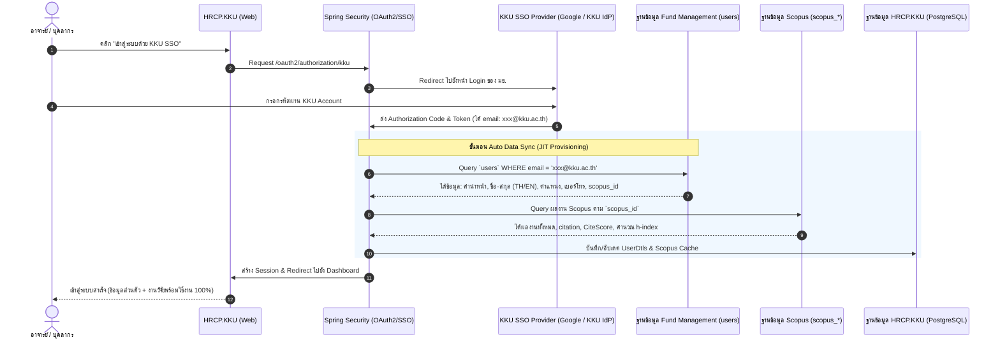
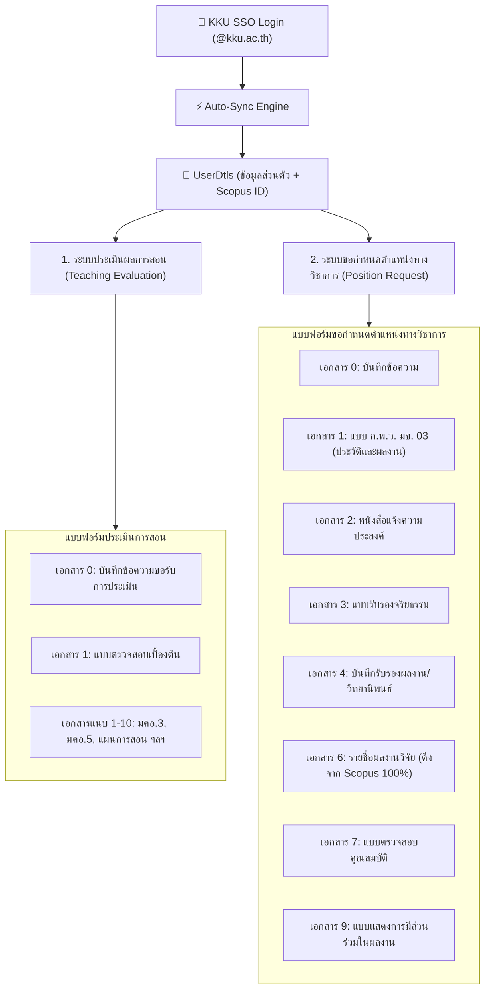

# 📊 วิเคราะห์การเชื่อมโยงข้อมูลจากระบบภายนอก (Fund Management & Scopus) + KKU SSO เข้ากับโปรเจค HRCP.KKU

> **เป้าหมายหลัก:** 
> 1. ผู้ใช้เข้าสู่ระบบด้วย **KKU SSO (Single Sign-On)** โดยใช้บัญชี KKU Mail (@kku.ac.th / @kkumail.com)
> 2. เมื่อ Login สำเร็จ ระบบจะ **Sync ข้อมูลอาจารย์และงานวิจัย Scopus อัตโนมัติ (Zero Data Entry Onboarding)**
> 3. ลดภาระการกรอกข้อมูลในแบบฟอร์มประเมินการสอนและขอกำหนดตำแหน่งทางวิชาการให้เหลือน้อยที่สุด

---

## 🔐 1. สถาปัตยกรรมการเข้าสู่ระบบด้วย KKU SSO (Single Sign-On)

### 🔄 End-to-End Authentication & Data Auto-Sync Flow



---

## 🏗️ 2. โครงสร้างของระบบ HRCP.KKU (2 ระบบหลัก)



---

## 🔍 3. ข้อมูลต้นทางที่มีให้ (2 แหล่ง)

### แหล่งที่ 1: `roles_positions_users_combined.sql` (ข้อมูลบุคลากร ~50 ท่าน)
- **ข้อมูลส่วนตัว:** `prefix` (คำนำหน้า), `user_fname`, `user_lname`, `gender`, `email`, `TEL`, `TELformat`
- **ข้อมูลตำแหน่ง:** `position` (ตำแหน่งวิชาการ TH), `position_en`, `prefix_position_en`, `manage_position` (ตำแหน่งบริหาร)
- **ข้อมูลภาษาอังกฤษ:** `Name_en`, `suffix_en` (เช่น Ph.D.)
- **ID ภายนอก:** `scopus_id` (สำหรับดึง Scopus), `scholar_author_id` (Google Scholar)
- **สถานที่/สังกัด:** `LAB_Name`, `Room`, `CP_WEB_ID`
- **บทบาทในระบบ:** `role_id` (teacher, staff, admin, dept_head, executive)

### แหล่งที่ 2: `SCOPUS_DATA_DICTIONARY.md` (ข้อมูลงานวิจัย Scopus)
- **ผลงาน:** `scopus_documents` (ชื่อเรื่อง `title`, DOI, วารสาร `publication_name`, วันที่ตีพิมพ์, จำนวน citation `citedby_count`, งานประชุม `conference_*`)
- **ผู้แต่ง & ลำดับ:** `scopus_authors`, `scopus_document_authors` (ลำดับผู้แต่ง `author_seq`, สังกัด `scopus_affiliations`)
- **ตัวชี้วัดวารสาร:** `scopus_source_metrics` (CiteScore, SJR, SNIP, Quartile Q1-Q4)

---

## 📋 4. การ Mapping ข้อมูลเข้าสู่แบบฟอร์ม (ครบทั้ง 2 ระบบ)

---

### 🟢 ระบบที่ 1: การประเมินผลการสอน (Teaching Evaluation)

| เอกสาร | ฟิลด์ในฟอร์ม | ดึงได้จากภายนอก? | ฟิลด์ต้นทาง | หมายเหตุ / UX ที่เปลี่ยนไป |
|---|---|:---:|---|---|
| **สร้างคำร้องใหม่** (`new_request.html`) | ตำแหน่งปัจจุบัน | ✅ | `users.position` | ดึงตำแหน่งปัจจุบันอัตโนมัติ |
| | คำนำหน้า, ชื่อ-นามสกุล | ✅ | `users.prefix`, `user_fname`, `user_lname` | แสดงชื่อผู้ยื่นอัตโนมัติ |
| **เอกสาร 0: บันทึกข้อความ** (`document_0_form.html`) | คำนำหน้า (`title`) | ✅ | `users.prefix` | Auto-select ใน dropdown |
| | ชื่อ-นามสกุล (`applicant_name`) | ✅ | `users.user_fname` + `users.user_lname` | Auto-fill |
| | ตำแหน่งทางวิชาการปัจจุบัน | ✅ | `users.position` | Auto-fill (เช่น อาจารย์, ผศ.) |
| | ประเภทบุคลากร (`employee_type`) | ⚠️ | Default: `พนักงานมหาวิทยาลัย` | ผู้ใช้ปรับแก้ได้ |
| | สาขาวิชา / ภาควิชา | ✅ | `สาขาวิชาวิทยาการคอมพิวเตอร์` | Auto-fill |
| | รายวิชาที่ขอประเมิน (1-3 วิชา) | ❌ | — | ผู้ใช้ระบุรหัส/ชื่อวิชาที่ขอประเมิน |
| **เอกสาร 1: แบบตรวจสอบเบื้องต้น** (`document_1_form.html`) | ชื่อ-นามสกุล ผู้ยื่น | ✅ | `users.prefix` + ชื่อ + นามสกุล | Auto-fill |
| | ตำแหน่งทางวิชาการ | ✅ | `users.position` | Auto-fill |
| | Checklist เอกสารแนบ 1-5 | ❌ | — | ติ๊กยืนยันการแนบไฟล์ |
| **เอกสารแนบ 1-10** (`documents.html`) | อัปโหลดไฟล์ มคอ.3, มคอ.5, เอกสารสอน | ❌ | — | อัปโหลดไฟล์ PDF |

---

### 🔵 ระบบที่ 2: การขอกำหนดตำแหน่งทางวิชาการ (Academic Position Request)

#### 1) เอกสาร 0: บันทึกข้อความ (`doc_form_0.html`)
| ฟิลด์ในฟอร์ม | ดึงได้? | ฟิลด์ต้นทาง | คำอธิบาย |
|---|:---:|---|---|
| คำนำหน้า (`title`) | ✅ | `users.prefix` | Auto-select |
| ชื่อ-นามสกุล (`applicant_name`) | ✅ | `users.user_fname` + `users.user_lname` | Auto-fill |
| ชื่อเต็มสำหรับลงนาม (`full_name`) | ✅ | `users.prefix` + ชื่อ + นามสกุล | Auto-fill |
| ตำแหน่งปัจจุบัน (`current_position`) | ✅ | `users.position` | Auto-fill |
| ประเภทพนักงาน (`employee_type`) | ⚠️ | Default: `พนักงานมหาวิทยาลัย` | ผู้ใช้ปรับได้ |

---

#### 2) เอกสาร 1: แบบ ก.พ.ว. มข. 03 (`doc_form_1.html`) — **ลดการกรอกได้มากที่สุด**
| ส่วนงาน | ฟิลด์ในฟอร์ม | ดึงได้? | ฟิลด์ต้นทาง |
|---|---|:---:|---|
| **๑. ข้อมูลส่วนบุคคล** | คำนำหน้า + ชื่อ-นามสกุล (TH) | ✅ | `users.prefix`, `user_fname`, `user_lname` |
| | ชื่อ-นามสกุล (EN) | ✅ | `users.Name_en`, `users.suffix_en` (เช่น Ph.D.) |
| | ตำแหน่งปัจจุบัน | ✅ | `users.position`, `users.position_en` |
| | สังกัด / คณะ / มหาวิทยาลัย | ✅ | `วิทยาลัยการคอมพิวเตอร์ มหาวิทยาลัยขอนแก่น` |
| | เบอร์โทรศัพท์ | ✅ | `users.TEL` / `users.TELformat` |
| | วันเกิด / อายุ / เงินเดือน | ❌ | กรอกเอง (ข้อมูลเฉพาะตัว/ลับ) |
| **๒. ประวัติรับราชการ** | ตำแหน่งบริหาร | ✅ | `users.manage_position` (เช่น คณบดี, รองคณบดี) |
| | วันเริ่มปฏิบัติงาน | ✅ | `users.date_of_employment` |
| | ประวัติการศึกษา ป.ตรี/โท/เอก | ❌ | กรอกเอง |
| **๓. ภาระงาน & ผลงาน Scopus** | **จำนวนเรื่องใน Scopus** (`assoc_scopus_stories_count`) | ✅ **Auto** | `COUNT(*)` จาก `scopus_document_authors` ตาม `scopus_id` |
| | **จำนวน Citation ทั้งหมด** (`assoc_scopus_citation_count`) | ✅ **Auto** | `SUM(scopus_documents.citedby_count)` |
| | **h-index (Scopus)** (`assoc_h_index`) | ✅ **Auto** | คำนวณอัตโนมัติจากชุด citation ของผลงาน |
| | **รายชื่อผลงานวิจัยย้อนหลัง** (`assoc_research_working_N`) | ✅ **Auto** | ดึงรายชื่อจาก `scopus_documents.title` ทั้งหมด |
| | โครงการวิจัยที่เป็น PI (`assoc_pi_project_N`) | ⚠️ | `scopus_documents.fund_sponsor` (แหล่งทุนวิจัย) |

---

#### 3) เอกสาร 2: หนังสือแจ้งความประสงค์การรับรู้ข้อมูล (`doc_form_2.html`)
| ฟิลด์ในฟอร์ม | ดึงได้? | ฟิลด์ต้นทาง |
|---|:---:|---|
| คำนำหน้า, ชื่อ-นามสกุล | ✅ | `users.prefix`, `user_fname`, `user_lname` |
| ตำแหน่งปัจจุบัน | ✅ | `users.position` |
| สถานะ (ข้าราชการ/พนักงาน) | ⚠️ | Default: `พนักงานมหาวิทยาลัย` |
| สาขาวิชา | ✅ | `สาขาวิชาวิทยาการคอมพิวเตอร์` |

---

#### 4) เอกสาร 3: แบบรับรองจริยธรรมและจรรยาบรรณ (`doc_form_3.html`)
| ฟิลด์ในฟอร์ม | ดึงได้? | ฟิลด์ต้นทาง |
|---|:---:|---|
| คำนำหน้า, ชื่อ-นามสกุล | ✅ | `users.prefix`, `user_fname`, `user_lname` |
| วันที่รับรอง | ✅ | วันที่ปัจจุบัน (พ.ศ.) Auto-fill |

---

#### 5) เอกสาร 4: บันทึกรับรองผลงานวิชาการ/วิทยานิพนธ์ (`doc_form_4.html`)
| ฟิลด์ในฟอร์ม | ดึงได้? | ฟิลด์ต้นทาง |
|---|:---:|---|
| คำนำหน้า, ชื่อ-นามสกุล, ตำแหน่ง | ✅ | `users.prefix`, `user_fname`, `user_lname`, `users.position` |
| สังกัด | ✅ | `วิทยาลัยการคอมพิวเตอร์ มหาวิทยาลัยขอนแก่น` |
| ชื่อวิทยานิพนธ์ ป.โท / ป.เอก | ❌ | กรอกเอง |

---

#### 6) เอกสาร 6: รายชื่อผลงานวิจัยเพื่อประกอบการแต่งตั้ง (`doc_form_6.html`) — **ดึงจาก Scopus 100%**
| ฟิลด์ในฟอร์ม (ตาราง Dynamic Rows) | ดึงได้? | ฟิลด์ต้นทาง | ประโยชน์ที่ได้รับ |
|---|:---:|---|---|
| **ชื่อผลงานวิจัย** (`des_research${idx}`) | ✅ **Auto** | `scopus_documents.title` | ดึงรายการผลงานทั้งหมดมาสร้างเป็นแถวตารางให้อัตโนมัติ ไม่ต้องพิมพ์เองแม้แต่เรื่องเดียว |
| **ผู้ประพันธ์อันดับแรก (First author)** | ✅ **Auto** | `scopus_document_authors.author_seq = 1` | ติ๊ก ☑ ให้อัตโนมัติหากชื่อผู้ใช้อยู่ลำดับที่ 1 |
| **ผู้ประพันธ์บรรณกิจ (Corresponding)** | ⚠️ | ผู้ใช้ติ๊กยืนยัน | Scopus API ไม่ได้ระบุฟิลด์นี้แยกเฉพาะ |
| **Impact Factor / CiteScore / SJR** | ✅ **Auto** | `scopus_source_metrics.cite_score` หรือ `sjr` | ดึงค่าตัวชี้วัดของวารสารนั้นๆ มากรอกให้อัตโนมัติ |
| **Quartile (Q1 - Q4)** | ✅ **Auto** | `scopus_source_metrics.cite_score_quartile` | แสดง Q1, Q2, Q3, Q4 อัตโนมัติ |
| **ฐานข้อมูล** (`data${idx}`) | ✅ **Auto** | ค่าคงที่ `'Scopus'` | กรอกคำว่า "Scopus" ให้อัตโนมัติทุกแถว |

---

#### 7) เอกสาร 7: แบบตรวจสอบคุณสมบัติและเอกสาร (`doc_form_7.html`)
| ฟิลด์ในฟอร์ม | ดึงได้? | ฟิลด์ต้นทาง |
|---|:---:|---|
| ชื่อ, นามสกุล | ✅ | `users.user_fname`, `users.user_lname` |
| Email, มือถือ | ✅ | `users.email`, `users.TEL` |
| คณะ, สังกัด | ✅ | `วิทยาลัยการคอมพิวเตอร์` |
| วันที่สำเร็จการศึกษา ป.โท/ป.เอก | ❌ | กรอกเอง |

---

#### 8) เอกสาร 9: แบบแสดงหลักฐานการมีส่วนร่วมในผลงาน (`doc_form_9.html`)
| ฟิลด์ในฟอร์ม | ดึงได้? | ฟิลด์ต้นทาง |
|---|:---:|---|
| ชื่อผลงานวิจัย | ✅ | เลือกจาก Dropdown ผลงาน Scopus ที่ดึงมา |
| ผู้ประพันธ์อันดับแรก (First Author) | ✅ | ตรวจสอบจาก `author_seq = 1` |
| กลุ่มประเภทผลงาน (งานวิจัยกลุ่มที่ 1) | ✅ | ติ๊ก ☑ งานวิจัยให้อัตโนมัติ |
| สัดส่วนการมีส่วนร่วม (%) | ❌ | กรอกเอง (เช่น 70%, 30%) |

---

## 🛠️ 5. ขั้นตอนและแนวทางการพัฒนา (Implementation Roadmap)

### 📌 เฟส 1: ติดตั้ง KKU SSO (OAuth2 / OpenID Connect)
1. เพิ่ม dependency `spring-boot-starter-oauth2-client` ใน `pom.xml`
2. กำหนดค่าใน `application.properties`:
   ```properties
   # KKU SSO / OAuth2 Client Configuration
   spring.security.oauth2.client.registration.kku.client-id=${KKU_SSO_CLIENT_ID}
   spring.security.oauth2.client.registration.kku.client-secret=${KKU_SSO_CLIENT_SECRET}
   spring.security.oauth2.client.registration.kku.scope=openid,profile,email
   spring.security.oauth2.client.registration.kku.redirect-uri={baseUrl}/login/oauth2/code/kku
   spring.security.oauth2.client.registration.kku.authorization-grant-type=authorization_code
   spring.security.oauth2.client.provider.kku.authorization-uri=https://sso.kku.ac.th/oauth/authorize
   spring.security.oauth2.client.provider.kku.token-uri=https://sso.kku.ac.th/oauth/token
   spring.security.oauth2.client.provider.kku.user-info-uri=https://sso.kku.ac.th/oauth/userinfo
   spring.security.oauth2.client.provider.kku.user-name-attribute=email
   ```
3. สร้าง `OAuth2AuthenticationSuccessHandler` สำหรับจัดการ User Provisioning:
   - เมื่อ Login ผ่าน SSO ได้ `email` → ค้นหาใน `users` (Fund Management DB)
   - Auto-create หรือ Sync ข้อมูลลงใน `UserDtls`
   - กำหนด Role ตาม `role_id` (เช่น `ROLE_USER`, `ROLE_ADMIN`)

---

### 📌 เฟส 2: Service ดึงและคำนวณข้อมูล Scopus
1. สร้าง `ScopusSyncService`:
   - ค้นหา `scopus_id` ของ User
   - ดึงผลงานทั้งหมดจาก `scopus_documents` และ `scopus_document_authors`
   - เชื่อมโยง `scopus_source_metrics` เพื่อเอา CiteScore / Quartile
   - คำนวณ `h-index` และผลรวม Citation
2. สร้าง REST API สำหรับ Frontend:
   - `GET /api/user/scopus/summary`: ส่งค่า count, citation, h-index
   - `GET /api/user/scopus/publications`: ส่งรายการผลงานพร้อม Impact Factor

---

### 📌 เฟส 3: เชื่อมต่อเข้ากับหน้าแบบฟอร์ม (Frontend Integration)
1. ในหน้า `doc_form_0`, `doc_form_1`, `doc_form_6`, `doc_form_7`:
   - ข้อมูลส่วนตัวโหลดใส่ Input fields อัตโนมัติ (ผ่าน Controller Model หรือ AJAX)
   - ในหน้า `doc_form_6` มีปุ่ม **"⚡ นำเข้าผลงานจาก Scopus อัตโนมัติ"** กดแล้ว Render แถวตารางผลงานทั้งหมดทันที
