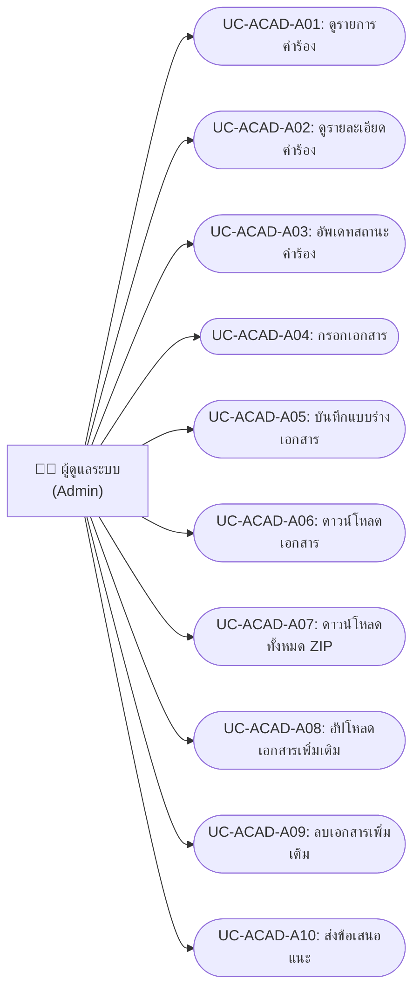
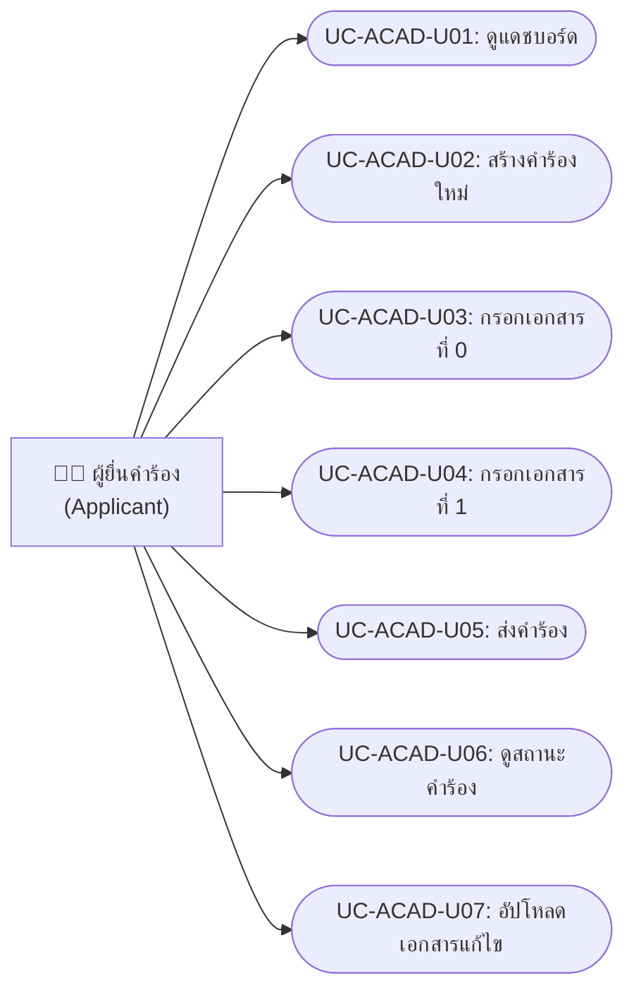
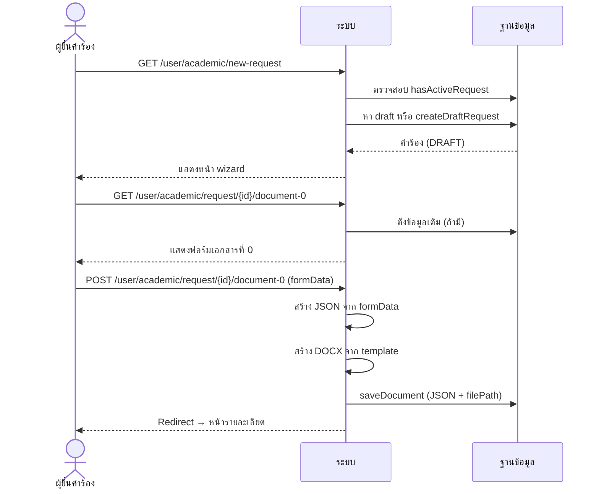
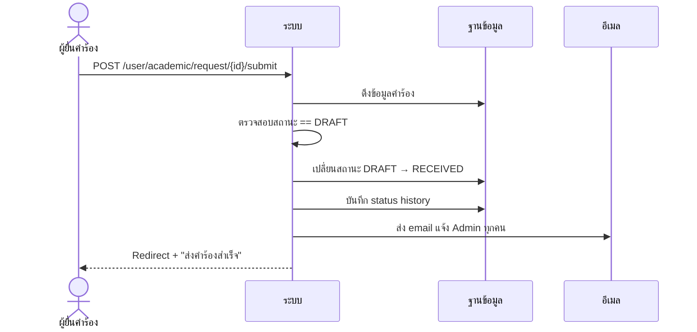
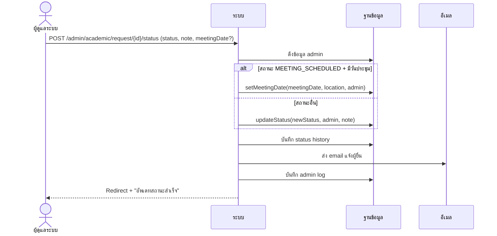
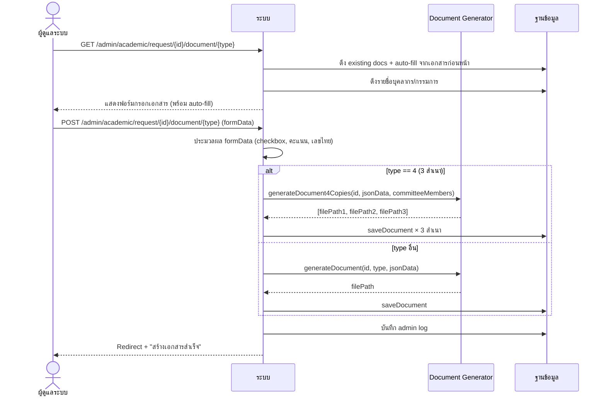
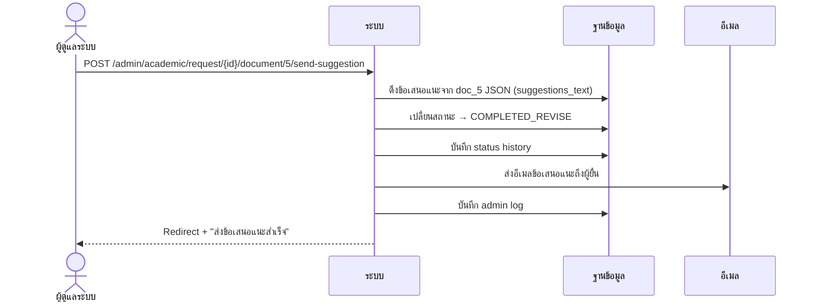
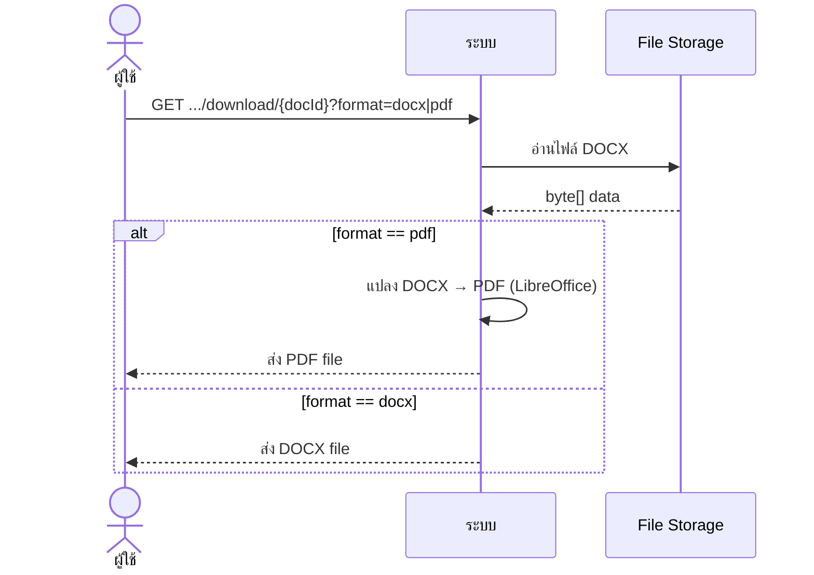

# คำร้องประเมินผลการสอน (Academic Request — Phase 1)

---

## 1. Use Case Diagram

### 1.1 ฝั่งผู้ดูแลระบบ (Admin)

### 1.2 ฝั่งผู้ยื่นคำร้อง (Applicant)

---

## 2. Use Case Descriptions

### ฝั่งผู้ดูแลระบบ (Admin)

---

### UC-ACAD-A01: ดูรายการคำร้อง

| รายการ | รายละเอียด |
|--------|-----------|
| **รหัส Use Case** | UC-ACAD-A01 |
| **ชื่อ Use Case** | ดูรายการคำร้องทั้งหมด |
| **คำอธิบาย** | ผู้ดูแลระบบดูรายการคำร้องประเมินผลการสอนทั้งหมด พร้อมค้นหาและกรองตามสถานะ |
| **ผู้กระทำหลัก** | ผู้ดูแลระบบ (Admin) |
| **เงื่อนไขก่อนหน้า** | เข้าสู่ระบบแล้ว (ROLE_ADMIN) |
| **เงื่อนไขหลัง** | — |
| **ทริกเกอร์** | คลิกเมนู "คำร้องประเมินผลการสอน" |

#### ลำดับเหตุการณ์หลัก

| ขั้นตอน | ผู้กระทำ | การกระทำ |
|---------|---------|---------|
| 1 | ผู้ดูแลระบบ | คลิกเมนู "คำร้องประเมินผลการสอน" (GET `/admin/academic/requests`) |
| 2 | ระบบ | ดึงรายการคำร้องทั้งหมด (ไม่รวม DRAFT) |
| 3 | ระบบ | นับจำนวนคำร้องแต่ละสถานะสำหรับ dashboard cards |
| 4 | ระบบ | แยกเป็น "กำลังดำเนินการ" (เรียงตามวันส่ง) + "เสร็จสิ้น" (เรียงตามล่าสุด) |
| 5 | ระบบ | แสดงหน้ารายการ พร้อม tabs (Phase 1 / Phase 2) |

#### ลำดับเหตุการณ์ทางเลือก

**AF-1: ค้นหาตามชื่อ**

| ขั้นตอน | ผู้กระทำ | การกระทำ |
|---------|---------|---------|
| 1a | ผู้ดูแลระบบ | กรอกชื่อผู้ยื่นในช่องค้นหา |
| 1b | ระบบ | กรองผลลัพธ์ตามชื่อผู้ยื่น (searchByApplicantName) |

**AF-2: กรองตามสถานะ**

| ขั้นตอน | ผู้กระทำ | การกระทำ |
|---------|---------|---------|
| 1a | ผู้ดูแลระบบ | คลิก status card |
| 1b | ระบบ | กรองเฉพาะคำร้องที่มีสถานะที่เลือก |

---

### UC-ACAD-A02: ดูรายละเอียดคำร้อง

| รายการ | รายละเอียด |
|--------|-----------|
| **รหัส Use Case** | UC-ACAD-A02 |
| **ชื่อ Use Case** | ดูรายละเอียดคำร้อง |
| **คำอธิบาย** | ดูรายละเอียดคำร้อง: ข้อมูลผู้ยื่น, สถานะ, เอกสารทั้ง 9 ประเภท, ไฟล์แนบ, ประวัติสถานะ |
| **ผู้กระทำหลัก** | ผู้ดูแลระบบ (Admin) |
| **เงื่อนไขก่อนหน้า** | เข้าสู่ระบบแล้ว (ROLE_ADMIN) |
| **เงื่อนไขหลัง** | — |
| **ทริกเกอร์** | คลิกดูรายละเอียดจากรายการ |

#### ลำดับเหตุการณ์หลัก

| ขั้นตอน | ผู้กระทำ | การกระทำ |
|---------|---------|---------|
| 1 | ผู้ดูแลระบบ | คลิก "ดูรายละเอียด" (GET `/admin/academic/request/{id}`) |
| 2 | ระบบ | ดึงข้อมูลคำร้อง + เอกสาร (sorted) + attachments + status history |
| 3 | ระบบ | แสดงหน้ารายละเอียด: progress bar, ข้อมูลผู้ยื่น, ตารางเอกสาร, ไฟล์แนบ, ไทม์ไลน์สถานะ |

---

### UC-ACAD-A03: อัพเดทสถานะคำร้อง

| รายการ | รายละเอียด |
|--------|-----------|
| **รหัส Use Case** | UC-ACAD-A03 |
| **ชื่อ Use Case** | อัพเดทสถานะคำร้อง |
| **คำอธิบาย** | เปลี่ยนสถานะคำร้อง พร้อมระบุหมายเหตุ และกำหนดวันประชุมในกรณี MEETING_SCHEDULED |
| **ผู้กระทำหลัก** | ผู้ดูแลระบบ (Admin) |
| **เงื่อนไขก่อนหน้า** | มีคำร้องที่สถานะไม่ใช่ terminal |
| **เงื่อนไขหลัง** | สถานะเปลี่ยนแปลง + บันทึก history + ส่ง email แจ้งผู้ยื่น + บันทึก admin log |
| **ทริกเกอร์** | คลิก "อัพเดทสถานะ" ในหน้ารายละเอียด |

#### ลำดับเหตุการณ์หลัก

| ขั้นตอน | ผู้กระทำ | การกระทำ |
|---------|---------|---------|
| 1 | ผู้ดูแลระบบ | เลือกสถานะใหม่จาก dropdown |
| 2 | ผู้ดูแลระบบ | (ทางเลือก) กรอกหมายเหตุ |
| 3 | ผู้ดูแลระบบ | คลิก "อัพเดทสถานะ" |
| 4 | ระบบ | บันทึกสถานะใหม่ + ประวัติ (POST `/admin/academic/request/{id}/status`) |
| 5 | ระบบ | ส่ง email แจ้งเตือนผู้ยื่น |
| 6 | ระบบ | บันทึก admin log |
| 7 | ระบบ | แสดงข้อความ "อัพเดทสถานะสำเร็จ" |

#### ลำดับเหตุการณ์ทางเลือก

**AF-1: นัดหมายวันประชุม (MEETING_SCHEDULED)**

| ขั้นตอน | ผู้กระทำ | การกระทำ |
|---------|---------|---------|
| 1a | ผู้ดูแลระบบ | เลือก MEETING_SCHEDULED + กรอกวันเวลาและสถานที่ประชุม |
| 4a | ระบบ | บันทึกวัน/เวลา/สถานที่ประชุม (setMeetingDate) |

#### กฎทางธุรกิจ
- สถานะเปลี่ยนตาม flow: RECEIVED → SUB_COMMITTEE_APPOINTED → MEETING_SCHEDULED → COMPLETED_PASS/REVISE/FAIL → COMPLETED (ดู [แผนภาพสถานะ](appendix-status-flows.md))

---

### UC-ACAD-A04: กรอกเอกสาร

| รายการ | รายละเอียด |
|--------|-----------|
| **รหัส Use Case** | UC-ACAD-A04 |
| **ชื่อ Use Case** | กรอกเอกสาร (ประเภทที่ 2-8) |
| **คำอธิบาย** | Admin กรอกข้อมูลในแบบฟอร์มเอกสาร ระบบสร้างไฟล์ DOCX อัตโนมัติจาก template |
| **ผู้กระทำหลัก** | ผู้ดูแลระบบ (Admin) |
| **เงื่อนไขก่อนหน้า** | มีคำร้องในระบบ |
| **เงื่อนไขหลัง** | เอกสาร DOCX ถูกสร้างและบันทึกในระบบ |
| **ทริกเกอร์** | คลิกปุ่ม "กรอกเอกสาร" ที่ประเภทเอกสาร |

#### ประเภทเอกสารที่ Admin กรอก

| ประเภท | ชื่อเอกสาร |
|--------|-----------|
| 2 | การขอรายชื่อเพื่อแต่งตั้งคณะกรรมการ |
| 3 | คำสั่งแต่งตั้งคณะอนุกรรมการประเมินผลการสอน |
| 4 | บันทึกข้อความ ขอเชิญเป็นกรรมการผู้ทรงคุณวุฒิ (สร้าง 3 สำเนา) |
| 5 | ประชุมกรรมการประเมินผลการสอน |
| 6 | แบบฟอร์มประเมินการสอน ตามประกาศ มข.1607-66 (คำนวณคะแนนถ่วงน้ำหนัก) |
| 7 | ส่วนที่ 3 แบบประเมินผลการสอน |
| 8 | บันทึกข้อความ แจ้งผลการประเมินผลการสอน |

#### ลำดับเหตุการณ์หลัก

| ขั้นตอน | ผู้กระทำ | การกระทำ |
|---------|---------|---------|
| 1 | ผู้ดูแลระบบ | คลิก "กรอกเอกสาร" ที่ประเภทเอกสารที่ต้องการ |
| 2 | ระบบ | ดึงข้อมูลเดิม (ถ้ามี) + auto-fill จากเอกสารก่อนหน้า (doc_0, doc_2 เป็นต้น) |
| 3 | ระบบ | แสดงฟอร์มกรอกเอกสาร พร้อมรายชื่อบุคลากร/กรรมการ |
| 4 | ผู้ดูแลระบบ | กรอกข้อมูลในฟอร์ม |
| 5 | ผู้ดูแลระบบ | คลิก "บันทึกและสร้างเอกสาร" |
| 6 | ระบบ | สร้างไฟล์ DOCX จาก template + ข้อมูลฟอร์ม |
| 7 | ระบบ | บันทึกเอกสาร (JSON + file path) ลง DB |
| 8 | ระบบ | บันทึก admin log |
| 9 | ระบบ | แสดงข้อความ "สร้างเอกสารสำเร็จ" |

#### กฎทางธุรกิจ
- เอกสารประเภท 4: สร้าง 3 สำเนา (1 ฉบับต่อกรรมการ)
- เอกสารประเภท 6: คำนวณคะแนนถ่วงน้ำหนัก (ส่วน 1-4 น้ำหนัก 20/30/30/20) + แปลงเป็นเลขไทย
- ข้อมูลจาก doc_0 (ชื่อผู้ยื่น, ตำแหน่ง) auto-fill ไปยัง doc_3, 6, 7, 8
- ข้อมูลจาก doc_2 (รายชื่อกรรมการ 3 คน) auto-fill ไปยังเอกสารอื่นๆ

---

### UC-ACAD-A05: บันทึกแบบร่างเอกสาร

| รายการ | รายละเอียด |
|--------|-----------|
| **รหัส Use Case** | UC-ACAD-A05 |
| **ชื่อ Use Case** | บันทึกแบบร่างเอกสาร |
| **คำอธิบาย** | บันทึกข้อมูลฟอร์มเป็น draft โดยไม่สร้างไฟล์ DOCX |
| **ผู้กระทำหลัก** | ผู้ดูแลระบบ (Admin) |
| **เงื่อนไขก่อนหน้า** | กำลังกรอกแบบฟอร์มเอกสาร |
| **เงื่อนไขหลัง** | ข้อมูล JSON ถูกบันทึก สามารถกลับมาแก้ไขภายหลังได้ |
| **ทริกเกอร์** | คลิก "บันทึกแบบร่าง" |

#### ลำดับเหตุการณ์หลัก

| ขั้นตอน | ผู้กระทำ | การกระทำ |
|---------|---------|---------|
| 1 | ผู้ดูแลระบบ | กรอกข้อมูลในฟอร์มบางส่วน |
| 2 | ผู้ดูแลระบบ | คลิก "บันทึกแบบร่าง" (action=draft) |
| 3 | ระบบ | บันทึก JSON data ลง DB (ไม่สร้าง DOCX) |
| 4 | ระบบ | แสดงข้อความ "บันทึกแบบร่างสำเร็จ" |

---

### UC-ACAD-A06: ดาวน์โหลดเอกสาร

| รายการ | รายละเอียด |
|--------|-----------|
| **รหัส Use Case** | UC-ACAD-A06 |
| **ชื่อ Use Case** | ดาวน์โหลดเอกสาร |
| **คำอธิบาย** | ดาวน์โหลดเอกสารเดี่ยวในรูปแบบ DOCX หรือ PDF |
| **ผู้กระทำหลัก** | ผู้ดูแลระบบ (Admin) |
| **เงื่อนไขก่อนหน้า** | มีเอกสารที่ถูกสร้างแล้ว |
| **เงื่อนไขหลัง** | ไฟล์ถูกดาวน์โหลดไปยังเครื่องผู้ใช้ |
| **ทริกเกอร์** | คลิกปุ่มดาวน์โหลดที่เอกสาร |

#### ลำดับเหตุการณ์หลัก

| ขั้นตอน | ผู้กระทำ | การกระทำ |
|---------|---------|---------|
| 1 | ผู้ดูแลระบบ | คลิกปุ่มดาวน์โหลด DOCX หรือ PDF |
| 2 | ระบบ | อ่านไฟล์จาก storage |
| 3 | ระบบ | (ถ้า PDF) แปลง DOCX → PDF ด้วย LibreOffice |
| 4 | ระบบ | ส่งไฟล์เป็น attachment download |

---

### UC-ACAD-A07: ดาวน์โหลดทั้งหมด ZIP

| รายการ | รายละเอียด |
|--------|-----------|
| **รหัส Use Case** | UC-ACAD-A07 |
| **ชื่อ Use Case** | ดาวน์โหลดเอกสารทั้งหมด (ZIP) |
| **คำอธิบาย** | ดาวน์โหลดเอกสารทุกประเภทของคำร้องเป็นไฟล์ ZIP เดียว |
| **ผู้กระทำหลัก** | ผู้ดูแลระบบ (Admin) |
| **เงื่อนไขก่อนหน้า** | มีเอกสารอย่างน้อย 1 ฉบับ |
| **เงื่อนไขหลัง** | ไฟล์ ZIP ถูกดาวน์โหลด |
| **ทริกเกอร์** | คลิก "ดาวน์โหลดทั้งหมด" |

#### ลำดับเหตุการณ์หลัก

| ขั้นตอน | ผู้กระทำ | การกระทำ |
|---------|---------|---------|
| 1 | ผู้ดูแลระบบ | คลิก "ดาวน์โหลดทั้งหมด" |
| 2 | ระบบ | ดึงรายการเอกสารทั้งหมดของคำร้อง |
| 3 | ระบบ | สร้าง ZIP stream รวมทุกไฟล์ DOCX ที่มี |
| 4 | ระบบ | ส่ง ZIP file (request_{id}_documents.zip) |

---

### UC-ACAD-A08: อัปโหลดเอกสารเพิ่มเติม

| รายการ | รายละเอียด |
|--------|-----------|
| **รหัส Use Case** | UC-ACAD-A08 |
| **ชื่อ Use Case** | อัปโหลดเอกสารเพิ่มเติม (Attachment) |
| **คำอธิบาย** | อัปโหลดไฟล์เสริม (PDF/DOCX) แนบกับคำร้อง สูงสุด 10 ไฟล์ |
| **ผู้กระทำหลัก** | ผู้ดูแลระบบ (Admin) |
| **เงื่อนไขก่อนหน้า** | จำนวนไฟล์แนบยังไม่ถึง 10 |
| **เงื่อนไขหลัง** | ไฟล์ถูกบันทึกลง storage + DB |
| **ทริกเกอร์** | คลิก "อัปโหลดเอกสาร" |

#### ลำดับเหตุการณ์หลัก

| ขั้นตอน | ผู้กระทำ | การกระทำ |
|---------|---------|---------|
| 1 | ผู้ดูแลระบบ | เลือกไฟล์ PDF หรือ DOCX |
| 2 | ผู้ดูแลระบบ | คลิก "อัปโหลด" |
| 3 | ระบบ | ตรวจสอบจำนวนไฟล์แนบ (< 10) + ประเภทไฟล์ (PDF/DOCX) |
| 4 | ระบบ | บันทึกไฟล์ (uploads/academic/{id}/attachments/) |
| 5 | ระบบ | สร้าง record ใน AcademicAttachment |
| 6 | ระบบ | บันทึก admin log |
| 7 | ระบบ | แสดงข้อความ "อัปโหลดสำเร็จ" |

#### ลำดับเหตุการณ์ทางเลือก

**AF-1: เกินจำนวนสูงสุด**

| ขั้นตอน | ผู้กระทำ | การกระทำ |
|---------|---------|---------|
| 3a | ระบบ | ตรวจพบจำนวนไฟล์ ≥ 10 |
| 3b | ระบบ | แสดงข้อความ error "ไฟล์แนบเต็มจำนวนสูงสุด (10 ไฟล์)" |

---

### UC-ACAD-A09: ลบเอกสารเพิ่มเติม

| รายการ | รายละเอียด |
|--------|-----------|
| **รหัส Use Case** | UC-ACAD-A09 |
| **ชื่อ Use Case** | ลบเอกสารเพิ่มเติม |
| **คำอธิบาย** | ลบไฟล์แนบ (attachment) จากคำร้อง |
| **ผู้กระทำหลัก** | ผู้ดูแลระบบ (Admin) |
| **เงื่อนไขก่อนหน้า** | มีไฟล์แนบอยู่ในคำร้อง |
| **เงื่อนไขหลัง** | ไฟล์ถูกลบจาก storage + DB |
| **ทริกเกอร์** | คลิก "ลบ" ที่ไฟล์แนบ |

#### ลำดับเหตุการณ์หลัก

| ขั้นตอน | ผู้กระทำ | การกระทำ |
|---------|---------|---------|
| 1 | ผู้ดูแลระบบ | คลิก "ลบ" ที่ไฟล์แนบที่ต้องการ |
| 2 | ระบบ | ลบไฟล์จาก disk (Files.deleteIfExists) |
| 3 | ระบบ | ลบ record จาก DB |
| 4 | ระบบ | บันทึก admin log |
| 5 | ระบบ | แสดงข้อความ "ลบสำเร็จ" |

---

### UC-ACAD-A10: ส่งข้อเสนอแนะ

| รายการ | รายละเอียด |
|--------|-----------|
| **รหัส Use Case** | UC-ACAD-A10 |
| **ชื่อ Use Case** | ส่งข้อเสนอแนะเพื่อแก้ไขเอกสาร |
| **คำอธิบาย** | ส่ง feedback จากเอกสารที่ 5 ให้ผู้ยื่นคำร้องทางอีเมล พร้อมเปลี่ยนสถานะเป็น "แจ้งผล - แก้ไข" |
| **ผู้กระทำหลัก** | ผู้ดูแลระบบ (Admin) |
| **เงื่อนไขก่อนหน้า** | มีข้อมูลข้อเสนอแนะจากเอกสารที่ 5 |
| **เงื่อนไขหลัก** | สถานะเปลี่ยนเป็น COMPLETED_REVISE + อีเมลถูกส่ง |
| **ทริกเกอร์** | คลิก "ส่งข้อเสนอแนะ" |

#### ลำดับเหตุการณ์หลัก

| ขั้นตอน | ผู้กระทำ | การกระทำ |
|---------|---------|---------|
| 1 | ผู้ดูแลระบบ | คลิก "ส่งข้อเสนอแนะ" ในหน้าเอกสารที่ 5 |
| 2 | ระบบ | ดึงข้อเสนอแนะจาก doc_5 JSON (suggestions_text) |
| 3 | ระบบ | เปลี่ยนสถานะเป็น COMPLETED_REVISE + บันทึก history |
| 4 | ระบบ | ส่งอีเมลข้อเสนอแนะให้ผู้ยื่น |
| 5 | ระบบ | บันทึก admin log |
| 6 | ระบบ | แสดงข้อความ "ส่งข้อเสนอแนะสำเร็จ" |

---

### ฝั่งผู้ยื่นคำร้อง (Applicant)

---

### UC-ACAD-U01: ดูแดชบอร์ด

| รายการ | รายละเอียด |
|--------|-----------|
| **รหัส Use Case** | UC-ACAD-U01 |
| **ชื่อ Use Case** | ดูแดชบอร์ด |
| **คำอธิบาย** | แสดงรายการคำร้องของผู้ใช้ แยก draft ออกจากคำร้องที่ส่งแล้ว |
| **ผู้กระทำหลัก** | ผู้ยื่นคำร้อง (Applicant) |
| **เงื่อนไขก่อนหน้า** | เข้าสู่ระบบแล้ว (ROLE_USER) |
| **เงื่อนไขหลัง** | — |
| **ทริกเกอร์** | คลิกเมนู "คำร้องประเมินผลการสอน" |

#### ลำดับเหตุการณ์หลัก

| ขั้นตอน | ผู้กระทำ | การกระทำ |
|---------|---------|---------|
| 1 | ผู้ยื่นคำร้อง | คลิกเมนู "คำร้องประเมินผลการสอน" |
| 2 | ระบบ | ดึงรายการคำร้องของผู้ใช้ แยก draft / submitted |
| 3 | ระบบ | แสดง: draft card (ถ้ามี) + ตารางคำร้องที่ส่งแล้วพร้อมสถานะ |

---

### UC-ACAD-U02: สร้างคำร้องใหม่

| รายการ | รายละเอียด |
|--------|-----------|
| **รหัส Use Case** | UC-ACAD-U02 |
| **ชื่อ Use Case** | สร้างคำร้องใหม่ |
| **คำอธิบาย** | สร้างคำร้องประเมินผลการสอนใหม่ (สถานะ DRAFT) หรือดำเนินการต่อจาก draft ที่มีอยู่ |
| **ผู้กระทำหลัก** | ผู้ยื่นคำร้อง (Applicant) |
| **เงื่อนไขก่อนหน้า** | ไม่มีคำร้องที่ active อยู่ |
| **เงื่อนไขหลัก** | คำร้อง draft ถูกสร้าง (หรือดึง draft ที่มีอยู่) |
| **ทริกเกอร์** | คลิก "สร้างคำร้องใหม่" |

#### ลำดับเหตุการณ์หลัก

| ขั้นตอน | ผู้กระทำ | การกระทำ |
|---------|---------|---------|
| 1 | ผู้ยื่นคำร้อง | คลิก "สร้างคำร้องใหม่" (GET `/user/academic/new-request`) |
| 2 | ระบบ | ตรวจสอบว่าไม่มีคำร้องที่ active |
| 3 | ระบบ | หา draft ที่มีอยู่ หรือสร้าง draft ใหม่ (createDraftRequest) |
| 4 | ระบบ | ตรวจสอบสถานะเอกสาร (hasDoc0, hasDoc1) |
| 5 | ระบบ | แสดงหน้า wizard: ขั้นตอนกรอกเอกสาร 0 → 1 → ส่ง |

#### ลำดับเหตุการณ์ทางเลือก

**AF-1: มีคำร้องที่ active อยู่**

| ขั้นตอน | ผู้กระทำ | การกระทำ |
|---------|---------|---------|
| 2a | ระบบ | ตรวจพบคำร้องที่กำลังดำเนินการ |
| 2b | ระบบ | Redirect ไป dashboard + error "มีคำร้องที่กำลังดำเนินการอยู่" |

---

### UC-ACAD-U03: กรอกเอกสารที่ 0 (บันทึกข้อความ)

| รายการ | รายละเอียด |
|--------|-----------|
| **รหัส Use Case** | UC-ACAD-U03 |
| **ชื่อ Use Case** | กรอกเอกสารที่ 0 — บันทึกข้อความ ขอรับการประเมินผลการสอน |
| **คำอธิบาย** | ผู้ยื่นกรอกข้อมูลส่วนตัวและตำแหน่งที่ขอรับการประเมิน |
| **ผู้กระทำหลัก** | ผู้ยื่นคำร้อง (Applicant) |
| **เงื่อนไขก่อนหน้า** | มีคำร้อง draft อยู่ |
| **เงื่อนไขหลัก** | เอกสาร DOCX ถูกสร้าง หรือ draft ถูกบันทึก |
| **ทริกเกอร์** | คลิก "กรอกเอกสารที่ 0" |

#### ลำดับเหตุการณ์หลัก

| ขั้นตอน | ผู้กระทำ | การกระทำ |
|---------|---------|---------|
| 1 | ผู้ยื่นคำร้อง | คลิก "กรอกเอกสารที่ 0" |
| 2 | ระบบ | ดึงข้อมูลเดิม (ถ้ามี) + แสดงฟอร์ม |
| 3 | ผู้ยื่นคำร้อง | กรอกข้อมูล: ชื่อ-สกุล, ตำแหน่ง, สังกัด, ตำแหน่งที่ขอ (ผศ./รศ./ศ.) |
| 4 | ผู้ยื่นคำร้อง | คลิก "บันทึก" หรือ "บันทึกแบบร่าง" |
| 5 | ระบบ | (ถ้า submit) สร้าง DOCX จาก template |
| 6 | ระบบ | บันทึก JSON + file path ลง DB |
| 7 | ระบบ | Redirect ไปหน้ารายละเอียด/ฟอร์มถัดไป |

---

### UC-ACAD-U04: กรอกเอกสารที่ 1 (แบบตรวจสอบเบื้องต้น)

| รายการ | รายละเอียด |
|--------|-----------|
| **รหัส Use Case** | UC-ACAD-U04 |
| **ชื่อ Use Case** | กรอกเอกสารที่ 1 — แบบตรวจสอบเบื้องต้นเอกสารประกอบประเมินผลการสอน |
| **คำอธิบาย** | ผู้ยื่นกรอก checklist ตรวจสอบเอกสารประกอบ |
| **ผู้กระทำหลัก** | ผู้ยื่นคำร้อง (Applicant) |
| **เงื่อนไขก่อนหน้า** | มีคำร้อง draft อยู่ |
| **เงื่อนไขหลัก** | เอกสาร DOCX ถูกสร้าง หรือ draft ถูกบันทึก |
| **ทริกเกอร์** | คลิก "กรอกเอกสารที่ 1" |

#### ลำดับเหตุการณ์หลัก

| ขั้นตอน | ผู้กระทำ | การกระทำ |
|---------|---------|---------|
| 1 | ผู้ยื่นคำร้อง | คลิก "กรอกเอกสารที่ 1" |
| 2 | ระบบ | ดึงข้อมูลเดิม + แสดงฟอร์ม checklist |
| 3 | ผู้ยื่นคำร้อง | กรอก checklist ตรวจสอบเอกสาร |
| 4 | ผู้ยื่นคำร้อง | คลิก "บันทึก" หรือ "บันทึกแบบร่าง" |
| 5 | ระบบ | สร้าง DOCX (ถ้า submit) + บันทึก |

---

### UC-ACAD-U05: ส่งคำร้อง

| รายการ | รายละเอียด |
|--------|-----------|
| **รหัส Use Case** | UC-ACAD-U05 |
| **ชื่อ Use Case** | ส่งคำร้อง |
| **คำอธิบาย** | เปลี่ยนสถานะจาก DRAFT → RECEIVED พร้อมส่งอีเมลแจ้ง Admin |
| **ผู้กระทำหลัก** | ผู้ยื่นคำร้อง (Applicant) |
| **เงื่อนไขก่อนหน้า** | คำร้องอยู่ในสถานะ DRAFT |
| **เงื่อนไขหลัก** | สถานะเป็น RECEIVED + Admin ได้รับอีเมลแจ้งเตือน |
| **ทริกเกอร์** | คลิก "ส่งคำร้อง" |

#### ลำดับเหตุการณ์หลัก

| ขั้นตอน | ผู้กระทำ | การกระทำ |
|---------|---------|---------|
| 1 | ผู้ยื่นคำร้อง | คลิก "ส่งคำร้อง" (POST `/user/academic/request/{id}/submit`) |
| 2 | ระบบ | ตรวจสอบสถานะเป็น DRAFT |
| 3 | ระบบ | เปลี่ยนสถานะเป็น RECEIVED (submitDraftRequest) |
| 4 | ระบบ | ส่งอีเมลแจ้งเตือน Admin ทุกคน |
| 5 | ระบบ | Redirect + "ส่งคำร้องสำเร็จ" |

#### ลำดับเหตุการณ์ทางเลือก

**AF-1: ส่งซ้ำ**

| ขั้นตอน | ผู้กระทำ | การกระทำ |
|---------|---------|---------|
| 2a | ระบบ | สถานะไม่ใช่ DRAFT (ส่งแล้ว) |
| 2b | ระบบ | Redirect + error "ส่งแล้ว" |

---

### UC-ACAD-U06: ดูสถานะคำร้อง

| รายการ | รายละเอียด |
|--------|-----------|
| **รหัส Use Case** | UC-ACAD-U06 |
| **ชื่อ Use Case** | ดูสถานะ/รายละเอียดคำร้อง |
| **คำอธิบาย** | ดูรายละเอียดคำร้องที่ส่งแล้ว พร้อม progress bar และเอกสารที่เห็นได้ (0, 1, 8) |
| **ผู้กระทำหลัก** | ผู้ยื่นคำร้อง (Applicant) |
| **เงื่อนไขก่อนหน้า** | เป็นเจ้าของคำร้อง |
| **เงื่อนไขหลัง** | — |
| **ทริกเกอร์** | คลิกดูรายละเอียดจาก dashboard |

#### ลำดับเหตุการณ์หลัก

| ขั้นตอน | ผู้กระทำ | การกระทำ |
|---------|---------|---------|
| 1 | ผู้ยื่นคำร้อง | คลิก "ดูรายละเอียด" |
| 2 | ระบบ | ตรวจสอบสิทธิ์ (เจ้าของ) |
| 3 | ระบบ | ดึงข้อมูลคำร้อง + เอกสาร (เฉพาะ type 0, 1, 8) + status history |
| 4 | ระบบ | แสดง: progress bar, ข้อมูลคำร้อง, เอกสารที่เห็นได้, ไทม์ไลน์สถานะ |

#### กฎทางธุรกิจ
- ผู้ยื่นเห็นเฉพาะเอกสารประเภท 0 (บันทึกข้อความ), 1 (แบบตรวจสอบ), 8 (แจ้งผลการประเมิน)
- ถ้าสถานะ DRAFT จะ redirect ไป new-request แทน

---

### UC-ACAD-U07: อัปโหลดเอกสารแก้ไข

| รายการ | รายละเอียด |
|--------|-----------|
| **รหัส Use Case** | UC-ACAD-U07 |
| **ชื่อ Use Case** | อัปโหลดเอกสารแก้ไข |
| **คำอธิบาย** | อัปโหลดไฟล์เอกสารที่แก้ไขแล้ว (เมื่อ Admin ส่งข้อเสนอแนะ) |
| **ผู้กระทำหลัก** | ผู้ยื่นคำร้อง (Applicant) |
| **เงื่อนไขก่อนหน้า** | คำร้องอยู่ในสถานะที่ต้องแก้ไข (COMPLETED_REVISE) |
| **เงื่อนไขหลัก** | ไฟล์ revision ถูกบันทึก |
| **ทริกเกอร์** | คลิก "อัปโหลดเอกสารแก้ไข" |

#### ลำดับเหตุการณ์หลัก

| ขั้นตอน | ผู้กระทำ | การกระทำ |
|---------|---------|---------|
| 1 | ผู้ยื่นคำร้อง | เลือกไฟล์เอกสารที่แก้ไขแล้ว |
| 2 | ผู้ยื่นคำร้อง | คลิก "อัปโหลด" |
| 3 | ระบบ | บันทึกไฟล์ (uploads/academic/{id}/revisions/) |
| 4 | ระบบ | อัพเดท revision file path ในคำร้อง |
| 5 | ระบบ | แสดงข้อความ "อัปโหลดสำเร็จ" |

---

## 3. System Sequence Diagrams

### SSD-ACAD-01: ผู้ยื่นสร้างคำร้องและกรอกเอกสาร

### SSD-ACAD-02: ผู้ยื่นส่งคำร้อง

### SSD-ACAD-03: Admin อัพเดทสถานะคำร้อง

### SSD-ACAD-04: Admin กรอกเอกสาร + สร้าง DOCX

### SSD-ACAD-05: Admin ส่งข้อเสนอแนะ

### SSD-ACAD-06: ดาวน์โหลดเอกสาร

---

## 4. User Interface Design

### UI-ACAD-A01: หน้ารายการคำร้อง (Admin)

| รายการ | รายละเอียด |
|--------|-----------|
| **ชื่อหน้า** | รายการคำร้องประเมินผลการสอน |
| **URL** | `/admin/academic/requests` |
| **บทบาท** | ผู้ดูแลระบบ (ROLE_ADMIN) |
| **Use Cases** | UC-ACAD-A01 |

#### องค์ประกอบหน้าจอ

| ลำดับ | องค์ประกอบ | ประเภท | คำอธิบาย | การกระทำ |
|------|----------|--------|---------|---------|
| 1 | Tabs: Phase 1 / Phase 2 | Tab bar | สลับระหว่างคำร้องประเมินผลการสอน / ขอกำหนดตำแหน่ง | — |
| 2 | Status cards | Cards (colored) | แสดงจำนวนคำร้องแต่ละสถานะ | คลิกเพื่อกรอง |
| 3 | ช่องค้นหา | Text Input + ปุ่มค้นหา | ค้นหาตามชื่อผู้ยื่น | GET ?search= |
| 4 | ตารางกำลังดำเนินการ | Table | รหัส, ชื่อผู้ยื่น, วันที่ส่ง, สถานะ, ปุ่มดู | — |
| 5 | ตารางเสร็จสิ้น | Table (collapsible) | คำร้องที่ terminal แล้ว | — |
| 6 | ปุ่ม "ดู" ในแต่ละแถว | Button/Link | ไปหน้ารายละเอียด | GET /admin/academic/request/{id} |

#### กฎการแสดงผล
- ไม่แสดงคำร้องที่สถานะ DRAFT
- เรียงลำดับ: กำลังดำเนินการ = วันที่ส่ง (เก่า→ใหม่), เสร็จสิ้น = วันที่อัพเดท (ใหม่→เก่า)
- Status cards แสดงสี/ไอคอนตาม StatusType (INFO/WARNING/SUCCESS/DANGER)

---

### UI-ACAD-A02: หน้ารายละเอียดคำร้อง (Admin)

| รายการ | รายละเอียด |
|--------|-----------|
| **ชื่อหน้า** | รายละเอียดคำร้อง |
| **URL** | `/admin/academic/request/{id}` |
| **บทบาท** | ผู้ดูแลระบบ (ROLE_ADMIN) |
| **Use Cases** | UC-ACAD-A02, A03, A04, A06, A07, A08, A09 |

#### องค์ประกอบหน้าจอ

| ลำดับ | องค์ประกอบ | ประเภท | คำอธิบาย | การกระทำ |
|------|----------|--------|---------|---------|
| 1 | Progress bar | Stepper | แสดงขั้นตอนสถานะ (จาก getProgressSteps) | — |
| 2 | ข้อมูลผู้ยื่น | Card | ชื่อ, อีเมล, สาขา, วันที่ส่ง | — |
| 3 | อัพเดทสถานะ | Form (dropdown + textarea + button) | เลือกสถานะ + หมายเหตุ + ปุ่มอัพเดท | POST .../status |
| 4 | วันประชุม | Date/Time picker + Text | แสดงเมื่อเลือก MEETING_SCHEDULED | — |
| 5 | ตารางเอกสาร (0-8) | Table | ประเภท, ชื่อ, สถานะ, ปุ่มกรอก/ดาวน์โหลด | — |
| 6 | ปุ่มดาวน์โหลดทั้งหมด | Button | ดาวน์โหลด ZIP | GET .../download-all |
| 7 | ส่วนอัปโหลดไฟล์แนบ | File Input + Button | อัปโหลดไฟล์เสริม (PDF/DOCX) | POST .../upload-result |
| 8 | รายการไฟล์แนบ | List | ชื่อไฟล์, ขนาด, ปุ่มดาวน์โหลด/ลบ | — |
| 9 | ไทม์ไลน์สถานะ | Timeline/List | ประวัติการเปลี่ยนสถานะตามเวลา | — |

---

### UI-ACAD-A03: หน้ากรอกเอกสาร (Admin)

| รายการ | รายละเอียด |
|--------|-----------|
| **ชื่อหน้า** | กรอกเอกสารที่ {type} |
| **URL** | `/admin/academic/request/{id}/document/{type}` |
| **บทบาท** | ผู้ดูแลระบบ (ROLE_ADMIN) |
| **Use Cases** | UC-ACAD-A04, A05 |

#### องค์ประกอบหน้าจอ

| ลำดับ | องค์ประกอบ | ประเภท | คำอธิบาย | การกระทำ |
|------|----------|--------|---------|---------|
| 1 | หัวเรื่อง | Text (h2) | ชื่อประเภทเอกสาร (จาก DOC_LABELS) | — |
| 2 | ฟอร์มข้อมูล | Form (dynamic) | ฟิลด์ต่างๆ ตามประเภทเอกสาร (auto-fill จากเอกสารก่อนหน้า) | — |
| 3 | Dropdown บุคลากร | Select (multiple) | เลือกกรรมการ/คณบดี/หัวหน้าสาขา | — |
| 4 | ปุ่ม "บันทึกแบบร่าง" | Button (secondary) | บันทึก JSON ไม่สร้าง DOCX | POST (action=draft) |
| 5 | ปุ่ม "บันทึกและสร้างเอกสาร" | Button (primary) | สร้าง DOCX + บันทึก | POST (action=submit) |
| 6 | ปุ่ม "ดูตัวอย่าง" | Button (outline) | Preview DOCX แบบ real-time | POST /api/academic/preview/{type} |

#### กฎการแสดงผล
- ฟิลด์จะแตกต่างกันตามประเภทเอกสาร (แต่ละ type มี fragment HTML แยก)
- Auto-fill: doc_0 → doc_3/6/7/8 (ชื่อ/ตำแหน่ง), doc_2 → อื่นๆ (รายชื่อกรรมการ)
- เอกสารที่ 6: แสดง score input + คำนวณ weighted score อัตโนมัติ

---

### UI-ACAD-U01: หน้าแดชบอร์ด (User)

| รายการ | รายละเอียด |
|--------|-----------|
| **ชื่อหน้า** | คำร้องประเมินผลการสอน |
| **URL** | `/user/academic/dashboard` |
| **บทบาท** | ผู้ยื่นคำร้อง (ROLE_USER) |
| **Use Cases** | UC-ACAD-U01 |

#### องค์ประกอบหน้าจอ

| ลำดับ | องค์ประกอบ | ประเภท | คำอธิบาย | การกระทำ |
|------|----------|--------|---------|---------|
| 1 | Draft card | Card (highlight) | แสดง draft ที่ยังไม่ได้ส่ง (ถ้ามี) | คลิก → new-request |
| 2 | ปุ่ม "สร้างคำร้องใหม่" | Button (primary) | สร้างคำร้องใหม่ | GET /user/academic/new-request |
| 3 | ตารางคำร้อง | Table | รหัส, วันที่ส่ง, สถานะ, ปุ่มดู | — |
| 4 | ปุ่ม "ดู" | Button/Link | ไปหน้ารายละเอียด | GET /user/academic/request/{id} |

#### กฎการแสดงผล
- ปุ่ม "สร้างคำร้องใหม่" ซ่อนเมื่อ hasActiveRequest = true
- Draft card แสดงเฉพาะเมื่อมี draft ที่ยังไม่ส่ง

---

### UI-ACAD-U02: หน้าสร้างคำร้องใหม่ (User)

| รายการ | รายละเอียด |
|--------|-----------|
| **ชื่อหน้า** | สร้างคำร้องใหม่ |
| **URL** | `/user/academic/new-request` |
| **บทบาท** | ผู้ยื่นคำร้อง (ROLE_USER) |
| **Use Cases** | UC-ACAD-U02, U03, U04, U05 |

#### องค์ประกอบหน้าจอ

| ลำดับ | องค์ประกอบ | ประเภท | คำอธิบาย | การกระทำ |
|------|----------|--------|---------|---------|
| 1 | Stepper (3 ขั้นตอน) | Progress indicator | เอกสารที่ 0 → เอกสารที่ 1 → ส่งคำร้อง | — |
| 2 | สถานะเอกสาร 0 | Badge (✅/⏳) | แสดงว่ากรอกแล้วหรือยัง | — |
| 3 | ปุ่ม "กรอกเอกสารที่ 0" | Button | ไปหน้ากรอกเอกสารที่ 0 | GET .../document-0 |
| 4 | สถานะเอกสาร 1 | Badge (✅/⏳) | แสดงว่ากรอกแล้วหรือยัง | — |
| 5 | ปุ่ม "กรอกเอกสารที่ 1" | Button | ไปหน้ากรอกเอกสารที่ 1 | GET .../document-1 |
| 6 | ปุ่ม "ส่งคำร้อง" | Button (primary, disabled until ready) | ส่งคำร้อง | POST .../submit |

---

### UI-ACAD-U03: หน้ากรอกเอกสารที่ 0 (User)

| รายการ | รายละเอียด |
|--------|-----------|
| **ชื่อหน้า** | บันทึกข้อความ ขอรับการประเมินผลการสอน |
| **URL** | `/user/academic/request/{id}/document-0` |
| **บทบาท** | ผู้ยื่นคำร้อง (ROLE_USER) |
| **Use Cases** | UC-ACAD-U03 |

#### องค์ประกอบหน้าจอ

| ลำดับ | องค์ประกอบ | ประเภท | คำอธิบาย | การกระทำ |
|------|----------|--------|---------|---------|
| 1 | ชื่อ-สกุล | Text Input | ชื่อเต็มผู้ยื่น | — |
| 2 | ตำแหน่งปัจจุบัน | Text Input | ตำแหน่งทางวิชาการปัจจุบัน | — |
| 3 | สังกัด | Text Input | สาขา/ภาควิชา | — |
| 4 | ตำแหน่งที่ขอ | Radio (chk1/chk2/chk3) | ผศ. / รศ. / ศ. | — |
| 5 | ปุ่ม "บันทึกแบบร่าง" | Button (secondary) | บันทึก draft | POST (action=draft) |
| 6 | ปุ่ม "บันทึกและสร้างเอกสาร" | Button (primary) | สร้าง DOCX | POST (action=submit) |
| 7 | ปุ่ม "ดูตัวอย่าง" | Button (outline) | Preview DOCX | — |

---

### UI-ACAD-U04: หน้ากรอกเอกสารที่ 1 (User)

| รายการ | รายละเอียด |
|--------|-----------|
| **ชื่อหน้า** | แบบตรวจสอบเบื้องต้นเอกสารประกอบประเมินผลการสอน |
| **URL** | `/user/academic/request/{id}/document-1` |
| **บทบาท** | ผู้ยื่นคำร้อง (ROLE_USER) |
| **Use Cases** | UC-ACAD-U04 |

#### องค์ประกอบหน้าจอ

| ลำดับ | องค์ประกอบ | ประเภท | คำอธิบาย | การกระทำ |
|------|----------|--------|---------|---------|
| 1 | รายการ Checklist | Checkboxes | เอกสารที่ต้องแนบ/ตรวจสอบ | — |
| 2 | ฟิลด์เพิ่มเติม | Text Inputs | ข้อมูลเสริมตามประเภท | — |
| 3 | ปุ่ม "บันทึกแบบร่าง" | Button (secondary) | — | POST (action=draft) |
| 4 | ปุ่ม "บันทึกและสร้างเอกสาร" | Button (primary) | — | POST (action=submit) |

---

### UI-ACAD-U05: หน้ารายละเอียดคำร้อง (User)

| รายการ | รายละเอียด |
|--------|-----------|
| **ชื่อหน้า** | รายละเอียดคำร้อง |
| **URL** | `/user/academic/request/{id}` |
| **บทบาท** | ผู้ยื่นคำร้อง (ROLE_USER) |
| **Use Cases** | UC-ACAD-U06, U07 |

#### องค์ประกอบหน้าจอ

| ลำดับ | องค์ประกอบ | ประเภท | คำอธิบาย | การกระทำ |
|------|----------|--------|---------|---------|
| 1 | Progress bar | Stepper | แสดงขั้นตอนสถานะ | — |
| 2 | ข้อมูลคำร้อง | Card | รหัส, วันที่ส่ง, สถานะปัจจุบัน | — |
| 3 | เอกสารที่เห็นได้ | Table | เฉพาะเอกสาร type 0, 1, 8 พร้อมปุ่มดาวน์โหลด | GET .../download/{docId} |
| 4 | อัปโหลดเอกสารแก้ไข | File Input + Button | แสดงเมื่อสถานะ COMPLETED_REVISE | POST .../upload-revision/{id} |
| 5 | ไทม์ไลน์สถานะ | Timeline | ประวัติการเปลี่ยนสถานะ | — |

#### กฎการแสดงผล
- ผู้ยื่นเห็นเฉพาะเอกสาร type 0 (บันทึกข้อความ), 1 (แบบตรวจสอบ), 8 (แจ้งผล)
- ส่วนอัปโหลดเอกสารแก้ไข แสดงเฉพาะเมื่อสถานะ COMPLETED_REVISE
