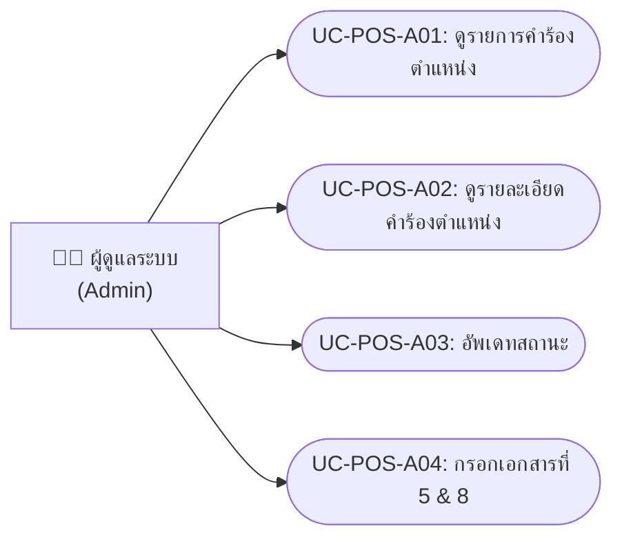
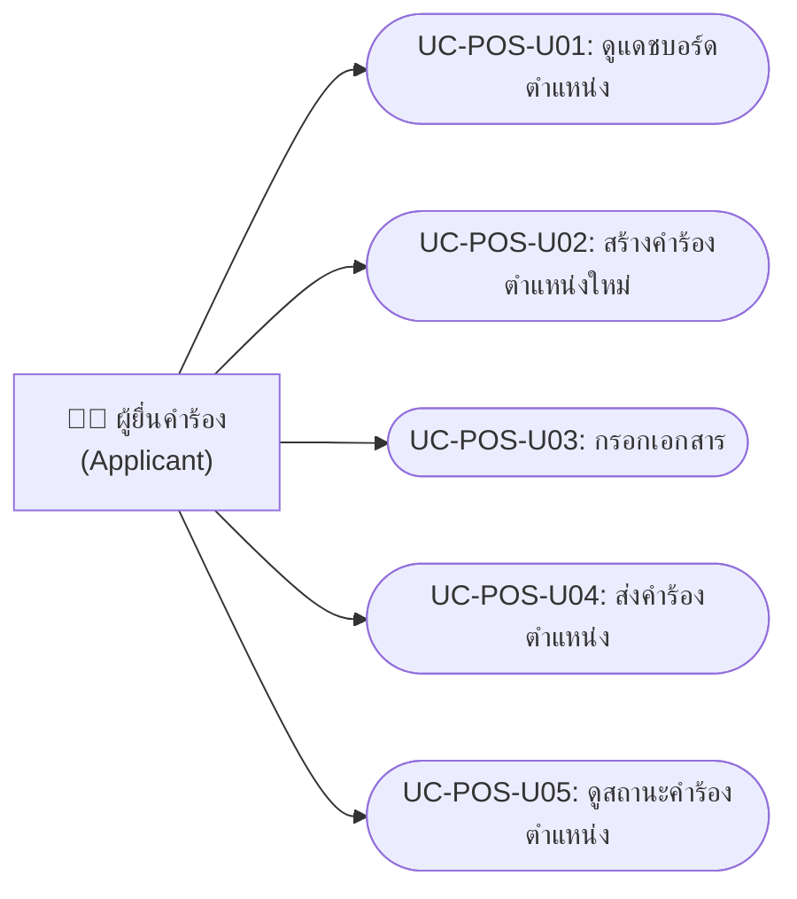
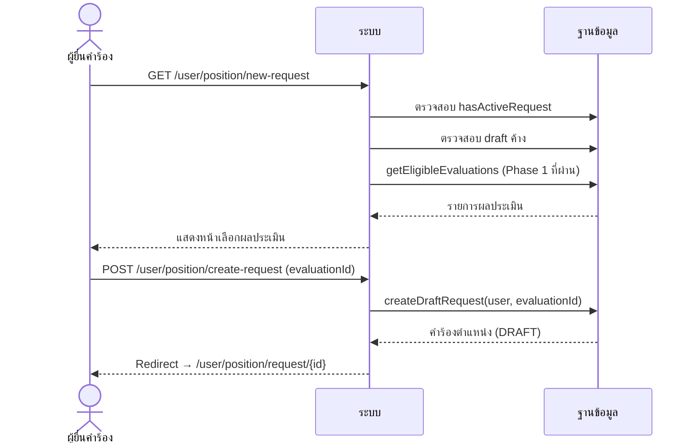
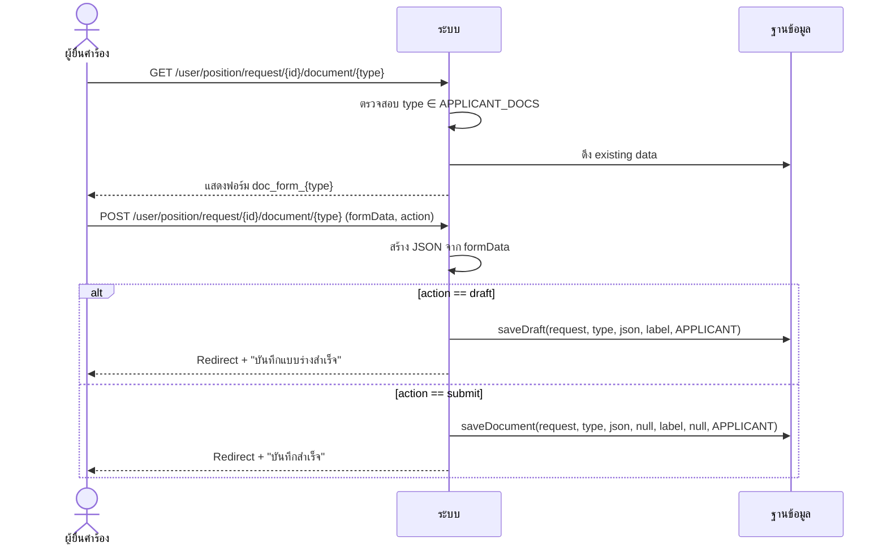
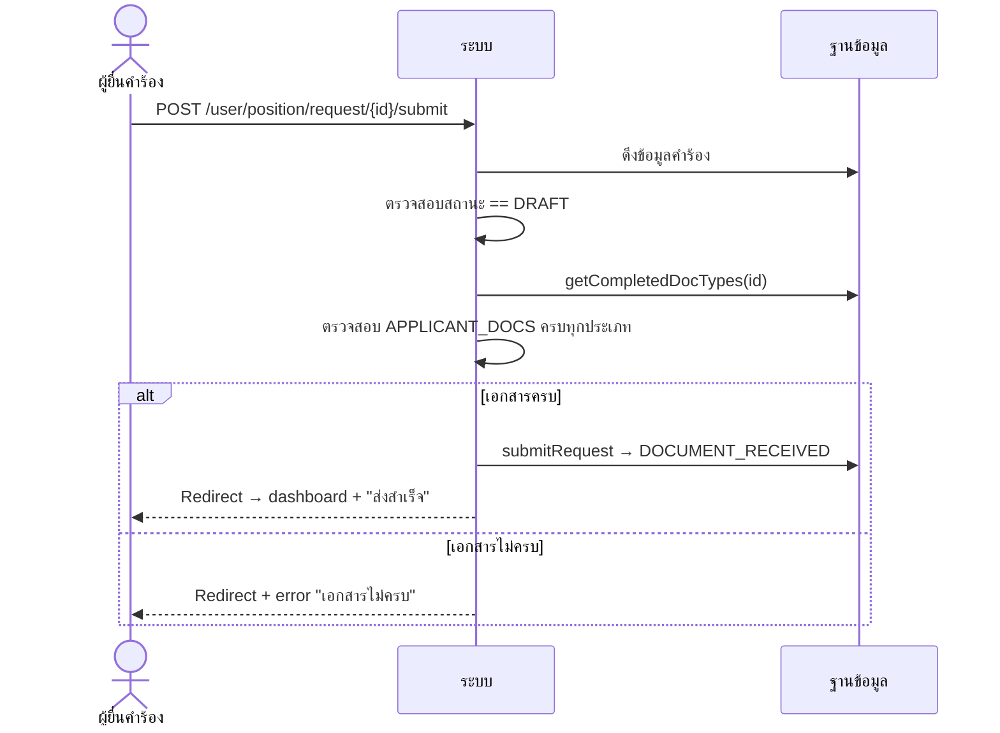
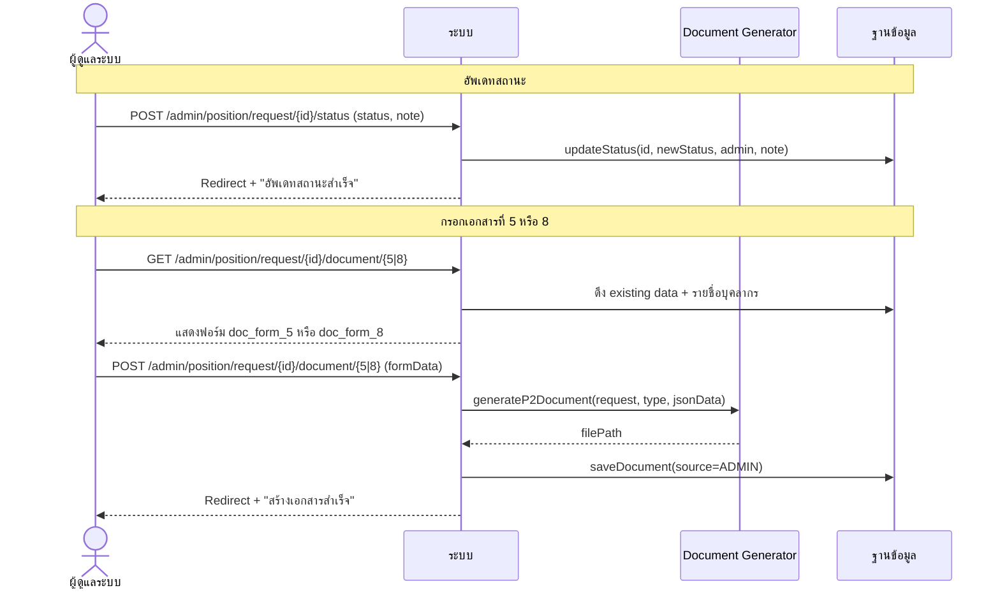

# คำร้องขอกำหนดตำแหน่ง (Position Request — Phase 2)

---

## 1. Use Case Diagram

### 1.1 ฝั่งผู้ดูแลระบบ (Admin)

### 1.2 ฝั่งผู้ยื่นคำร้อง (Applicant)

---

## 2. Use Case Descriptions

### ฝั่งผู้ดูแลระบบ (Admin)

---

### UC-POS-A01: ดูรายการคำร้องตำแหน่ง

| รายการ | รายละเอียด |
|--------|-----------|
| **รหัส Use Case** | UC-POS-A01 |
| **ชื่อ Use Case** | ดูรายการคำร้องตำแหน่งทั้งหมด |
| **คำอธิบาย** | ผู้ดูแลระบบดูรายการคำร้องขอกำหนดตำแหน่งทุกรายการ |
| **ผู้กระทำหลัก** | ผู้ดูแลระบบ (Admin) |
| **เงื่อนไขก่อนหน้า** | เข้าสู่ระบบแล้ว (ROLE_ADMIN) |
| **เงื่อนไขหลัง** | — |
| **ทริกเกอร์** | คลิก Tab "Phase 2" ในหน้ารายการคำร้อง |

#### ลำดับเหตุการณ์หลัก

| ขั้นตอน | ผู้กระทำ | การกระทำ |
|---------|---------|---------|
| 1 | ผู้ดูแลระบบ | คลิก Tab "Phase 2" หรือเข้า GET `/admin/position/requests` |
| 2 | ระบบ | ดึงรายการคำร้องตำแหน่งทั้งหมด |
| 3 | ระบบ | แสดงตารางรายการ: รหัส, ชื่อผู้ยื่น, ผลประเมิน Phase 1, สถานะ |

---

### UC-POS-A02: ดูรายละเอียดคำร้องตำแหน่ง

| รายการ | รายละเอียด |
|--------|-----------|
| **รหัส Use Case** | UC-POS-A02 |
| **ชื่อ Use Case** | ดูรายละเอียดคำร้องตำแหน่ง |
| **คำอธิบาย** | ดูรายละเอียดคำร้อง: เอกสารทั้งหมด, สถานะ, progress steps, status history |
| **ผู้กระทำหลัก** | ผู้ดูแลระบบ (Admin) |
| **เงื่อนไขก่อนหน้า** | เข้าสู่ระบบแล้ว (ROLE_ADMIN) |
| **เงื่อนไขหลัง** | — |
| **ทริกเกอร์** | คลิก "ดูรายละเอียด" จากรายการ |

#### ลำดับเหตุการณ์หลัก

| ขั้นตอน | ผู้กระทำ | การกระทำ |
|---------|---------|---------|
| 1 | ผู้ดูแลระบบ | คลิก "ดูรายละเอียด" (GET `/admin/position/request/{id}`) |
| 2 | ระบบ | ดึงข้อมูลคำร้อง + เอกสาร + completedDocs + status history |
| 3 | ระบบ | แสดง: progress bar, ข้อมูลผู้ยื่น, ตารางเอกสาร (Admin ดู: doc 5, 8), ไทม์ไลน์สถานะ |

---

### UC-POS-A03: อัพเดทสถานะ

| รายการ | รายละเอียด |
|--------|-----------|
| **รหัส Use Case** | UC-POS-A03 |
| **ชื่อ Use Case** | อัพเดทสถานะคำร้องตำแหน่ง |
| **คำอธิบาย** | เปลี่ยนสถานะคำร้องตำแหน่ง พร้อมระบุหมายเหตุ |
| **ผู้กระทำหลัก** | ผู้ดูแลระบบ (Admin) |
| **เงื่อนไขก่อนหน้า** | มีคำร้องตำแหน่งที่ยังไม่ terminal |
| **เงื่อนไขหลัง** | สถานะเปลี่ยน + บันทึก history + ส่ง email |
| **ทริกเกอร์** | คลิก "อัพเดทสถานะ" |

#### ลำดับเหตุการณ์หลัก

| ขั้นตอน | ผู้กระทำ | การกระทำ |
|---------|---------|---------|
| 1 | ผู้ดูแลระบบ | เลือกสถานะใหม่จาก dropdown |
| 2 | ผู้ดูแลระบบ | (ทางเลือก) กรอกหมายเหตุ |
| 3 | ผู้ดูแลระบบ | คลิก "อัพเดทสถานะ" |
| 4 | ระบบ | บันทึกสถานะ + history (POST `/admin/position/request/{id}/status`) |
| 5 | ระบบ | ส่ง email แจ้งผู้ยื่น |
| 6 | ระบบ | แสดงข้อความ "อัพเดทสถานะสำเร็จ" |

#### กฎทางธุรกิจ
- สถานะเปลี่ยนตาม flow: DRAFT → DOCUMENT_RECEIVED → DOCUMENT_VERIFICATION → SCREENING_COMMITTEE → REVISION_REQUESTED / SCREENING_APPROVED → COLLEGE_COMMITTEE → COLLEGE_APPROVED → SENT_TO_HR (ดู [แผนภาพสถานะ](appendix-status-flows.md))

---

### UC-POS-A04: กรอกเอกสารที่ 5 & 8

| รายการ | รายละเอียด |
|--------|-----------|
| **รหัส Use Case** | UC-POS-A04 |
| **ชื่อ Use Case** | กรอกเอกสารที่ 5 และ 8 (Admin) |
| **คำอธิบาย** | Admin กรอกเอกสารที่กำหนดให้ Admin เท่านั้น พร้อมสร้าง DOCX |
| **ผู้กระทำหลัก** | ผู้ดูแลระบบ (Admin) |
| **เงื่อนไขก่อนหน้า** | มีคำร้องตำแหน่งในระบบ |
| **เงื่อนไขหลัก** | เอกสาร DOCX ถูกสร้างและบันทึก |
| **ทริกเกอร์** | คลิก "กรอกเอกสาร" ที่เอกสาร 5 หรือ 8 |

#### ลำดับเหตุการณ์หลัก

| ขั้นตอน | ผู้กระทำ | การกระทำ |
|---------|---------|---------|
| 1 | ผู้ดูแลระบบ | คลิก "กรอกเอกสาร" ที่ type 5 หรือ 8 |
| 2 | ระบบ | ดึงข้อมูลเดิม (ถ้ามี) + รายชื่อบุคลากร |
| 3 | ระบบ | แสดงฟอร์มเฉพาะ (doc_form_5 หรือ doc_form_8) |
| 4 | ผู้ดูแลระบบ | กรอกข้อมูลในฟอร์ม |
| 5 | ผู้ดูแลระบบ | คลิก "บันทึกและสร้างเอกสาร" |
| 6 | ระบบ | สร้าง DOCX (generateP2Document) |
| 7 | ระบบ | บันทึกเอกสาร (JSON + filePath, source=ADMIN) |
| 8 | ระบบ | แสดงข้อความ "สร้างเอกสารสำเร็จ" |

---

### ฝั่งผู้ยื่นคำร้อง (Applicant)

---

### UC-POS-U01: ดูแดชบอร์ดตำแหน่ง

| รายการ | รายละเอียด |
|--------|-----------|
| **รหัส Use Case** | UC-POS-U01 |
| **ชื่อ Use Case** | ดูแดชบอร์ดคำร้องขอกำหนดตำแหน่ง |
| **คำอธิบาย** | แสดงคำร้องตำแหน่งทั้งหมด พร้อม countdown วันหมดอายุผลประเมิน |
| **ผู้กระทำหลัก** | ผู้ยื่นคำร้อง (Applicant) |
| **เงื่อนไขก่อนหน้า** | เข้าสู่ระบบแล้ว (ROLE_USER) |
| **เงื่อนไขหลัง** | — |
| **ทริกเกอร์** | คลิกเมนู "คำร้องขอกำหนดตำแหน่ง" |

#### ลำดับเหตุการณ์หลัก

| ขั้นตอน | ผู้กระทำ | การกระทำ |
|---------|---------|---------|
| 1 | ผู้ยื่นคำร้อง | คลิกเมนู "คำร้องขอกำหนดตำแหน่ง" |
| 2 | ระบบ | ดึงรายการคำร้องตำแหน่ง (ไม่รวม DRAFT) |
| 3 | ระบบ | ดึงวันหมดอายุผลประเมินล่าสุด (evaluationExpiryDate) |
| 4 | ระบบ | แสดง: draft card (ถ้ามี), countdown หมดอายุ, ตารางคำร้อง |

---

### UC-POS-U02: สร้างคำร้องตำแหน่งใหม่

| รายการ | รายละเอียด |
|--------|-----------|
| **รหัส Use Case** | UC-POS-U02 |
| **ชื่อ Use Case** | สร้างคำร้องขอกำหนดตำแหน่งใหม่ |
| **คำอธิบาย** | สร้างคำร้องใหม่โดยเลือกผลประเมินจาก Phase 1 ที่ผ่านแล้ว |
| **ผู้กระทำหลัก** | ผู้ยื่นคำร้อง (Applicant) |
| **เงื่อนไขก่อนหน้า** | 1. ไม่มีคำร้องตำแหน่ง active 2. มีผลประเมิน Phase 1 ที่ eligible |
| **เงื่อนไขหลัก** | คำร้องตำแหน่ง draft ถูกสร้างโดยเชื่อมกับผลประเมิน |
| **ทริกเกอร์** | คลิก "สร้างคำร้องใหม่" |

#### ลำดับเหตุการณ์หลัก

| ขั้นตอน | ผู้กระทำ | การกระทำ |
|---------|---------|---------|
| 1 | ผู้ยื่นคำร้อง | คลิก "สร้างคำร้องใหม่" (GET `/user/position/new-request`) |
| 2 | ระบบ | ตรวจสอบ: ไม่มีคำร้อง active, ไม่มี draft ค้าง |
| 3 | ระบบ | ดึงรายการผลประเมิน Phase 1 ที่ eligible (getEligibleEvaluations) |
| 4 | ระบบ | แสดงหน้าเลือกผลประเมิน |
| 5 | ผู้ยื่นคำร้อง | เลือกผลประเมินที่ต้องการ |
| 6 | ผู้ยื่นคำร้อง | คลิก "สร้างคำร้อง" (POST `/user/position/create-request`) |
| 7 | ระบบ | สร้าง draft request เชื่อมกับ evaluationId |
| 8 | ระบบ | Redirect ไปหน้ารายละเอียดคำร้อง |

#### ลำดับเหตุการณ์ทางเลือก

**AF-1: มีคำร้องที่ active อยู่**

| ขั้นตอน | ผู้กระทำ | การกระทำ |
|---------|---------|---------|
| 2a | ระบบ | ตรวจพบคำร้อง active |
| 2b | ระบบ | Redirect ไป dashboard + error |

**AF-2: มี draft ค้าง**

| ขั้นตอน | ผู้กระทำ | การกระทำ |
|---------|---------|---------|
| 2a | ระบบ | พบ draft ค้าง |
| 2b | ระบบ | Redirect ไปหน้ารายละเอียด draft นั้น |

**AF-3: ไม่มีผลประเมินที่ eligible**

| ขั้นตอน | ผู้กระทำ | การกระทำ |
|---------|---------|---------|
| 3a | ระบบ | ไม่พบผลประเมินที่ผ่าน Phase 1 |
| 3b | ระบบ | แสดงหน้า "ไม่มีผลประเมินที่สามารถใช้ได้" |

---

### UC-POS-U03: กรอกเอกสาร

| รายการ | รายละเอียด |
|--------|-----------|
| **รหัส Use Case** | UC-POS-U03 |
| **ชื่อ Use Case** | กรอกเอกสาร (Applicant — เอกสารที่ 1, 2, 3, 4, 6, 7, 9) |
| **คำอธิบาย** | ผู้ยื่นกรอกเอกสารที่กำหนดให้กรอกเอง (APPLICANT_DOCS) |
| **ผู้กระทำหลัก** | ผู้ยื่นคำร้อง (Applicant) |
| **เงื่อนไขก่อนหน้า** | มีคำร้องตำแหน่ง draft/active อยู่ |
| **เงื่อนไขหลัง** | เอกสารถูกบันทึก (draft หรือ submitted) |
| **ทริกเกอร์** | คลิก "กรอกเอกสาร" ที่เอกสารที่ต้องการ |

#### เอกสารที่ผู้ยื่นกรอก (APPLICANT_DOCS)

| ประเภท | ชื่อเอกสาร |
|--------|-----------|
| 1 | แบบคำขอรับการพิจารณากำหนดตำแหน่ง |
| 2 | แบบแสดงหลักฐานผลงาน |
| 3 | แบบรับรองจริยธรรมและจรรยาบรรณ |
| 4 | แบบสรุปผลการสอน |
| 6 | เอกสารประกอบการเรียนการสอน |
| 7 | ผลงานทางวิชาการ |
| 9 | เอกสารอื่นๆ |

#### ลำดับเหตุการณ์หลัก

| ขั้นตอน | ผู้กระทำ | การกระทำ |
|---------|---------|---------|
| 1 | ผู้ยื่นคำร้อง | คลิก "กรอกเอกสาร" ที่ type ที่ต้องการ |
| 2 | ระบบ | ตรวจสอบว่า type อยู่ใน APPLICANT_DOCS |
| 3 | ระบบ | ดึงข้อมูลเดิม (ถ้ามี) + แสดงฟอร์ม (doc_form_{type}) |
| 4 | ผู้ยื่นคำร้อง | กรอกข้อมูล |
| 5 | ผู้ยื่นคำร้อง | คลิก "บันทึก" หรือ "บันทึกแบบร่าง" |
| 6 | ระบบ | บันทึก JSON (draft: saveDraft / submit: saveDocument, source=APPLICANT) |
| 7 | ระบบ | Redirect + "บันทึกสำเร็จ" |

#### ลำดับเหตุการณ์ทางเลือก

**AF-1: ไม่มีสิทธิ์กรอกเอกสารนี้**

| ขั้นตอน | ผู้กระทำ | การกระทำ |
|---------|---------|---------|
| 2a | ระบบ | type ไม่อยู่ใน APPLICANT_DOCS |
| 2b | ระบบ | Redirect ไปหน้ารายละเอียดคำร้อง |

---

### UC-POS-U04: ส่งคำร้องตำแหน่ง

| รายการ | รายละเอียด |
|--------|-----------|
| **รหัส Use Case** | UC-POS-U04 |
| **ชื่อ Use Case** | ส่งคำร้องขอกำหนดตำแหน่ง |
| **คำอธิบาย** | ส่งคำร้องเมื่อเอกสารที่ผู้ยื่นต้องกรอกครบทุกฉบับ |
| **ผู้กระทำหลัก** | ผู้ยื่นคำร้อง (Applicant) |
| **เงื่อนไขก่อนหน้า** | สถานะ DRAFT + เอกสาร APPLICANT_DOCS ครบทุกประเภท |
| **เงื่อนไขหลัก** | สถานะเปลี่ยนเป็น DOCUMENT_RECEIVED |
| **ทริกเกอร์** | คลิก "ส่งคำร้อง" |

#### ลำดับเหตุการณ์หลัก

| ขั้นตอน | ผู้กระทำ | การกระทำ |
|---------|---------|---------|
| 1 | ผู้ยื่นคำร้อง | คลิก "ส่งคำร้อง" (POST `/user/position/request/{id}/submit`) |
| 2 | ระบบ | ตรวจสอบสถานะ == DRAFT |
| 3 | ระบบ | ตรวจสอบเอกสาร APPLICANT_DOCS ครบทุกประเภท (1,2,3,4,6,7,9) |
| 4 | ระบบ | เปลี่ยนสถานะ → DOCUMENT_RECEIVED (submitRequest) |
| 5 | ระบบ | Redirect → dashboard + "ส่งคำร้องสำเร็จ" |

#### ลำดับเหตุการณ์ทางเลือก

**AF-1: เอกสารไม่ครบ**

| ขั้นตอน | ผู้กระทำ | การกระทำ |
|---------|---------|---------|
| 3a | ระบบ | ตรวจพบเอกสารไม่ครบ |
| 3b | ระบบ | Redirect + error "กรุณากรอกเอกสารให้ครบทุกรายการ" |

---

### UC-POS-U05: ดูสถานะคำร้องตำแหน่ง

| รายการ | รายละเอียด |
|--------|-----------|
| **รหัส Use Case** | UC-POS-U05 |
| **ชื่อ Use Case** | ดูสถานะ/รายละเอียดคำร้องตำแหน่ง |
| **คำอธิบาย** | ดูรายละเอียดคำร้อง เอกสารที่กรอกแล้ว และประวัติสถานะ |
| **ผู้กระทำหลัก** | ผู้ยื่นคำร้อง (Applicant) |
| **เงื่อนไขก่อนหน้า** | เป็นเจ้าของคำร้อง |
| **เงื่อนไขหลัง** | — |
| **ทริกเกอร์** | คลิก "ดูรายละเอียด" จาก dashboard |

#### ลำดับเหตุการณ์หลัก

| ขั้นตอน | ผู้กระทำ | การกระทำ |
|---------|---------|---------|
| 1 | ผู้ยื่นคำร้อง | คลิก "ดูรายละเอียด" (GET `/user/position/request/{id}`) |
| 2 | ระบบ | ตรวจสอบสิทธิ์ (เจ้าของ) |
| 3 | ระบบ | ดึงข้อมูลคำร้อง + เอกสาร + completedDocs + status history |
| 4 | ระบบ | แสดง: ตารางเอกสาร (เฉพาะ APPLICANT_DOCS), สถานะ, ไทม์ไลน์ |

#### กฎทางธุรกิจ
- ผู้ยื่นเห็นเฉพาะเอกสาร APPLICANT_DOCS (1,2,3,4,6,7,9)
- docLabels ที่แสดงเป็นฝั่ง applicant (getApplicantDocLabels)

---

## 3. System Sequence Diagrams

### SSD-POS-01: ผู้ยื่นสร้างคำร้องตำแหน่ง

### SSD-POS-02: ผู้ยื่นกรอกเอกสาร

### SSD-POS-03: ผู้ยื่นส่งคำร้องตำแหน่ง

### SSD-POS-04: Admin อัพเดทสถานะ + กรอกเอกสาร

---

## 4. User Interface Design

### UI-POS-A01: หน้ารายการคำร้องตำแหน่ง (Admin)

| รายการ | รายละเอียด |
|--------|-----------|
| **ชื่อหน้า** | คำร้องขอกำหนดตำแหน่ง |
| **URL** | `/admin/position/requests` |
| **บทบาท** | ผู้ดูแลระบบ (ROLE_ADMIN) |
| **Use Cases** | UC-POS-A01 |

#### องค์ประกอบหน้าจอ

| ลำดับ | องค์ประกอบ | ประเภท | คำอธิบาย | การกระทำ |
|------|----------|--------|---------|---------|
| 1 | ตารางคำร้อง | Table | รหัส, ชื่อผู้ยื่น, ผลประเมิน Phase 1, สถานะ | — |
| 2 | ปุ่ม "ดู" | Button/Link | ไปหน้ารายละเอียด | GET /admin/position/request/{id} |

---

### UI-POS-A02: หน้ารายละเอียดคำร้องตำแหน่ง (Admin)

| รายการ | รายละเอียด |
|--------|-----------|
| **ชื่อหน้า** | รายละเอียดคำร้องตำแหน่ง |
| **URL** | `/admin/position/request/{id}` |
| **บทบาท** | ผู้ดูแลระบบ (ROLE_ADMIN) |
| **Use Cases** | UC-POS-A02, A03, A04 |

#### องค์ประกอบหน้าจอ

| ลำดับ | องค์ประกอบ | ประเภท | คำอธิบาย | การกระทำ |
|------|----------|--------|---------|---------|
| 1 | Progress bar | Stepper | ขั้นตอนสถานะ (getProgressSteps) | — |
| 2 | ข้อมูลผู้ยื่น | Card | ชื่อ, ผลประเมิน Phase 1 ที่อ้างอิง | — |
| 3 | อัพเดทสถานะ | Form (dropdown + textarea) | เลือกสถานะ + หมายเหตุ | POST .../status |
| 4 | ตารางเอกสาร | Table | ประเภท, ชื่อ, ผู้กรอก (Admin/Applicant), สถานะ | — |
| 5 | ปุ่ม "กรอกเอกสาร" (5, 8) | Button | ไปฟอร์มกรอก Admin | GET .../document/{5\|8} |
| 6 | ไทม์ไลน์สถานะ | Timeline | ประวัติการเปลี่ยนสถานะ | — |

---

### UI-POS-U01: หน้าแดชบอร์ดตำแหน่ง (User)

| รายการ | รายละเอียด |
|--------|-----------|
| **ชื่อหน้า** | คำร้องขอกำหนดตำแหน่ง |
| **URL** | `/user/position/dashboard` |
| **บทบาท** | ผู้ยื่นคำร้อง (ROLE_USER) |
| **Use Cases** | UC-POS-U01 |

#### องค์ประกอบหน้าจอ

| ลำดับ | องค์ประกอบ | ประเภท | คำอธิบาย | การกระทำ |
|------|----------|--------|---------|---------|
| 1 | Countdown หมดอายุ | Card (warning) | แสดงวันหมดอายุผลประเมิน Phase 1 | — |
| 2 | Draft card | Card (highlight) | แสดง draft ที่ค้างอยู่ | คลิก → request detail |
| 3 | ปุ่ม "สร้างคำร้องใหม่" | Button (primary) | เริ่มสร้างคำร้องตำแหน่ง | GET /user/position/new-request |
| 4 | ตารางคำร้อง | Table | รหัส, วันที่ส่ง, สถานะ, ปุ่มดู | — |

#### กฎการแสดงผล
- ซ่อนปุ่ม "สร้างคำร้องใหม่" เมื่อ hasActiveRequest = true
- Countdown แสดงเฉพาะเมื่อมี evaluationExpiryDate

---

### UI-POS-U02: หน้าสร้างคำร้องตำแหน่งใหม่ (User)

| รายการ | รายละเอียด |
|--------|-----------|
| **ชื่อหน้า** | สร้างคำร้องขอกำหนดตำแหน่งใหม่ |
| **URL** | `/user/position/new-request` |
| **บทบาท** | ผู้ยื่นคำร้อง (ROLE_USER) |
| **Use Cases** | UC-POS-U02 |

#### องค์ประกอบหน้าจอ

| ลำดับ | องค์ประกอบ | ประเภท | คำอธิบาย | การกระทำ |
|------|----------|--------|---------|---------|
| 1 | รายการผลประเมิน | Radio/Card list | เลือกผลประเมิน Phase 1 ที่ eligible | — |
| 2 | ข้อมูลผลประเมิน | Card detail | แสดงรายละเอียดผลประเมินที่เลือก | — |
| 3 | ปุ่ม "สร้างคำร้อง" | Button (primary) | สร้าง draft linked to evaluation | POST .../create-request |

#### กฎการแสดงผล
- ถ้าไม่มีผลประเมินที่ eligible แสดงข้อความ "ไม่มีผลประเมินที่ใช้ได้"
- ปุ่ม disabled ถ้ายังไม่เลือกผลประเมิน

---

### UI-POS-U03: หน้ารายละเอียดคำร้องตำแหน่ง (User)

| รายการ | รายละเอียด |
|--------|-----------|
| **ชื่อหน้า** | รายละเอียดคำร้องขอกำหนดตำแหน่ง |
| **URL** | `/user/position/request/{id}` |
| **บทบาท** | ผู้ยื่นคำร้อง (ROLE_USER) |
| **Use Cases** | UC-POS-U03, U04, U05 |

#### องค์ประกอบหน้าจอ

| ลำดับ | องค์ประกอบ | ประเภท | คำอธิบาย | การกระทำ |
|------|----------|--------|---------|---------|
| 1 | ข้อมูลคำร้อง | Card | รหัส, สถานะ, ผลประเมิน Phase 1 | — |
| 2 | ตารางเอกสาร (APPLICANT_DOCS) | Table | ประเภท, ชื่อ, สถานะ (✅/⏳), ปุ่มกรอก | — |
| 3 | ปุ่ม "กรอกเอกสาร" | Button ต่อแถว | ไปฟอร์มกรอกเอกสาร | GET .../document/{type} |
| 4 | ปุ่ม "ส่งคำร้อง" | Button (primary, disabled until all done) | ส่งคำร้อง | POST .../submit |
| 5 | ไทม์ไลน์สถานะ | Timeline | ประวัติการเปลี่ยนสถานะ | — |

#### กฎการแสดงผล
- แสดงเฉพาะเอกสาร APPLICANT_DOCS (1,2,3,4,6,7,9)
- ปุ่ม "ส่งคำร้อง" enabled เฉพาะเมื่อเอกสารครบทุกประเภท + สถานะ DRAFT
- เอกสารที่กรอกแล้วแสดง ✅ เอกสารที่ยังไม่กรอกแสดง ⏳
