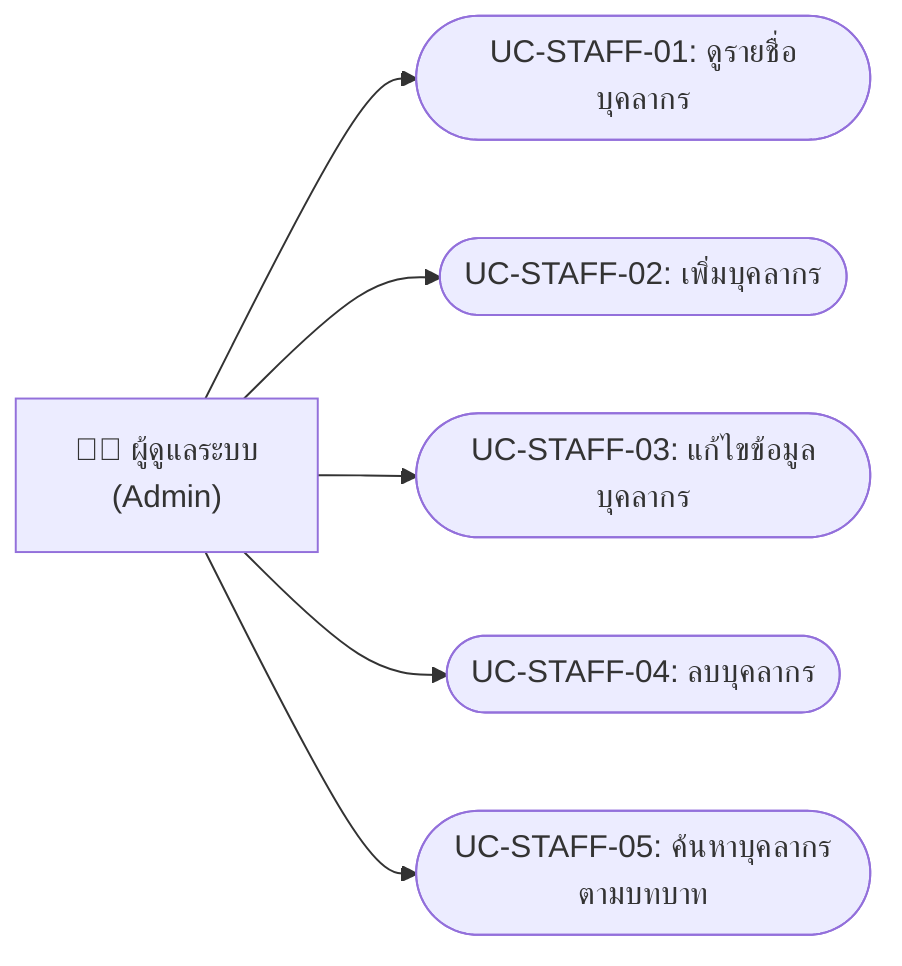
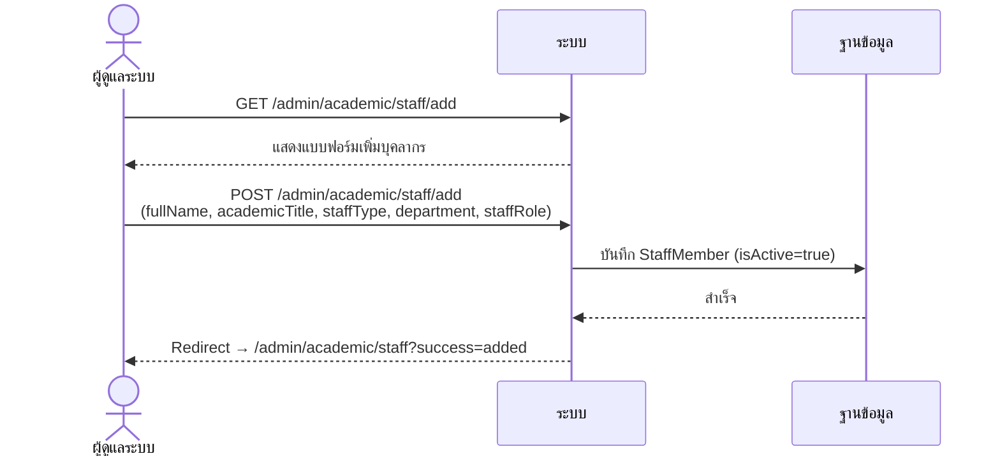
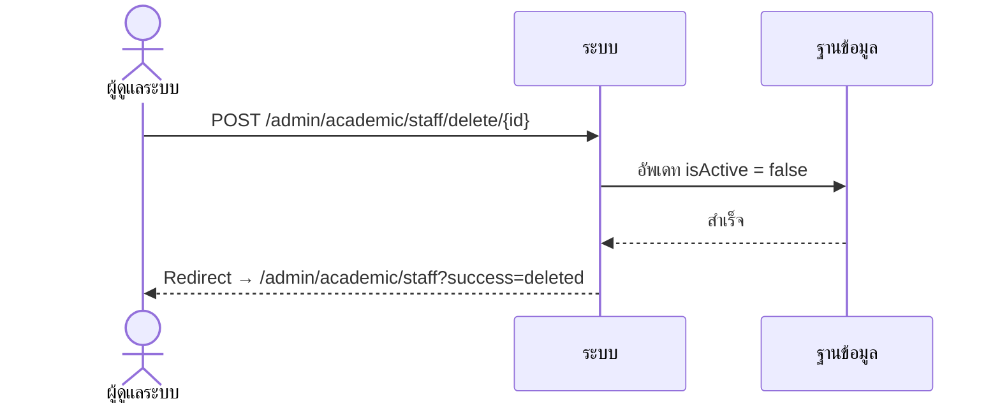

# ระบบจัดการบุคลากร (Staff Management)

> **บทบาท**: ผู้ดูแลระบบ (Admin) เท่านั้น

---

## 1. Use Case Diagram

---

## 2. Use Case Descriptions

### UC-STAFF-01: ดูรายชื่อบุคลากร

| รายการ | รายละเอียด |
|--------|-----------|
| **รหัส Use Case** | UC-STAFF-01 |
| **ชื่อ Use Case** | ดูรายชื่อบุคลากร |
| **คำอธิบาย** | แสดงรายชื่อบุคลากร/กรรมการทั้งหมดในระบบ |
| **ผู้กระทำหลัก** | ผู้ดูแลระบบ (Admin) |
| **เงื่อนไขก่อนหน้า** | เข้าสู่ระบบแล้ว (ROLE_ADMIN) |
| **เงื่อนไขหลัง** | — |
| **ทริกเกอร์** | คลิกเมนู "จัดการบุคลากร" |

#### ลำดับเหตุการณ์หลัก

| ขั้นตอน | ผู้กระทำ | การกระทำ |
|---------|---------|---------|
| 1 | ผู้ดูแลระบบ | คลิกเมนู "จัดการบุคลากร" |
| 2 | ระบบ | ดึงรายชื่อบุคลากรทั้งหมดที่ active |
| 3 | ระบบ | แสดงตาราง: ชื่อ, ตำแหน่งทางวิชาการ, ประเภท, สาขา, บทบาท |

---

### UC-STAFF-02: เพิ่มบุคลากร

| รายการ | รายละเอียด |
|--------|-----------|
| **รหัส Use Case** | UC-STAFF-02 |
| **ชื่อ Use Case** | เพิ่มบุคลากร |
| **คำอธิบาย** | เพิ่มข้อมูลบุคลากร/กรรมการใหม่เข้าสู่ระบบ |
| **ผู้กระทำหลัก** | ผู้ดูแลระบบ (Admin) |
| **เงื่อนไขก่อนหน้า** | เข้าสู่ระบบแล้ว (ROLE_ADMIN) |
| **เงื่อนไขหลัง** | บุคลากรใหม่ถูกเพิ่มในระบบ (isActive = true) |
| **ทริกเกอร์** | คลิกปุ่ม "เพิ่มบุคลากร" |

#### ลำดับเหตุการณ์หลัก

| ขั้นตอน | ผู้กระทำ | การกระทำ |
|---------|---------|---------|
| 1 | ผู้ดูแลระบบ | คลิก "เพิ่มบุคลากร" |
| 2 | ระบบ | แสดงแบบฟอร์มเพิ่มบุคลากร |
| 3 | ผู้ดูแลระบบ | กรอกข้อมูล: ชื่อเต็ม, ตำแหน่งทางวิชาการ, ประเภทบุคลากร, สาขา, บทบาท |
| 4 | ผู้ดูแลระบบ | คลิก "บันทึก" |
| 5 | ระบบ | บันทึกข้อมูลบุคลากร |
| 6 | ระบบ | Redirect ไปหน้ารายชื่อ + แสดง "เพิ่มสำเร็จ" |

---

### UC-STAFF-03: แก้ไขข้อมูลบุคลากร

| รายการ | รายละเอียด |
|--------|-----------|
| **รหัส Use Case** | UC-STAFF-03 |
| **ชื่อ Use Case** | แก้ไขข้อมูลบุคลากร |
| **คำอธิบาย** | แก้ไขข้อมูลบุคลากรที่มีอยู่ |
| **ผู้กระทำหลัก** | ผู้ดูแลระบบ (Admin) |
| **เงื่อนไขก่อนหน้า** | เข้าสู่ระบบแล้ว (ROLE_ADMIN) มีบุคลากรในระบบ |
| **เงื่อนไขหลัง** | ข้อมูลบุคลากรถูกอัพเดท |
| **ทริกเกอร์** | คลิกปุ่ม "แก้ไข" ในแถวของบุคลากร |

#### ลำดับเหตุการณ์หลัก

| ขั้นตอน | ผู้กระทำ | การกระทำ |
|---------|---------|---------|
| 1 | ผู้ดูแลระบบ | คลิก "แก้ไข" ที่แถวบุคลากร |
| 2 | ระบบ | ดึงข้อมูลบุคลากร แสดงในแบบฟอร์ม |
| 3 | ผู้ดูแลระบบ | แก้ไขข้อมูลที่ต้องการ |
| 4 | ผู้ดูแลระบบ | คลิก "บันทึก" |
| 5 | ระบบ | อัพเดทข้อมูล Redirect + แสดง "อัพเดทสำเร็จ" |

---

### UC-STAFF-04: ลบบุคลากร

| รายการ | รายละเอียด |
|--------|-----------|
| **รหัส Use Case** | UC-STAFF-04 |
| **ชื่อ Use Case** | ลบบุคลากร |
| **คำอธิบาย** | ลบบุคลากรออกจากระบบ (soft delete — เปลี่ยน isActive เป็น false) |
| **ผู้กระทำหลัก** | ผู้ดูแลระบบ (Admin) |
| **เงื่อนไขก่อนหน้า** | เข้าสู่ระบบแล้ว (ROLE_ADMIN) มีบุคลากรในระบบ |
| **เงื่อนไขหลัง** | บุคลากรถูก soft delete (isActive = false) |
| **ทริกเกอร์** | คลิกปุ่ม "ลบ" |

#### ลำดับเหตุการณ์หลัก

| ขั้นตอน | ผู้กระทำ | การกระทำ |
|---------|---------|---------|
| 1 | ผู้ดูแลระบบ | คลิก "ลบ" ที่แถวบุคลากร |
| 2 | ระบบ | แสดง confirm dialog |
| 3 | ผู้ดูแลระบบ | ยืนยันการลบ |
| 4 | ระบบ | Soft delete (isActive = false) |
| 5 | ระบบ | Redirect + แสดง "ลบสำเร็จ" |

---

### UC-STAFF-05: ค้นหาบุคลากรตามบทบาท

| รายการ | รายละเอียด |
|--------|-----------|
| **รหัส Use Case** | UC-STAFF-05 |
| **ชื่อ Use Case** | ค้นหาบุคลากรตามบทบาท |
| **คำอธิบาย** | ค้นหาบุคลากรตามบทบาท (คณบดี, หัวหน้าสาขา, กรรมการ, HR) ผ่าน API |
| **ผู้กระทำหลัก** | ผู้ดูแลระบบ (Admin) — เรียกจากหน้าเอกสาร |
| **เงื่อนไขก่อนหน้า** | เข้าสู่ระบบแล้ว |
| **เงื่อนไขหลัง** | — |
| **ทริกเกอร์** | ระบบเรียก API เมื่อต้องการรายชื่อบุคลากรตามบทบาท |

#### ลำดับเหตุการณ์หลัก

| ขั้นตอน | ผู้กระทำ | การกระทำ |
|---------|---------|---------|
| 1 | ระบบ (JavaScript) | เรียก GET /admin/academic/staff/api/by-role?role=xxx |
| 2 | ระบบ | ค้นหาบุคลากรที่มี staffRole ตรงกัน |
| 3 | ระบบ | ส่งกลับ JSON array ของบุคลากร |

---

## 3. System Sequence Diagrams

### SSD-STAFF-01: เพิ่ม/แก้ไขบุคลากร

### SSD-STAFF-02: ลบบุคลากร (Soft Delete)

---

## 4. User Interface Design

### UI-STAFF-01: หน้ารายชื่อบุคลากร

| รายการ | รายละเอียด |
|--------|-----------|
| **ชื่อหน้า** | จัดการบุคลากร |
| **URL** | `/admin/academic/staff` |
| **บทบาท** | ผู้ดูแลระบบ (ROLE_ADMIN) |
| **Use Cases** | UC-STAFF-01, UC-STAFF-04 |

#### องค์ประกอบหน้าจอ

| ลำดับ | องค์ประกอบ | ประเภท | คำอธิบาย | การกระทำ |
|------|----------|--------|---------|---------|
| 1 | ปุ่ม "เพิ่มบุคลากร" | Button (primary) | ไปหน้าเพิ่มบุคลากร | GET /admin/academic/staff/add |
| 2 | ตารางบุคลากร | Table | แสดง: ชื่อเต็ม, ตำแหน่งทางวิชาการ, ประเภท, สาขา, บทบาท | — |
| 3 | ปุ่ม "แก้ไข" ในแต่ละแถว | Button (warning) | ไปหน้าแก้ไข | GET /admin/academic/staff/edit/{id} |
| 4 | ปุ่ม "ลบ" ในแต่ละแถว | Button (danger) | ลบบุคลากร (confirm ก่อน) | POST /admin/academic/staff/delete/{id} |
| 5 | ข้อความแจ้งเตือน | Alert (success) | แสดงเมื่อ added/updated/deleted สำเร็จ | — |

---

### UI-STAFF-02: หน้าเพิ่ม/แก้ไขบุคลากร

| รายการ | รายละเอียด |
|--------|-----------|
| **ชื่อหน้า** | เพิ่มบุคลากร / แก้ไขบุคลากร |
| **URL** | `/admin/academic/staff/add` หรือ `/admin/academic/staff/edit/{id}` |
| **บทบาท** | ผู้ดูแลระบบ (ROLE_ADMIN) |
| **Use Cases** | UC-STAFF-02, UC-STAFF-03 |

#### องค์ประกอบหน้าจอ

| ลำดับ | องค์ประกอบ | ประเภท | คำอธิบาย | การกระทำ |
|------|----------|--------|---------|---------|
| 1 | ชื่อเต็ม (fullName) | Text Input (required) | ชื่อ-นามสกุล | — |
| 2 | ตำแหน่งทางวิชาการ (academicTitle) | Text Input (required) | เช่น ผศ.ดร., รศ.ดร. | — |
| 3 | ประเภทบุคลากร (staffType) | Select/Text (required) | เช่น ข้าราชการ, พนักงานมหาวิทยาลัย | — |
| 4 | สาขา (department) | Text Input (optional) | สาขาวิชาที่สังกัด | — |
| 5 | บทบาท (staffRole) | Select (required) | คณบดี, หัวหน้าสาขา, กรรมการ, HR | — |
| 6 | ปุ่ม "บันทึก" | Button (primary) | บันทึกข้อมูล | POST |
| 7 | ปุ่ม "ยกเลิก" | Button (secondary) | กลับหน้ารายชื่อ | GET /admin/academic/staff |

#### กฎการแสดงผล
- หน้าแก้ไขจะ pre-fill ข้อมูลบุคลากรที่มีอยู่
- ฟิลด์ department เป็น optional (required = false)
- ใช้ฟอร์มเดียวกันสำหรับทั้งเพิ่มและแก้ไข (แยกโดย URL)
