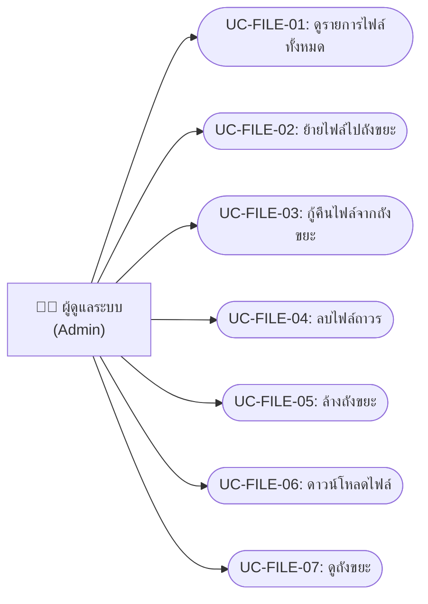
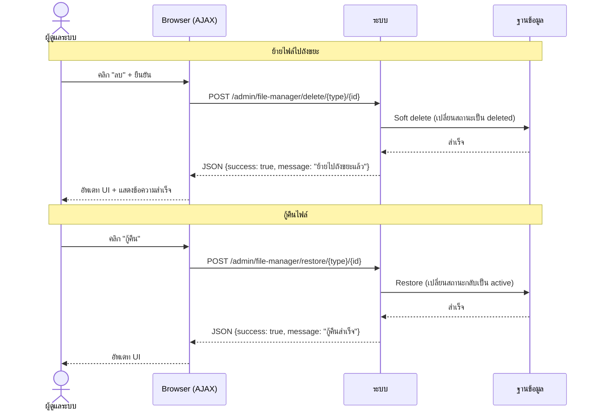
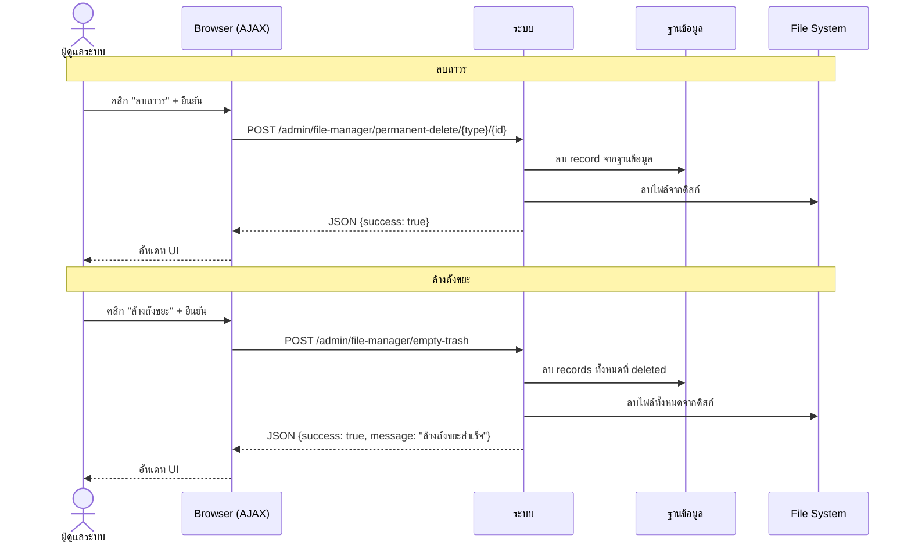

# ระบบจัดการไฟล์ (File Management)

> **บทบาท**: ผู้ดูแลระบบ (Admin) เท่านั้น

---

## 1. Use Case Diagram

---

## 2. Use Case Descriptions

### UC-FILE-01: ดูรายการไฟล์ทั้งหมด

| รายการ | รายละเอียด |
|--------|-----------|
| **รหัส Use Case** | UC-FILE-01 |
| **ชื่อ Use Case** | ดูรายการไฟล์ทั้งหมด |
| **คำอธิบาย** | แสดงรายการไฟล์เอกสารทั้งหมดในระบบ พร้อมสรุปจำนวนไฟล์ ขนาดรวม และจำนวนไฟล์ในถังขยะ |
| **ผู้กระทำหลัก** | ผู้ดูแลระบบ (Admin) |
| **เงื่อนไขก่อนหน้า** | เข้าสู่ระบบแล้ว (ROLE_ADMIN) |
| **เงื่อนไขหลัง** | — |
| **ทริกเกอร์** | คลิกเมนู "จัดการไฟล์" |

#### ลำดับเหตุการณ์หลัก

| ขั้นตอน | ผู้กระทำ | การกระทำ |
|---------|---------|---------|
| 1 | ผู้ดูแลระบบ | คลิกเมนู "จัดการไฟล์" |
| 2 | ระบบ | ดึงรายการไฟล์ที่ active ทั้งหมด |
| 3 | ระบบ | คำนวณสรุป: จำนวนไฟล์, ขนาดรวม, จำนวนในถังขยะ |
| 4 | ระบบ | แสดงตารางไฟล์: ชื่อ, ประเภท, ขนาด, วันที่สร้าง |

---

### UC-FILE-02: ย้ายไฟล์ไปถังขยะ

| รายการ | รายละเอียด |
|--------|-----------|
| **รหัส Use Case** | UC-FILE-02 |
| **ชื่อ Use Case** | ย้ายไฟล์ไปถังขยะ (Soft Delete) |
| **คำอธิบาย** | ย้ายไฟล์ไปยังถังขยะ (ไม่ลบจริง สามารถกู้คืนได้) |
| **ผู้กระทำหลัก** | ผู้ดูแลระบบ (Admin) |
| **เงื่อนไขก่อนหน้า** | เข้าสู่ระบบแล้ว มีไฟล์ในรายการ |
| **เงื่อนไขหลัง** | ไฟล์ถูกย้ายไปถังขยะ |
| **ทริกเกอร์** | คลิกปุ่ม "ลบ" ที่ไฟล์ |

#### ลำดับเหตุการณ์หลัก

| ขั้นตอน | ผู้กระทำ | การกระทำ |
|---------|---------|---------|
| 1 | ผู้ดูแลระบบ | คลิก "ลบ" ที่แถวไฟล์ |
| 2 | ระบบ | แสดง confirm dialog |
| 3 | ผู้ดูแลระบบ | ยืนยันการลบ |
| 4 | ระบบ | POST /admin/file-manager/delete/{type}/{id} (AJAX) |
| 5 | ระบบ | Soft delete ไฟล์ |
| 6 | ระบบ | ส่ง JSON: {success: true, message: "ย้ายไปถังขยะแล้ว"} |

---

### UC-FILE-03: กู้คืนไฟล์จากถังขยะ

| รายการ | รายละเอียด |
|--------|-----------|
| **รหัส Use Case** | UC-FILE-03 |
| **ชื่อ Use Case** | กู้คืนไฟล์จากถังขยะ |
| **คำอธิบาย** | กู้คืนไฟล์ที่อยู่ในถังขยะกลับมาเป็นไฟล์ active |
| **ผู้กระทำหลัก** | ผู้ดูแลระบบ (Admin) |
| **เงื่อนไขก่อนหน้า** | เข้าสู่ระบบแล้ว มีไฟล์ในถังขยะ |
| **เงื่อนไขหลัง** | ไฟล์กลับมาเป็น active |
| **ทริกเกอร์** | คลิก "กู้คืน" ในหน้าถังขยะ |

#### ลำดับเหตุการณ์หลัก

| ขั้นตอน | ผู้กระทำ | การกระทำ |
|---------|---------|---------|
| 1 | ผู้ดูแลระบบ | เปิดหน้าถังขยะ |
| 2 | ผู้ดูแลระบบ | คลิก "กู้คืน" ที่ไฟล์ |
| 3 | ระบบ | POST /admin/file-manager/restore/{type}/{id} (AJAX) |
| 4 | ระบบ | กู้คืนไฟล์ |
| 5 | ระบบ | ส่ง JSON: {success: true, message: "กู้คืนสำเร็จ"} |

---

### UC-FILE-04: ลบไฟล์ถาวร

| รายการ | รายละเอียด |
|--------|-----------|
| **รหัส Use Case** | UC-FILE-04 |
| **ชื่อ Use Case** | ลบไฟล์ถาวร |
| **คำอธิบาย** | ลบไฟล์จากระบบอย่างถาวร (ไม่สามารถกู้คืนได้) |
| **ผู้กระทำหลัก** | ผู้ดูแลระบบ (Admin) |
| **เงื่อนไขก่อนหน้า** | ไฟล์อยู่ในถังขยะ |
| **เงื่อนไขหลัง** | ไฟล์ถูกลบจากระบบและดิสก์อย่างถาวร |
| **ทริกเกอร์** | คลิก "ลบถาวร" ในหน้าถังขยะ |

#### ลำดับเหตุการณ์หลัก

| ขั้นตอน | ผู้กระทำ | การกระทำ |
|---------|---------|---------|
| 1 | ผู้ดูแลระบบ | คลิก "ลบถาวร" ที่ไฟล์ในถังขยะ |
| 2 | ระบบ | แสดง confirm dialog (เตือนว่าลบถาวร กู้คืนไม่ได้) |
| 3 | ผู้ดูแลระบบ | ยืนยัน |
| 4 | ระบบ | POST /admin/file-manager/permanent-delete/{type}/{id} |
| 5 | ระบบ | ลบไฟล์จากฐานข้อมูลและดิสก์ |
| 6 | ระบบ | ส่ง JSON: {success: true, message: "ลบถาวรสำเร็จ"} |

---

### UC-FILE-05: ล้างถังขยะ

| รายการ | รายละเอียด |
|--------|-----------|
| **รหัส Use Case** | UC-FILE-05 |
| **ชื่อ Use Case** | ล้างถังขยะ |
| **คำอธิบาย** | ลบไฟล์ทั้งหมดในถังขยะอย่างถาวร |
| **ผู้กระทำหลัก** | ผู้ดูแลระบบ (Admin) |
| **เงื่อนไขก่อนหน้า** | มีไฟล์ในถังขยะ |
| **เงื่อนไขหลัง** | ถังขยะว่าง ไฟล์ทั้งหมดถูกลบถาวร |
| **ทริกเกอร์** | คลิก "ล้างถังขยะ" |

#### ลำดับเหตุการณ์หลัก

| ขั้นตอน | ผู้กระทำ | การกระทำ |
|---------|---------|---------|
| 1 | ผู้ดูแลระบบ | คลิก "ล้างถังขยะ" |
| 2 | ระบบ | แสดง confirm dialog |
| 3 | ผู้ดูแลระบบ | ยืนยัน |
| 4 | ระบบ | POST /admin/file-manager/empty-trash |
| 5 | ระบบ | ลบไฟล์ทั้งหมดในถังขยะอย่างถาวร |
| 6 | ระบบ | ส่ง JSON: {success: true, message: "ล้างถังขยะสำเร็จ"} |

---

### UC-FILE-06: ดาวน์โหลดไฟล์

| รายการ | รายละเอียด |
|--------|-----------|
| **รหัส Use Case** | UC-FILE-06 |
| **ชื่อ Use Case** | ดาวน์โหลดไฟล์ |
| **คำอธิบาย** | ดาวน์โหลดไฟล์จากระบบ |
| **ผู้กระทำหลัก** | ผู้ดูแลระบบ (Admin) |
| **เงื่อนไขก่อนหน้า** | ไฟล์มีอยู่ในระบบ |
| **เงื่อนไขหลัง** | ไฟล์ถูกดาวน์โหลดไปยังเครื่องผู้ใช้ |
| **ทริกเกอร์** | คลิกปุ่ม "ดาวน์โหลด" |

#### ลำดับเหตุการณ์หลัก

| ขั้นตอน | ผู้กระทำ | การกระทำ |
|---------|---------|---------|
| 1 | ผู้ดูแลระบบ | คลิก "ดาวน์โหลด" ที่แถวไฟล์ |
| 2 | ระบบ | GET /admin/file-manager/download/{type}/{id} |
| 3 | ระบบ | อ่านไฟล์จากดิสก์ ตั้ง Content-Disposition header |
| 4 | ระบบ | ส่งไฟล์กลับเป็น binary response |
| 5 | Browser | ดาวน์โหลดไฟล์ |

#### ลำดับเหตุการณ์ผิดพลาด

**EF-1: ไฟล์ไม่พบ**

| ขั้นตอน | ผู้กระทำ | การกระทำ |
|---------|---------|---------|
| 3a | ระบบ | ไม่พบไฟล์บนดิสก์ |
| 3b | ระบบ | ส่ง 404 Not Found |

---

### UC-FILE-07: ดูถังขยะ

| รายการ | รายละเอียด |
|--------|-----------|
| **รหัส Use Case** | UC-FILE-07 |
| **ชื่อ Use Case** | ดูถังขยะ |
| **คำอธิบาย** | แสดงรายการไฟล์ที่อยู่ในถังขยะ |
| **ผู้กระทำหลัก** | ผู้ดูแลระบบ (Admin) |
| **เงื่อนไขก่อนหน้า** | เข้าสู่ระบบแล้ว |
| **เงื่อนไขหลัง** | — |
| **ทริกเกอร์** | คลิกแท็บ "ถังขยะ" |

#### ลำดับเหตุการณ์หลัก

| ขั้นตอน | ผู้กระทำ | การกระทำ |
|---------|---------|---------|
| 1 | ผู้ดูแลระบบ | คลิกแท็บ "ถังขยะ" |
| 2 | ระบบ | GET /admin/file-manager/trash |
| 3 | ระบบ | ดึงรายการไฟล์ที่ถูก soft delete |
| 4 | ระบบ | แสดงตาราง: ชื่อ, ประเภท, ขนาด, วันที่ลบ + ปุ่มกู้คืน/ลบถาวร |

---

## 3. System Sequence Diagrams

### SSD-FILE-01: Soft Delete และกู้คืนไฟล์

### SSD-FILE-02: ลบถาวร / ล้างถังขยะ

---

## 4. User Interface Design

### UI-FILE-01: หน้ารายการไฟล์ / ถังขยะ

| รายการ | รายละเอียด |
|--------|-----------|
| **ชื่อหน้า** | จัดการไฟล์ |
| **URL** | `/admin/file-manager` (ไฟล์ทั้งหมด) หรือ `/admin/file-manager/trash` (ถังขยะ) |
| **บทบาท** | ผู้ดูแลระบบ (ROLE_ADMIN) |
| **Use Cases** | UC-FILE-01 ~ UC-FILE-07 |

#### องค์ประกอบหน้าจอ

| ลำดับ | องค์ประกอบ | ประเภท | คำอธิบาย | การกระทำ |
|------|----------|--------|---------|---------|
| 1 | สรุปจำนวนไฟล์ | Card/Stats | แสดง: จำนวนไฟล์ทั้งหมด, ขนาดรวม, จำนวนในถังขยะ | — |
| 2 | แท็บ "ไฟล์ทั้งหมด" | Tab | สลับดูไฟล์ active | GET /admin/file-manager |
| 3 | แท็บ "ถังขยะ" | Tab (badge) | สลับดูถังขยะ (แสดงจำนวน) | GET /admin/file-manager/trash |
| 4 | ตารางไฟล์ | Table | แสดง: ชื่อ, ประเภท, ขนาด, คำร้องที่เกี่ยวข้อง, วันที่ | — |
| 5 | ปุ่ม "ดาวน์โหลด" | Button (info) | ดาวน์โหลดไฟล์ | GET /admin/file-manager/download/{type}/{id} |
| 6 | ปุ่ม "ลบ" | Button (danger) | ย้ายไปถังขยะ (AJAX) | POST /admin/file-manager/delete/{type}/{id} |
| 7 | ปุ่ม "กู้คืน" | Button (success) | กู้คืนจากถังขยะ (แสดงในโหมดถังขยะ) | POST /admin/file-manager/restore/{type}/{id} |
| 8 | ปุ่ม "ลบถาวร" | Button (danger) | ลบไฟล์ถาวร (แสดงในโหมดถังขยะ) | POST /admin/file-manager/permanent-delete/{type}/{id} |
| 9 | ปุ่ม "ล้างถังขยะ" | Button (danger) | ลบทั้งหมดในถังขยะ (แสดงในโหมดถังขยะ) | POST /admin/file-manager/empty-trash |

#### กฎการแสดงผล
- โหมด "ไฟล์ทั้งหมด" (viewMode = "files"): แสดงปุ่ม ดาวน์โหลด + ลบ
- โหมด "ถังขยะ" (viewMode = "trash"): แสดงปุ่ม กู้คืน + ลบถาวร + ล้างถังขยะ
- การลบ/กู้คืน/ลบถาวร ใช้ AJAX (ไม่ reload หน้า)
- ขนาดไฟล์แสดงในรูปแบบ B / KB / MB / GB
