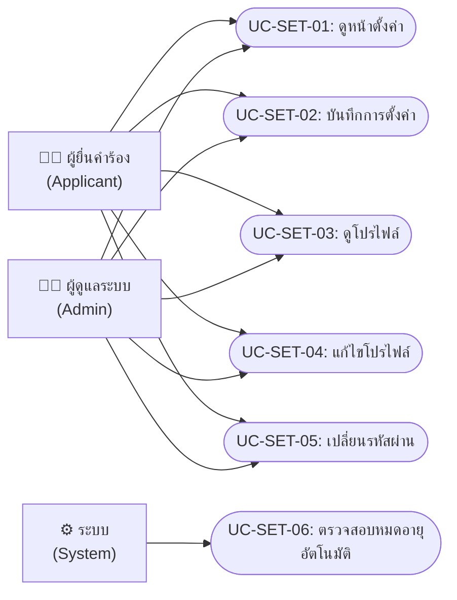
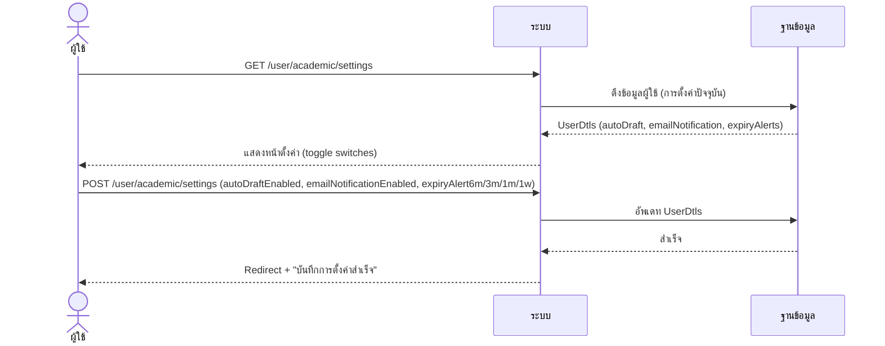
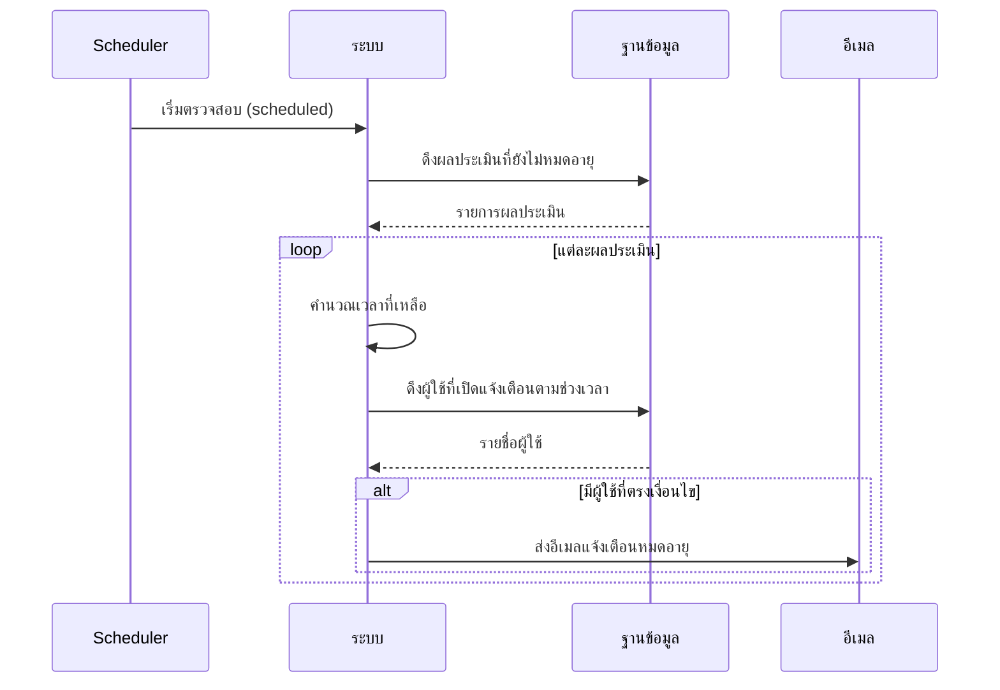

# การตั้งค่าและแจ้งเตือน (Settings & Notifications)

---

## 1. Use Case Diagram

---

## 2. Use Case Descriptions

### UC-SET-01: ดูหน้าตั้งค่า

| รายการ | รายละเอียด |
|--------|-----------|
| **รหัส Use Case** | UC-SET-01 |
| **ชื่อ Use Case** | ดูหน้าตั้งค่า |
| **คำอธิบาย** | แสดงหน้าตั้งค่าสำหรับผู้ใช้: Auto-Draft, การแจ้งเตือนอีเมล, การแจ้งเตือนหมดอายุ |
| **ผู้กระทำหลัก** | ผู้ยื่นคำร้อง / ผู้ดูแลระบบ |
| **เงื่อนไขก่อนหน้า** | เข้าสู่ระบบแล้ว |
| **เงื่อนไขหลัง** | — |
| **ทริกเกอร์** | คลิกเมนู "ตั้งค่า" |

#### ลำดับเหตุการณ์หลัก

| ขั้นตอน | ผู้กระทำ | การกระทำ |
|---------|---------|---------|
| 1 | ผู้ใช้ | คลิกเมนู "ตั้งค่า" (GET `/user/academic/settings` หรือ `/admin/academic/settings`) |
| 2 | ระบบ | ดึงข้อมูลการตั้งค่าปัจจุบันของผู้ใช้ |
| 3 | ระบบ | แสดงหน้าตั้งค่าพร้อมค่าปัจจุบัน |

---

### UC-SET-02: บันทึกการตั้งค่า

| รายการ | รายละเอียด |
|--------|-----------|
| **รหัส Use Case** | UC-SET-02 |
| **ชื่อ Use Case** | บันทึกการตั้งค่า |
| **คำอธิบาย** | บันทึกการตั้งค่า Auto-Draft, การแจ้งเตือนอีเมล, การแจ้งเตือนหมดอายุ (6 เดือน, 3 เดือน, 1 เดือน, 1 สัปดาห์) |
| **ผู้กระทำหลัก** | ผู้ยื่นคำร้อง / ผู้ดูแลระบบ |
| **เงื่อนไขก่อนหน้า** | เข้าสู่ระบบแล้ว |
| **เงื่อนไขหลัง** | การตั้งค่าถูกบันทึกลง DB |
| **ทริกเกอร์** | คลิก "บันทึกการตั้งค่า" |

#### ลำดับเหตุการณ์หลัก

| ขั้นตอน | ผู้กระทำ | การกระทำ |
|---------|---------|---------|
| 1 | ผู้ใช้ | เปิด/ปิดตัวเลือกการตั้งค่า |
| 2 | ผู้ใช้ | คลิก "บันทึก" |
| 3 | ระบบ | บันทึก: autoDraftEnabled, emailNotificationEnabled, expiryAlert6m/3m/1m/1w |
| 4 | ระบบ | แสดงข้อความ "บันทึกการตั้งค่าสำเร็จ" |

#### ตัวเลือกการตั้งค่า

| ตัวเลือก | คำอธิบาย | ค่าเริ่มต้น |
|----------|---------|-----------|
| Auto-Draft | บันทึกแบบร่างอัตโนมัติขณะกรอกเอกสาร | ปิด |
| การแจ้งเตือนอีเมล | รับแจ้งเตือนทางอีเมลเมื่อสถานะเปลี่ยน | เปิด |
| แจ้งเตือน 6 เดือนก่อนหมดอายุ | แจ้งเตือนผลประเมินก่อนหมดอายุ 6 เดือน | ปิด |
| แจ้งเตือน 3 เดือนก่อนหมดอายุ | แจ้งเตือนผลประเมินก่อนหมดอายุ 3 เดือน | ปิด |
| แจ้งเตือน 1 เดือนก่อนหมดอายุ | แจ้งเตือนผลประเมินก่อนหมดอายุ 1 เดือน | ปิด |
| แจ้งเตือน 1 สัปดาห์ก่อนหมดอายุ | แจ้งเตือนผลประเมินก่อนหมดอายุ 1 สัปดาห์ | ปิด |

---

### UC-SET-03: ดูโปรไฟล์

| รายการ | รายละเอียด |
|--------|-----------|
| **รหัส Use Case** | UC-SET-03 |
| **ชื่อ Use Case** | ดูโปรไฟล์ |
| **คำอธิบาย** | แสดงข้อมูลส่วนตัวของผู้ใช้ |
| **ผู้กระทำหลัก** | ผู้ยื่นคำร้อง / ผู้ดูแลระบบ |
| **เงื่อนไขก่อนหน้า** | เข้าสู่ระบบแล้ว |
| **เงื่อนไขหลัง** | — |
| **ทริกเกอร์** | คลิก "โปรไฟล์" |

#### ลำดับเหตุการณ์หลัก

| ขั้นตอน | ผู้กระทำ | การกระทำ |
|---------|---------|---------|
| 1 | ผู้ใช้ | คลิก "โปรไฟล์" (GET `/user/profile` หรือ `/admin/profile`) |
| 2 | ระบบ | ดึงข้อมูลผู้ใช้ |
| 3 | ระบบ | แสดง: ชื่อ, อีเมล, รูปโปรไฟล์, ข้อมูลเพิ่มเติม |

---

### UC-SET-04: แก้ไขโปรไฟล์

| รายการ | รายละเอียด |
|--------|-----------|
| **รหัส Use Case** | UC-SET-04 |
| **ชื่อ Use Case** | แก้ไขโปรไฟล์ |
| **คำอธิบาย** | แก้ไขข้อมูลส่วนตัวและอัปโหลดรูปโปรไฟล์ |
| **ผู้กระทำหลัก** | ผู้ยื่นคำร้อง / ผู้ดูแลระบบ |
| **เงื่อนไขก่อนหน้า** | เข้าสู่ระบบแล้ว |
| **เงื่อนไขหลัง** | ข้อมูลโปรไฟล์ถูกอัพเดท |
| **ทริกเกอร์** | คลิก "แก้ไขโปรไฟล์" |

#### ลำดับเหตุการณ์หลัก

| ขั้นตอน | ผู้กระทำ | การกระทำ |
|---------|---------|---------|
| 1 | ผู้ใช้ | แก้ไขข้อมูล: ชื่อ, เบอร์โทร, อัปโหลดรูปใหม่ |
| 2 | ผู้ใช้ | คลิก "บันทึก" (POST `/user/update-profile` หรือ `/admin/update-profile`) |
| 3 | ระบบ | บันทึกข้อมูล + อัปโหลดรูปใหม่ (ถ้ามี) |
| 4 | ระบบ | แสดงข้อความ "อัพเดทโปรไฟล์สำเร็จ" |

---

### UC-SET-05: เปลี่ยนรหัสผ่าน

| รายการ | รายละเอียด |
|--------|-----------|
| **รหัส Use Case** | UC-SET-05 |
| **ชื่อ Use Case** | เปลี่ยนรหัสผ่าน |
| **คำอธิบาย** | เปลี่ยนรหัสผ่านโดยกรอกรหัสเก่าและรหัสใหม่ |
| **ผู้กระทำหลัก** | ผู้ยื่นคำร้อง / ผู้ดูแลระบบ |
| **เงื่อนไขก่อนหน้า** | เข้าสู่ระบบแล้ว |
| **เงื่อนไขหลัง** | รหัสผ่านถูกเปลี่ยน |
| **ทริกเกอร์** | คลิก "เปลี่ยนรหัสผ่าน" |

#### ลำดับเหตุการณ์หลัก

| ขั้นตอน | ผู้กระทำ | การกระทำ |
|---------|---------|---------|
| 1 | ผู้ใช้ | กรอกรหัสผ่านปัจจุบัน + รหัสผ่านใหม่ + ยืนยัน |
| 2 | ผู้ใช้ | คลิก "เปลี่ยนรหัสผ่าน" (POST `/user/change-password` หรือ `/admin/change-password`) |
| 3 | ระบบ | ตรวจสอบรหัสเก่าถูกต้อง + รหัสใหม่ตรงกัน |
| 4 | ระบบ | เข้ารหัส (BCrypt) + บันทึก |
| 5 | ระบบ | แสดงข้อความ "เปลี่ยนรหัสผ่านสำเร็จ" |

#### ลำดับเหตุการณ์ทางเลือก

**AF-1: รหัสผ่านเก่าไม่ถูกต้อง**

| ขั้นตอน | ผู้กระทำ | การกระทำ |
|---------|---------|---------|
| 3a | ระบบ | รหัสผ่านเก่าไม่ตรง |
| 3b | ระบบ | แสดงข้อความ "รหัสผ่านเก่าไม่ถูกต้อง" |

---

### UC-SET-06: ตรวจสอบหมดอายุอัตโนมัติ

| รายการ | รายละเอียด |
|--------|-----------|
| **รหัส Use Case** | UC-SET-06 |
| **ชื่อ Use Case** | ตรวจสอบและส่งแจ้งเตือนหมดอายุอัตโนมัติ |
| **คำอธิบาย** | ระบบ Scheduler ตรวจสอบผลประเมินที่ใกล้หมดอายุ แล้วส่งอีเมลแจ้งเตือนตามการตั้งค่าของผู้ใช้ |
| **ผู้กระทำหลัก** | ระบบ (EvaluationExpiryScheduler) |
| **เงื่อนไขก่อนหน้า** | ผู้ใช้เปิดใช้งานการแจ้งเตือนหมดอายุ |
| **เงื่อนไขหลัง** | ส่ง email แจ้งเตือนผู้ใช้ที่ตั้งค่าไว้ |
| **ทริกเกอร์** | Scheduled task ทำงานตามกำหนดเวลา |

#### ลำดับเหตุการณ์หลัก

| ขั้นตอน | ผู้กระทำ | การกระทำ |
|---------|---------|---------|
| 1 | ระบบ | Scheduler ทำงาน (cron/fixed rate) |
| 2 | ระบบ | ดึงผลประเมินที่ยังไม่หมดอายุ |
| 3 | ระบบ | คำนวณเวลาที่เหลือก่อนหมดอายุ |
| 4 | ระบบ | ดึงผู้ใช้ที่เปิดการแจ้งเตือนตามช่วงเวลา (6m/3m/1m/1w) |
| 5 | ระบบ | ส่งอีเมลแจ้งเตือนเฉพาะผู้ใช้ที่ตรงเงื่อนไข |

---

## 3. System Sequence Diagrams

### SSD-SET-01: บันทึกการตั้งค่า

### SSD-SET-02: ตรวจสอบและส่งแจ้งเตือนหมดอายุ

---

## 4. User Interface Design

### UI-SET-01: หน้าตั้งค่า

| รายการ | รายละเอียด |
|--------|-----------|
| **ชื่อหน้า** | ตั้งค่า |
| **URL** | `/user/academic/settings` หรือ `/admin/academic/settings` |
| **บทบาท** | ผู้ยื่นคำร้อง / ผู้ดูแลระบบ |
| **Use Cases** | UC-SET-01, UC-SET-02 |

#### องค์ประกอบหน้าจอ

| ลำดับ | องค์ประกอบ | ประเภท | คำอธิบาย | การกระทำ |
|------|----------|--------|---------|---------|
| 1 | Auto-Draft | Toggle Switch | เปิด/ปิดบันทึกแบบร่างอัตโนมัติ | — |
| 2 | การแจ้งเตือนอีเมล | Toggle Switch | เปิด/ปิดการแจ้งเตือนทางอีเมล | — |
| 3 | แจ้งเตือน 6 เดือน | Checkbox | แจ้งเตือนก่อนหมดอายุ 6 เดือน | — |
| 4 | แจ้งเตือน 3 เดือน | Checkbox | แจ้งเตือนก่อนหมดอายุ 3 เดือน | — |
| 5 | แจ้งเตือน 1 เดือน | Checkbox | แจ้งเตือนก่อนหมดอายุ 1 เดือน | — |
| 6 | แจ้งเตือน 1 สัปดาห์ | Checkbox | แจ้งเตือนก่อนหมดอายุ 1 สัปดาห์ | — |
| 7 | ปุ่ม "บันทึก" | Button (primary) | บันทึกการตั้งค่า | POST .../settings |

#### กฎการแสดงผล
- หน้า settings ใช้ template เดียวกัน (`academic/settings.html`) ทั้ง user และ admin
- settingsBasePath เปลี่ยนตาม role (user/admin)

---

### UI-SET-02: หน้าโปรไฟล์ (User)

| รายการ | รายละเอียด |
|--------|-----------|
| **ชื่อหน้า** | โปรไฟล์ |
| **URL** | `/user/profile` |
| **บทบาท** | ผู้ยื่นคำร้อง (ROLE_USER) |
| **Use Cases** | UC-SET-03, UC-SET-04, UC-SET-05 |

#### องค์ประกอบหน้าจอ

| ลำดับ | องค์ประกอบ | ประเภท | คำอธิบาย | การกระทำ |
|------|----------|--------|---------|---------|
| 1 | รูปโปรไฟล์ | Image + File Input | แสดงรูป + ปุ่มอัปโหลดใหม่ | — |
| 2 | ชื่อ | Text Input | แก้ไขชื่อ | — |
| 3 | อีเมล | Text (readonly) | แสดงอีเมล (ไม่สามารถเปลี่ยนได้) | — |
| 4 | เบอร์โทร | Text Input | แก้ไขเบอร์โทร | — |
| 5 | ปุ่ม "บันทึก" | Button (primary) | บันทึกข้อมูลโปรไฟล์ | POST /user/update-profile |
| 6 | ส่วนเปลี่ยนรหัสผ่าน | Form (separate) | รหัสเก่า + ใหม่ + ยืนยัน | POST /user/change-password |

---

### UI-SET-03: หน้าโปรไฟล์ (Admin)

| รายการ | รายละเอียด |
|--------|-----------|
| **ชื่อหน้า** | โปรไฟล์ |
| **URL** | `/admin/profile` |
| **บทบาท** | ผู้ดูแลระบบ (ROLE_ADMIN) |
| **Use Cases** | UC-SET-03, UC-SET-04, UC-SET-05 |

#### องค์ประกอบหน้าจอ

| ลำดับ | องค์ประกอบ | ประเภท | คำอธิบาย | การกระทำ |
|------|----------|--------|---------|---------|
| 1 | รูปโปรไฟล์ | Image + File Input | แสดงรูป + อัปโหลดใหม่ | — |
| 2 | ชื่อ | Text Input | แก้ไขชื่อ | — |
| 3 | อีเมล | Text (readonly) | แสดงอีเมล | — |
| 4 | เบอร์โทร | Text Input | แก้ไขเบอร์โทร | — |
| 5 | ปุ่ม "บันทึก" | Button (primary) | บันทึกข้อมูลโปรไฟล์ | POST /admin/update-profile |
| 6 | ส่วนเปลี่ยนรหัสผ่าน | Form (separate) | รหัสเก่า + ใหม่ + ยืนยัน | POST /admin/change-password |
