# การเดินทางของเอกสารการยื่นขอตำแหน่งทางวิชาการ (Phase 1–2)

เอกสารฉบับนี้อธิบายเส้นทางเดินของ "เอกสาร" ตลอดกระบวนการขอกำหนดตำแหน่งทางวิชาการ ซึ่งแบ่งเป็น 2 เฟสต่อเนื่องกัน — **Phase 1 การยื่นประเมินผลการสอน** ที่เป็นเงื่อนไขคุณสมบัติ และ **Phase 2 การยื่นขอกำหนดตำแหน่ง** ที่จบด้วยการส่งเรื่องออกไปยังกองทรัพยากรบุคคล มหาวิทยาลัยขอนแก่น ประกอบด้วย 3 ส่วน

| ส่วน | เนื้อหา |
|------|--------|
| 1 | **Activity Diagram** — 2 แผนภาพแยกตามเฟส และวงจรชีวิตของเอกสารรายฉบับ |
| 2 | **System Sequence Diagram** — แผนภาพลำดับระดับระบบของ 6 เหตุการณ์สำคัญใน Phase 2 |
| 3 | **Domain Model** — แผนภาพคลาสที่ถอดจาก `@Entity` จริงในระบบ พร้อมคำอธิบายคลาส คลาสที่ไม่ได้แสดง และกฎธุรกิจ |

> **ขอบเขต** — อ้างอิงจากซอร์สโค้ดจริงในแพ็กเกจ `com.ecom.academic`
> (`AcademicApplicantController`, `AcademicAdminController`, `AcademicRequestService`,
> `PositionApplicantController`, `PositionAdminController`, `PositionRequestService`,
> `DocumentGenerationService`, `PositionEmailService`)

---

## 0. เอกสารในกระบวนการ

### 0.1 Phase 1 — การยื่นประเมินผลการสอน (เอกสารที่ 0–8)

| ฉบับที่ | ชื่อเอกสาร | ผู้กรอก | ผลข้างเคียงเมื่อบันทึก |
|--------|-----------|--------|----------------------|
| 0 | บันทึกข้อความ ขอรับการประเมินผลการสอน | ผู้ยื่น | สร้างไฟล์ DOCX ทันที |
| 1 | แบบตรวจสอบเบื้องต้นเอกสารประกอบประเมินผลการสอน | ผู้ยื่น | สร้างไฟล์ DOCX ทันที |
| 2 | การขอรายชื่อเพื่อแต่งตั้งคณะกรรมการ | **ผู้ดูแลระบบ** | — |
| 3 | คำสั่งแต่งตั้งคณะอนุกรรมการประเมินผลการสอน | **ผู้ดูแลระบบ** | เลื่อนสถานะเป็น `SUB_COMMITTEE_APPOINTED` |
| 4 | บันทึกข้อความ ขอเชิญเป็นกรรมการผู้ทรงคุณวุฒิ | **ผู้ดูแลระบบ** | สร้าง DOCX **3 สำเนา** (กรรมการ 3 ท่าน) + เลื่อนสถานะเป็น `MEETING_SCHEDULED` |
| 5 | ข้อเสนอแนะจากคณะอนุกรรมการ | **ผู้ดูแลระบบ** | มีปุ่มส่งข้อเสนอแนะแยก → เปลี่ยนสถานะเป็น `COMPLETED_REVISE` + ส่งอีเมล |
| 6 | แบบฟอร์มประเมินการสอน ตามประกาศ มข. 1607-66 | **ผู้ดูแลระบบ** | คำนวณคะแนนถ่วงน้ำหนักฝั่งเซิร์ฟเวอร์ → เลื่อนสถานะเป็น `COMPLETED_PASS` หรือ `COMPLETED_FAIL` |
| 7 | ส่วนที่ 3 แบบประเมินผลการสอน | **ผู้ดูแลระบบ** | แปลงเลขอารบิกเป็นเลขไทยสำหรับ DOCX |
| 8 | บันทึกข้อความ แจ้งผลการประเมินผลการสอน | **ผู้ดูแลระบบ** | เลื่อนสถานะเป็น `COMPLETED` + บันทึก `expiration_date` ที่ใช้เป็นคุณสมบัติของ Phase 2 |

- **เอกสารของผู้ยื่น** — เอกสารที่ 0 และ 1 ต้องกรอกให้เสร็จก่อนจึงจะส่งคำร้องได้
- **เกณฑ์คะแนนเอกสารที่ 6** — น้ำหนัก 4 ส่วน 20/30/30/20 คะแนน คำนวณด้วยสูตร `(คะแนน ÷ 5) × น้ำหนัก` แล้วสรุปผลเป็น ไม่ผ่าน (≤56), ชำนาญ (57–70), ชำนาญพิเศษ (71–85), เชี่ยวชาญ (86–100)

### 0.2 Phase 2 — การยื่นขอกำหนดตำแหน่ง (เอกสารที่ 1–9)

| ฉบับที่ | ชื่อเอกสาร | ผู้กรอก | ผลข้างเคียงเมื่อบันทึก |
|--------|-----------|--------|----------------------|
| 1 | แบบ ก.พ.ว. มข. 03 (ประวัติและผลงาน) | ผู้ยื่น | เป็นแหล่งข้อมูลให้เอกสารอื่นเติมข้อมูลอัตโนมัติ |
| 2 | หนังสือแจ้งความประสงค์เรื่องการรับรู้ข้อมูล | ผู้ยื่น | Sync `targetPosition`, `major`, `subMajor`, `evaluationMethod` กลับเข้า `PositionRequest` |
| 3 | แบบรับรองจริยธรรมและจรรยาบรรณ | ผู้ยื่น | — |
| 4 | บันทึกรับรองผลงานทางวิชาการ (วิทยานิพนธ์) | ผู้ยื่น | — |
| 5 | แบบประเมินคุณสมบัติโดยผู้บังคับบัญชา | **ผู้ดูแลระบบ** | สร้างไฟล์ DOCX + เลื่อนสถานะเป็น `DOCUMENT_VERIFICATION` |
| 6 | บันทึกข้อความจริยธรรมการวิจัย (Exemption) | ผู้ยื่น | — |
| 7 | แบบฟอร์มตรวจสอบคุณสมบัติ (Checklist) | ผู้ยื่น (บางช่องเฉพาะเจ้าหน้าที่) | ช่อง `hr_officer_*`, `dean_*`, `reason_if_none` สงวนไว้ให้เจ้าหน้าที่เท่านั้น |
| 8 | แบบสรุปรายละเอียดและรายชื่อผู้ทรงคุณวุฒิ | **ผู้ดูแลระบบ** | สร้างไฟล์ DOCX + เลื่อนสถานะเป็น `SCREENING_COMMITTEE` |
| 9 | ลักษณะการมีส่วนร่วมในผลงาน | ผู้ยื่น | — |

- **เอกสารของผู้ยื่น** — `APPLICANT_DOCS = {1, 2, 3, 4, 6, 7, 9}` ต้องกรอกครบทั้ง 7 ฉบับจึงจะส่งคำร้องได้
- **เอกสารของผู้ดูแลระบบ** — `ADMIN_DOCS = {5, 8}` ผู้ยื่นมองไม่เห็นในหน้ารายละเอียดคำร้อง

---

## 1. Activity Diagram

| แผนภาพ | ขอบเขต |
|--------|--------|
| 1.1 | การยื่นประเมินผลการสอน (Phase 1) — ตั้งแต่สร้างแบบร่างจนถึงแจ้งผลการประเมิน |
| 1.2 | การยื่นขอกำหนดตำแหน่ง (Phase 2) — ตั้งแต่ตรวจสอบคุณสมบัติจนถึงส่งออกกองทรัพยากรบุคคล |
| 1.3 | วงจรชีวิตของเอกสารรายฉบับ — ใช้ร่วมกันทั้งสองเฟส |

### 1.1 การยื่นประเมินผลการสอน (Phase 1)

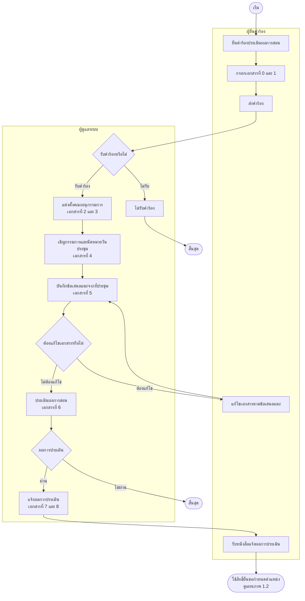

**งานที่ระบบทำอัตโนมัติเบื้องหลัง** (ไม่แสดงเป็นขั้นตอนในแผนภาพ)

- สร้างไฟล์ DOCX จากเทมเพลตทุกครั้งที่บันทึกเอกสารสมบูรณ์ — เอกสารที่ 4 สร้าง 3 สำเนาสำหรับกรรมการ 3 ท่าน
- เลื่อนสถานะให้อัตโนมัติเมื่อบันทึกเอกสารที่ 3, 4, 6 และ 8
- ส่งอีเมลและการแจ้งเตือนในระบบทุกครั้งที่สถานะเปลี่ยน พร้อมบันทึก Admin Log
- ตัวตั้งเวลารายวันแจ้งเตือนล่วงหน้าเมื่อผลการประเมินใกล้หมดอายุ (6 เดือน / 3 เดือน / 1 เดือน / 1 สัปดาห์)

**จุดตรวจสอบสำคัญของ Phase 1**

| # | จุดตรวจสอบ | เงื่อนไข | ผลเมื่อไม่ผ่าน |
|---|-----------|---------|---------------|
| 1 | สิทธิ์ยื่นคำร้อง | ต้องไม่มีคำร้องที่สถานะยังไม่ใช่ `REJECTED`, `COMPLETED` หรือ `COMPLETED_FAIL` | `?error=active-request` |
| 2 | สถานะก่อนส่ง | ต้องเป็น `DRAFT` เท่านั้น | `?error=already_submitted` |
| 3 | ผลการประเมินเอกสารที่ 6 | คะแนนรวมถ่วงน้ำหนักต้องมากกว่า 56 | สถานะเปลี่ยนเป็น `COMPLETED_FAIL` และกระบวนการสิ้นสุด |
| 4 | ไฟล์แนบของผู้ดูแลระบบ | ไม่เกิน 10 ไฟล์ และต้องเป็น PDF หรือ DOCX | `?error=max_attachments` หรือ `?error=invalid_file_type` |
| 5 | คุณสมบัติสู่ Phase 2 | สถานะต้องเป็น `COMPLETED` และ `expiration_date` ในเอกสารที่ 8 ต้องยังไม่ถึงกำหนด | ไม่ปรากฏในรายการให้เลือกตอนยื่น Phase 2 |

> **หมายเหตุ** — การเลื่อนสถานะอัตโนมัติจากเอกสารที่ 3, 4, 6 และ 8 จะทำงานก็ต่อเมื่อผู้ดูแลระบบติ๊กเลือกแจ้งเตือนผู้ยื่นตอนบันทึกเอกสาร (`sendNotify = true`) มิฉะนั้นสถานะจะคงเดิมจนกว่าจะอัพเดทด้วยตนเอง

### 1.2 การยื่นขอกำหนดตำแหน่ง (Phase 2)

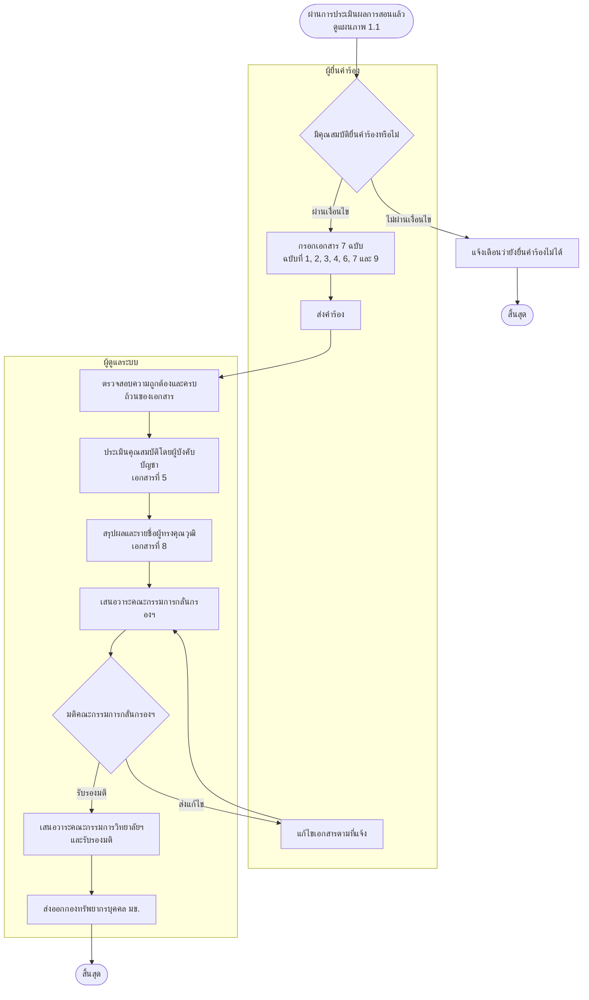

**งานที่ระบบทำอัตโนมัติเบื้องหลัง** (ไม่แสดงเป็นขั้นตอนในแผนภาพ)

- ตรวจสอบคุณสมบัติให้ตอนกดยื่นคำร้อง — ต้องไม่มีคำร้องค้างอยู่ และผลประเมินผลการสอนต้องยังไม่หมดอายุ
- เติมข้อมูลอัตโนมัติจากโปรไฟล์และเอกสารฉบับที่ 1 พร้อมบันทึกร่างอัตโนมัติ (Auto-Draft)
- สร้างไฟล์ DOCX เมื่อผู้ดูแลระบบบันทึกเอกสาร หรือเมื่อผู้ยื่นกดดาวน์โหลดครั้งแรก
- เลื่อนสถานะให้อัตโนมัติเมื่อบันทึกเอกสารที่ 5 และ 8
- ส่งอีเมลและการแจ้งเตือนในระบบทุกครั้งที่สถานะเปลี่ยน พร้อมบันทึก Admin Log

> รายละเอียดการทำงานภายในของระบบในแต่ละขั้นตอน ดูได้ที่หัวข้อ 2 System Sequence Diagram

**จุดตรวจสอบสำคัญของ Phase 2**

| # | จุดตรวจสอบ | เงื่อนไข | ผลเมื่อไม่ผ่าน |
|---|-----------|---------|---------------|
| 1 | สิทธิ์ยื่นคำร้อง | ต้องไม่มีคำร้องที่สถานะยังไม่ใช่ `SENT_TO_HR` | `?error=active_exists` |
| 2 | คุณสมบัติจาก Phase 1 | ต้องมี `AcademicRequest` สถานะ `COMPLETED` และเอกสารที่ 8 ยังไม่หมดอายุ | ไม่แสดงรายการให้เลือก |
| 3 | ความครบถ้วนก่อนส่ง | เอกสาร 1, 2, 3, 4, 6, 7, 9 ต้องมีระเบียนที่ `is_draft = false` | `?error=incomplete_docs` |
| 4 | สถานะแบบร่าง | ผู้ดูแลระบบแก้ไขเอกสาร/อัพเดทสถานะคำร้องที่เป็น `DRAFT` ไม่ได้ | `?error=status_update_failed` |
| 5 | ช่องข้อมูลเฉพาะเจ้าหน้าที่ | ผู้ยื่นบันทึกเอกสารที่ 7 แล้วช่องของเจ้าหน้าที่ต้องไม่ถูกเขียนทับ | ระบบคืนค่าเดิมให้อัตโนมัติ |

### 1.3 วงจรชีวิตของเอกสารรายฉบับ (Document Lifecycle)

ใช้ร่วมกันทั้งสองเฟส ต่างกันที่จังหวะสร้างไฟล์ DOCX — Phase 1 สร้างไฟล์ทันทีที่บันทึกสมบูรณ์ทุกฉบับ ส่วน Phase 2 สร้างทันทีเฉพาะเอกสารที่ผู้ดูแลระบบกรอก (ฉบับที่ 5 และ 8) เอกสารของผู้ยื่นจะสร้างเมื่อกดดาวน์โหลดครั้งแรก

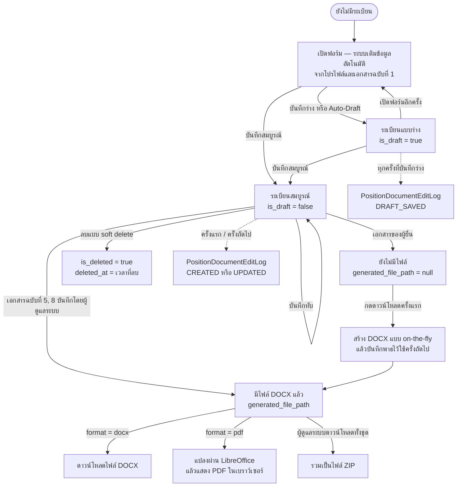

**หมายเหตุการเก็บข้อมูลเอกสาร**

- ข้อมูลที่กรอกถูกเก็บเป็น **JSON** ในคอลัมน์ `json_data` ไม่ใช่คอลัมน์แยกรายช่อง ทำให้เพิ่มหรือแก้ฟิลด์ในเทมเพลตได้โดยไม่ต้องแก้สคีมาฐานข้อมูล
- ระเบียนแบบร่างและระเบียนสมบูรณ์ของเอกสารประเภทเดียวกัน **อยู่แยกแถวกันได้** — เมื่อมีระเบียนสมบูรณ์อยู่แล้วและผู้ใช้กดบันทึกร่าง ระบบจะสร้างแถวร่างใหม่ ไม่เขียนทับฉบับสมบูรณ์
- การลบเป็น **soft delete** ทุกคิวรีจึงกรอง `is_deleted = false` เสมอ

---

## 2. System Sequence Diagram ที่สำคัญ

| รหัส | เหตุการณ์ | ผู้กระทำหลัก |
|------|----------|-------------|
| SSD-POS-01 | สร้างคำร้องตำแหน่ง (ตรวจสอบสิทธิ์) | ผู้ยื่นคำร้อง |
| SSD-POS-02 | กรอกและบันทึกเอกสาร | ผู้ยื่นคำร้อง |
| SSD-POS-03 | ส่งคำร้อง | ผู้ยื่นคำร้อง |
| SSD-POS-04 | กรอกเอกสารและเลื่อนสถานะอัตโนมัติ | ผู้ดูแลระบบ |
| SSD-POS-05 | อัพเดทสถานะคำร้อง | ผู้ดูแลระบบ |
| SSD-POS-06 | ดาวน์โหลดเอกสาร DOCX / PDF / ZIP | ผู้ยื่นคำร้อง, ผู้ดูแลระบบ |

### SSD-POS-01 — ผู้ยื่นสร้างคำร้องตำแหน่ง (ตรวจสอบสิทธิ์)

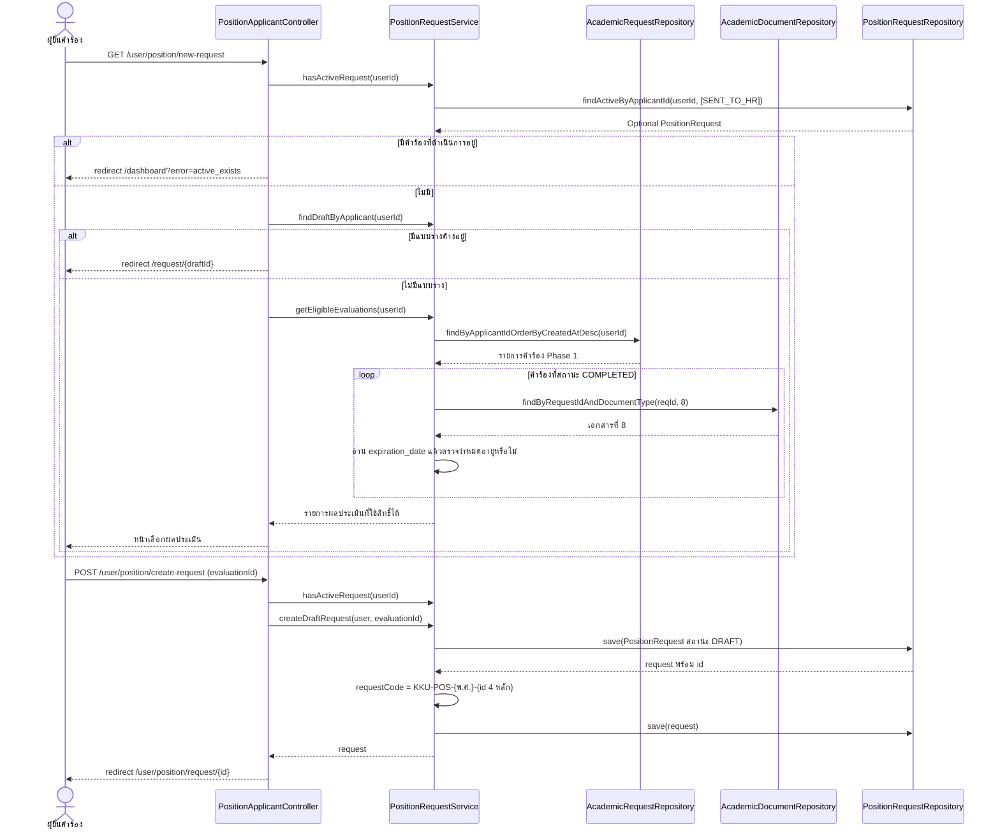

### SSD-POS-02 — ผู้ยื่นกรอกและบันทึกเอกสาร

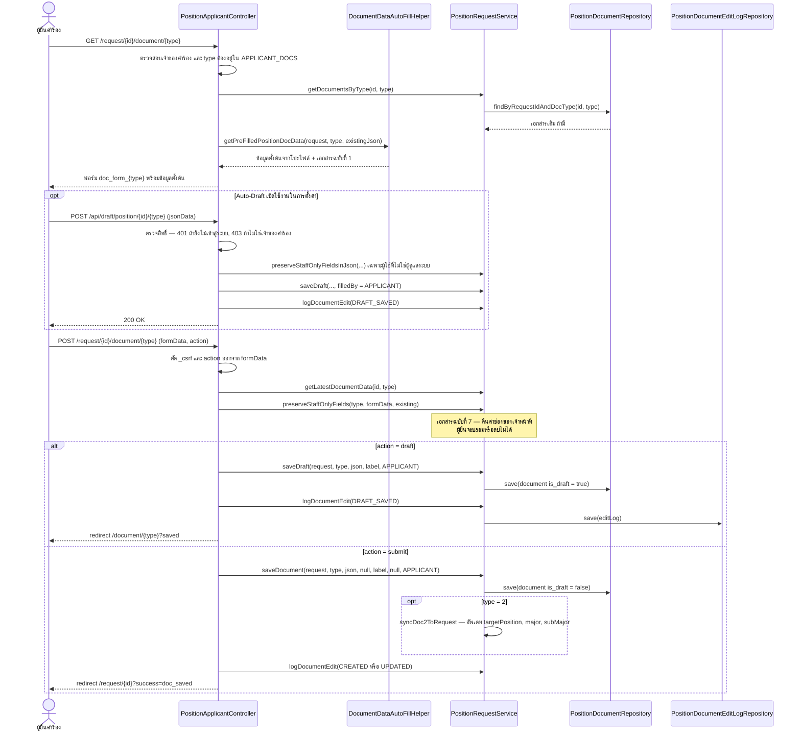

### SSD-POS-03 — ผู้ยื่นส่งคำร้อง

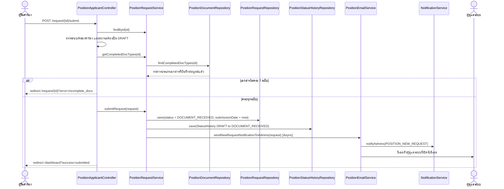

### SSD-POS-04 — ผู้ดูแลระบบกรอกเอกสารและระบบเลื่อนสถานะอัตโนมัติ

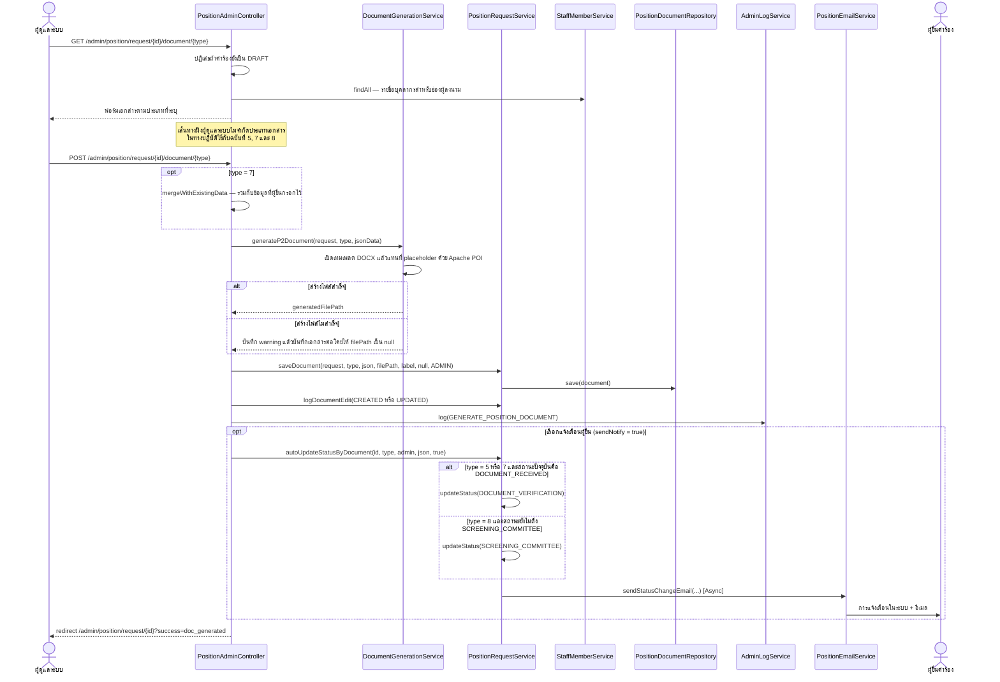

> **หมายเหตุ** — `autoUpdateStatusByDocument()` รับประเภทเอกสาร 5, 7 และ 0 เข้าเงื่อนไขเดียวกัน
> แต่ Phase 2 ไม่มีเอกสารประเภทที่ 0 กิ่งนั้นจึงไม่เคยทำงานจริง

### SSD-POS-05 — ผู้ดูแลระบบอัพเดทสถานะคำร้อง

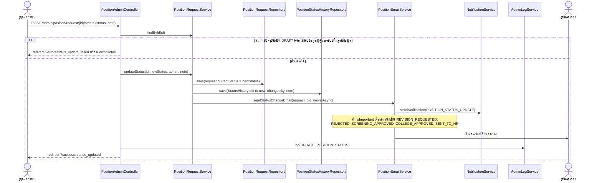

### SSD-POS-06 — ดาวน์โหลดเอกสาร (DOCX / PDF / ZIP)

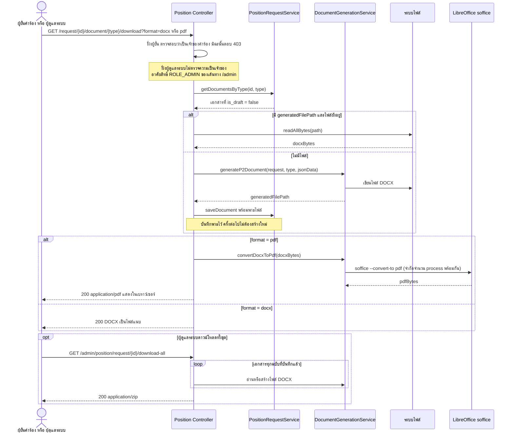

---

## 3. Domain Model

### 3.1 แผนภาพ Domain Model

แผนภาพนี้ถอดจากคลาส `@Entity` จริงในระบบ แสดงเฉพาะคลาสที่เป็นแกนของกระบวนการเอกสาร — คำร้องทั้งสองเฟส เอกสาร ประวัติสถานะ ทะเบียนบุคคลที่ถูกอ้างชื่อในเอกสาร และการเวียนลงนามอิเล็กทรอนิกส์

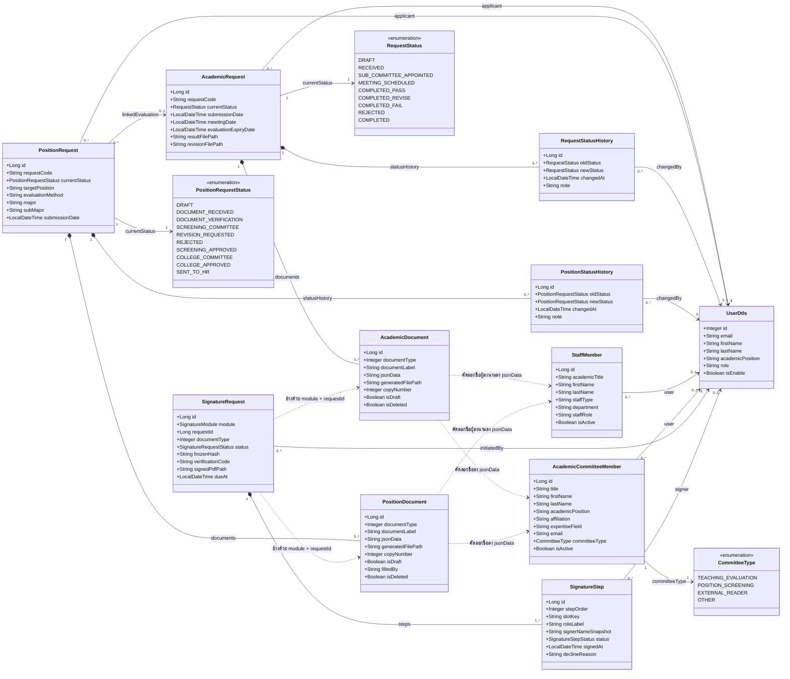

**วิธีอ่านเส้นแต่ละแบบ**

| เส้น | ความหมาย |
|------|---------|
| `*--` (composition) | ลูกอยู่ไม่ได้ถ้าไม่มีแม่ — FK เป็น `nullable = false` และตั้ง `CascadeType.ALL` ลบคำร้องแล้วเอกสารกับประวัติสถานะถูกลบตาม |
| `-->` (association) | มีคอลัมน์ FK ชี้ไปยังปลายทางจริง ป้ายบนเส้นคือชื่อฟิลด์ในโค้ด |
| `..>` (dependency) | **ไม่มี FK** — ผูกกันด้วยวิธีอื่น ดูคำอธิบายด้านล่าง |

**เส้นประ 6 เส้นคือจุดที่ต้องอธิบายเป็นพิเศษ**

- `SignatureRequest ..> เอกสาร` — คำขอลงนามไม่ได้ใช้ FK แต่เก็บ `module` (`ACADEMIC` หรือ `POSITION`) คู่กับ `requestId` และ `documentType` เป็นการอ้างแบบข้ามตารางด้วยตนเอง เพื่อให้ใช้กลไกลงนามชุดเดียวกันได้กับทั้งสองเฟส
- `เอกสาร ..> AcademicCommitteeMember` และ `..> StaffMember` — ชื่อกรรมการ ผู้ทรงคุณวุฒิ และผู้ลงนาม ถูก **คัดลอกเป็นข้อความลงใน `jsonData`** ตอนกรอกฟอร์ม ไม่ได้เก็บเป็น FK เอกสารที่ออกไปแล้วจึงไม่เปลี่ยนตามเมื่อมีการแก้ไขทะเบียนภายหลัง ซึ่งเป็นพฤติกรรมที่ถูกต้องสำหรับเอกสารราชการ แต่แลกมาด้วยการที่ระบบสืบค้นย้อนกลับไม่ได้ว่ากรรมการท่านหนึ่งเคยพิจารณาคำร้องใดบ้าง

### 3.2 คำอธิบายคลาส

| คลาส | ตาราง | ความหมายในโดเมน |
|------|-------|-----------------|
| `UserDtls` | `user_dtls` | **ผู้ใช้ระบบ** — ทั้งผู้ยื่นคำร้องและเจ้าหน้าที่ แยกบทบาทด้วยคอลัมน์ `role` |
| `AcademicRequest` | `academic_request` | **ใบคำร้องขอรับการประเมินผลการสอน** — Aggregate Root ของ Phase 1 |
| `AcademicDocument` | `academic_document` | แบบฟอร์มหนึ่งฉบับใน 9 ฉบับของ Phase 1 เก็บคำตอบเป็น JSON |
| `RequestStatusHistory` | `request_status_history` | ประวัติการเปลี่ยนสถานะของคำร้อง Phase 1 |
| `PositionRequest` | `position_request` | **ใบคำร้องขอกำหนดตำแหน่งทางวิชาการ** — Aggregate Root ของ Phase 2 |
| `PositionDocument` | `position_document` | แบบฟอร์มหนึ่งฉบับใน 9 ฉบับของ Phase 2 |
| `PositionStatusHistory` | `position_status_history` | ประวัติการเปลี่ยนสถานะของคำร้อง Phase 2 |
| `StaffMember` | `staff_member` | **ทะเบียนบุคลากรภายใน** — คณบดี หัวหน้าสาขา เจ้าหน้าที่ ที่ถูกอ้างชื่อเป็นผู้ลงนามในเอกสาร ผูกบัญชีผู้ใช้ได้เพื่อลงนามอิเล็กทรอนิกส์ |
| `AcademicCommitteeMember` | `academic_committee_member` | **ทะเบียนกรรมการและผู้ทรงคุณวุฒิ** — เก็บสังกัดและสาขาความเชี่ยวชาญ รองรับทั้งกรรมการภายในและผู้ทรงคุณวุฒิภายนอก |
| `SignatureRequest` | `signature_request` | **คำขอเวียนลงนาม** ของเอกสารหนึ่งฉบับ ตรึงเนื้อหาด้วย `frozenHash` และออกรหัสตรวจสอบเอกสาร |
| `SignatureStep` | `signature_step` | **ขั้นการลงนามหนึ่งคิว** ระบุลำดับ ตำแหน่งช่องลงนามในเทมเพลต และผู้ลงนามที่รับผิดชอบ |
| `RequestStatus` / `PositionRequestStatus` | (enum) | ชุดสถานะของแต่ละเฟส เป็นตัวกำหนดเส้นทางเดินของคำร้อง |
| `CommitteeType` | (enum) | ประเภทกรรมการ — ประเมินผลการสอน, กลั่นกรองผลงานทางวิชาการ, **ผู้ทรงคุณวุฒิประเมินผลงาน (Reader)** และอื่น ๆ |

### 3.3 คลาสที่ไม่ได้แสดงในแผนภาพ

ระบบมี `@Entity` ทั้งหมด 27 คลาส แผนภาพข้างต้นแสดง 11 คลาสที่เป็นแกนของกระบวนการเอกสาร ส่วนที่เหลือแยกตามหน้าที่ดังนี้

| กลุ่ม | คลาส | เหตุผลที่ไม่แสดง |
|-------|------|-----------------|
| ไฟล์แนบ | `AcademicAttachment`, `PositionAttachment` | ไฟล์ที่เจ้าหน้าที่อัปโหลดแนบเพิ่ม ไม่ใช่แบบฟอร์มในกระบวนการ |
| ร่องรอยการแก้ไข | `AcademicDocumentEditLog`, `PositionDocumentEditLog`, `AdminLog` | ข้อมูลตรวจสอบย้อนหลัง ไม่ได้ขับเคลื่อนกระบวนการ |
| ลายเซ็นและผังลงนาม | `UserSignature`, `DocumentWorkflowConfig`, `SignatureAuditEvent` | ไม่แสดงในแผนภาพหลักเพื่อไม่ให้แน่นเกินไป — **แสดงแยกในหัวข้อ 3.6** |
| จัดการไฟล์ | `UserFile`, `UserFolder`, `AdminFile`, `AdminFolder` | ระบบจัดเก็บไฟล์ส่วนตัว อยู่คนละ subsystem |
| ซิงค์ข้อมูลภายนอก | `FsFaculty`, `FsFacultyChange`, `FsSyncState`, `ScopusPublication` | ข้อมูลที่ซิงค์มาจาก fs.computing อยู่คนละ subsystem |
| การแจ้งเตือน | `Notification` | โครงสร้างพื้นฐานที่ใช้ร่วมกันทุก subsystem |

### 3.4 ความสัมพันธ์และภาวะคงสภาพ (Invariants)

| # | กฎ | บังคับใช้ที่ |
|---|-----|-------------|
| 1 | ผู้ยื่น 1 คนมีคำร้องที่ยังไม่ถึงสถานะ `SENT_TO_HR` ได้ไม่เกิน 1 คำร้อง | `PositionRequestService.hasActiveRequest()` |
| 2 | `requestCode` ไม่ซ้ำ รูปแบบ `KKU-POS-{พ.ศ.}-{ลำดับ 4 หลัก}` | `unique = true` + `createDraftRequest()` |
| 3 | คำร้องใหม่เริ่มที่สถานะ `DRAFT` เสมอ | ค่าเริ่มต้นของฟิลด์ `currentStatus` |
| 4 | คำร้องสถานะ `DRAFT` แก้ไขได้เฉพาะโดยเจ้าของ และผู้ดูแลระบบยังเข้าถึงไม่ได้ | `PositionRequestStatus.isEditable()` + การตรวจใน controller ทั้งสองฝั่ง |
| 5 | ส่งคำร้องได้เมื่อเอกสาร `APPLICANT_DOCS` ครบทุกฉบับที่ `is_draft = false` | `submitRequest()` ใน controller |
| 6 | ทุกการเปลี่ยนสถานะต้องบันทึก `PositionStatusHistory` หนึ่งแถวเสมอ | `PositionRequestService.addStatusHistory()` |
| 7 | เอกสารประเภทเดียวกันมีระเบียนสมบูรณ์ได้เพียงฉบับเดียว (ยกเว้นเอกสารที่มี `copyNumber`) | `saveDocument()` เลือกอัพเดทระเบียนเดิม |
| 8 | ช่องเฉพาะเจ้าหน้าที่ในเอกสารที่ 7 ผู้ยื่นเขียนไม่ได้ | `preserveStaffOnlyFields()` |
| 9 | การลบเอกสารและไฟล์แนบเป็น soft delete | `isDeleted` + คิวรีที่กรอง `is_deleted = false` |
| 10 | สถานะ `SENT_TO_HR` และ `REJECTED` เป็นสถานะปลายทาง | `PositionRequestStatus.isTerminal()` |

> **ข้อสังเกต** — `isTerminal()` นับ `REJECTED` เป็นสถานะปลายทาง แต่ `hasActiveRequest()` ตรวจเฉพาะ `SENT_TO_HR`
> ดังนั้นคำร้องที่ถูกปฏิเสธจะยังนับเป็นคำร้องที่ดำเนินการอยู่ และผู้ยื่นจะสร้างคำร้องใหม่ไม่ได้จนกว่าคำร้องเดิมจะถูกจัดการ

ภาวะคงสภาพข้อที่ 11 ถึง 17 เป็นกฎเฉพาะของการเวียนลงนาม อยู่ในหัวข้อ 3.6

### 3.5 คำศัพท์เฉพาะโดเมน (Ubiquitous Language)

| คำศัพท์ | ความหมายในระบบ |
|---------|----------------|
| **คำร้อง (Request)** | ชุดเอกสารและสถานะทั้งหมดของการขอกำหนดตำแหน่งหนึ่งครั้ง |
| **เอกสาร (Document)** | แบบฟอร์มตามระเบียบหนึ่งฉบับ ระบุด้วย `documentType` 1–9 |
| **ไฟล์แนบ (Attachment)** | ไฟล์อิสระที่ผู้ดูแลระบบอัปโหลดเพิ่ม ไม่ผูกกับแบบฟอร์มใด |
| **แบบร่าง (Draft)** | ระเบียนเอกสารที่ `is_draft = true` ยังไม่นับเป็นเอกสารที่กรอกเสร็จ |
| **ผลประเมินที่ผูกไว้ (Linked Evaluation)** | `AcademicRequest` จาก Phase 1 ที่ใช้เป็นคุณสมบัติในการยื่น Phase 2 |
| **Auto-Draft** | การบันทึกร่างอัตโนมัติระหว่างกรอกฟอร์ม เปิด/ปิดได้ที่การตั้งค่าผู้ใช้ |
| **การเลื่อนสถานะอัตโนมัติ** | ระบบเปลี่ยนสถานะให้เองเมื่อผู้ดูแลระบบบันทึกเอกสารที่ 5, 7 หรือ 8 |
| **บุคลากร (Staff Member)** | ทะเบียนบุคลากรภายในวิทยาลัยที่ถูกอ้างชื่อเป็นผู้ลงนามในเอกสาร |
| **กรรมการ / ผู้ทรงคุณวุฒิ (Committee Member)** | ทะเบียนผู้ประเมิน แยกประเภทด้วย `CommitteeType` ครอบคลุมทั้งกรรมการประเมินผลการสอน กรรมการกลั่นกรอง และผู้ทรงคุณวุฒิภายนอก (Reader) |
| **การเวียนลงนาม (Signature Request)** | กระบวนการส่งเอกสารให้ผู้มีอำนาจลงนามตามลำดับขั้น โดยตรึงเนื้อหาเอกสารไว้ด้วยค่าแฮช |
| **ขั้นการลงนาม (Signature Step)** | คิวลงนามหนึ่งคิวในการเวียน ระบุลำดับ ช่องลงนามในเทมเพลต และผู้รับผิดชอบ |
| **การตรึงเนื้อหา (Freezing)** | การบันทึกสำเนาข้อมูลเอกสาร (`frozenJson`) พร้อมค่าแฮช (`frozenHash`) ณ วินาทีที่เปิดการเวียนลงนาม ใช้เป็นหลักฐานว่าผู้ลงนามเห็นเนื้อหาใดตอนลงนาม |
| **ช่องลงนาม (Slot)** | ตำแหน่งลงนามหนึ่งตำแหน่งในแม่แบบเอกสาร ระบุด้วย `slotKey` และผูกกับ `anchorPlaceholder` ที่ใช้หาจุดวางภาพลายเซ็นในไฟล์ DOCX |
| **สแนปช็อตผู้ลงนาม (Signer Snapshot)** | สำเนาชื่อ ตำแหน่ง และภาพลายเซ็นที่คัดลอกเก็บไว้ในขั้นการลงนาม เพื่อให้เอกสารที่ลงนามแล้วไม่เปลี่ยนตามข้อมูลปัจจุบันของผู้ใช้ |
| **โมฆะ (Voided)** | สถานะที่การเวียนลงนามถูกยกเลิกโดยอัตโนมัติ เมื่อพบว่าเนื้อหาเอกสารไม่ตรงกับค่าแฮชที่ตรึงไว้ |

### 3.6 แบบจำลองส่วนการลงนามอิเล็กทรอนิกส์

แผนภาพในหัวข้อ 3.1 แสดง `SignatureRequest` และ `SignatureStep` ในฐานะส่วนหนึ่งของการเดินทางของเอกสาร หัวข้อนี้ขยายเฉพาะกลไกการลงนาม พร้อมคลาสตั้งค่าและร่องรอยตรวจสอบที่ไม่ได้แสดงในแผนภาพหลัก

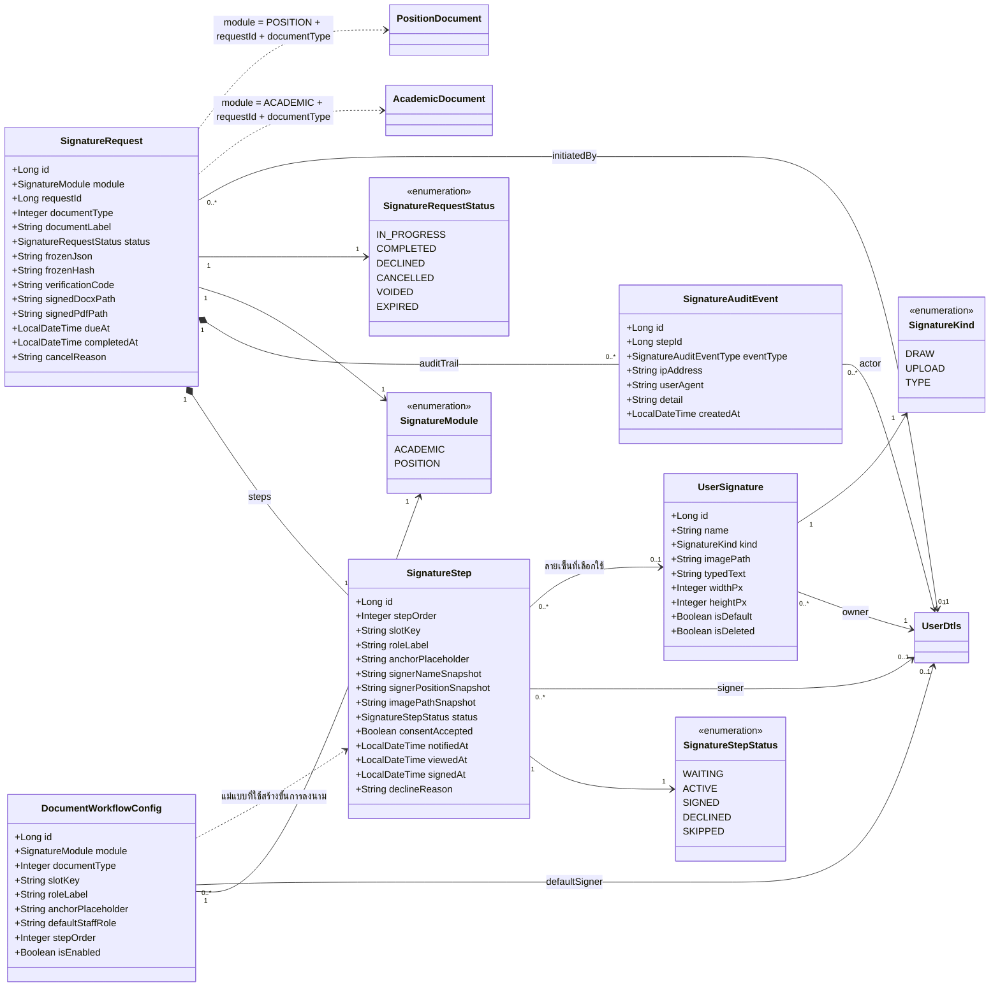

#### คำอธิบายคลาสเพิ่มเติม

| คลาส | ตาราง | ความหมายในโดเมน |
|------|-------|-----------------|
| `UserSignature` | `user_signature` | **ลายเซ็นที่ผู้ใช้เก็บไว้ในบัญชีตนเอง** สร้างได้ 3 วิธีตาม `SignatureKind` — วาด อัปโหลดภาพ หรือพิมพ์ข้อความ ตั้งเป็นค่าเริ่มต้นได้หนึ่งรายการ และลบแบบ soft delete |
| `DocumentWorkflowConfig` | `document_workflow_config` | **ผังผู้ลงนามของเอกสารหนึ่งประเภท** ระบุว่าเอกสารนี้มีช่องลงนามใดบ้าง เรียงลำดับอย่างไร และผู้ลงนามเริ่มต้นคือใคร เป็นตัวที่ทำให้เปลี่ยนผู้ลงนามได้จากหน้าจอโดยไม่ต้องแก้โปรแกรม |
| `SignatureAuditEvent` | `signature_audit_event` | **ร่องรอยการกระทำ** ทุกเหตุการณ์ในการเวียนลงนาม บันทึกผู้กระทำ หมายเลขไอพี และเบราว์เซอร์ |
| `SignatureModule` | (enum) | กระบวนการต้นทางของเอกสาร ใช้คู่กับ `requestId` แทนคีย์นอก |
| `SignatureRequestStatus` | (enum) | สถานะของการเวียนลงนามทั้งซอง |
| `SignatureStepStatus` | (enum) | สถานะของขั้นการลงนามรายคน |
| `SignatureKind` | (enum) | วิธีสร้างลายเซ็น |

#### ภาวะคงสภาพเฉพาะการลงนาม

| # | กฎ | บังคับใช้ที่ |
|---|-----|-------------|
| 11 | ในหนึ่งซองมีขั้นการลงนามสถานะ `ACTIVE` ได้ครั้งละหนึ่งขั้นเท่านั้น ขั้นถัดไปจะเปลี่ยนจาก `WAITING` เป็น `ACTIVE` ก็ต่อเมื่อขั้นก่อนหน้าลงนามเสร็จ | `SignatureWorkflowService` |
| 12 | รับลายเซ็นได้เฉพาะเมื่อซองอยู่ในสถานะ `IN_PROGRESS` และขั้นนั้นเป็น `ACTIVE` | `SignatureRequestStatus.isOpen()` + การตรวจสถานะขั้นก่อนบันทึก |
| 13 | เอกสารถูกล็อกไม่ให้แก้ไขขณะซองอยู่ในสถานะ `IN_PROGRESS` หรือ `COMPLETED` | `SignatureRequestStatus.locksDocument()` |
| 14 | หากเนื้อหาเอกสารไม่ตรงกับ `frozenHash` ที่ตรึงไว้ ซองจะเปลี่ยนเป็น `VOIDED` ทันทีและกู้คืนไม่ได้ | `SignatureWorkflowService` ตรวจก่อนบันทึกลายเซ็นทุกครั้ง |
| 15 | `verificationCode` ไม่ซ้ำทั้งระบบ ใช้เป็นคีย์ของหน้าตรวจสอบเอกสาร | `unique = true` |
| 16 | ช่องลงนามหนึ่งช่องมีการตั้งค่าได้ชุดเดียว — ไม่ซ้ำในคู่ (`module`, `documentType`, `slotKey`) | `@UniqueConstraint` ชื่อ `uq_doc_workflow_slot` |
| 17 | ขั้นการลงนามที่ลงนามแล้วต้องมี `consentAccepted = true` เสมอ — ระบบบันทึกทั้งเวลาที่เปิดดู (`viewedAt`) และเวลาที่ลงนาม (`signedAt`) แยกกัน เพื่อยืนยันว่าผู้ลงนามได้เห็นเอกสารก่อนให้ความยินยอม | หน้าจอลงนามและ `SigningController` |

#### เหตุผลของการออกแบบสองข้อที่ควรอธิบายเพิ่ม

- **`SignatureRequest` ไม่มีคีย์นอกชี้ไปยังเอกสาร** — ระบบเก็บเอกสารแยกเป็นสองตารางตามกระบวนการ (`academic_document` และ `position_document`) แต่กลไกการลงนามใช้ร่วมกันทั้งสอง หากใช้คีย์นอกจะต้องมีสองคอลัมน์ที่ว่างสลับกันตลอดเวลา จึงเลือกอ้างด้วยชุดค่า `module` + `requestId` + `documentType` แทน และแสดงเป็นความสัมพันธ์แบบพึ่งพา (เส้นประ) ในแผนภาพ

- **`SignatureStep` เก็บสแนปช็อตแทนการอ้างอิงข้อมูลปัจจุบัน** — ชื่อ ตำแหน่งทางวิชาการ และเส้นทางไฟล์ภาพลายเซ็น ถูกคัดลอกเก็บไว้ ณ เวลาที่ลงนาม เอกสารที่ลงนามไปแล้วจึงไม่เปลี่ยนตาม แม้ผู้ลงนามจะได้รับตำแหน่งใหม่หรือลบลายเซ็นเดิมทิ้งในภายหลัง เป็นหลักการเดียวกับที่ใช้กับชื่อกรรมการใน `jsonData` ของเอกสาร

---

## เอกสารที่เกี่ยวข้อง

- [ภาพรวมระบบ](01-system-overview.md)
- [คำร้องขอกำหนดตำแหน่ง — Use Case และ UI](04-position-request.md)
- [คำร้องประเมินผลการสอน Phase 1](03-academic-request.md)
- [ภาคผนวก — แผนภาพสถานะ](appendix-status-flows.md)
