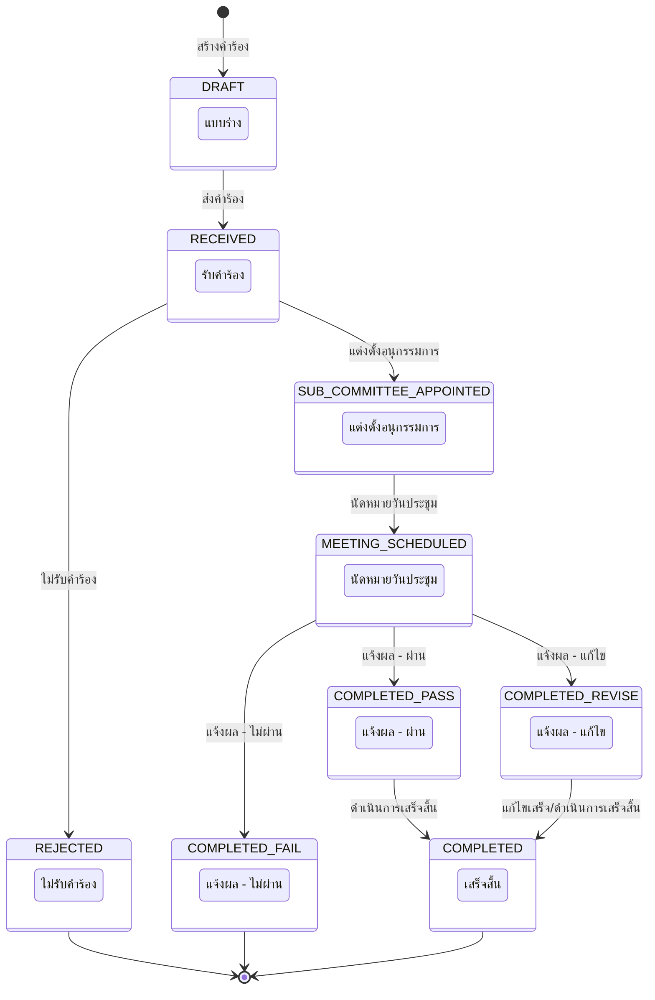
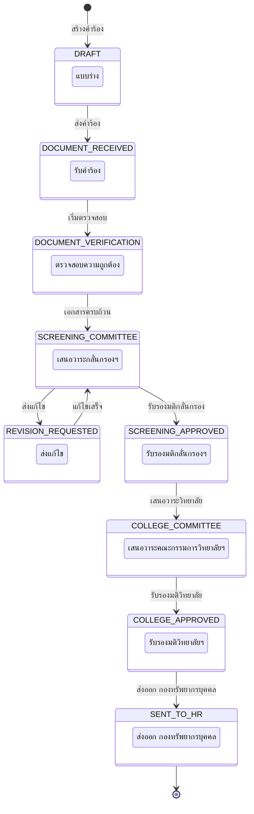
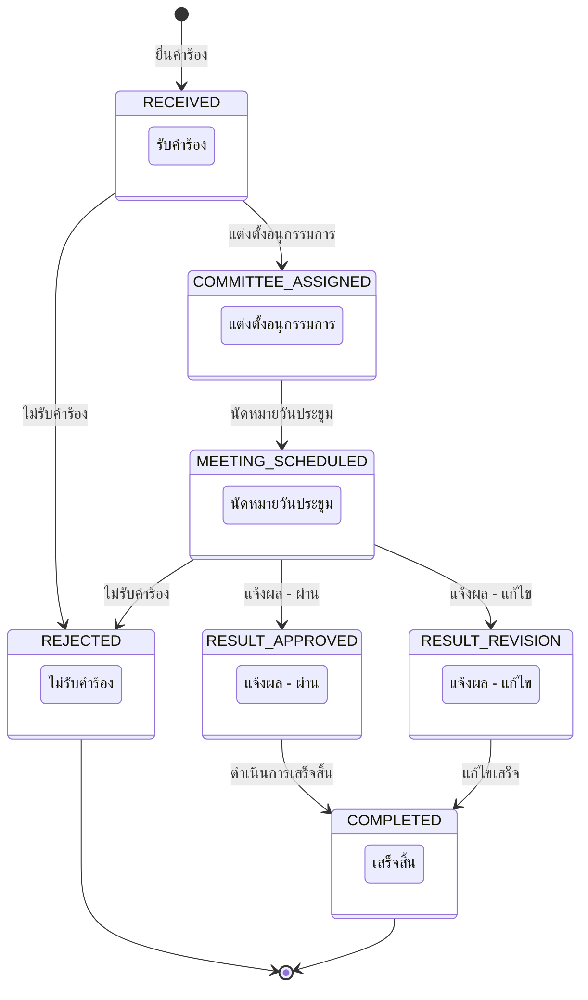

# ภาคผนวก — แผนภาพสถานะ (State Diagrams)

---

## 1. สถานะคำร้องประเมินผลการสอน (Academic Request — Phase 1)

| สถานะ | ชื่อภาษาไทย | คำอธิบาย |
|-------|-------------|---------|
| DRAFT | แบบร่าง | คำร้องถูกสร้างแล้วแต่ยังไม่ส่ง |
| RECEIVED | รับคำร้อง | ผู้ดูแลระบบรับคำร้องเข้าสู่กระบวนการ |
| SUB_COMMITTEE_APPOINTED | แต่งตั้งอนุกรรมการ | แต่งตั้งคณะอนุกรรมการประเมิน |
| MEETING_SCHEDULED | นัดหมายวันประชุม | กำหนดวันประชุมพิจารณา |
| COMPLETED_PASS | แจ้งผล - ผ่าน | ผลการประเมินผ่าน |
| COMPLETED_REVISE | แจ้งผล - แก้ไข | ต้องแก้ไขเอกสารเพิ่มเติม |
| COMPLETED_FAIL | แจ้งผล - ไม่ผ่าน | ผลการประเมินไม่ผ่าน (สิ้นสุดกระบวนการ) |
| REJECTED | ไม่รับคำร้อง | คำร้องถูกปฏิเสธ (สิ้นสุดกระบวนการ) |
| COMPLETED | เสร็จสิ้น | กระบวนการเสร็จสมบูรณ์ |

---

## 2. สถานะคำร้องขอกำหนดตำแหน่ง (Position Request — Phase 2)

| สถานะ | ชื่อภาษาไทย | คำอธิบาย |
|-------|-------------|---------|
| DRAFT | แบบร่าง | คำร้องถูกสร้างแล้วแต่ยังไม่ส่ง |
| DOCUMENT_RECEIVED | รับคำร้อง | รับเอกสารเข้าสู่กระบวนการ |
| DOCUMENT_VERIFICATION | ตรวจสอบความถูกต้อง/ครบถ้วน | ตรวจสอบเอกสารทั้งหมด |
| SCREENING_COMMITTEE | เสนอวาระกลั่นกรองฯ | เสนอต่อคณะกรรมการกลั่นกรอง |
| REVISION_REQUESTED | ส่งแก้ไข | ส่งกลับให้แก้ไขเอกสาร |
| SCREENING_APPROVED | รับรองมติกลั่นกรองฯ | คณะกรรมการกลั่นกรองรับรอง |
| COLLEGE_COMMITTEE | เสนอวาระคณะกรรมการวิทยาลัยฯ | เสนอต่อคณะกรรมการวิทยาลัย |
| COLLEGE_APPROVED | รับรองมติคณะกรรมการวิทยาลัยฯ | คณะกรรมการวิทยาลัยรับรอง |
| SENT_TO_HR | ส่งออกกองทรัพยากรบุคคล มข. | ส่งเรื่องไปยังกองทรัพยากรบุคคล (สิ้นสุด) |

---

## 3. สถานะคำร้องทั่วไป (Petition)

| สถานะ | ชื่อภาษาไทย | คำอธิบาย |
|-------|-------------|---------|
| RECEIVED | รับคำร้อง | รับคำร้องเข้าสู่ระบบ |
| COMMITTEE_ASSIGNED | แต่งตั้งอนุกรรมการ | แต่งตั้งคณะกรรมการพิจารณา |
| MEETING_SCHEDULED | นัดหมายวันประชุม | กำหนดวันประชุมพิจารณา |
| RESULT_APPROVED | แจ้งผล - ผ่าน | คำร้องได้รับการอนุมัติ |
| RESULT_REVISION | แจ้งผล - แก้ไข | ต้องแก้ไขเพิ่มเติม |
| REJECTED | ไม่รับคำร้อง | คำร้องถูกปฏิเสธ |
| COMPLETED | เสร็จสิ้น | กระบวนการเสร็จสมบูรณ์ |

