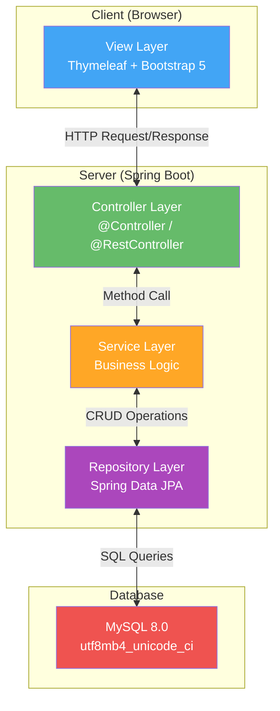

# บทที่ 3 วิธีการดำเนินงาน

การพัฒนาระบบจัดการคำร้องบุคลากรทางวิชาการ (HRCP-KKU-Academic) ของวิทยาลัยการคอมพิวเตอร์ มหาวิทยาลัยขอนแก่น ใช้แนวคิดการพัฒนาแบบ Agile/Iterative ซึ่งเป็นวิธีการพัฒนาซอฟต์แวร์ที่เน้นการทำงานเป็นรอบ (Iteration) โดยแต่ละรอบจะมีการวิเคราะห์ ออกแบบ พัฒนา และทดสอบ แล้วนำผลลัพธ์ที่ได้ไปปรับปรุงในรอบถัดไป จนได้ระบบที่สมบูรณ์ตรงตามความต้องการของผู้ใช้งาน

---

## 3.1 ขั้นตอนและวิธีการดำเนินงาน

### 3.1.1 แนวคิดการพัฒนาแบบ Agile/Iterative

การพัฒนาระบบนี้ใช้วิธีการพัฒนาแบบ Agile/Iterative (การพัฒนาแบบวนรอบ) ซึ่งมีหลักการสำคัญดังนี้:

1. **การพัฒนาเป็นรอบ (Iteration)** — แบ่งการพัฒนาออกเป็นรอบย่อย (Sprint) แต่ละรอบใช้เวลาประมาณ 2-4 สัปดาห์ โดยในแต่ละรอบจะดำเนินการครบทุกขั้นตอนตั้งแต่วิเคราะห์ ออกแบบ พัฒนา จนถึงทดสอบ
2. **การตอบสนองต่อการเปลี่ยนแปลง** — สามารถปรับเปลี่ยนความต้องการได้ในทุกรอบของการพัฒนา จากการรับ Feedback ของผู้ใช้งาน
3. **การส่งมอบงานที่ใช้ได้จริง** — ในแต่ละรอบจะส่งมอบ Working Software ที่สามารถทดสอบและใช้งานได้จริง
4. **การสื่อสารอย่างต่อเนื่อง** — มีการสื่อสารกับผู้ใช้งานและผู้มีส่วนได้ส่วนเสียอย่างสม่ำเสมอ เพื่อให้ระบบตรงตามความต้องการ

---

### 3.1.2 ขั้นตอนการพัฒนาระบบ

การพัฒนาระบบแบ่งออกเป็น 5 ขั้นตอนหลัก โดยในแต่ละรอบการพัฒนา (Iteration) จะดำเนินการครบทุกขั้นตอน ดังนี้:

#### ขั้นตอนที่ 1: ศึกษาและวิเคราะห์ความต้องการ (Requirements Analysis)

เป็นขั้นตอนการรวบรวมและวิเคราะห์ความต้องการของระบบ มีรายละเอียดดังนี้:

| กิจกรรม | รายละเอียด |
|---------|-----------|
| ศึกษาระบบงานเดิม | ศึกษากระบวนการยื่นคำร้องประเมินผลการสอนและขอกำหนดตำแหน่งทางวิชาการแบบเดิม (กระดาษ/ด้วยตนเอง) ของวิทยาลัยการคอมพิวเตอร์ มหาวิทยาลัยขอนแก่น |
| รวบรวมความต้องการ | สัมภาษณ์ผู้ใช้งาน (บุคลากรทางวิชาการ, เจ้าหน้าที่ฝ่ายบริหาร) เพื่อรวบรวมความต้องการของระบบ |
| วิเคราะห์ความต้องการ | จำแนกความต้องการออกเป็น Functional Requirements และ Non-Functional Requirements |
| กำหนดขอบเขตระบบ | กำหนดขอบเขตการทำงานของระบบ โดยแบ่งเป็น 8 ระบบย่อย (Subsystem) |
| จัดทำ Use Case | สร้าง Use Case Diagram และ Use Case Description สำหรับแต่ละ Subsystem |

**ผลลัพธ์ที่ได้:**
- เอกสารข้อกำหนดความต้องการ (Requirements Specification)
- Use Case Diagram ระดับระบบและระดับ Subsystem
- Use Case Description ของทุก Use Case
- รายการ Functional Requirements และ Non-Functional Requirements

#### ขั้นตอนที่ 2: ออกแบบระบบ (System Design)

เป็นขั้นตอนการออกแบบสถาปัตยกรรมระบบและส่วนประกอบต่าง ๆ มีรายละเอียดดังนี้:

| กิจกรรม | รายละเอียด |
|---------|-----------|
| ออกแบบสถาปัตยกรรมระบบ | ออกแบบระบบตามสถาปัตยกรรม MVC (Model-View-Controller) โดยแบ่งเป็น 4 ชั้น ได้แก่ Controller Layer, Service Layer, Repository Layer และ Model Layer |
| ออกแบบฐานข้อมูล | ออกแบบ Entity-Relationship Diagram (ER Diagram) และ Database Schema สำหรับเก็บข้อมูลผู้ใช้ คำร้อง เอกสาร บุคลากร และประวัติสถานะ |
| ออกแบบ System Sequence Diagram | สร้างแผนภาพลำดับ (Sequence Diagram) แสดง Flow การทำงานของระบบในแต่ละ Use Case |
| ออกแบบหน้าจอผู้ใช้งาน | ออกแบบ User Interface (UI) สำหรับทุกหน้าจอ ครอบคลุมทั้ง 3 บทบาท (Guest, Applicant, Admin) |
| ออกแบบ Status Flow | ออกแบบ State Diagram สำหรับสถานะคำร้องแต่ละประเภท (Academic Request, Position Request, Petition) |

**สถาปัตยกรรมระบบ MVC (Model-View-Controller):**

**ผลลัพธ์ที่ได้:**
- แผนภาพสถาปัตยกรรมระบบ (System Architecture Diagram)
- ER Diagram และ Database Schema
- System Sequence Diagram ของทุก Use Case
- Wireframe/Mockup หน้าจอผู้ใช้งาน
- State Diagram ของสถานะคำร้อง

#### ขั้นตอนที่ 3: พัฒนาระบบ (Implementation)

เป็นขั้นตอนการเขียนโปรแกรมตามที่ออกแบบไว้ โดยแบ่งการพัฒนาออกเป็นรอบ (Iteration) ตามลำดับความสำคัญของ Subsystem ดังนี้:

| Iteration | Subsystem ที่พัฒนา | รายละเอียด |
|-----------|-------------------|-----------|
| **Iteration 1** | ระบบยืนยันตัวตน (Authentication) | เข้าสู่ระบบ, OTP ครั้งแรก, ลืม/รีเซ็ตรหัสผ่าน, จัดการ Session, Brute Force Protection |
| **Iteration 2** | จัดการผู้ใช้งาน (User Management) | CRUD ผู้ใช้/แอดมิน, เปิด/ปิดบัญชี, ดูประวัติ Activity Log |
| **Iteration 3** | จัดการบุคลากร (Staff Management) | CRUD บุคลากร/กรรมการ (คณบดี, หัวหน้าสาขา, กรรมการ, HR) |
| **Iteration 4** | คำร้องประเมินผลการสอน (Phase 1) | สร้าง/กรอก/ส่งคำร้อง, เอกสาร 9 ประเภท (Type 0-8), อัพเดทสถานะ, กำหนดกรรมการ, นัดประชุม |
| **Iteration 5** | คำร้องขอกำหนดตำแหน่ง (Phase 2) | สร้าง/กรอก/ส่งคำร้อง, เอกสาร 9 ประเภท, ขั้นตอนอนุมัติหลายระดับ |
| **Iteration 6** | คำร้องทั่วไป (Petition) | ยื่นคำร้อง/อุทธรณ์, ติดตามสถานะ, ประวัติสถานะ |
| **Iteration 7** | จัดการไฟล์ (File Management) | จัดการไฟล์เอกสาร, ถังขยะ, กู้คืน, ลบถาวร |
| **Iteration 8** | การตั้งค่าและแจ้งเตือน | Auto-Draft Engine, แจ้งเตือนอีเมล, แจ้งเตือนหมดอายุ, ตั้งค่าโปรไฟล์ |
| **Iteration 9** | การสร้างเอกสาร (Document Generation) | สร้าง DOCX จากแม่แบบ, แปลง DOCX เป็น PDF, ดูตัวอย่างเอกสารแบบ Real-time, ส่งออก ZIP เข้ารหัส |
| **Iteration 10** | ปรับปรุงและเพิ่มประสิทธิภาพ | ปรับปรุง UI/UX, เพิ่ม Security Headers, Rate Limiting, CSP, Google Translate |

**แนวทางการเขียนโปรแกรม:**

- **Backend** — ใช้ภาษา Java 21 ร่วมกับ Spring Boot Framework เขียนโค้ดตามหลัก Layered Architecture โดยแยกเป็น Controller, Service, Repository และ Model
- **Frontend** — ใช้ Thymeleaf Template Engine ร่วมกับ Bootstrap 5 และ JavaScript ES6 สำหรับหน้าจอผู้ใช้งาน
- **Database** — ใช้ Spring Data JPA ทำ Object-Relational Mapping (ORM) กับฐานข้อมูล MySQL โดยใช้ Entity Class แทนตารางในฐานข้อมูล
- **Version Control** — ใช้ Git สำหรับควบคุมเวอร์ชันของซอร์สโค้ด

#### ขั้นตอนที่ 4: ทดสอบระบบ (Testing)

เป็นขั้นตอนการทดสอบระบบเพื่อให้มั่นใจว่าระบบทำงานได้ถูกต้องตามที่ออกแบบไว้ โดยดำเนินการทดสอบ 3 ระดับ:

| ระดับการทดสอบ | วิธีการ | เครื่องมือ | รายละเอียด |
|--------------|---------|-----------|-----------|
| **Unit Testing** | ทดสอบแต่ละ Method/Function แยกส่วน | JUnit 5, jqwik 1.8.2, H2 Database | ทดสอบ Service Layer และ Business Logic โดยใช้ H2 In-Memory Database แทน MySQL จริง เพื่อความรวดเร็ว |
| **Integration Testing** | ทดสอบการทำงานร่วมกันของหลายส่วน | Spring Boot Test, MockMvc | ทดสอบ Controller + Service + Repository ทำงานร่วมกันได้ถูกต้อง ทดสอบ API Endpoint ด้วย MockMvc |
| **User Acceptance Testing (UAT)** | ทดสอบโดยผู้ใช้งานจริง | Manual Testing | ให้บุคลากรทางวิชาการและเจ้าหน้าที่ฝ่ายบริหาร ทดสอบระบบตาม Use Case ที่กำหนด พร้อมรวบรวม Feedback |

**สิ่งที่ทดสอบ:**
- ความถูกต้องของ Business Logic (การเปลี่ยนสถานะคำร้อง, การกรอกเอกสาร, การคำนวณวันหมดอายุ)
- ความปลอดภัยของระบบ (Authentication, Authorization, CSRF Protection, Brute Force Protection)
- การทำงานของ Auto-Draft Engine (บันทึกอัตโนมัติ, Debounce, Dirty Tracking)
- การสร้างเอกสาร DOCX และการแปลงเป็น PDF
- การแสดงผลหน้าจอบนอุปกรณ์ที่หลากหลาย (Responsive Design)

#### ขั้นตอนที่ 5: ติดตั้งและส่งมอบ (Deployment)

เป็นขั้นตอนการนำระบบไปติดตั้งบน Server จริงและส่งมอบให้ผู้ใช้งาน มีรายละเอียดดังนี้:

| กิจกรรม | รายละเอียด |
|---------|-----------|
| เตรียมสภาพแวดล้อม | ติดตั้ง Java 21, MySQL 8.0, LibreOffice บน Server |
| Build & Package | ใช้ Maven build เป็น Executable JAR ด้วย Spring Boot Plugin |
| ตั้งค่า Environment Variables | กำหนดค่าฐานข้อมูล, Email SMTP, AWS S3 ผ่าน Environment Variables |
| Database Migration | รัน SQL Migration Script เพื่อสร้างตาราง, Index และข้อมูลเริ่มต้น |
| Deploy & Run | รันระบบบน Embedded Tomcat Server (Port 8080) |
| ทดสอบหลังติดตั้ง | ทดสอบระบบในสภาพแวดล้อมจริง ตรวจสอบ Log และ Error |

---

### 3.1.3 แผนการดำเนินงาน

แผนการดำเนินงานตามรอบการพัฒนา (Iteration) แสดงดังตารางต่อไปนี้:

| Iteration | กิจกรรม | ระยะเวลา (สัปดาห์) |
|-----------|---------|-------------------|
| - | ศึกษาและวิเคราะห์ความต้องการ | 2 |
| - | ออกแบบสถาปัตยกรรมและฐานข้อมูล | 2 |
| 1 | พัฒนาระบบยืนยันตัวตน | 2 |
| 2 | พัฒนาจัดการผู้ใช้งาน | 2 |
| 3 | พัฒนาจัดการบุคลากร | 1 |
| 4 | พัฒนาคำร้องประเมินผลการสอน (Phase 1) | 4 |
| 5 | พัฒนาคำร้องขอกำหนดตำแหน่ง (Phase 2) | 3 |
| 6 | พัฒนาคำร้องทั่วไป | 1 |
| 7 | พัฒนาจัดการไฟล์ | 1 |
| 8 | พัฒนาการตั้งค่าและแจ้งเตือน | 2 |
| 9 | พัฒนาการสร้างเอกสาร | 3 |
| 10 | ปรับปรุงและเพิ่มประสิทธิภาพ | 2 |
| - | ทดสอบ UAT และแก้ไข | 2 |
| - | ติดตั้งและส่งมอบ | 1 |
| | **รวม** | **28 สัปดาห์** |

---

## 3.2 เครื่องมือที่ใช้

### 3.2.1 เครื่องมือด้าน Hardware

| รายการ | รายละเอียด |
|--------|-----------|
| คอมพิวเตอร์สำหรับพัฒนา | CPU: Intel Core i5 ขึ้นไป หรือเทียบเท่า, RAM: 8 GB ขึ้นไป, SSD: 256 GB ขึ้นไป |
| Server สำหรับติดตั้งระบบ | CPU: 2 Core ขึ้นไป, RAM: 4 GB ขึ้นไป, Storage: 50 GB ขึ้นไป, OS: Linux หรือ Windows Server |
| เครือข่าย | เครือข่ายอินเทอร์เน็ตสำหรับเข้าถึง Server, CDN และบริการอีเมล |

### 3.2.2 เครื่องมือด้าน Software

เครื่องมือซอฟต์แวร์ที่ใช้ในการพัฒนาระบบแบ่งออกเป็นหมวดหมู่ดังนี้:

#### ก. ภาษาโปรแกรมและ Framework หลัก (Backend)

| ลำดับ | ซอฟต์แวร์ | เวอร์ชัน | วัตถุประสงค์ |
|-------|----------|---------|-------------|
| 1 | Java | 21 (LTS) | ภาษาโปรแกรมหลักสำหรับพัฒนา Backend |
| 2 | Spring Boot | 4.0.3 | Framework หลักสำหรับพัฒนา Web Application |
| 3 | Spring Security | (managed) | ระบบยืนยันตัวตนและควบคุมสิทธิ์การเข้าถึง (Authentication & Authorization) |
| 4 | Spring Data JPA | (managed) | Object-Relational Mapping (ORM) สำหรับจัดการฐานข้อมูล |
| 5 | Spring Mail | (managed) | ส่งอีเมลแจ้งเตือน (Asynchronous Email) |
| 6 | Spring Validation | (managed) | ตรวจสอบความถูกต้องของข้อมูล (Bean Validation) |
| 7 | Spring Boot Actuator | (managed) | ตรวจสอบสุขภาพระบบ (Health Check) |

> **(managed)** หมายถึง เวอร์ชันถูกจัดการโดย Spring Boot Parent POM 4.0.3 โดยอัตโนมัติ

#### ข. เทคโนโลยีด้าน Frontend

| ลำดับ | ซอฟต์แวร์ | เวอร์ชัน | วัตถุประสงค์ |
|-------|----------|---------|-------------|
| 1 | Thymeleaf | (managed) | Server-side Template Engine สำหรับสร้างหน้า HTML แบบ Dynamic |
| 2 | Bootstrap | 5 | CSS Framework สำหรับออกแบบ Responsive UI |
| 3 | JavaScript | ES6 | ภาษาสคริปต์สำหรับ Interactive Features (Auto-Draft, Document Preview) |
| 4 | Font Awesome | 6.5.1 | ไลบรารีไอคอนสำหรับแสดงสัญลักษณ์ต่าง ๆ บนหน้าจอ |
| 5 | docx-preview | (latest) | ไลบรารีแสดงตัวอย่างเอกสาร DOCX ในเบราว์เซอร์แบบ Real-time |

#### ค. ระบบจัดการฐานข้อมูล

| ลำดับ | ซอฟต์แวร์ | เวอร์ชัน | วัตถุประสงค์ |
|-------|----------|---------|-------------|
| 1 | MySQL | 8.0+ | ระบบจัดการฐานข้อมูลเชิงสัมพันธ์ (RDBMS) หลัก รองรับ utf8mb4 สำหรับภาษาไทย |
| 2 | MySQL Connector/J | (managed) | JDBC Driver สำหรับเชื่อมต่อ Java กับ MySQL |
| 3 | H2 Database | (managed) | ฐานข้อมูลในหน่วยความจำ (In-Memory) สำหรับ Unit Testing |

#### ง. การสร้างและจัดการเอกสาร

| ลำดับ | ซอฟต์แวร์ | เวอร์ชัน | วัตถุประสงค์ |
|-------|----------|---------|-------------|
| 1 | Apache POI | 5.5.1 | อ่าน/เขียนไฟล์ Microsoft Office (DOCX) ด้วย Java |
| 2 | poi-tl | 1.12.2 | Template Engine สำหรับ DOCX ใช้แทนค่า `{{variable}}` ในแม่แบบเอกสาร |
| 3 | JODConverter | 4.4.7 | แปลงเอกสาร DOCX เป็น PDF ผ่าน LibreOffice (100% Format Fidelity) |
| 4 | XDocReport | 2.1.0 | ตัวแปลง DOCX เป็น PDF ทางเลือก (OpenSagres + OpenPDF) |
| 5 | LibreOffice | (latest) | ซอฟต์แวร์สำนักงานสำหรับแปลงเอกสาร (ใช้ร่วมกับ JODConverter) |

#### จ. ไลบรารีเสริม

| ลำดับ | ซอฟต์แวร์ | เวอร์ชัน | วัตถุประสงค์ |
|-------|----------|---------|-------------|
| 1 | Jackson | (managed) | ประมวลผล JSON (Serialization/Deserialization) |
| 2 | ZXing | 3.5.4 | สร้าง QR Code สำหรับเอกสารหรือลิงก์ |
| 3 | Zip4j | 2.11.6 | สร้างไฟล์ ZIP เข้ารหัส AES-256 สำหรับส่งออกเอกสาร |
| 4 | AWS SDK S3 | 1.12.700 | เชื่อมต่อ Amazon S3 สำหรับจัดเก็บไฟล์บน Cloud Storage |
| 5 | JAXB API | 2.4.0 | XML Binding สำหรับประมวลผลข้อมูล XML |

#### ฉ. เครื่องมือพัฒนาและ Build

| ลำดับ | ซอฟต์แวร์ | เวอร์ชัน | วัตถุประสงค์ |
|-------|----------|---------|-------------|
| 1 | Apache Maven | 3.x | Build Tool สำหรับจัดการ Dependencies และ Build Project |
| 2 | Git | (latest) | ระบบควบคุมเวอร์ชัน (Version Control System) |
| 3 | IntelliJ IDEA / VS Code | (latest) | IDE สำหรับเขียนโปรแกรม |
| 4 | Spring Boot DevTools | (managed) | Hot Reload ขณะพัฒนา ช่วยเพิ่มประสิทธิภาพการพัฒนา |

#### ช. เครื่องมือทดสอบ

| ลำดับ | ซอฟต์แวร์ | เวอร์ชัน | วัตถุประสงค์ |
|-------|----------|---------|-------------|
| 1 | JUnit 5 | (managed) | Framework สำหรับ Unit Testing ใน Java |
| 2 | Spring Boot Test | (managed) | เครื่องมือทดสอบ Integration Test สำหรับ Spring Boot Application |
| 3 | jqwik | 1.8.2 | Framework สำหรับ Property-Based Testing |
| 4 | H2 Database | (managed) | ฐานข้อมูลในหน่วยความจำสำหรับทดสอบโดยไม่ต้องเชื่อมต่อ MySQL จริง |
| 5 | MockMvc | (managed) | ทดสอบ Spring MVC Controller โดยไม่ต้องรัน Server จริง |

---

### 3.2.3 ตารางสรุปซอฟต์แวร์ทั้งหมด

| ลำดับ | ซอฟต์แวร์ | เวอร์ชัน | ประเภท | วัตถุประสงค์ |
|-------|----------|---------|--------|-------------|
| 1 | Java | 21 | ภาษาโปรแกรม | ภาษาหลักในการพัฒนา Backend |
| 2 | Spring Boot | 4.0.3 | Framework | Framework หลักของระบบ |
| 3 | Spring Security | managed | Security | Authentication & Authorization |
| 4 | Spring Data JPA | managed | ORM | จัดการฐานข้อมูล |
| 5 | Thymeleaf | managed | Template Engine | สร้างหน้า HTML |
| 6 | Bootstrap | 5 | CSS Framework | ออกแบบ Responsive UI |
| 7 | JavaScript | ES6 | ภาษาสคริปต์ | Interactive Features |
| 8 | Font Awesome | 6.5.1 | Icon Library | ไอคอนบนหน้าจอ |
| 9 | MySQL | 8.0+ | Database | ฐานข้อมูลหลัก |
| 10 | Apache POI | 5.5.1 | Document Processing | อ่าน/เขียน DOCX |
| 11 | poi-tl | 1.12.2 | Template Engine | แม่แบบเอกสาร DOCX |
| 12 | JODConverter | 4.4.7 | Document Converter | แปลง DOCX เป็น PDF |
| 13 | XDocReport | 2.1.0 | Document Converter | แปลง DOCX เป็น PDF (ทางเลือก) |
| 14 | LibreOffice | latest | Office Suite | ใช้ร่วมกับ JODConverter |
| 15 | Jackson | managed | JSON Processing | ประมวลผล JSON |
| 16 | ZXing | 3.5.4 | QR Code | สร้าง QR Code |
| 17 | Zip4j | 2.11.6 | Compression | สร้าง ZIP เข้ารหัส AES-256 |
| 18 | AWS SDK S3 | 1.12.700 | Cloud Storage | จัดเก็บไฟล์บน S3 |
| 19 | Apache Maven | 3.x | Build Tool | Build และจัดการ Dependencies |
| 20 | Git | latest | Version Control | ควบคุมเวอร์ชัน |
| 21 | JUnit 5 | managed | Testing | Unit Testing |
| 22 | jqwik | 1.8.2 | Testing | Property-Based Testing |
| 23 | H2 Database | managed | Testing DB | ฐานข้อมูลสำหรับทดสอบ |
| 24 | Spring Boot DevTools | managed | Development | Hot Reload |
