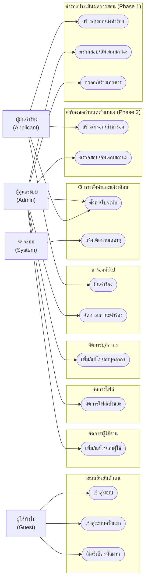

# ภาพรวมระบบ HRCP-KKU-Academic

## ระบบจัดการคำร้องบุคลากรทางวิชาการ

ระบบนี้ใช้สำหรับจัดการกระบวนการยื่นคำร้องประเมินผลการสอนและการขอกำหนดตำแหน่งทางวิชาการ ของวิทยาลัยการคอมพิวเตอร์ มหาวิทยาลัยขอนแก่น แบ่งเป็น 2 เฟสหลัก คือ การประเมินผลการสอน (Phase 1) และ การขอกำหนดตำแหน่ง (Phase 2) พร้อมระบบคำร้องทั่วไปและเครื่องมือบริหารจัดการ

---

## ตัวแสดง (Actors)

| ตัวแสดง | บทบาทในระบบ | คำอธิบาย |
|---------|-------------|---------|
| ผู้ใช้ทั่วไป (Guest) | ไม่มี role | ผู้ที่ยังไม่ได้เข้าสู่ระบบ สามารถเข้าสู่ระบบ ตั้งรหัสผ่านครั้งแรก หรือรีเซ็ตรหัสผ่านได้ |
| ผู้ยื่นคำร้อง (Applicant) | ROLE_USER | บุคลากรทางวิชาการที่ยื่นคำร้องประเมินผลการสอน ขอกำหนดตำแหน่ง หรือยื่นคำร้องทั่วไป |
| ผู้ดูแลระบบ (Admin) | ROLE_ADMIN | เจ้าหน้าที่ที่ตรวจสอบคำร้อง กรอกเอกสาร อัพเดทสถานะ และจัดการผู้ใช้/บุคลากร |
| ระบบ (System) | Scheduler | ระบบอัตโนมัติที่ตรวจสอบวันหมดอายุการประเมินและส่งแจ้งเตือนทางอีเมล |

---

## Use Case Diagram ระดับระบบ

---

## รายการ Subsystem

### 1. ระบบยืนยันตัวตน (Authentication)
จัดการการเข้าสู่ระบบ การตั้งรหัสผ่านครั้งแรกผ่าน OTP การลืม/รีเซ็ตรหัสผ่าน

### 2. คำร้องประเมินผลการสอน (Academic Request — Phase 1)
กระบวนการยื่นคำร้องประเมินผลการสอน ตั้งแต่สร้างคำร้อง กรอกเอกสาร 9 ประเภท จนถึงแจ้งผลการประเมิน
- **ผู้ยื่นคำร้อง**: กรอกเอกสารที่ 0 (บันทึกข้อความ) และที่ 1 (แบบตรวจสอบเบื้องต้น)
- **ผู้ดูแลระบบ**: กรอกเอกสารที่ 2-8 อัพเดทสถานะ ส่งข้อเสนอแนะ

### 3. คำร้องขอกำหนดตำแหน่ง (Position Request — Phase 2)
กระบวนการยื่นคำร้องขอกำหนดตำแหน่งทางวิชาการ ต่อเนื่องจาก Phase 1 ที่ผ่านการประเมินแล้ว
- **ผู้ยื่นคำร้อง**: กรอกเอกสารที่ 1-4, 6, 7, 9
- **ผู้ดูแลระบบ**: กรอกเอกสารที่ 5 และ 8 อัพเดทสถานะ

### 4. คำร้องทั่วไป (Petition)
ระบบยื่นคำร้องทั่วไป/อุทธรณ์ สำหรับกรณีที่ต้องการร้องเรียนหรือขอทบทวน

### 5. จัดการบุคลากร (Staff Management)
จัดการรายชื่อบุคลากร/กรรมการ เช่น คณบดี หัวหน้าสาขา กรรมการ เจ้าหน้าที่ HR

### 6. จัดการไฟล์ (File Management)
ระบบจัดการไฟล์เอกสาร พร้อมถังขยะ การกู้คืน และการลบถาวร

### 7. จัดการผู้ใช้งาน (User Management)
จัดการบัญชีผู้ใช้และแอดมิน เปิด/ปิดบัญชี ดูประวัติการใช้งาน

### 8. การตั้งค่าและแจ้งเตือน (Settings & Notifications)
ตั้งค่า Auto-Draft การแจ้งเตือนทางอีเมล การแจ้งเตือนหมดอายุ โปรไฟล์ เปลี่ยนรหัสผ่าน
