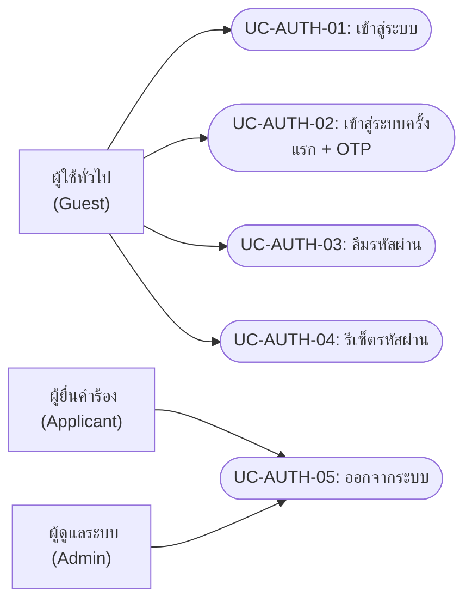
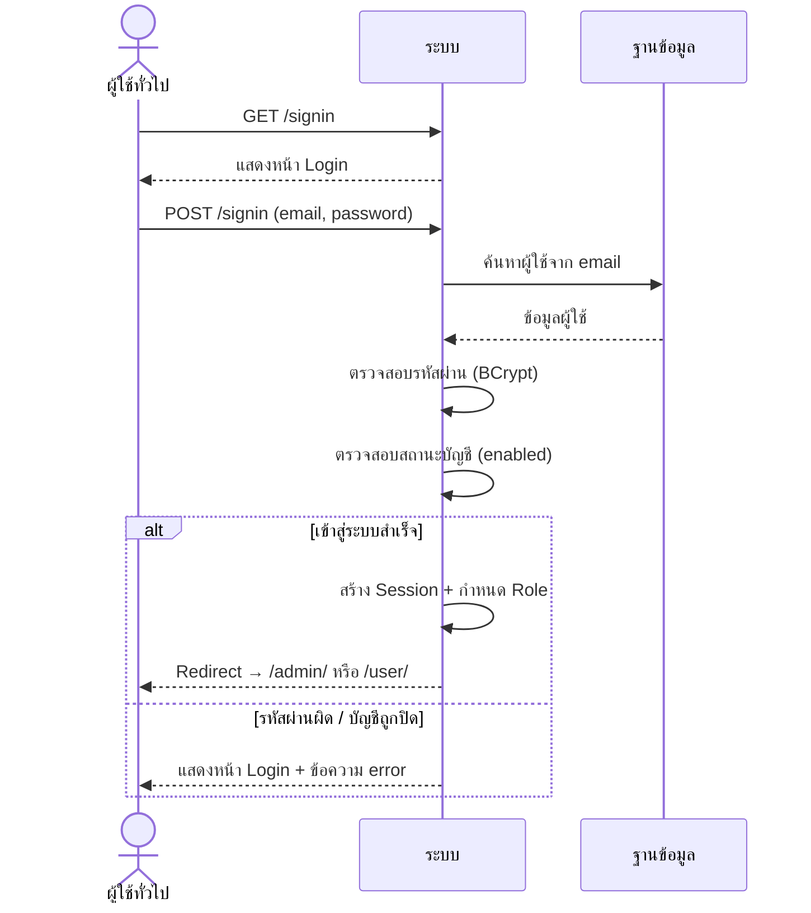
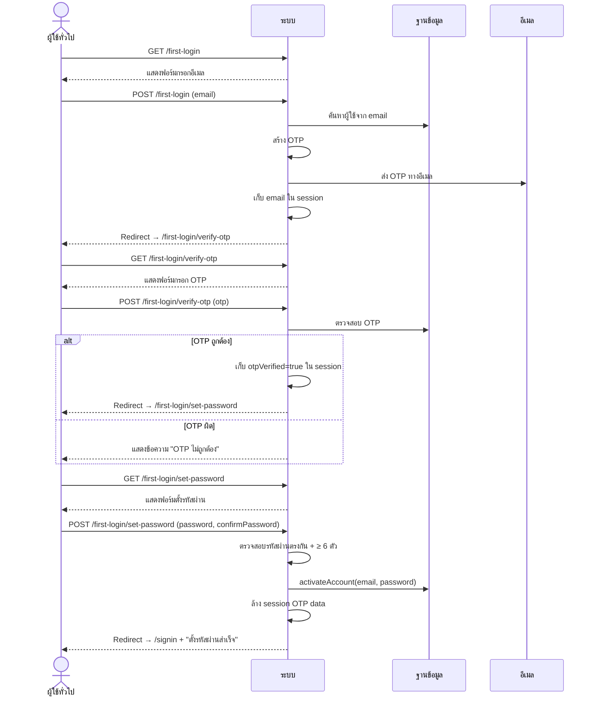

# ระบบยืนยันตัวตน (Authentication)

---

## 1. Use Case Diagram

---

## 2. Use Case Descriptions

### UC-AUTH-01: เข้าสู่ระบบ

| รายการ | รายละเอียด |
|--------|-----------|
| **รหัส Use Case** | UC-AUTH-01 |
| **ชื่อ Use Case** | เข้าสู่ระบบ |
| **คำอธิบาย** | ผู้ใช้เข้าสู่ระบบด้วยอีเมลและรหัสผ่าน |
| **ผู้กระทำหลัก** | ผู้ใช้ทั่วไป (Guest) |
| **เงื่อนไขก่อนหน้า** | ยังไม่ได้เข้าสู่ระบบ |
| **เงื่อนไขหลัง** | ผู้ใช้เข้าสู่ระบบสำเร็จ ถูก redirect ไปหน้า dashboard ตาม role |
| **ทริกเกอร์** | ผู้ใช้เปิดหน้า login หรือเข้า URL ที่ต้อง authenticate |

#### ลำดับเหตุการณ์หลัก

| ขั้นตอน | ผู้กระทำ | การกระทำ |
|---------|---------|---------|
| 1 | ผู้ใช้ | เปิดหน้าเข้าสู่ระบบ (`/signin`) |
| 2 | ระบบ | แสดงแบบฟอร์ม login (อีเมล + รหัสผ่าน) |
| 3 | ผู้ใช้ | กรอกอีเมลและรหัสผ่าน แล้วคลิก "เข้าสู่ระบบ" |
| 4 | ระบบ | Spring Security ตรวจสอบ credentials |
| 5 | ระบบ | ตรวจสอบสถานะบัญชี (enabled/disabled) |
| 6 | ระบบ | Redirect ไปหน้า dashboard ตาม role: ROLE_ADMIN → `/admin/` , ROLE_USER → `/user/` |

#### ลำดับเหตุการณ์ทางเลือก

**AF-1: รหัสผ่านไม่ถูกต้อง**

| ขั้นตอน | ผู้กระทำ | การกระทำ |
|---------|---------|---------|
| 4a | ระบบ | ตรวจพบ credentials ไม่ถูกต้อง |
| 4b | ระบบ | แสดงข้อความ "อีเมลหรือรหัสผ่านไม่ถูกต้อง" |

**AF-2: บัญชีถูกปิดใช้งาน**

| ขั้นตอน | ผู้กระทำ | การกระทำ |
|---------|---------|---------|
| 5a | ระบบ | ตรวจพบบัญชีถูก disable |
| 5b | ระบบ | แสดงข้อความ "บัญชีถูกระงับ กรุณาติดต่อผู้ดูแล" |

---

### UC-AUTH-02: เข้าสู่ระบบครั้งแรก + OTP

| รายการ | รายละเอียด |
|--------|-----------|
| **รหัส Use Case** | UC-AUTH-02 |
| **ชื่อ Use Case** | เข้าสู่ระบบครั้งแรก (ยืนยัน OTP + ตั้งรหัสผ่าน) |
| **คำอธิบาย** | ผู้ใช้ที่เข้าระบบครั้งแรกต้องยืนยันอีเมลผ่าน OTP แล้วตั้งรหัสผ่านใหม่ |
| **ผู้กระทำหลัก** | ผู้ใช้ทั่วไป (Guest) |
| **เงื่อนไขก่อนหน้า** | มีบัญชีในระบบแต่ยังไม่เคยตั้งรหัสผ่าน |
| **เงื่อนไขหลัก** | บัญชีถูก activate และตั้งรหัสผ่านสำเร็จ |
| **ทริกเกอร์** | ผู้ใช้คลิก "เข้าสู่ระบบครั้งแรก" |

#### ลำดับเหตุการณ์หลัก

| ขั้นตอน | ผู้กระทำ | การกระทำ |
|---------|---------|---------|
| 1 | ผู้ใช้ | คลิก "เข้าสู่ระบบครั้งแรก" (GET `/first-login`) |
| 2 | ระบบ | แสดงฟอร์มกรอกอีเมล |
| 3 | ผู้ใช้ | กรอกอีเมลแล้วคลิก "ส่ง OTP" |
| 4 | ระบบ | สร้างรหัส OTP และส่งไปทางอีเมล |
| 5 | ระบบ | Redirect ไปหน้ายืนยัน OTP (`/first-login/verify-otp`) |
| 6 | ผู้ใช้ | กรอกรหัส OTP จากอีเมล |
| 7 | ระบบ | ตรวจสอบรหัส OTP ถูกต้อง |
| 8 | ระบบ | Redirect ไปหน้าตั้งรหัสผ่าน (`/first-login/set-password`) |
| 9 | ผู้ใช้ | กรอกรหัสผ่านใหม่ + ยืนยันรหัสผ่าน |
| 10 | ระบบ | ตรวจสอบรหัสผ่านตรงกัน + ≥ 6 ตัวอักษร |
| 11 | ระบบ | Activate บัญชี + ตั้งรหัสผ่าน + ล้าง session OTP |
| 12 | ระบบ | Redirect ไป `/signin` พร้อมข้อความ "ตั้งรหัสผ่านสำเร็จ" |

#### ลำดับเหตุการณ์ทางเลือก

**AF-1: OTP ไม่ถูกต้อง**

| ขั้นตอน | ผู้กระทำ | การกระทำ |
|---------|---------|---------|
| 7a | ระบบ | ตรวจพบรหัส OTP ไม่ถูกต้องหรือหมดอายุ |
| 7b | ระบบ | แสดงข้อความ "รหัส OTP ไม่ถูกต้องหรือหมดอายุ" |

**AF-2: รหัสผ่านไม่ตรงกัน**

| ขั้นตอน | ผู้กระทำ | การกระทำ |
|---------|---------|---------|
| 10a | ระบบ | ตรวจพบรหัสผ่านไม่ตรงกัน หรือสั้นกว่า 6 ตัว |
| 10b | ระบบ | แสดงข้อความ error + กลับไปหน้าตั้งรหัสผ่าน |

#### ลำดับเหตุการณ์ผิดพลาด

**EF-1: เซสชันหมดอายุ**

| ขั้นตอน | ผู้กระทำ | การกระทำ |
|---------|---------|---------|
| * | ระบบ | ตรวจพบเซสชันหมดอายุ (otpEmail = null) |
| * | ระบบ | แสดงข้อความ "เซสชันหมดอายุ กรุณาเริ่มใหม่" → redirect `/first-login` |

---

### UC-AUTH-03: ลืมรหัสผ่าน

| รายการ | รายละเอียด |
|--------|-----------|
| **รหัส Use Case** | UC-AUTH-03 |
| **ชื่อ Use Case** | ลืมรหัสผ่าน |
| **คำอธิบาย** | ผู้ใช้ขอรีเซ็ตรหัสผ่านโดยกรอกอีเมล ระบบส่งลิงก์รีเซ็ตไปทางอีเมล |
| **ผู้กระทำหลัก** | ผู้ใช้ทั่วไป (Guest) |
| **เงื่อนไขก่อนหน้า** | มีบัญชีอยู่ในระบบ |
| **เงื่อนไขหลัง** | ผู้ใช้ได้รับลิงก์รีเซ็ตรหัสผ่านทางอีเมล |
| **ทริกเกอร์** | คลิก "ลืมรหัสผ่าน" ในหน้า login |

#### ลำดับเหตุการณ์หลัก

| ขั้นตอน | ผู้กระทำ | การกระทำ |
|---------|---------|---------|
| 1 | ผู้ใช้ | คลิก "ลืมรหัสผ่าน" (GET `/forgot-password`) |
| 2 | ระบบ | แสดงฟอร์มกรอกอีเมล |
| 3 | ผู้ใช้ | กรอกอีเมลแล้วคลิก "ส่ง" |
| 4 | ระบบ | ค้นหาผู้ใช้จากอีเมล |
| 5 | ระบบ | สร้าง resetToken (UUID) และบันทึกลง DB |
| 6 | ระบบ | ส่งอีเมลพร้อมลิงก์ `/reset-password?token=...` |
| 7 | ระบบ | แสดงข้อความ "กรุณาตรวจสอบอีเมลของคุณ" |

#### ลำดับเหตุการณ์ทางเลือก

**AF-1: ไม่พบอีเมลในระบบ**

| ขั้นตอน | ผู้กระทำ | การกระทำ |
|---------|---------|---------|
| 4a | ระบบ | ไม่พบอีเมลในระบบ |
| 4b | ระบบ | แสดงข้อความ "ไม่พบอีเมลนี้ในระบบ" |

---

### UC-AUTH-04: รีเซ็ตรหัสผ่าน

| รายการ | รายละเอียด |
|--------|-----------|
| **รหัส Use Case** | UC-AUTH-04 |
| **ชื่อ Use Case** | รีเซ็ตรหัสผ่าน |
| **คำอธิบาย** | ผู้ใช้ตั้งรหัสผ่านใหม่ผ่านลิงก์ที่ได้รับทางอีเมล |
| **ผู้กระทำหลัก** | ผู้ใช้ทั่วไป (Guest) |
| **เงื่อนไขก่อนหน้า** | มี reset token ที่ถูกต้องจากอีเมล |
| **เงื่อนไขหลัก** | รหัสผ่านถูกเปลี่ยนและ token ถูกลบ |
| **ทริกเกอร์** | คลิกลิงก์รีเซ็ตจากอีเมล |

#### ลำดับเหตุการณ์หลัก

| ขั้นตอน | ผู้กระทำ | การกระทำ |
|---------|---------|---------|
| 1 | ผู้ใช้ | คลิกลิงก์จากอีเมล (GET `/reset-password?token=...`) |
| 2 | ระบบ | ตรวจสอบ token ถูกต้อง |
| 3 | ระบบ | แสดงฟอร์มตั้งรหัสผ่านใหม่ |
| 4 | ผู้ใช้ | กรอกรหัสผ่านใหม่ + ยืนยัน |
| 5 | ระบบ | ตรวจสอบรหัสผ่านตรงกัน + ≥ 6 ตัวอักษร |
| 6 | ระบบ | เข้ารหัสรหัสผ่านใหม่ (BCrypt) ลบ resetToken |
| 7 | ระบบ | Redirect ไป `/signin` พร้อมข้อความ "รีเซ็ตรหัสผ่านสำเร็จ" |

#### ลำดับเหตุการณ์ทางเลือก

**AF-1: Token ไม่ถูกต้อง**

| ขั้นตอน | ผู้กระทำ | การกระทำ |
|---------|---------|---------|
| 2a | ระบบ | ตรวจพบ token ไม่ถูกต้องหรือหมดอายุ |
| 2b | ระบบ | แสดงข้อความ "ลิงก์ไม่ถูกต้องหรือหมดอายุ" |

---

### UC-AUTH-05: ออกจากระบบ

| รายการ | รายละเอียด |
|--------|-----------|
| **รหัส Use Case** | UC-AUTH-05 |
| **ชื่อ Use Case** | ออกจากระบบ |
| **คำอธิบาย** | ผู้ใช้ออกจากระบบเพื่อยุติ session |
| **ผู้กระทำหลัก** | ผู้ยื่นคำร้อง / ผู้ดูแลระบบ |
| **เงื่อนไขก่อนหน้า** | เข้าสู่ระบบอยู่ |
| **เงื่อนไขหลัก** | Session ถูกทำลาย ผู้ใช้ถูก redirect ไปหน้า login |
| **ทริกเกอร์** | คลิกปุ่ม "ออกจากระบบ" |

#### ลำดับเหตุการณ์หลัก

| ขั้นตอน | ผู้กระทำ | การกระทำ |
|---------|---------|---------|
| 1 | ผู้ใช้ | คลิก "ออกจากระบบ" |
| 2 | ระบบ | Spring Security ทำลาย session + ลบ cookie |
| 3 | ระบบ | Redirect ไป `/signin?logout` พร้อมข้อความ "ออกจากระบบสำเร็จ" |

---

## 3. System Sequence Diagrams

### SSD-AUTH-01: เข้าสู่ระบบ

### SSD-AUTH-02: เข้าสู่ระบบครั้งแรก (OTP)

### SSD-AUTH-03: ลืมรหัสผ่าน + รีเซ็ตรหัสผ่าน

```mermaid
sequenceDiagram
    actor G as ผู้ใช้ทั่วไป
    participant S as ระบบ
    participant DB as ฐานข้อมูล
    participant E as อีเมล

    G->>S: GET /forgot-password
    S-->>G: แสดงฟอร์มกรอกอีเมล

    G->>S: POST /forgot-password (email)
    S->>DB: ค้นหาผู้ใช้จาก email
    alt พบอีเมล
        S->>S: สร้าง resetToken (UUID)
        S->>DB: บันทึก resetToken
        S->>E: ส่งลิงก์รีเซ็ตทางอีเมล
        S-->>G: "กรุณาตรวจสอบอีเมล"
    else ไม่พบอีเมล
        S-->>G: "ไม่พบอีเมลนี้ในระบบ"
    end

    Note over G: ผู้ใช้คลิกลิงก์จากอีเมล

    G->>S: GET /reset-password?token=xxx
    S->>DB: ค้นหาผู้ใช้จาก token
    alt token ถูกต้อง
        S-->>G: แสดงฟอร์มตั้งรหัสผ่านใหม่
    else token ไม่ถูกต้อง
        S-->>G: "ลิงก์ไม่ถูกต้องหรือหมดอายุ"
    end

    G->>S: POST /reset-password (token, password, confirmPassword)
    S->>S: ตรวจสอบรหัสผ่านตรงกัน + ≥ 6 ตัว
    S->>DB: เข้ารหัส (BCrypt) + บันทึก + ลบ token
    S-->>G: Redirect → /signin + "รีเซ็ตรหัสผ่านสำเร็จ"
```

---

## 4. User Interface Design

### UI-AUTH-01: หน้าเข้าสู่ระบบ

| รายการ | รายละเอียด |
|--------|-----------|
| **ชื่อหน้า** | เข้าสู่ระบบ |
| **URL** | `/signin` |
| **บทบาท** | ผู้ใช้ทั่วไป (Guest) |
| **Use Cases** | UC-AUTH-01 |

#### องค์ประกอบหน้าจอ

| ลำดับ | องค์ประกอบ | ประเภท | คำอธิบาย | การกระทำ |
|------|----------|--------|---------|---------|
| 1 | อีเมล | Text Input (required) | กรอกอีเมลผู้ใช้ | — |
| 2 | รหัสผ่าน | Password Input (required) | กรอกรหัสผ่าน | — |
| 3 | ปุ่ม "เข้าสู่ระบบ" | Button (primary) | ส่ง credentials | POST /signin |
| 4 | ลิงก์ "เข้าสู่ระบบครั้งแรก" | Link | สำหรับผู้ใช้ใหม่ | GET /first-login |
| 5 | ลิงก์ "ลืมรหัสผ่าน" | Link | ขอรีเซ็ตรหัสผ่าน | GET /forgot-password |
| 6 | ข้อความแจ้งเตือน | Alert (error/success) | แสดง flash message | — |

#### กฎการแสดงผล
- แสดงข้อความ success เมื่อ redirect จาก logout, set-password, reset-password
- แสดงข้อความ error เมื่อ login ผิดพลาด

---

### UI-AUTH-02: หน้าเข้าสู่ระบบครั้งแรก

| รายการ | รายละเอียด |
|--------|-----------|
| **ชื่อหน้า** | เข้าสู่ระบบครั้งแรก |
| **URL** | `/first-login` |
| **บทบาท** | ผู้ใช้ทั่วไป (Guest) |
| **Use Cases** | UC-AUTH-02 |

#### องค์ประกอบหน้าจอ

| ลำดับ | องค์ประกอบ | ประเภท | คำอธิบาย | การกระทำ |
|------|----------|--------|---------|---------|
| 1 | อีเมล | Text Input (required) | กรอกอีเมลที่ลงทะเบียนไว้ | — |
| 2 | ปุ่ม "ส่ง OTP" | Button (primary) | ส่ง OTP ไปทางอีเมล | POST /first-login |
| 3 | ข้อความแจ้งเตือน | Alert | แสดง success/error message | — |

---

### UI-AUTH-03: หน้ายืนยัน OTP

| รายการ | รายละเอียด |
|--------|-----------|
| **ชื่อหน้า** | ยืนยัน OTP |
| **URL** | `/first-login/verify-otp` |
| **บทบาท** | ผู้ใช้ทั่วไป (Guest) |
| **Use Cases** | UC-AUTH-02 |

#### องค์ประกอบหน้าจอ

| ลำดับ | องค์ประกอบ | ประเภท | คำอธิบาย | การกระทำ |
|------|----------|--------|---------|---------|
| 1 | ข้อความแจ้งอีเมล | Text | แสดงอีเมลที่ส่ง OTP ไป | — |
| 2 | รหัส OTP | Text Input (required) | กรอกรหัส OTP 6 หลัก | — |
| 3 | ปุ่ม "ยืนยัน" | Button (primary) | ตรวจสอบ OTP | POST /first-login/verify-otp |

#### กฎการแสดงผล
- ถ้า session ไม่มี otpEmail จะ redirect ไป `/first-login`
- ถ้า OTP ผิด แสดง error message แล้วกลับมาหน้านี้

---

### UI-AUTH-04: หน้าตั้งรหัสผ่าน

| รายการ | รายละเอียด |
|--------|-----------|
| **ชื่อหน้า** | ตั้งรหัสผ่าน |
| **URL** | `/first-login/set-password` |
| **บทบาท** | ผู้ใช้ทั่วไป (Guest) |
| **Use Cases** | UC-AUTH-02 |

#### องค์ประกอบหน้าจอ

| ลำดับ | องค์ประกอบ | ประเภท | คำอธิบาย | การกระทำ |
|------|----------|--------|---------|---------|
| 1 | รหัสผ่านใหม่ | Password Input (required) | กรอกรหัสผ่าน (≥ 6 ตัวอักษร) | — |
| 2 | ยืนยันรหัสผ่าน | Password Input (required) | กรอกรหัสผ่านซ้ำ | — |
| 3 | ปุ่ม "ตั้งรหัสผ่าน" | Button (primary) | บันทึกรหัสผ่าน | POST /first-login/set-password |

#### กฎการแสดงผล
- ต้องมี otpVerified=true ใน session ถึงจะเข้าได้
- รหัสผ่านต้องตรงกัน + ≥ 6 ตัวอักษร

---

### UI-AUTH-05: หน้าลืมรหัสผ่าน

| รายการ | รายละเอียด |
|--------|-----------|
| **ชื่อหน้า** | ลืมรหัสผ่าน |
| **URL** | `/forgot-password` |
| **บทบาท** | ผู้ใช้ทั่วไป (Guest) |
| **Use Cases** | UC-AUTH-03 |

#### องค์ประกอบหน้าจอ

| ลำดับ | องค์ประกอบ | ประเภท | คำอธิบาย | การกระทำ |
|------|----------|--------|---------|---------|
| 1 | อีเมล | Text Input (required) | กรอกอีเมลที่ลงทะเบียนไว้ | — |
| 2 | ปุ่ม "ส่งลิงก์รีเซ็ต" | Button (primary) | ส่งลิงก์รีเซ็ตไปทางอีเมล | POST /forgot-password |
| 3 | ลิงก์ "กลับไปหน้า Login" | Link | กลับไปหน้าเข้าสู่ระบบ | GET /signin |

---

### UI-AUTH-06: หน้ารีเซ็ตรหัสผ่าน

| รายการ | รายละเอียด |
|--------|-----------|
| **ชื่อหน้า** | รีเซ็ตรหัสผ่าน |
| **URL** | `/reset-password?token=xxx` |
| **บทบาท** | ผู้ใช้ทั่วไป (Guest) |
| **Use Cases** | UC-AUTH-04 |

#### องค์ประกอบหน้าจอ

| ลำดับ | องค์ประกอบ | ประเภท | คำอธิบาย | การกระทำ |
|------|----------|--------|---------|---------|
| 1 | รหัสผ่านใหม่ | Password Input (required) | กรอกรหัสผ่านใหม่ (≥ 6 ตัวอักษร) | — |
| 2 | ยืนยันรหัสผ่าน | Password Input (required) | กรอกรหัสผ่านซ้ำ | — |
| 3 | ปุ่ม "รีเซ็ตรหัสผ่าน" | Button (primary) | บันทึกรหัสผ่านใหม่ | POST /reset-password |
| 4 | Hidden field: token | Hidden Input | ส่ง token กลับไปเพื่อ validate | — |

#### กฎการแสดงผล
- ถ้า token ไม่ถูกต้องจะแสดงหน้า message "ลิงก์ไม่ถูกต้องหรือหมดอายุ" แทน
- รหัสผ่านต้องตรงกัน + ≥ 6 ตัวอักษร
