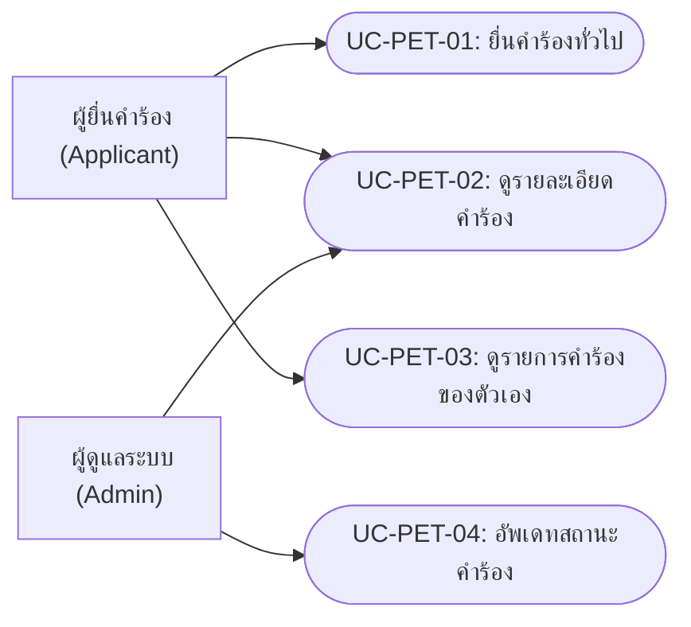
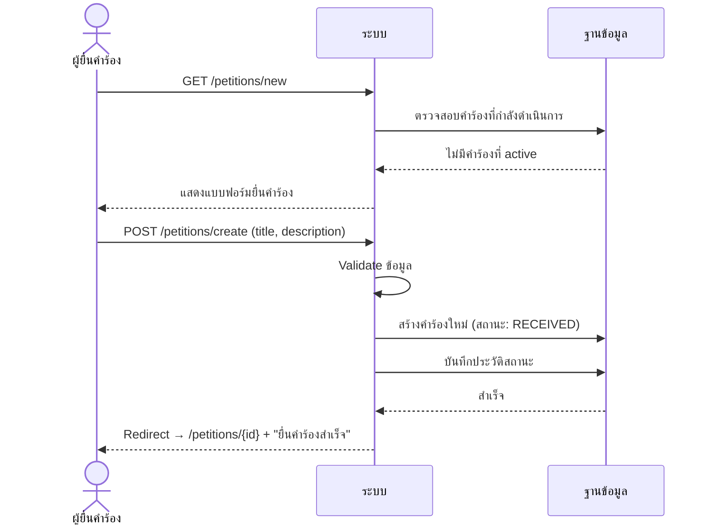
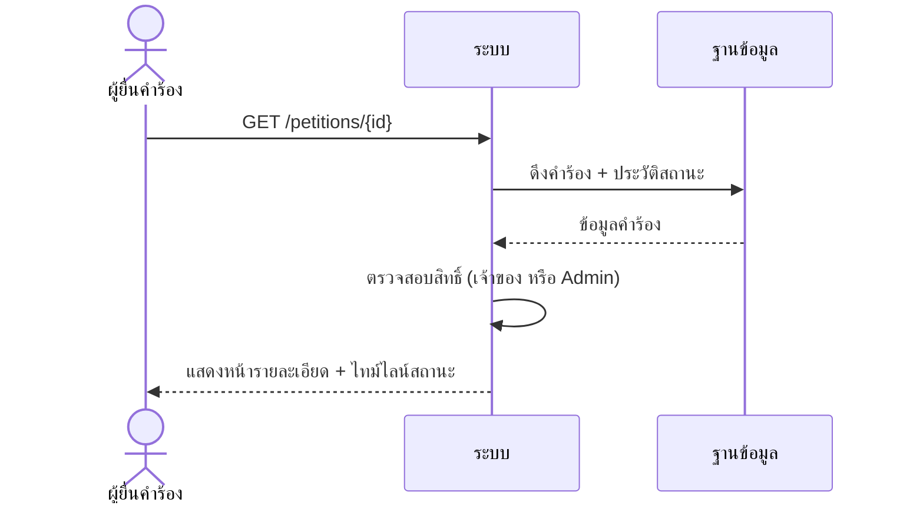
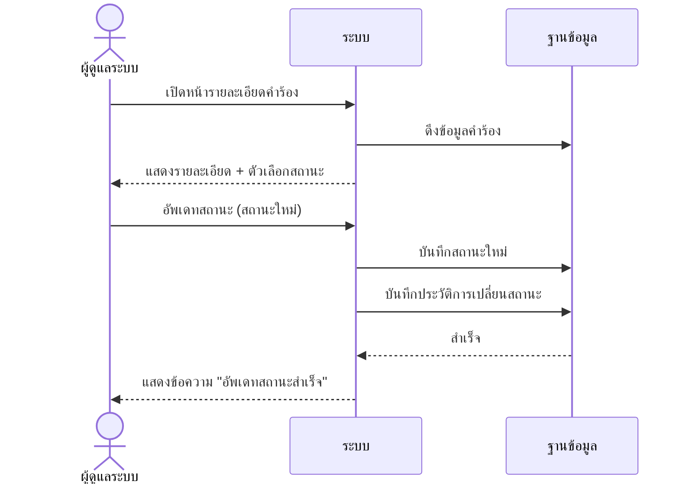

# ระบบคำร้องทั่วไป (Petition)

---

## 1. Use Case Diagram

---

## 2. Use Case Descriptions

### UC-PET-01: ยื่นคำร้องทั่วไป

| รายการ | รายละเอียด |
|--------|-----------|
| **รหัส Use Case** | UC-PET-01 |
| **ชื่อ Use Case** | ยื่นคำร้องทั่วไป |
| **คำอธิบาย** | ผู้ยื่นคำร้องสร้างคำร้องทั่วไปใหม่ โดยระบุหัวข้อและรายละเอียด |
| **ผู้กระทำหลัก** | ผู้ยื่นคำร้อง (Applicant) |
| **เงื่อนไขก่อนหน้า** | 1. ผู้ใช้เข้าสู่ระบบแล้ว (ROLE_USER) 2. ไม่มีคำร้องที่กำลังดำเนินการอยู่ |
| **เงื่อนไขหลัง** | คำร้องถูกสร้างในสถานะ "รับคำร้อง" (RECEIVED) |
| **ทริกเกอร์** | ผู้ใช้คลิก "ยื่นคำร้องใหม่" |

#### ลำดับเหตุการณ์หลัก

| ขั้นตอน | ผู้กระทำ | การกระทำ |
|---------|---------|---------|
| 1 | ผู้ยื่นคำร้อง | คลิกเมนู "ยื่นคำร้องใหม่" |
| 2 | ระบบ | ตรวจสอบว่าผู้ใช้ไม่มีคำร้องที่กำลังดำเนินการ |
| 3 | ระบบ | แสดงแบบฟอร์มยื่นคำร้อง |
| 4 | ผู้ยื่นคำร้อง | กรอกหัวข้อคำร้อง (title) และรายละเอียด (description) |
| 5 | ผู้ยื่นคำร้อง | คลิกปุ่ม "ยื่นคำร้อง" |
| 6 | ระบบ | ตรวจสอบความถูกต้องของข้อมูล (validation) |
| 7 | ระบบ | สร้างคำร้องใหม่ในสถานะ RECEIVED พร้อมบันทึกประวัติสถานะ |
| 8 | ระบบ | แสดงหน้ารายละเอียดคำร้องที่สร้างสำเร็จ พร้อมข้อความ "ยื่นคำร้องสำเร็จ" |

#### ลำดับเหตุการณ์ทางเลือก

**AF-1: มีคำร้องที่กำลังดำเนินการอยู่**

| ขั้นตอน | ผู้กระทำ | การกระทำ |
|---------|---------|---------|
| 2a | ระบบ | ตรวจพบว่ามีคำร้องที่กำลังดำเนินการ |
| 2b | ระบบ | แสดงหน้า "ไม่สามารถยื่นคำร้องใหม่ได้" พร้อมแสดงคำร้องที่มีอยู่ |

#### ลำดับเหตุการณ์ผิดพลาด

**EF-1: ข้อมูลไม่ถูกต้อง**

| ขั้นตอน | ผู้กระทำ | การกระทำ |
|---------|---------|---------|
| 6a | ระบบ | ตรวจพบข้อมูลไม่ถูกต้อง (เช่น หัวข้อว่าง) |
| 6b | ระบบ | แสดงข้อความแจ้งเตือนข้อผิดพลาดในแบบฟอร์ม |

---

### UC-PET-02: ดูรายละเอียดคำร้อง

| รายการ | รายละเอียด |
|--------|-----------|
| **รหัส Use Case** | UC-PET-02 |
| **ชื่อ Use Case** | ดูรายละเอียดคำร้อง |
| **คำอธิบาย** | ดูรายละเอียดคำร้องและประวัติการเปลี่ยนสถานะ |
| **ผู้กระทำหลัก** | ผู้ยื่นคำร้อง / ผู้ดูแลระบบ |
| **เงื่อนไขก่อนหน้า** | เข้าสู่ระบบแล้ว และมีสิทธิ์เข้าถึงคำร้อง (เจ้าของคำร้อง หรือ Admin) |
| **เงื่อนไขหลัง** | — |
| **ทริกเกอร์** | คลิกดูรายละเอียดคำร้อง |

#### ลำดับเหตุการณ์หลัก

| ขั้นตอน | ผู้กระทำ | การกระทำ |
|---------|---------|---------|
| 1 | ผู้ใช้ | คลิกดูรายละเอียดคำร้อง |
| 2 | ระบบ | ตรวจสอบสิทธิ์การเข้าถึง (เจ้าของ หรือ Admin) |
| 3 | ระบบ | ดึงข้อมูลคำร้องพร้อมประวัติสถานะ |
| 4 | ระบบ | แสดงหน้ารายละเอียดคำร้อง: หัวข้อ, รายละเอียด, สถานะปัจจุบัน, ไทม์ไลน์สถานะ |

#### ลำดับเหตุการณ์ทางเลือก

**AF-1: ไม่มีสิทธิ์เข้าถึง**

| ขั้นตอน | ผู้กระทำ | การกระทำ |
|---------|---------|---------|
| 2a | ระบบ | ตรวจพบว่าผู้ใช้ไม่ใช่เจ้าของและไม่ใช่ Admin |
| 2b | ระบบ | Redirect ไปหน้ารายการคำร้องของตัวเอง |

---

### UC-PET-03: ดูรายการคำร้องของตัวเอง

| รายการ | รายละเอียด |
|--------|-----------|
| **รหัส Use Case** | UC-PET-03 |
| **ชื่อ Use Case** | ดูรายการคำร้องของตัวเอง |
| **คำอธิบาย** | ผู้ยื่นดูรายการคำร้องทั้งหมดที่เคยยื่น |
| **ผู้กระทำหลัก** | ผู้ยื่นคำร้อง (Applicant) |
| **เงื่อนไขก่อนหน้า** | เข้าสู่ระบบแล้ว (ROLE_USER) |
| **เงื่อนไขหลัง** | — |
| **ทริกเกอร์** | คลิกเมนู "คำร้องของฉัน" |

#### ลำดับเหตุการณ์หลัก

| ขั้นตอน | ผู้กระทำ | การกระทำ |
|---------|---------|---------|
| 1 | ผู้ยื่นคำร้อง | คลิก "คำร้องของฉัน" |
| 2 | ระบบ | ดึงรายการคำร้องทั้งหมดของผู้ใช้ |
| 3 | ระบบ | แสดงรายการคำร้อง: หัวข้อ, วันที่ยื่น, สถานะ |

---

### UC-PET-04: อัพเดทสถานะคำร้อง

| รายการ | รายละเอียด |
|--------|-----------|
| **รหัส Use Case** | UC-PET-04 |
| **ชื่อ Use Case** | อัพเดทสถานะคำร้อง |
| **คำอธิบาย** | ผู้ดูแลระบบเปลี่ยนสถานะคำร้องทั่วไป |
| **ผู้กระทำหลัก** | ผู้ดูแลระบบ (Admin) |
| **เงื่อนไขก่อนหน้า** | เข้าสู่ระบบแล้ว (ROLE_ADMIN) มีคำร้องในระบบ |
| **เงื่อนไขหลัง** | สถานะคำร้องเปลี่ยนแปลง พร้อมบันทึกประวัติ |
| **ทริกเกอร์** | ผู้ดูแลเลือกเปลี่ยนสถานะคำร้อง |

#### ลำดับเหตุการณ์หลัก

| ขั้นตอน | ผู้กระทำ | การกระทำ |
|---------|---------|---------|
| 1 | ผู้ดูแลระบบ | เปิดหน้ารายละเอียดคำร้อง |
| 2 | ระบบ | แสดงรายละเอียดคำร้องพร้อมตัวเลือกสถานะ |
| 3 | ผู้ดูแลระบบ | เลือกสถานะใหม่จาก dropdown |
| 4 | ผู้ดูแลระบบ | คลิกปุ่ม "อัพเดทสถานะ" |
| 5 | ระบบ | บันทึกสถานะใหม่พร้อมประวัติการเปลี่ยนแปลง |
| 6 | ระบบ | แสดงข้อความ "อัพเดทสถานะสำเร็จ" |

#### กฎทางธุรกิจ
- สถานะเปลี่ยนได้ตาม flow: RECEIVED → COMMITTEE_ASSIGNED → MEETING_SCHEDULED → RESULT_APPROVED/RESULT_REVISION/REJECTED → COMPLETED

---

## 3. System Sequence Diagrams

### SSD-PET-01: ผู้ยื่นสร้างคำร้องทั่วไป

### SSD-PET-02: ผู้ยื่นดูรายละเอียดคำร้อง

### SSD-PET-03: ผู้ดูแลอัพเดทสถานะคำร้อง

---

## 4. User Interface Design

### UI-PET-01: หน้ายื่นคำร้องใหม่

| รายการ | รายละเอียด |
|--------|-----------|
| **ชื่อหน้า** | ยื่นคำร้องใหม่ |
| **URL** | `/petitions/new` |
| **บทบาท** | ผู้ยื่นคำร้อง (ROLE_USER) |
| **Use Cases** | UC-PET-01 |

#### องค์ประกอบหน้าจอ

| ลำดับ | องค์ประกอบ | ประเภท | คำอธิบาย | การกระทำ |
|------|----------|--------|---------|---------|
| 1 | หัวข้อคำร้อง | Text Input (required) | กรอกหัวข้อคำร้อง | — |
| 2 | รายละเอียด | Textarea (required) | กรอกรายละเอียดคำร้อง | — |
| 3 | ปุ่ม "ยื่นคำร้อง" | Button (primary) | ส่งแบบฟอร์ม | POST /petitions/create |
| 4 | ข้อความแจ้งเตือน | Alert | แสดงเมื่อมี validation error | — |

#### กฎการแสดงผล
- หัวข้อและรายละเอียดต้องไม่ว่าง (validated ด้วย `@Valid`)
- หากมีคำร้องที่ active อยู่ จะ redirect ไปหน้า cannot_submit แทน

---

### UI-PET-02: หน้าไม่สามารถยื่นคำร้องได้

| รายการ | รายละเอียด |
|--------|-----------|
| **ชื่อหน้า** | ไม่สามารถยื่นคำร้องใหม่ได้ |
| **URL** | `/petitions/new` (redirect ภายใน) |
| **บทบาท** | ผู้ยื่นคำร้อง (ROLE_USER) |
| **Use Cases** | UC-PET-01 (AF-1) |

#### องค์ประกอบหน้าจอ

| ลำดับ | องค์ประกอบ | ประเภท | คำอธิบาย | การกระทำ |
|------|----------|--------|---------|---------|
| 1 | ข้อความแจ้งเตือน | Alert (warning) | แสดงเหตุผลที่ยื่นไม่ได้ | — |
| 2 | ข้อมูลคำร้องที่มีอยู่ | Card | แสดงหัวข้อ สถานะ วันที่ของคำร้อง active | — |
| 3 | ลิงก์ "ดูรายละเอียด" | Link | ไปยังหน้ารายละเอียดคำร้องที่มีอยู่ | GET /petitions/{id} |

---

### UI-PET-03: หน้ารายละเอียดคำร้อง

| รายการ | รายละเอียด |
|--------|-----------|
| **ชื่อหน้า** | รายละเอียดคำร้อง |
| **URL** | `/petitions/{id}` |
| **บทบาท** | ผู้ยื่นคำร้อง / ผู้ดูแลระบบ |
| **Use Cases** | UC-PET-02, UC-PET-04 |

#### องค์ประกอบหน้าจอ

| ลำดับ | องค์ประกอบ | ประเภท | คำอธิบาย | การกระทำ |
|------|----------|--------|---------|---------|
| 1 | หัวข้อคำร้อง | Text (h2) | แสดงหัวข้อคำร้อง | — |
| 2 | สถานะปัจจุบัน | Badge | แสดงสถานะด้วยสีตาม StatusType | — |
| 3 | รายละเอียดคำร้อง | Text block | แสดงรายละเอียดเต็ม | — |
| 4 | ไทม์ไลน์สถานะ | Timeline/List | แสดงประวัติการเปลี่ยนสถานะตามลำดับเวลา | — |
| 5 | ข้อความแจ้งเตือน | Alert (success) | แสดงเมื่อยื่นคำร้องสำเร็จ (flash attribute) | — |

---

### UI-PET-04: หน้ารายการคำร้องของฉัน

| รายการ | รายละเอียด |
|--------|-----------|
| **ชื่อหน้า** | คำร้องของฉัน |
| **URL** | `/petitions/my-petitions` |
| **บทบาท** | ผู้ยื่นคำร้อง (ROLE_USER) |
| **Use Cases** | UC-PET-03 |

#### องค์ประกอบหน้าจอ

| ลำดับ | องค์ประกอบ | ประเภท | คำอธิบาย | การกระทำ |
|------|----------|--------|---------|---------|
| 1 | ตารางรายการคำร้อง | Table | แสดง: หัวข้อ, วันที่ยื่น, สถานะ | — |
| 2 | ปุ่ม "ดู" ในแต่ละแถว | Link/Button | ไปหน้ารายละเอียด | GET /petitions/{id} |
| 3 | ปุ่ม "ยื่นคำร้องใหม่" | Button (primary) | ไปหน้าสร้างคำร้อง | GET /petitions/new |
| 4 | ข้อความเมื่อไม่มีคำร้อง | Empty state | แสดงเมื่อยังไม่เคยยื่นคำร้อง | — |
