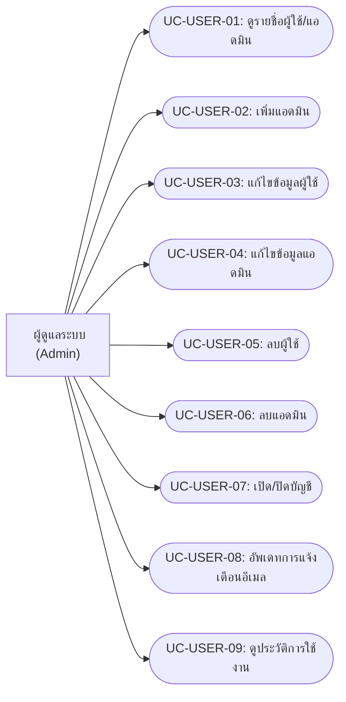
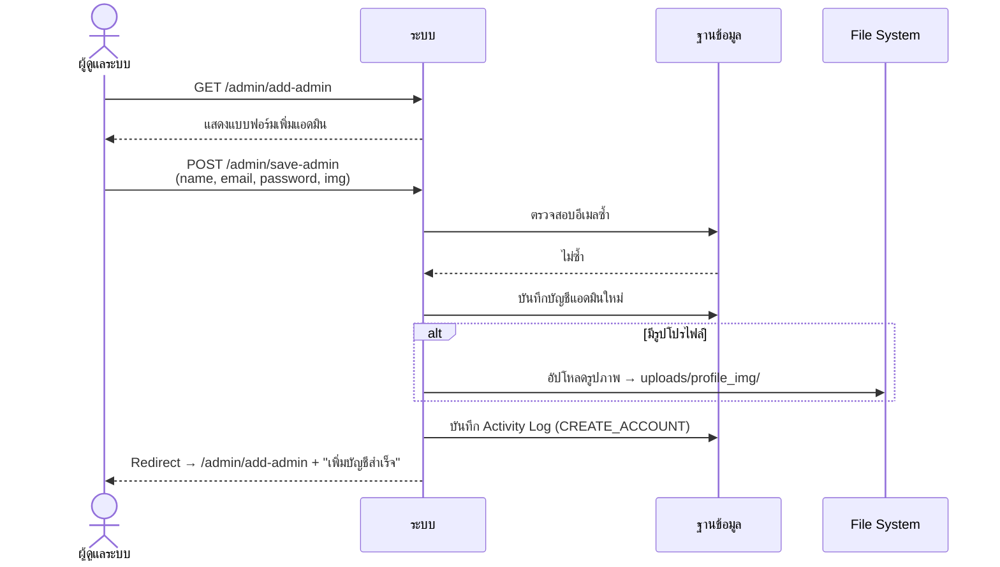
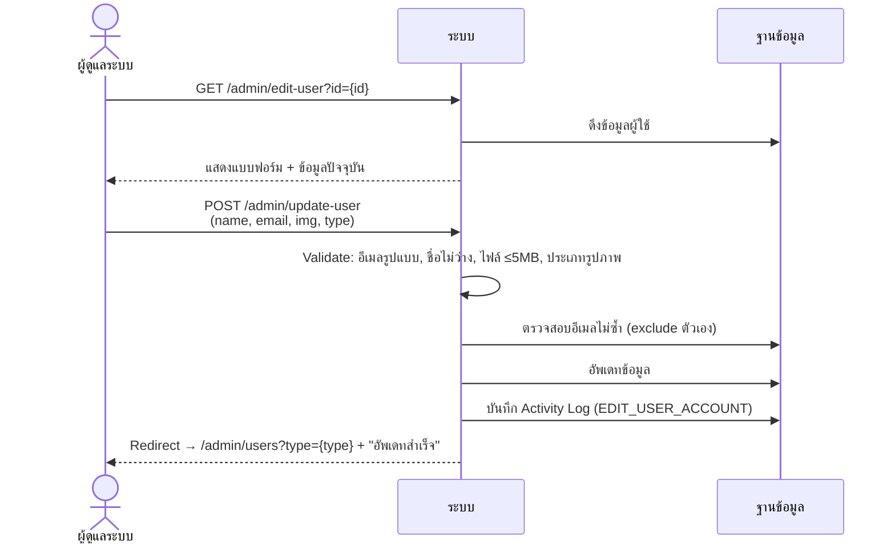
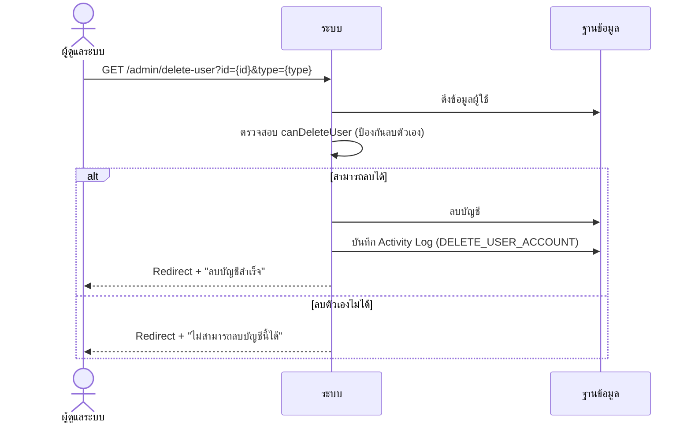

# ระบบจัดการผู้ใช้งาน (User Management)

> **บทบาท**: ผู้ดูแลระบบ (Admin) เท่านั้น

---

## 1. Use Case Diagram

---

## 2. Use Case Descriptions

### UC-USER-01: ดูรายชื่อผู้ใช้/แอดมิน

| รายการ | รายละเอียด |
|--------|-----------|
| **รหัส Use Case** | UC-USER-01 |
| **ชื่อ Use Case** | ดูรายชื่อผู้ใช้/แอดมิน |
| **คำอธิบาย** | แสดงรายชื่อบัญชีผู้ใช้ (type=1) หรือแอดมิน (type=2) ทั้งหมด |
| **ผู้กระทำหลัก** | ผู้ดูแลระบบ (Admin) |
| **เงื่อนไขก่อนหน้า** | เข้าสู่ระบบแล้ว (ROLE_ADMIN) |
| **เงื่อนไขหลัง** | — |
| **ทริกเกอร์** | คลิกเมนู "จัดการผู้ใช้" หรือ "จัดการแอดมิน" |

#### ลำดับเหตุการณ์หลัก

| ขั้นตอน | ผู้กระทำ | การกระทำ |
|---------|---------|---------|
| 1 | ผู้ดูแลระบบ | คลิกเมนูจัดการผู้ใช้ |
| 2 | ระบบ | GET /admin/users?type=1 (ผู้ใช้) หรือ type=2 (แอดมิน) |
| 3 | ระบบ | ดึงรายชื่อตาม role (ROLE_USER หรือ ROLE_ADMIN) |
| 4 | ระบบ | แสดงตาราง: รูปโปรไฟล์, ชื่อ, อีเมล, สถานะ, การแจ้งเตือน |

---

### UC-USER-02: เพิ่มแอดมิน

| รายการ | รายละเอียด |
|--------|-----------|
| **รหัส Use Case** | UC-USER-02 |
| **ชื่อ Use Case** | เพิ่มแอดมิน |
| **คำอธิบาย** | สร้างบัญชีแอดมินใหม่ในระบบ |
| **ผู้กระทำหลัก** | ผู้ดูแลระบบ (Admin) |
| **เงื่อนไขก่อนหน้า** | เข้าสู่ระบบแล้ว (ROLE_ADMIN) |
| **เงื่อนไขหลัง** | บัญชีแอดมินใหม่ถูกสร้าง บันทึกใน Activity Log |
| **ทริกเกอร์** | คลิกปุ่ม "เพิ่มแอดมิน" |

#### ลำดับเหตุการณ์หลัก

| ขั้นตอน | ผู้กระทำ | การกระทำ |
|---------|---------|---------|
| 1 | ผู้ดูแลระบบ | คลิก "เพิ่มแอดมิน" |
| 2 | ระบบ | แสดงแบบฟอร์มสร้างแอดมิน |
| 3 | ผู้ดูแลระบบ | กรอกข้อมูล: ชื่อ, อีเมล, รหัสผ่าน, รูปโปรไฟล์ (optional) |
| 4 | ผู้ดูแลระบบ | คลิก "บันทึก" |
| 5 | ระบบ | ตรวจสอบว่าอีเมลไม่ซ้ำ |
| 6 | ระบบ | สร้างบัญชี พร้อมอัปโหลดรูปโปรไฟล์ (ถ้ามี) |
| 7 | ระบบ | บันทึก Activity Log: CREATE_ACCOUNT |
| 8 | ระบบ | Redirect + แสดง "เพิ่มบัญชีสำเร็จ" |

#### ลำดับเหตุการณ์ทางเลือก

**AF-1: อีเมลซ้ำ**

| ขั้นตอน | ผู้กระทำ | การกระทำ |
|---------|---------|---------|
| 5a | ระบบ | ตรวจพบอีเมลมีในระบบแล้ว |
| 5b | ระบบ | แสดง "อีเมลนี้มีในระบบแล้ว" |

---

### UC-USER-03: แก้ไขข้อมูลผู้ใช้

| รายการ | รายละเอียด |
|--------|-----------|
| **รหัส Use Case** | UC-USER-03 |
| **ชื่อ Use Case** | แก้ไขข้อมูลผู้ใช้ |
| **คำอธิบาย** | แก้ไขข้อมูลบัญชีผู้ใช้ (ชื่อ, อีเมล, รูปโปรไฟล์) |
| **ผู้กระทำหลัก** | ผู้ดูแลระบบ (Admin) |
| **เงื่อนไขก่อนหน้า** | เข้าสู่ระบบแล้ว มีผู้ใช้ในระบบ |
| **เงื่อนไขหลัก** | ข้อมูลผู้ใช้ถูกอัพเดท บันทึก Activity Log |
| **ทริกเกอร์** | คลิก "แก้ไข" ที่แถวผู้ใช้ |

#### ลำดับเหตุการณ์หลัก

| ขั้นตอน | ผู้กระทำ | การกระทำ |
|---------|---------|---------|
| 1 | ผู้ดูแลระบบ | คลิก "แก้ไข" ที่แถวผู้ใช้ |
| 2 | ระบบ | GET /admin/edit-user?id={id} |
| 3 | ระบบ | แสดงแบบฟอร์มพร้อมข้อมูลปัจจุบัน |
| 4 | ผู้ดูแลระบบ | แก้ไขข้อมูลที่ต้องการ |
| 5 | ผู้ดูแลระบบ | คลิก "บันทึก" |
| 6 | ระบบ | Validate: อีเมลถูกรูปแบบ, ชื่อไม่ว่าง, อีเมลไม่ซ้ำ, รูปภาพถูกประเภท (สูงสุด 5MB) |
| 7 | ระบบ | อัพเดทข้อมูล + บันทึก Activity Log: EDIT_USER_ACCOUNT |
| 8 | ระบบ | Redirect ไปรายชื่อ + แสดง "อัพเดทสำเร็จ" |

#### ลำดับเหตุการณ์ผิดพลาด

**EF-1: Validation ไม่ผ่าน**

| ขั้นตอน | ผู้กระทำ | การกระทำ |
|---------|---------|---------|
| 6a | ระบบ | ตรวจพบข้อผิดพลาด (อีเมลรูปแบบผิด / ชื่อว่าง / อีเมลซ้ำ / ไฟล์ใหญ่เกิน) |
| 6b | ระบบ | Redirect กลับแบบฟอร์ม + แสดงข้อความ error |

---

### UC-USER-04: แก้ไขข้อมูลแอดมิน

*(เหมือน UC-USER-03 แต่ใช้ endpoint `/admin/edit-admin` และ `/admin/update-admin`)*

| รายการ | รายละเอียด |
|--------|-----------|
| **รหัส Use Case** | UC-USER-04 |
| **ชื่อ Use Case** | แก้ไขข้อมูลแอดมิน |
| **คำอธิบาย** | แก้ไขข้อมูลบัญชีแอดมิน |
| **ผู้กระทำหลัก** | ผู้ดูแลระบบ (Admin) |
| **เงื่อนไขก่อนหน้า** | เข้าสู่ระบบแล้ว |
| **เงื่อนไขหลัง** | ข้อมูลแอดมินถูกอัพเดท บันทึก Activity Log: EDIT_ADMIN_ACCOUNT |
| **ทริกเกอร์** | คลิก "แก้ไข" ที่แถวแอดมิน |

*(ลำดับเหตุการณ์เหมือน UC-USER-03)*

---

### UC-USER-05: ลบผู้ใช้

| รายการ | รายละเอียด |
|--------|-----------|
| **รหัส Use Case** | UC-USER-05 |
| **ชื่อ Use Case** | ลบผู้ใช้ |
| **คำอธิบาย** | ลบบัญชีผู้ใช้ออกจากระบบ |
| **ผู้กระทำหลัก** | ผู้ดูแลระบบ (Admin) |
| **เงื่อนไขก่อนหน้า** | เข้าสู่ระบบแล้ว มีผู้ใช้ในระบบ ไม่ใช่บัญชีตัวเอง |
| **เงื่อนไขหลัง** | บัญชีผู้ใช้ถูกลบ บันทึก Activity Log: DELETE_USER_ACCOUNT |
| **ทริกเกอร์** | คลิก "ลบ" ที่แถวผู้ใช้ |

#### ลำดับเหตุการณ์หลัก

| ขั้นตอน | ผู้กระทำ | การกระทำ |
|---------|---------|---------|
| 1 | ผู้ดูแลระบบ | คลิก "ลบ" ที่แถวผู้ใช้ |
| 2 | ระบบ | ตรวจสอบว่าบัญชีมีอยู่จริง |
| 3 | ระบบ | ตรวจสอบสิทธิ์ (canDeleteUser — ป้องกันลบตัวเอง) |
| 4 | ระบบ | ลบบัญชี |
| 5 | ระบบ | บันทึก Activity Log |
| 6 | ระบบ | Redirect + แสดง "ลบบัญชีสำเร็จ" |

#### ลำดับเหตุการณ์ทางเลือก

**AF-1: ลบตัวเองไม่ได้**

| ขั้นตอน | ผู้กระทำ | การกระทำ |
|---------|---------|---------|
| 3a | ระบบ | ตรวจพบว่าเป็นบัญชีตัวเอง |
| 3b | ระบบ | แสดง "ไม่สามารถลบบัญชีของตัวเองได้" |

---

### UC-USER-06: ลบแอดมิน

*(เหมือน UC-USER-05 แต่ใช้ endpoint `/admin/delete-admin` บันทึก Activity Log: DELETE_ADMIN_ACCOUNT)*

| รายการ | รายละเอียด |
|--------|-----------|
| **รหัส Use Case** | UC-USER-06 |
| **ชื่อ Use Case** | ลบแอดมิน |
| **คำอธิบาย** | ลบบัญชีแอดมินออกจากระบบ (ป้องกันลบตัวเอง) |
| **ผู้กระทำหลัก** | ผู้ดูแลระบบ (Admin) |
| **เงื่อนไขก่อนหน้า** | เข้าสู่ระบบแล้ว ไม่ใช่บัญชีตัวเอง |
| **เงื่อนไขหลัง** | บัญชีแอดมินถูกลบ บันทึก Activity Log |
| **ทริกเกอร์** | คลิก "ลบ" ที่แถวแอดมิน |

*(ลำดับเหตุการณ์เหมือน UC-USER-05)*

---

### UC-USER-07: เปิด/ปิดบัญชี

| รายการ | รายละเอียด |
|--------|-----------|
| **รหัส Use Case** | UC-USER-07 |
| **ชื่อ Use Case** | เปิด/ปิดบัญชีผู้ใช้ |
| **คำอธิบาย** | เปลี่ยนสถานะบัญชีผู้ใช้ (เปิด/ปิด) |
| **ผู้กระทำหลัก** | ผู้ดูแลระบบ (Admin) |
| **เงื่อนไขก่อนหน้า** | เข้าสู่ระบบแล้ว มีบัญชีในระบบ |
| **เงื่อนไขหลัง** | สถานะบัญชีเปลี่ยน บันทึก Activity Log: UPDATE_ACCOUNT_STATUS |
| **ทริกเกอร์** | คลิก toggle สถานะบัญชี |

#### ลำดับเหตุการณ์หลัก

| ขั้นตอน | ผู้กระทำ | การกระทำ |
|---------|---------|---------|
| 1 | ผู้ดูแลระบบ | คลิก toggle สถานะ (เปิด↔ปิด) |
| 2 | ระบบ | GET /admin/updateSts?status={true/false}&id={id}&type={type} |
| 3 | ระบบ | อัพเดทสถานะบัญชี |
| 4 | ระบบ | บันทึก Activity Log |
| 5 | ระบบ | Redirect กลับรายชื่อ + แสดง "อัพเดทสถานะสำเร็จ" |

---

### UC-USER-08: อัพเดทการแจ้งเตือนอีเมล

| รายการ | รายละเอียด |
|--------|-----------|
| **รหัส Use Case** | UC-USER-08 |
| **ชื่อ Use Case** | อัพเดทการแจ้งเตือนอีเมล |
| **คำอธิบาย** | เปิด/ปิดการแจ้งเตือนทางอีเมลสำหรับบัญชีผู้ใช้ |
| **ผู้กระทำหลัก** | ผู้ดูแลระบบ (Admin) |
| **เงื่อนไขก่อนหน้า** | เข้าสู่ระบบแล้ว |
| **เงื่อนไขหลัง** | การตั้งค่าแจ้งเตือนอีเมลเปลี่ยน |
| **ทริกเกอร์** | คลิก toggle การแจ้งเตือนอีเมล |

#### ลำดับเหตุการณ์หลัก

| ขั้นตอน | ผู้กระทำ | การกระทำ |
|---------|---------|---------|
| 1 | ผู้ดูแลระบบ | คลิก toggle แจ้งเตือนอีเมล |
| 2 | ระบบ | GET /admin/updateEmailNotification?enabled={true/false}&id={id}&type={type} |
| 3 | ระบบ | อัพเดทการตั้งค่า |
| 4 | ระบบ | Redirect กลับ + แสดง "อัพเดทสำเร็จ" |

---

### UC-USER-09: ดูประวัติการใช้งาน (Activity Logs)

| รายการ | รายละเอียด |
|--------|-----------|
| **รหัส Use Case** | UC-USER-09 |
| **ชื่อ Use Case** | ดูประวัติการใช้งาน |
| **คำอธิบาย** | ดู/ค้นหา/กรอง/ส่งออกประวัติการใช้งานระบบ (Audit Trail) |
| **ผู้กระทำหลัก** | ผู้ดูแลระบบ (Admin) |
| **เงื่อนไขก่อนหน้า** | เข้าสู่ระบบแล้ว (ROLE_ADMIN) |
| **เงื่อนไขหลัง** | — |
| **ทริกเกอร์** | คลิกเมนู "ประวัติการใช้งาน" |

#### ลำดับเหตุการณ์หลัก

| ขั้นตอน | ผู้กระทำ | การกระทำ |
|---------|---------|---------|
| 1 | ผู้ดูแลระบบ | คลิก "ประวัติการใช้งาน" |
| 2 | ระบบ | GET /admin/activity-logs |
| 3 | ระบบ | ดึง logs พร้อม pagination (20 ต่อหน้า) |
| 4 | ระบบ | แสดงตาราง: วันเวลา, ผู้ดำเนินการ, อีเมล, การกระทำ, รายละเอียด, IP |
| 5 | ระบบ | แสดง summary cards: จำนวน CREATE, UPDATE, DOCUMENT |

#### ลำดับเหตุการณ์ทางเลือก

**AF-1: ค้นหา/กรอง**

| ขั้นตอน | ผู้กระทำ | การกระทำ |
|---------|---------|---------|
| 3a | ผู้ดูแลระบบ | กรอกค้นหา / เลือกตัวกรอง action / ช่วงวันที่ |
| 3b | ระบบ | กรองผลลัพธ์ตามเงื่อนไข |

**AF-2: ส่งออก CSV**

| ขั้นตอน | ผู้กระทำ | การกระทำ |
|---------|---------|---------|
| 5a | ผู้ดูแลระบบ | คลิก "ส่งออก CSV" |
| 5b | ระบบ | GET /admin/activity-logs/export + ตัวกรองปัจจุบัน |
| 5c | ระบบ | สร้างไฟล์ CSV (UTF-8 BOM) พร้อมดาวน์โหลด |

---

## 3. System Sequence Diagrams

### SSD-USER-01: เพิ่มแอดมินใหม่

### SSD-USER-02: แก้ไขผู้ใช้/แอดมิน

### SSD-USER-03: ลบผู้ใช้/แอดมิน

---

## 4. User Interface Design

### UI-USER-01: หน้ารายชื่อผู้ใช้/แอดมิน

| รายการ | รายละเอียด |
|--------|-----------|
| **ชื่อหน้า** | จัดการผู้ใช้ / จัดการแอดมิน |
| **URL** | `/admin/users?type=1` (ผู้ใช้) หรือ `?type=2` (แอดมิน) |
| **บทบาท** | ผู้ดูแลระบบ (ROLE_ADMIN) |
| **Use Cases** | UC-USER-01, UC-USER-05, UC-USER-06, UC-USER-07, UC-USER-08 |

#### องค์ประกอบหน้าจอ

| ลำดับ | องค์ประกอบ | ประเภท | คำอธิบาย | การกระทำ |
|------|----------|--------|---------|---------|
| 1 | ตารางผู้ใช้ | Table | แสดง: รูป, ชื่อ, อีเมล, สถานะ, แจ้งเตือน | — |
| 2 | Toggle สถานะ | Switch | เปิด/ปิดบัญชี | GET /admin/updateSts |
| 3 | Toggle แจ้งเตือน | Switch | เปิด/ปิดการแจ้งเตือนอีเมล | GET /admin/updateEmailNotification |
| 4 | ปุ่ม "แก้ไข" | Button (warning) | ไปหน้าแก้ไข | GET /admin/edit-user?id={id} |
| 5 | ปุ่ม "ลบ" | Button (danger) | ลบบัญชี | GET /admin/delete-user?id={id} |
| 6 | ปุ่ม "เพิ่มแอดมิน" | Button (primary) | ไปหน้าเพิ่มแอดมิน (เฉพาะ type=2) | GET /admin/add-admin |

---

### UI-USER-02: หน้าเพิ่มแอดมิน

| รายการ | รายละเอียด |
|--------|-----------|
| **ชื่อหน้า** | เพิ่มแอดมิน |
| **URL** | `/admin/add-admin` |
| **บทบาท** | ผู้ดูแลระบบ (ROLE_ADMIN) |
| **Use Cases** | UC-USER-02 |

#### องค์ประกอบหน้าจอ

| ลำดับ | องค์ประกอบ | ประเภท | คำอธิบาย | การกระทำ |
|------|----------|--------|---------|---------|
| 1 | ชื่อ (name) | Text Input (required) | ชื่อแอดมิน | — |
| 2 | อีเมล (email) | Email Input (required) | อีเมลแอดมิน | — |
| 3 | รหัสผ่าน (password) | Password Input (required) | รหัสผ่าน | — |
| 4 | รูปโปรไฟล์ (img) | File Input (optional) | อัปโหลดรูปภาพ (JPG, PNG, GIF สูงสุด 5MB) | — |
| 5 | ปุ่ม "บันทึก" | Button (primary) | สร้างบัญชี | POST /admin/save-admin |

---

### UI-USER-03: หน้าแก้ไขผู้ใช้/แอดมิน

| รายการ | รายละเอียด |
|--------|-----------|
| **ชื่อหน้า** | แก้ไขข้อมูลผู้ใช้ / แก้ไขข้อมูลแอดมิน |
| **URL** | `/admin/edit-user?id={id}` หรือ `/admin/edit-admin?id={id}` |
| **บทบาท** | ผู้ดูแลระบบ (ROLE_ADMIN) |
| **Use Cases** | UC-USER-03, UC-USER-04 |

#### องค์ประกอบหน้าจอ

| ลำดับ | องค์ประกอบ | ประเภท | คำอธิบาย | การกระทำ |
|------|----------|--------|---------|---------|
| 1 | ชื่อ (name) | Text Input (required, pre-filled) | ชื่อผู้ใช้ | — |
| 2 | อีเมล (email) | Email Input (required, pre-filled) | อีเมล | — |
| 3 | รูปโปรไฟล์ (img) | File Input + Preview (optional) | เปลี่ยนรูปโปรไฟล์ | AJAX upload |
| 4 | ปุ่ม "บันทึก" | Button (primary) | อัพเดทข้อมูล | POST /admin/update-user |

#### กฎการแสดงผล
- ข้อมูลปัจจุบันถูก pre-fill ในฟอร์ม
- รูปโปรไฟล์แสดง preview ของรูปปัจจุบัน
- Validation: อีเมลรูปแบบถูกต้อง, ชื่อไม่ว่าง, อีเมลไม่ซ้ำ, รูปภาพ ≤5MB (JPG/PNG/GIF)

---

### UI-USER-04: หน้าประวัติการใช้งาน (Activity Logs)

| รายการ | รายละเอียด |
|--------|-----------|
| **ชื่อหน้า** | ประวัติการใช้งาน |
| **URL** | `/admin/activity-logs` |
| **บทบาท** | ผู้ดูแลระบบ (ROLE_ADMIN) |
| **Use Cases** | UC-USER-09 |

#### องค์ประกอบหน้าจอ

| ลำดับ | องค์ประกอบ | ประเภท | คำอธิบาย | การกระทำ |
|------|----------|--------|---------|---------|
| 1 | Summary Cards | Cards (3) | แสดงจำนวน: สร้างบัญชี, อัพเดทสถานะ, สร้างเอกสาร | — |
| 2 | ช่องค้นหา | Text Input | ค้นหาตามชื่อ/อีเมล/รายละเอียด | — |
| 3 | ตัวกรอง Action | Select | กรองตามประเภทการกระทำ | — |
| 4 | ตัวกรอง วันที่เริ่ม | Date Input | กรองวันที่เริ่มต้น | — |
| 5 | ตัวกรอง วันที่สิ้นสุด | Date Input | กรองวันที่สิ้นสุด | — |
| 6 | ตาราง Logs | Table (paginated) | แสดง: วันเวลา, ผู้ดำเนินการ, อีเมล, การกระทำ, รายละเอียด, IP | — |
| 7 | Pagination | Pagination | แบ่งหน้า 20 รายการต่อหน้า | — |
| 8 | ปุ่ม "ส่งออก CSV" | Button (secondary) | ดาวน์โหลด CSV | GET /admin/activity-logs/export |
