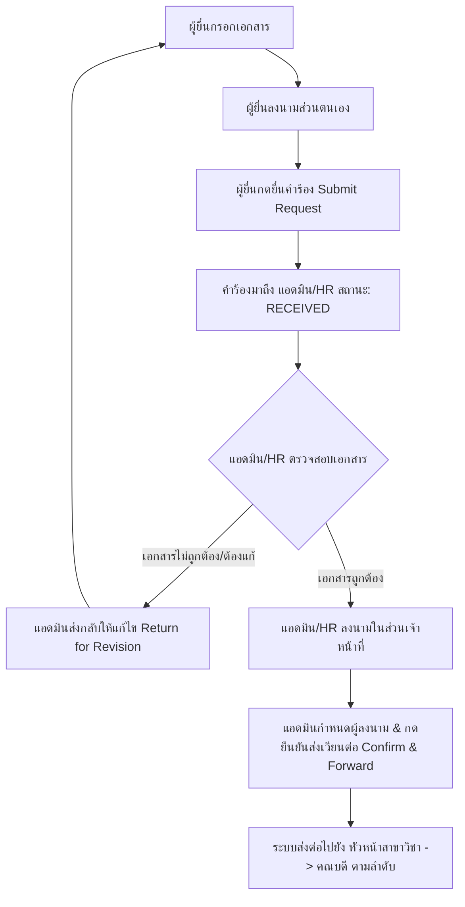

# Project Plan: Admin Signature Verification & Workflow Gate (ระบบตรวจสอบและอนุมัติการเวียนลงนามโดยแอดมิน)

**File Name:** `docs/PLAN-admin-signature-gate.md`  
**Mode:** Planning Mode (`/plan`)  
**Created:** 2026-08-24  
**Trigger:** User Request regarding Admin/HR verification before advancing signature chains  

---

##  Goal & Business Objective

สร้างกลไก **"Admin Verification Gate"** เพื่อควบคุมการเวียนลงนามเอกสาร:
1. **ผู้ยื่นคำร้อง (Applicant):** ลงนามเฉพาะในส่วนของผู้ยื่นคำร้อง และต้อง **กดยื่นคำร้อง (Submit Request)** เข้ามาในระบบก่อนเท่านั้น
2. **แอดมิน / นักทรัพยากรบุคคล (Admin / HR Gatekeeper):** เมื่อได้รับคำร้องแล้ว จะเข้ามา **ตรวจสอบความถูกต้องของเอกสารและไฟล์แนบทั้งหมดก่อน**
3. **การลงนามและการส่งต่อ (Staff Signature & Sequential Forwarding):** 
   - แอดมิน/นักทรัพยากรบุคคลลงนามในส่วนของเจ้าหน้าที่
   - แอดมินเป็นผู้ตรวจสอบและ **กดยืนยันการส่งเวียนลงนาม (Confirm & Forward)** ไปยังผู้ลงนามในลำดับถัดไป (เช่น หัวหน้าสาขาวิชา, คณบดี) ป้องกันเอกสารที่มีข้อผิดพลาดหลุดไปยังผู้บริหาร

---

##  Task Breakdown & Architecture

---

### Phase 1: Applicant Signature Isolation & Submission Check
- **วัตถุประสงค์:** ผู้ยื่นคำร้องลงนามได้เฉพาะส่วนของตนเอง (`slotKey == 'applicant'`) และไม่สามารถส่งเวียนต่อถึงผู้บริหารภายนอกได้โดยตรงในขณะที่ยังเป็นแบบร่าง (Draft)
- **การเปลี่ยนแปลง:**
  1. ในหน้าแบบฟอร์มเอกสารของผู้ยื่น: Signature Panel จะแสดงเฉพาะการลงนามของผู้ยื่น (Applicant Self-Sign)
  2. การเวียนลงนามลำดับถัดไป (Staff, Head, Dean) จะถูกระงับ (Hold) ไว้จนกว่าคำร้องจะถูกยื่น (`Submit Request`) และผ่านการตรวจสอบจากแอดมิน
  3. บังคับตรวจสอบใน `submitRequest` ว่าผู้ยื่นได้ลงนามครบทุกเอกสารที่จำเป็นก่อนส่งคำร้อง

---

### Phase 2: Admin / HR Review & Verification Gate
- **วัตถุประสงค์:** แอดมิน/นักทรัพยากรบุคคลเป็นผู้ตรวจสอบและควบคุมการส่งต่อเอกสาร
- **การเปลี่ยนแปลง:**
  1. ในหน้าจัดการคำร้องของแอดมิน (`/admin/academic/request/{id}` และ `/admin/position/request/{id}`):
     - เพิ่มกล่องสรุปสถานะการลงนามของเอกสารทุกฉบับ (Document Signature Checklist)
     - แสดงปุ่ม **"ตรวจสอบเอกสาร & ลงนามส่วนเจ้าหน้าที่"**
  2. เมื่อแอดมินลงนามในส่วนของเจ้าหน้าที่แล้ว:
     - แสดงแถบเลือกผู้ลงนามระดับผู้บริหาร (เช่น หัวหน้าสาขาวิชา, คณบดี) พร้อมปุ่ม **"ยืนยันและส่งเวียนลงนามต่อ (Confirm & Forward for Signatures)"**
  3. หากพบข้อผิดพลาด:
     - แอดมินสามารถกดปุ่ม **"ส่งกลับให้แก้ไข (Return for Revision)"** พร้อมระบุเหตุผล ระบบจะส่งแจ้งเตือนและปลดล็อกเอกสารให้ผู้ยื่นแก้ไขและลงนามใหม่ทันที

---

### Phase 3: Workflow Advancement Logic & Chain Control
- **วัตถุประสงค์:** ควบคุมการเปลี่ยนสถานะของ Step ใน `SignatureWorkflowService`
- **การเปลี่ยนแปลง:**
  1. เพิ่มฟังก์ชัน `forwardToNextSigners(Long envelopeId, List<SignerAssignment> assignments, UserDtls adminUser, ActorContext actor)` ใน `SignatureWorkflowService`
  2. ปรับปรุง `activateNextStep` ให้ไม่ปล่อย Step ไปยังภายนอกอัตโนมัติหากยังไม่ผ่านการตรวจสอบและยืนยันจากแอดมิน
  3. บันทึกประวัติ Audit Log ทุกขั้นตอนการยืนยันและการส่งต่อเพื่อความโปร่งใสตาม พ.ร.บ. คอมพิวเตอร์และมาตรฐาน e-Sign

---

### Phase 4: UI / UX Enhancements
- **วัตถุประสงค์:** หน้าจอใช้งานง่าย ชัดเจน และไม่สับสน
- **การเปลี่ยนแปลง:**
  1. **หน้าผู้ยื่นคำร้อง (`user/academic/detail.html`, `user/position/detail.html`):**
     - แสดงสถานะชัดเจนว่า *"ลงนามโดยผู้ยื่นเรียบร้อยแล้ว — รอเจ้าหน้าที่ตรวจสอบคำร้อง"*
  2. **หน้าแอดมิน (`admin/academic/detail.html`, `admin/position/detail.html`):**
     - แสดง Action Bar ชัดเจนสำหรับ: ตรวจสอบความถูกต้อง -> เซ็นส่วนเจ้าหน้าที่ -> เลือกผู้บริหาร -> กดยืนยันส่งต่อ
  3. **หน้ากล่องลงนาม (`esign/inbox.html`):**
     - แสดงป้ายกำกับชัดเจนสำหรับเอกสารที่กำลังรอการยืนยันจากแอดมิน

---

### Phase 5: Testing & Verification Plan
1. **Unit & Workflow Tests:**
   - ทดสอบการยื่นคำร้องของผู้ยื่นที่ต้องลงนามครบก่อน
   - ทดสอบ Admin Gate: เอกสารไม่ไหลไปหาหัวหน้าสาขา/คณบดีจนกว่าแอดมินจะกดยืนยัน
   - ทดสอบ Flow การส่งกลับแก้ไข (Return for Revision) และการลงนามซ้ำ
2. **Regression Testing:**
   - รันชุดทดสอบทั้งหมด `./mvnw test` (763+ tests) เพื่อยืนยันว่าไม่มีผลกระทบต่อระบบเดิม

---

##  Next Steps
- ตรวจสอบและให้ความเห็นชอบแผนงาน
- แจ้งเพื่อเริ่มดำเนินการขั้นตอน Implementation
