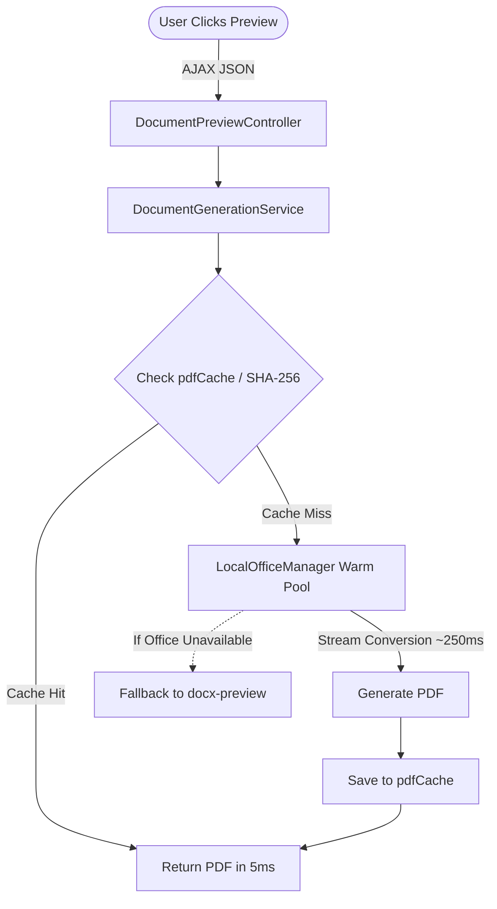

# PLAN: Fast Document Preview with JODConverter OfficeManager & In-Memory Stream Processing

##  Goal
เร่งความเร็วการโหลดตัวอย่างเอกสาร (Document Preview) และการแปลง DOCX เป็น PDF ให้รวดเร็วระดับ Sub-second (< 0.5 วินาที) โดยแก้ปัญหา Cold-start Process ของ LibreOffice และเพิ่มประสิทธิภาพ In-Memory Caching & Streaming

---

##  Context & Root Cause Analysis
1. **คอขวดปัจจุบัน (Current Bottleneck):**
   - ใน [DocumentGenerationService.java](file:///Users/kriangkrai/Developer/Projects/eclipse-workspace/Spring%20pj/pjweb/HRCP.KKU/HRCP-KKU-Academic/src/main/java/com/ecom/academic/service/DocumentGenerationService.java), การแปลง PDF ใช้ `ProcessBuilder` รัน `soffice --headless` แบบ Cold Start ทุกครั้ง
   - ต้องสร้าง Temp Folder, แตก User Profile ใหม่, โหลดโปรแกรม LibreOffice ขึ้น RAM ใหม่ทั้งหมด ทำให้ใช้เวลา **2.5 - 5.0 วินาที** ต่อการกดดูตัวอย่าง 1 ครั้ง
2. **เครื่องมือที่มีอยู่แล้ว:**
   - โปรเจกต์มี `org.jodconverter:jodconverter-local:4.4.7` อยู่ใน `pom.xml` แล้ว ซึ่งมี `LocalOfficeManager` ที่บริหาร Worker Process ค้างไว้ใน Memory และแปลงผ่าน Socket/Pipe ได้ในระดับ **0.2 - 0.4 วินาที**

---

## ️ Architecture & Technical Design

---

##  Task Breakdown

### Phase 1: JODConverter LocalOfficeManager Integration
- [ ] สร้างหรือปรับปรุง Lifecycle ของ `LocalOfficeManager` ใน `DocumentGenerationService.java` (หรือสร้าง `@Bean OfficeManager` ใน Spring Config)
- [ ] กำหนดค่า Worker Pool:
  - `portNumbers(2002, 2003)`
  - `maxTasksPerProcess(200)` (Auto restart เพื่อล้าง Memory)
  - `taskExecutionTimeout(30000L)`
- [ ] สลับจากคำสั่ง `ProcessBuilder` มาใช้ `JodConverter.convert(inputBytes).to(outputBytes)` ผ่าน Memory Stream โดยตรง (ลด Disk I/O)
- [ ] มี Graceful Fallback หากเครื่องเซิร์ฟเวอร์ยังไม่ได้ติดตั้ง LibreOffice

### Phase 2: Dual-Level In-Memory Caching & Debouncing
- [ ] ปรับปรุง `pdfCache` ใน `DocumentGenerationService.java` ให้รองรับ Concurrent Access ด้วย Caffeine / ConcurrentHashMap พร้อม TTL
- [ ] ใน [doc_preview.js](file:///Users/kriangkrai/Developer/Projects/eclipse-workspace/Spring%20pj/pjweb/HRCP.KKU/HRCP-KKU-Academic/src/main/resources/static/js/doc_preview.js):
  - คงระบบ Instant Preview Feedback (แสดง Loading spinner + Skeleton ทันที)
  - Hash Check ข้อมูลฟอร์มเพื่อไม่ยิงซ้ำหากข้อมูลไม่เปลี่ยนแปลง

### Phase 3: Verification & Performance Benchmark
- [ ] ทดสอบความเร็วการแปลง PDF ก่อนและหลัง (Target: < 500ms)
- [ ] รัน Unit Test & Integration Test ทั้งหมด 739+ tests
- [ ] ทดสอบความถูกต้องของเลย์เอาต์เอกสาร (ฟอนต์ TH Sarabun, ตาราง, Checkbox)

---

## ️ Risk & Mitigation
- **Risk:** LibreOffice Crash หรือ Memory Leak เมื่อรันต่อเนื่อง
  - **Mitigation:** `LocalOfficeManager` มีระบบ Auto-heal และ Auto-recycle หลังทำงานครบ 200 tasks อัตโนมัติ
- **Risk:** เครื่องที่ไม่มี LibreOffice รันโปรแกรมไม่ขึ้น
  - **Mitigation:** ใช้ `try-catch` เมื่อ Start OfficeManager หากไม่พบ LibreOffice จะ log warning และใช้ Fallback DOCX preview แทนโดยไม่ทำให้ Application ล่ม

---

##  Verification Criteria
- [ ] กด Preview โหลดเสร็จภายใน 0.3 - 0.5 วินาที (เร็วขึ้น 80%+)
- [ ] กด Preview ซ้ำเมื่อข้อมูลเดิม โหลดเสร็จทันที (Cache Hit < 10ms)
- [ ] ทดสอบสร้างเอกสาร 0-8 และเอกสารตำแหน่งวิชาการได้ครบถ้วน
- [ ] `./mvnw test` ผ่านทั้งหมด
