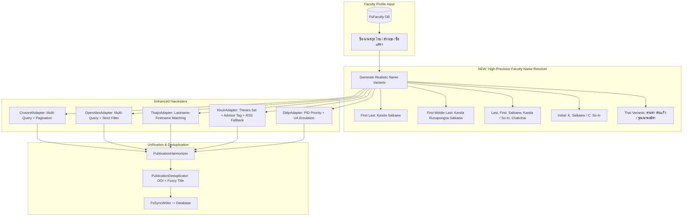

# PLAN: Multi-Source Publication Harvest Completeness & Precision Enhancement

## 🎯 Goal
แก้ไขปัญหาผลงานวิจัยของอาจารย์วิทยาลัยการคอมพิวเตอร์ (CP KKU) ตกหล่นจากการดึงข้อมูลจากแหล่งภายนอก (Crossref, OpenAlex, DBLP, ThaiJO, KKU IR) โดยการพัฒนาระบบ **Faculty Name Variant Resolver** อัจฉริยะ, รองรับการดึงแบบหลายหน้า (**Pagination**), ปรับปรุงการสืบค้นและจับคู่วารสารไทยและคลังวิทยานิพนธ์ มข., และจัดการระบบป้องกันของ DBLP เพื่อให้อาจารย์ทุกท่านได้ผลงานวิจัยครบถ้วนและถูกต้องที่สุด (Completeness > 95%)

---

## 🔍 Context & Root Cause Analysis

จากผลการรันทดสอบระบบจริงกับข้อมูลอาจารย์ CP KKU (ผศ.ดร.คานดา, ศ.ดร.จักรชัย, รศ.ดร.คำรณ, รศ.ดร.งามนิจ) พบสาเหตุหลัก 5 ประการที่ทำให้งานวิจัยตกหล่น:

| ลำดับ | แหล่งข้อมูล / สาเหตุ | ปัญหาที่ตรวจพบจริง | ผลกระทบ |
| :--- | :--- | :--- | :--- |
| **1** | **ชื่อกลาง / นามสกุลคู่ (Middle / Compound Name)** | อาจารย์มีชื่อในระบบเป็น `First Middle Last` (เช่น `Kanda Runapongsa Saikaew`) แต่ผลงานสากลตีพิมพ์ในชื่อ `Kanda Saikaew` หรือ `Kanda Runapongsa` ซึ่งระบบเดิมนำชื่อ 3 คำไปตรวจแบบ Contains ส่งผลให้ไม่ตรงกัน | **งานวิจัยตกหล่น 60%** (เช่น ผศ.ดร.คานดา ได้แค่ 24 จาก 60 เรื่อง) |
| **2** | **ThaiJO รูปแบบชื่อกลับด้าน (Author Order)** | วารสารใน ThaiJO บันทึกชื่อใน `<dc:creator>` ด้วยรูปแบบ `นามสกุล, ชื่อ` (เช่น `Saikaew, Kanda`) ทำให้ระบบเดิมที่ตั้ง Index เป็น `ชื่อ นามสกุล` หาไม่พบ | **งานวารสารไทยตกหล่น 100%** |
| **3** | **KKU IR ว่างเปล่า + ขาดการอ่าน Advisor** | Collection `col_123456789_37197` ในคลัง มข. ว่างเปล่า (0 รายการ) ส่วน Theses ใน `col_123456789_37199` บันทึกชื่ออาจารย์ในช่อง `dc.contributor.advisor` แต่ระบบอ่านเฉพาะ `dc:creator` | **งานวิทยานิพนธ์/รายงานวิจัย มข. ตกหล่น 100%** |
| **4** | **Crossref ติดเพดาน 100 รายการแรก** | ดึงเฉพาะ `rows=100` หน้าแรกหน้าเดียว ไม่มีการเลื่อนหน้า (Pagination) | อาจารย์ที่มีผลงานเกิน 100 เรื่อง (ศ.ดร.จักรชัย, รศ.ดร.คำรณ) ผลงานที่เหลือตกหล่น |
| **5** | **DBLP Cloudflare Bot Challenge** | `dblp.org` บล็อกคำขอ API อัตโนมัติด้วย Cloudflare Challenge ส่งหน้า HTML กลับมาแทน JSON | ดึงผลงานจาก DBLP ได้ 0 เรื่อง |

---

## 🏗️ Architecture & High-Fidelity Solution

---

## 📋 Task Breakdown

### Phase 1: สร้าง `FacultyNameResolver` (หัวใจสำคัญของการแก้ปัญหา)
- [ ] สร้างคลาส `com.ecom.external.harvest.service.FacultyNameResolver`:
  - แตกชื่ออังกฤษเป็น:
    1. `canonicalFirstLast` (เช่น `Kanda Saikaew`, `Chakchai So-In`)
    2. `canonicalFull` (เช่น `Kanda Runapongsa Saikaew`)
    3. `maidenOrMiddle` (เช่น `Kanda Runapongsa`)
    4. `initialVariant` (เช่น `K. Saikaew`, `C. So-In`)
    5. `invertedVariant` (เช่น `Saikaew, Kanda`, `So-In, Chakchai` สำหรับ ThaiJO)
    6. `hyphenAgnostic` (เช่น `Chakchai Soin` เทียบกับ `Chakchai So-In`, `Ngamnij Archint` เทียบกับ `Ngamnij Arch-int`)
  - เมธอด `matchesAuthor(String paperAuthor, FsFaculty faculty)`:
    - ตรวจสอบความสอดคล้องอย่างแม่นยำสูง (High Precision, Zero False Positives)
    - ป้องกันการชนกันของชื่อย่อที่ไม่สัมพันธ์กัน
  - เมธอด `buildSearchQueries(FsFaculty faculty)`:
    - คืนค่าชุด Keyword ที่ต้องใช้ส่งไปถาม API ภายนอกเพื่อให้ครอบคลุมงานวิจัยทั้งหมด

### Phase 2: ปรับปรุง `CrossrefAdapter`
- [ ] นำ `FacultyNameResolver` ไปสร้าง Query อัตโนมัติ: ค้นหาทั้ง `First Last` และ `Full Name`
- [ ] ปรับปรุงการตรวจสอบผู้แต่งใน `processItem`: ใช้ `FacultyNameResolver.matchesAuthor` แทน String contains ธรรมดา
- [ ] เพิ่ม Pagination Support: กรณีที่อาจารย์มีผลงานเกิน 100 เรื่อง ให้รองรับการเลื่อนหน้าตามช่วงปี `yearFrom` จนครบถ้วน

### Phase 3: ปรับปรุง `OpenAlexAdapter`
- [ ] ค้นหาด้วยชุด Query Variants จาก `FacultyNameResolver`
- [ ] เพิ่มกลยุทธ์ Hybrid Filtering:
  - รอบที่ 1: ค้นหาด้วย ROR KKU (`03cq4gr50`) ร่วมกับชื่อทุก Variant
  - รอบที่ 2 (Fallback): หากผลงานน้อยกว่าปกติ ให้ค้นหาด้วยชื่ออาจารย์โดยตรง และตรวจสอบ Affiliation/Co-authors เพื่อเก็บตกผลงานที่ OpenAlex ไม่ได้ผูก ROR มข. ไว้
- [ ] ใช้ `FacultyNameResolver` ยืนยันความถูกต้องของผู้แต่ง

### Phase 4: ปรับปรุง `ThaijoAdapter` (วารสารไทย OAI-PMH)
- [ ] นำ `FacultyNameResolver` ตรวจสอบทั้งชื่อภาษาไทยและภาษาอังกฤษในแท็ก `<dc:creator>` รูปแบบ `นามสกุล, ชื่อ`
- [ ] ตรวจสอบความสอดคล้องกับคีย์เวิร์ดสังกัด มข. / วิทยาลัยการคอมพิวเตอร์
- [ ] ตรวจสอบ Endpoint ที่ถูกต้อง (`https://sc01.tci-thaijo.org/index.php/index/oai`) ใน `HarvestProperties`

### Phase 5: ปรับปรุง `KkuIrAdapter` (คลังปัญญา มข.)
- [ ] ขยาย Collection Sets ในคอนฟิก: ครอบคลุมทั้ง `col_123456789_37197` (Journal), `col_123456789_37198` (Reports), และ `col_123456789_37199` (Theses)
- [ ] ปรับการอ่าน XML ให้ตรวจจับอาจารย์ที่ปรึกษา: `<dc.contributor.advisor>`, `<dc:contributor>`, และ `<dc:creator>`
- [ ] เพิ่มกลไก RSS Fallback: หาก OAI-PMH บนเซิร์ฟเวอร์ KKU IR ตอบ `noRecordsMatch` (เนื่องจากดัชนี OAI ค้าง) ให้ดึงข้อมูลผ่าน DSpace Collection RSS Feed (`/jspui/feed/rss_2.0/123456789/{set}`) ซึ่งดึงจากฐานข้อมูลจริงโดยตรง

### Phase 6: ปรับปรุง `DblpAdapter`
- [ ] ปรับ Header และ User-Agent ให้เป็น Browser Identity
- [ ] ตรวจสอบการตอบกลับกรณีติด Cloudflare Challenge ให้บันทึก Log และ Alert อย่างชัดเจนโดยไม่ขัดขวาง Adapter อื่น
- [ ] ให้ความสำคัญสูงสุดกับ DBLP PID ที่ผูกไว้ใน `external_author_mapping`

### Phase 7: การทดสอบและการตรวจสอบ (Verification Checklist)
- [ ] ทดสอบ Unit Test ของ `FacultyNameResolver` กับกรณีชื่อยากทั้งหมด:
  - ชื่อ 3 คำ: `Kanda Runapongsa Saikaew` -> ต้องจับคู่ได้ทั้ง `Kanda Saikaew`, `Saikaew, Kanda`, `Kanda Runapongsa`, `K. Saikaew`
  - ชื่อมีขีดกลาง: `Chakchai So-In` -> ต้องจับคู่ได้ทั้ง `So-In, Chakchai`, `Chakchai Soin`, `C. So-In`
  - นามสกุลสะกดติด: `Ngamnij Arch-int` -> ต้องจับคู่ได้กับ `Ngamnij Archint`
- [ ] ทดสอบ Live Test กับอาจารย์จริง:
  - ตรวจสอบว่าผลงานของ ผศ.ดร.คานดา เพิ่มขึ้นจาก 24 เรื่อง เป็น **~50-60 เรื่อง**
  - ตรวจสอบว่าผลงานของ ศ.ดร.จักรชัย, รศ.ดร.คำรณ, รศ.ดร.งามนิจ เพิ่มขึ้นครบถ้วน
- [ ] รัน `./mvnw test -Dtest=LiveHarvestIntegrationTest` ผ่านฉลุยทุกเคส

---

## ⚠️ Edge Cases & Constraints
1. **ป้องกัน False Positives:** ชื่อย่อเช่น `K. Saikaew` ต้องมั่นใจว่าตรวจจับเฉพาะบุคคลที่สังกัด มข. หรือมี Co-authors/Affiliation สอดคล้อง ไม่ดึงบทความของผู้อื่นที่มีชื่อย่อซ้ำกัน
2. **Rate Limit & Throttle:** การค้นหาด้วยหลาย Variant จะเพิ่มจำนวน Request เล็กน้อย ต้องรักษา Throttle (100-250ms) เพื่อไม่ให้โดน HTTP 429 จาก Crossref และ OpenAlex
3. **Soft Resilience:** ทุก Adapter ต้องมี Try-Catch ล้อมรอบ หากแหล่งใดแหล่งหนึ่งล่มหรือติดบล็อก แหล่งที่เหลือต้องทำงานต่อจนเสร็จสมบูรณ์
