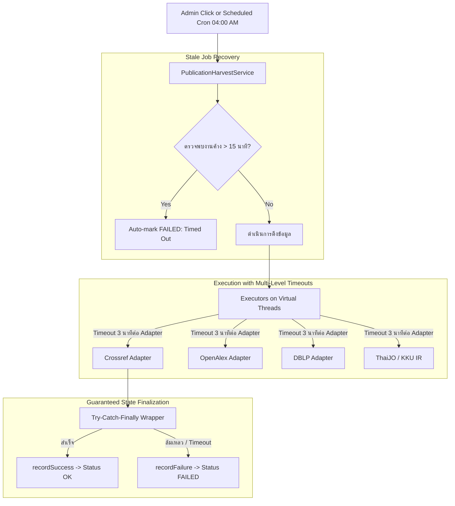

# PLAN: Publication Harvest Timeout Safeguard & Zombie State Recovery

## 🎯 Goal
แก้ไขปัญหาการดึงผลงานวิจัยภายนอก (โดยเฉพาะ Crossref) ที่ค้างสถานะ **"กำลังดึง" (RUNNING)** ไม่สิ้นสุดจนถึงตีสี่ โดยการเพิ่มระบบ **Multi-Level Timeout**, ปรับปรุงการจัดการ State ในฐานข้อมูลเพื่อกู้คืนสถานะค้างอัตโนมัติ (**Zombie State Self-Healing**), แก้ไขสาเหตุที่ดึงไม่สำเร็จ (URL Double-encoding, HTTP 429 Rate Limiting, Uncaught Exceptions), และเพิ่มปุ่มรีเซ็ตงานค้างบนหน้า Admin

---

## 🔍 Context & Root Cause Analysis

### 1. ทำไมสถานะถึงค้าง "กำลังดึง" ข้ามวันข้ามคืน?
1. **สถานะในฐานข้อมูลหลุดค้าง (Zombie DB State):**
   - เมื่อเริ่มดึง `writer.markRunning("crossref")` จะบันทึก `lastStatus = 'RUNNING'` ลงตาราง `fs_sync_state` ด้วย `REQUIRES_NEW` ทันที
   - หากเกิด Error ระหว่าง `writeInBatches` (เช่น DB Lock / Exception) หรือระบบถูก Restart/Deploy บันทึกในฐานข้อมูลจะยังคงเป็น `RUNNING` ถาวร
   - หน้า `/admin/external-sync` อ่านค่าจาก `fs_sync_state` ตรง ๆ เมื่อพบ `RUNNING` จึงแสดง Badge **"กำลังดึง"** พร้อม Spinner ตลอดเวลา แม้โปรเซสใน Memory จะตายไปแล้ว
2. **ไม่มี Global Timeout & Task Timeout ใน `PublicationHarvestService`:**
   - `executor.invokeAll(tasks)` ไม่มี Timeout กำหนด หากมี Adapter ใดค้างรอ Network Socket หรือรอคิว DB Thread จะบล็อกรอไปเรื่อย ๆ
   - ตัวแปร `running.compareAndSet(false, true)` หากไม่ถูกปลดในกรณี Exception หลุด จะทำให้คำขอดึงรอบใหม่ถูกปฏิเสธว่า "ระบบกำลังดึงข้อมูลอยู่แล้ว"
3. **ไม่มี Stale Detection:**
   - ขาดระบบตรวจจับว่างานที่สถานะ `RUNNING` วิ่งมานานเกิน 10-15 นาทีแล้วหรือไม่

### 2. ทำไม Crossref ถึงดึงไม่สำเร็จ?
1. **URL Double Encoding ใน `CrossrefAdapter`:**
   - มีการใช้ `URLEncoder.encode(name)` ก่อนนำไปต่อ String ใน `restClient.get().uri(url)` ซึ่ง Spring `DefaultUriBuilderFactory` จะ encode เครื่องหมาย `%` ซ้ำอีกรอบ ทำให้ API มองไม่เห็นชื่อที่ถูกต้อง
2. **Crossref Rate Limiting (HTTP 429):**
   - Crossref API มี Rate Limit 1 คำขอ/วินาที แต่ปัจจุบันคอนฟิก `throttleMs = 100ms` (10 คำขอ/วินาที) ทำให้เมื่อยิงอาจารย์ 40-50 คนติด ๆ กัน อาจถูกบล็อก 429 หรือ 504 Gateway Timeout
3. **Uncaught Exceptions ไม่ถูกส่งเข้า `recordFailure`:**
   - ใน `harvestAll()` และ `harvestSource()` โค้ดส่วน `writeInBatches()` อยู่นอกบล็อก Try-Catch ของผลลัพธ์ราย Adapter หากมีข้อผิดพลาดตอนเขียนฐานข้อมูล จะไม่มีการเรียก `writer.recordFailure()` ทำให้สถานะค้างที่ `RUNNING`

---

## 🏗️ Architecture & Timeout Flow

---

## 📋 Task Breakdown

### Phase 1: Robust Timeout Infrastructure
- [ ] **Task 1.1: Per-Adapter Timeout ใน `PublicationHarvestService`:**
  - กำหนด Timeout สูงสุดต่อ Adapter (Default 3-5 นาที) ผ่าน `Future.get(props.getAdapterTimeoutSeconds(), TimeUnit.SECONDS)` หรือ `CompletableFuture.orTimeout()`
  - หาก Adapter ใดหมดเวลา ให้บันทึกสถานะ `FAILED: Timed out after 3 minutes` โดยไม่กระทบ Adapter อื่น
- [ ] **Task 1.2: Global Harvest Timeout:**
  - กำหนดเวลา Timeout รวมของทั้งกระบวนการ (Default 15 นาที) เพื่อไม่ให้กระทบงาน Scheduled รอบถัดไป
- [ ] **Task 1.3: Adapter HTTP Timeouts & Loop Deadlines:**
  - เพิ่มการตรวจสอบ Deadline ภายในลูปวนอาจารย์ของ `CrossrefAdapter` และ `DblpAdapter` (หากเกิน 2 นาทีให้ break ออกและส่งผลงานเท่าที่ดึงได้)

### Phase 2: Stale / Zombie State Self-Healing
- [ ] **Task 2.1: Automatic Stale Recovery on Load & Startup:**
  - ใน `FsSyncService.currentState()`: ตรวจสอบหากงานใดมีสถานะ `RUNNING` แต่ `lastRunAt` ผ่านไปเกิน 15 นาที หรือ `harvestService.isRunning() == false` ให้เปลี่ยนสถานะในฐานข้อมูลเป็น `FAILED` อัตโนมัติ (พร้อมข้อความ "งานค้างเกินกำหนด ระบบรีเซ็ตให้อัตโนมัติ")
- [ ] **Task 2.2: Admin UI "รีเซ็ตสถานะงานค้าง" (Manual Reset Button):**
  - เพิ่มปุ่ม `POST /admin/external-sync/reset-stale-jobs` เพื่อให้แอดมินสามารถกดปลดล็อกสถานะค้างได้ทันทีหากมีปัญหาฉุกเฉิน

### Phase 3: Fix Crossref & Adapter Failure Root Causes
- [ ] **Task 3.1: Fix URL Encoding in `CrossrefAdapter`:**
  - ปรับการเรียก `RestClient` ให้ใช้ URI Builder หรือส่งพารามิเตอร์แบบ Clean เพื่อป้องกัน Double URL Encoding
- [ ] **Task 3.2: Adjust Crossref Throttling & HTTP 429 Resilience:**
  - ปรับ `throttleMs` เป็น 500ms เป็นค่าเริ่มต้น และเพิ่ม Retry หรือ Exponential Backoff เมื่อเจอ 429
- [ ] **Task 3.3: Bulletproof Exception Handling in `writeInBatches`:**
  - หุ้มขั้นตอน `writeInBatches` ด้วย Try-Catch รายละเอียดสูง หากเกิด Database Constraint หรือ Timeout ให้เรียก `writer.recordFailure(syncType, e)` เสมอ ไม่ให้สถานะหลุดลอย

### Phase 4: Verification & Automated Tests
- [ ] เขียน Unit Test จำลอง Adapter ที่หลับ (Thread.sleep) เกิน Timeout เพื่อพิสูจน์ว่าถูกตัดจบและอัปเดตเป็น `FAILED` อย่างถูกต้อง
- [ ] เขียน Unit Test ตรวจสอบ Stale Recovery ว่างานที่ `lastRunAt` เก่าจะถูกเคลียร์สถานะอัตโนมัติ
- [ ] รัน `./mvnw test` ยืนยันว่าชุดทดสอบทั้งหมดผ่าน 100%

---

## 🛡️ Risk & Mitigation
| ความเสี่ยง (Risk) | ผลกระทบ (Impact) | มาตรการรับมือ (Mitigation) |
|---|---|---|
| **API ภายนอกช้าหรือล่ม** | กระบวนการค้างข้ามคืน | ตัดจบด้วย Per-Adapter Timeout (3 นาที) และบันทึกผลเท่าที่ได้ |
| **เซิร์ฟเวอร์ Restart ระหว่างดึง** | สถานะค้างที่ `RUNNING` ตลอดกาล | Stale Self-Healing จะแก้สถานะเป็น `FAILED` ทันทีที่ระบบเปิดขึ้นมาใหม่หรือมีคนเข้าหน้าเว็บ |
| **ข้อมูลหายถ้าตัด Timeout** | ผลงานอาจารย์คนหลัง ๆ ตกหล่น | ข้อมูลที่ดึงสำเร็จก่อนหมดเวลาจะถูกบันทึกลงฐานข้อมูล ไม่ทิ้งทั้งหมด |

---

## ✅ Verification Criteria
- [ ] ไม่มีการค้างสถานะ "กำลังดึง" เกิน 5 นาทีในทุกกรณี
- [ ] สถานะของ Crossref ในหน้าเว็บแสดงผลลัพธ์ที่ถูกต้อง (ไม่ใช่ค้าง Spinner)
- [ ] มีปุ่มปลดล็อก/รีเซ็ตงานค้างบนหน้า Admin
- [ ] ชุดทดสอบ `PublicationHarvestServiceTest` และ `CrossrefAdapterTest` ผ่านทั้งหมด
