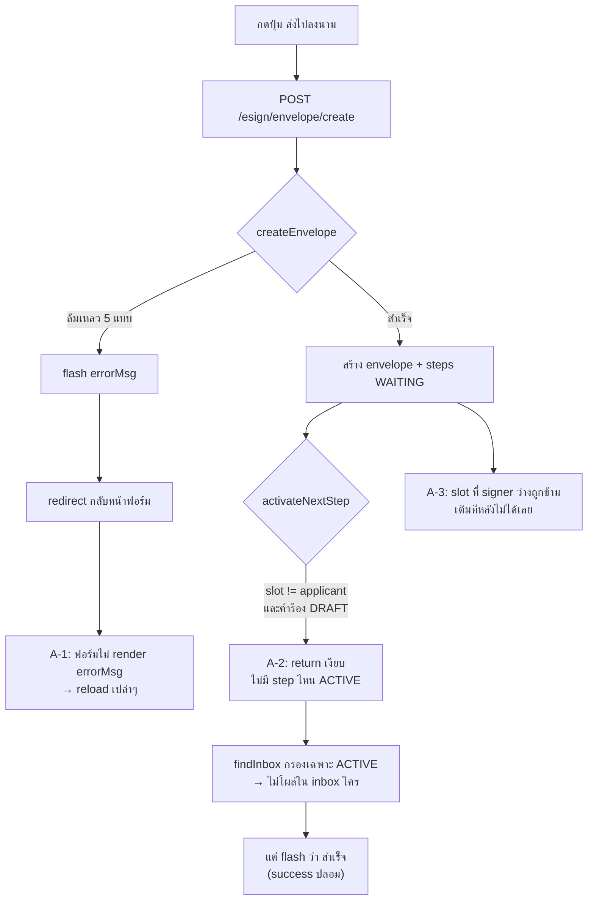

# Project Plan: แก้ปุ่ม "ส่งไปลงนาม" ไม่ทำงาน + สกัดแจ้งเตือนตอนเทส

**File Name:** `HRCP-KKU-Academic/docs/PLAN-signing-forward-fix.md`
**Mode:** Planning Mode (`/plan`) → **ดำเนินการแล้ว 2026-08-24**
**Created:** 2026-08-24
**Trigger:** กดส่งไปลงนามแล้วไม่ไปไหน ไม่ขึ้นให้เซ็น + ต้องไม่ส่งแจ้งเตือนจริงตอนเทสด้วย `user@user.com` / `admin@admin.com`
**สืบเนื่องจาก:** [`PLAN-admin-signature-gate.md`](PLAN-admin-signature-gate.md) (แผนเดียวกันวันนี้ — ทำไปครึ่งเดียว)

---

##  Context & Goal

มีงานค้างยังไม่ commit **34 ไฟล์** ซึ่งเริ่มทำฟีเจอร์ **"Admin Signature Gate"** แต่ทำไปแค่ครึ่งเดียว:

| ส่วน | สถานะ |
|---|---|
| **"หน่วง"** — `activateNextStep()` ไม่ปล่อย step ที่ไม่ใช่ `applicant` ถ้าคำร้องยัง `DRAFT` | [YES] ทำแล้ว |
| **"ปลดล็อก/ส่งต่อ"** — `forwardToNextSigners(...)` ที่ Phase 3 ของแผนเดิมระบุไว้ | [NO] **ไม่มีในโค้ดเลย** (grep เจอ 0 ที่) |
| ปุ่ม "ยืนยันและส่งเวียนลงนามต่อ" ใน Phase 2 | [NO] **ยังไม่มีในเทมเพลต** |

ผลคือกดปุ่มแล้วเอกสารถูกล็อก แต่ไม่มีใครได้รับให้เซ็น และหน้าจอไม่บอกอะไรเลย — ตรงกับอาการ *"หน้า reload แต่สถานะเหมือนเดิม"*

**เป้าหมาย:** ส่งเวียนลงนามได้ครบวงจร ผู้ยื่น → เจ้าหน้าที่ → ผู้บริหาร, ทุก error มองเห็นได้, และเทสได้โดยไม่รบกวนคนจริง

---

##  Part A — ปุ่ม "ส่งไปลงนาม" ไม่ทำงาน

### สาเหตุที่ยืนยันแล้ว (4 ข้อ ทับซ้อนกัน)



#### A-1 · ทุกข้อความ feedback หายหมด

`SigningController.createEnvelope` (`SigningController.java:342-346`) flash `succMsg`/`errorMsg` แล้ว redirect กลับหน้าฟอร์มเอกสาร — แต่ `document_0_form.html`, `document_1_form.html`, `doc_fragments/0.html`, `1.html` และ layout `base_academic.html` **ไม่มีที่ render ทั้งคู่เลย**

ทำให้ error 5 แบบนี้มองไม่เห็น (`SignatureWorkflowService.java:347-405`):

- `"ยังไม่มีข้อมูลในเอกสาร — กรุณาบันทึกเอกสารก่อนส่งไปลงนาม"` ← กรณีที่น่าจะเจอบ่อยสุด
- `"กรุณาเลือกผู้ลงนามอย่างน้อยหนึ่งคน"`
- `"เอกสารฉบับนี้อยู่ระหว่างการเวียนลงนามหรือลงนามครบแล้ว"`
- `"เอกสารฉบับนี้ไม่มีจุดลงนาม จึงส่งไปลงนามไม่ได้"`
- `"ไม่พบบัญชีผู้ลงนามสำหรับ ..."`

ซ้ำร้าย `data-confirm` อยู่ที่ `<button>` (`_signature_panel.html:331-336`) แต่ handler ใน `csp_fallbacks.js:141-150` อ่านจาก `form.dataset.confirm` → **กล่องยืนยันไม่เด้ง** เพิ่มความรู้สึก "กดแล้วไม่มีอะไรเกิด"

#### A-2 · DRAFT gate หน่วง step ไว้ แต่ไม่มีทางปล่อย

`SignatureWorkflowService.java:691-699`:

```java
// Admin Gate: hold non-applicant steps while the request is DRAFT
if (!"applicant".equalsIgnoreCase(step.getSlotKey()) && snapshotProvider != null
        && snapshotProvider.isDraftRequest(envelope.getModule(), envelope.getRequestId())) {
    log.info("Holding signature step {} ...");
    return;   // ← เงียบสนิท ไม่มีใครรู้
}
```

`SignatureStepRepository.findInbox` กรองเฉพาะ `ACTIVE` → step ที่ค้าง `WAITING` **ไม่โผล่ใน inbox ใครเลย** ขณะที่ controller ยัง flash ว่า *"ส่งเอกสารไปลงนามเรียบร้อยแล้ว ระบบได้แจ้งเตือนผู้ลงนามคนแรก"*

ทางปล่อยมีทางเดียวคือ `advanceHeldStepsForRequest` ซึ่งเรียกจากตอนผู้ยื่นกดส่งคำร้องเท่านั้น (`AcademicApplicantController.java:643-649`) — และยัง `catch (Exception e) { /* non-fatal */ }` กลืน error ทิ้ง

#### A-3 · slot ที่ไม่ได้เลือกตอนสร้าง เติมทีหลังไม่ได้เลย ← ต้นเหตุ "ไม่ขึ้นให้เซ็น"

`createEnvelope` ข้าม slot ที่ signer ว่าง (`:380-382`) และ**ไม่มี API ใดเพิ่ม step เข้า envelope เดิมได้**

ฝั่งผู้ยื่น post `signerUserIds` เป็นค่าว่างให้ทุก slot ที่ไม่ใช่ตัวเอง (`_signature_panel.html:312`):

```
ผู้ยื่นกดส่ง → envelope มี step เดียว (applicant)
  → ผู้ยื่นเซ็น → allSigned() = true → envelope COMPLETED
  → findBlockingEnvelopes นับ COMPLETED เป็น "ล็อก" ด้วย
  → signaturePanel.locked = true ถาวร
  → ฟอร์มเลือกผู้ลงนามไม่ render อีกเลย (th:unless="${signaturePanel.locked}")
  → แอดมินไม่มีทางส่งต่อให้ HR/หัวหน้าสาขา/คณบดี
```

ยิ่งชัดกับ **ACADEMIC doc 0** ที่ `SignatureAnchorRegistry` กำหนดไว้ **slot เดียว** คือ `applicant`

#### A-4 · ROLE_STAFF เห็นปุ่มแต่กดไม่ได้

`buildPanel` ตั้ง `isAdminViewer` ให้ทั้ง `ROLE_ADMIN` และ `ROLE_STAFF` (`:894-895`) แต่ `createEnvelope` รับแค่ `ROLE_ADMIN` (`SigningController.java:311`) แล้ว redirect ไป `module.userLink(...)` ซึ่งเป็น `/user/**` ที่ `SecurityConfig` จำกัดไว้ที่ `ROLE_USER` → เด้ง 403 พร้อม error ที่มองไม่เห็นอีก

> **ตัดออกจากรายชื่อผู้ต้องสงสัยแล้ว:** `searchable_select.js` **ไม่ใช่สาเหตุ** — `selectValue()` เขียนค่ากลับลง native `<select>` ที่ยังมี `name` อยู่ใน DOM (`this.select.value = val` + dispatch `change`) และไม่มี `preventDefault()` ที่ปุ่ม submit เลย

---

### Phase A1: ทำให้ feedback มองเห็น

- เพิ่มบล็อก alert สำหรับ `succMsg` / `errorMsg` ใน layout `templates/academic/base_academic.html` — **แก้จุดเดียวครอบทุกหน้า** ใช้รูปแบบเดียวกับที่ `esign/inbox.html:34-41` ทำอยู่แล้ว
- ย้าย `data-confirm` จาก `<button>` (บรรทัด 331) ไปที่ `<form>` (บรรทัด 196) ใน `_signature_panel.html` — ทำตามแบบฟอร์มยกเลิกที่บรรทัด 183 ซึ่งทำถูกอยู่แล้ว

### Phase A2: เพิ่ม `forwardToNextSigners` + ปุ่มส่งเวียนของแอดมิน

**ส่วนที่ `PLAN-admin-signature-gate.md` Phase 3 ระบุไว้แต่ยังไม่ได้ทำ**

ใน `SignatureWorkflowService`:

```java
@Transactional
public Result forwardToNextSigners(Long envelopeId, List<SignerAssignment> assignments,
                                   UserDtls adminUser, ActorContext actor)
```

1. เพิ่ม step ใหม่เข้า envelope เดิมสำหรับ slot ที่ยังว่าง — แยกลูปสร้าง step จาก `createEnvelope` (`:373-401`) ออกมาเป็น private helper แล้วเรียกร่วมกัน **ไม่เขียนซ้ำ**
2. ถ้า envelope เป็น `COMPLETED` อยู่ (เพราะ step ชุดแรกเซ็นครบ) ให้กลับเป็น `IN_PROGRESS` — **กุญแจที่ปลดล็อกอาการ A-3**
3. `stepOrder` ต่อจากตัวสุดท้าย เรียงตาม `stepOrder` ของ slot จาก `workflowConfigService.effectiveSlotsFor(...)`
4. เรียก `activateNextStep(...)` ปิดท้าย + `audit(...)` ด้วย event ใหม่ `FORWARDED`

ใน `SigningController` — เพิ่ม `POST /esign/envelope/{envelopeId}/forward` รับพารามิเตอร์ชุดเดียวกับ `createEnvelope` (`slotKeys`, `signerUserIds`, `dueAt`) ใช้ `mayManage(...)` ที่มีอยู่แล้ว (`:381-393`) เป็นตัวตรวจสิทธิ์

ใน `_signature_panel.html` — บล็อกใหม่ที่แสดงเมื่อ `isAdminViewer` **และ** มี envelope **และ** ยังมี slot ที่ไม่มี step: ฟอร์มเลือกผู้ลงนามที่เหลือ + ปุ่ม **"ยืนยันความถูกต้องและส่งเวียนลงนามต่อ"** (ใช้ `searchable-select` แบบเดียวกับฟอร์มสร้าง)

เพิ่ม helper ใน `SignaturePanelView`: `unfilledSlots()` / `hasUnfilledSlots()` คู่กับ `isApplicantSigned()` / `hasNonApplicantSlots()` ที่มีอยู่

### Phase A3: แสดงสถานะ "กำลังถูกหน่วง" ไม่ให้เงียบ

- แผงลงนาม: ถ้ามี step `WAITING` ที่ไม่ใช่ applicant และคำร้องยัง `DRAFT` → ป้าย *"รอผู้ยื่นกดส่งคำร้องก่อน จึงจะเวียนลงนามต่อได้"*
- แก้ข้อความ success ของ `createEnvelope` ไม่ให้โกหก — ถ้าไม่มี step ไหนได้ `ACTIVE` ให้บอกตามจริง ให้ `Result` พกสถานะนี้กลับมา
- แท็บ "เอกสารที่ฉันส่งไปลงนาม" ใน `inbox.html` แสดง step ที่ยัง `WAITING` พร้อมเหตุผล

### Phase A4: เก็บกวาดที่เหลือ

- ให้ `createEnvelope` รับ `ROLE_STAFF` ด้วย ให้ตรงกับ `isAdminViewer` ใน `buildPanel` (หรือตัด `ROLE_STAFF` ออกจาก `isAdminViewer` — ขอให้สองที่ตรงกัน)
- เปลี่ยน `catch (Exception e) { /* non-fatal */ }` รอบ `advanceHeldStepsForRequest` ทั้งสองที่ (`AcademicApplicantController.java:647`, `PositionApplicantController.java:426`) ให้ `log.error(...)` อย่างน้อย
- `PositionApplicantController.java:420` hardcode actor IP เป็น `"127.0.0.1"` → ใช้ `getClientIpAddress()` แบบฝั่ง Academic
- `sign.html:148-150`: radio `userSignatureId` มี `required` อยู่ใน `.btn-check` ที่ Bootstrap ตั้ง `clip:rect(0,0,0,0);pointer-events:none` → ถ้าผู้ใช้ไม่มีลายเซ็นที่ตั้งเป็น default เลย Chrome ปฏิเสธการ submit เงียบๆ (*"invalid form control is not focusable"*) **ปุ่ม "ยืนยันการลงนาม" ตายสนิท** → เอา `required` ออก (server ตรวจให้แล้วใน `workflow.sign(...)`) หรือบังคับ `th:checked` ตัวแรกเสมอ

---

##  Part B — สกัดแจ้งเตือนตอนเทส

### สภาพปัจจุบัน

ฟีเจอร์นี้ **มีอยู่แล้วบางส่วน** — commit `66b3045` เพิ่ม `EmailTemplateHelper.isTestEmail(String)` (`util/EmailTemplateHelper.java:33-46`) แล้วไปเรียกมือๆ ที่จุดส่งเมล แต่มีปัญหา 4 ข้อ:

| # | ปัญหา | รายละเอียด |
|---|---|---|
| 1 | **มีรูรั่ว** | `SystemAlertService.mail(...)` (`service/SystemAlertService.java:180-193`) **ไม่มีการ์ดเลย** commit นั้นไม่ได้แตะไฟล์นี้ ถ้า `admin@admin.com` เปิด `emailNotificationEnabled` ไว้ alert จาก cron จะยิง SMTP จริง |
| 2 | **กว้างเกินสั่ง** | บล็อกทั้งโดเมน `@user.com`, `@admin.com`, `@test.com`, `@example.com`, `@invalid`, `@localhost` และ `isTestEmail(null)` คืน `true` ทำให้ "ไม่มีอีเมล" กับ "บัญชีเทส" แยกกันไม่ออก |
| 3 | **กรองตามผู้รับอย่างเดียว** | ตอน `user@user.com` ยื่นคำร้อง `sendNewRequestNotificationToAdmins` วนหา `ROLE_ADMIN` ทุกคน **รวมอีเมลจริง** แล้วส่งออกไปจริง ← ตรงกับที่ไม่ต้องการ |
| 4 | **ไม่มีจุดคอขวด** | `JavaMailSender` ถูก inject ใน **6 คลาส** มี `mailSender.send(...)` **8 จุด** การ์ดเป็น `if` ก๊อปวาง 8 ชุด — สาเหตุที่ตกหล่นข้อ 1 |

**จุดส่งเมลทั้ง 8:** `CommonUtil` ×3, `TwoFactorService` ×1, `AcademicEmailService` ×3, `PositionEmailService` ×2, `SignatureNotifier` ×1, `EvaluationExpiryScheduler` ×1, `SystemAlertService` ×1
**ช่องทางอื่น:** ไม่มี — ไม่มี SMS / LINE / push / webhook ใดๆ ในโปรเจค

### Phase B1: ทำจุดคอขวดจริง — `@Primary` JavaMailSender decorator

สร้าง `com.ecom.config.GuardedMailSenderConfig` + `GuardedJavaMailSender implements JavaMailSender` ห่อ `JavaMailSenderImpl` ตัวจริง ประกาศเป็น `@Primary` ทุก `send(...)` อ่าน `MimeMessage.getAllRecipients()` ตัดสินใจก่อน delegate

ครอบ **ทั้ง 8 จุดรวม `SystemAlertService` ที่รั่วอยู่** โดย **ไม่ต้องแก้ service ทั้ง 6 คลาส**

### Phase B2: กติกาสกัด 2 ชั้น

```
ชั้นที่ 1 — ตามผู้กระทำ (actor):
  ถ้า action ถูกเริ่มโดยบัญชีเทส → บล็อกเมลทุกฉบับที่เกิดจาก action นั้น
  ไม่ว่าผู้รับจะเป็นใคร   ← "ถ้าใช้แค่สองบัญชีนี้ จะไม่ส่งแจ้งเตือนไปที่อื่น"

ชั้นที่ 2 — ตามผู้รับ:
  ถ้าผู้รับเป็นบัญชีเทส → บล็อก (พฤติกรรมเดิม คงไว้)

งานจาก scheduler/cron ที่ไม่มี actor → ใช้ชั้นที่ 2 อย่างเดียว
```

**อุปสรรคที่ต้องข้าม:** เมธอดส่งเมลเกือบทั้งหมดเป็น `@Async` → ThreadLocal ไม่ข้ามเธรด
**ทางแก้:** ตั้ง `TaskDecorator` (หรือ `DelegatingSecurityContextAsyncTaskExecutor`) ใน `config/AsyncConfig.java` ให้ propagate `SecurityContext` ไปเธรดลูก แล้ว decorator อ่าน `SecurityContextHolder.getContext().getAuthentication().getName()` ได้ตรงๆ — **ไม่ต้องแก้ signature เมธอดไหนเลย**

### Phase B3: แคบ `isTestEmail` เหลือ 2 อีเมล + ย้ายไป config

```properties
# application.properties (ต่อจาก app.user.email / app.admin.email บรรทัด 303-313)
app.notification.test-accounts=${TEST_ACCOUNTS:user@user.com,admin@admin.com}
```

- เทียบแบบ **exact match, case-insensitive** เท่านั้น **เลิกเทียบทั้งโดเมน**
- `null`/blank → คืน `false` แล้ว `log.warn(...)` ว่าเป็นปัญหาข้อมูล ไม่ใช่บัญชีเทส
- คง `EmailTemplateHelper.isTestEmail` ไว้เป็น facade เพื่อไม่ให้ 8 call site เดิมพัง แต่ให้อ่านรายชื่อจาก config
- **การแจ้งเตือนในระบบ (กระดิ่ง) ไม่แตะ** — `NotificationService:45` เป็น `notificationRepository.save(...)` ล้วน ไม่มี `JavaMailSender` บัญชีเทสยังต้องเห็นกระดิ่งเพื่อเทสได้ **นี่คือดีไซน์เดิมที่ถูกแล้ว**
- ทุกครั้งที่บล็อก `log.info("[MAIL SUPPRESSED] to={} reason={}")` เพื่อยืนยันตอนเทสว่าระบบ "จะส่ง" อะไรออกไปบ้าง

> [NOTE] **หมายเหตุความปลอดภัย (นอกขอบเขตงานนี้ แต่ควรรู้):** `application.properties` มี Gmail app password จริง commit อยู่ใน git และซ้ำอีกที่ `SendAllTestEmailsTest.java` — **ย้ายไป env var แล้ว (GAP-05)** แต่ยังต้อง revoke รหัสผ่านตัวนั้นที่บัญชี Google เพราะยังอ่านได้จากประวัติ git

---

##  ไฟล์หลักที่แตะ

| ไฟล์ | ทำอะไร |
|---|---|
| `service/SignatureWorkflowService.java` | เพิ่ม `forwardToNextSigners`, แยก helper สร้าง step, ปรับข้อความ `Result` |
| `controller/SigningController.java` | เพิ่ม `POST /esign/envelope/{id}/forward`, ปรับสิทธิ์ `ROLE_STAFF` |
| `dto/SignaturePanelView.java` | เพิ่ม `unfilledSlots()` / `hasUnfilledSlots()` |
| `templates/academic/esign/_signature_panel.html` | ฟอร์ม+ปุ่มส่งเวียนต่อ, ป้าย "รอส่งคำร้อง", ย้าย `data-confirm` |
| `templates/academic/base_academic.html` | render `succMsg` / `errorMsg` (แก้จุดเดียวครอบทุกหน้า) |
| `templates/academic/esign/sign.html` | แก้ radio `required` ใน `.btn-check` |
| `config/GuardedMailSenderConfig.java` *(ใหม่)* | `@Primary` JavaMailSender decorator |
| `config/AsyncConfig.java` | propagate SecurityContext ไปเธรด `@Async` |
| `util/EmailTemplateHelper.java` | `isTestEmail` แคบลง + อ่านจาก config |
| `resources/application.properties` | `app.notification.test-accounts` |
| `controller/AcademicApplicantController.java`<br/>`controller/PositionApplicantController.java` | เลิกกลืน exception, แก้ hardcode IP |

---

## [YES] Phase X: Verification Checklist

### Part A — เดินครบวงจร (`user@user.com` + `admin@admin.com`)

- [ ] ผู้ยื่นสร้างคำร้อง → กรอกเอกสาร 0 → **กด "ส่งไปลงนาม" โดยยังไม่บันทึกฟอร์ม** → เห็น alert แดง *"ยังไม่มีข้อมูลในเอกสาร — กรุณาบันทึกเอกสารก่อนส่งไปลงนาม"* (ก่อนแก้: เงียบสนิท)
- [ ] บันทึก → ส่งไปลงนาม → เด้งกล่องยืนยัน → เห็น alert เขียว → เอกสารโผล่ใน `/esign/inbox` แท็บ "รอฉันลงนาม"
- [ ] ผู้ยื่นเซ็น → ยังเป็น `DRAFT` → แผงขึ้นป้าย *"รอผู้ยื่นกดส่งคำร้องก่อน"* ไม่ใช่ success ปลอม
- [ ] ผู้ยื่นกดส่งคำร้อง (DRAFT → RECEIVED) → step ที่ค้างถูกปล่อยเป็น `ACTIVE`
- [ ] **แอดมินเปิดเอกสารเดิม → เห็นฟอร์มเลือกผู้ลงนามที่เหลือ + ปุ่ม "ยืนยันความถูกต้องและส่งเวียนลงนามต่อ"** (ก่อนแก้: แผงล็อกถาวร) → เลือก HR/หัวหน้าสาขา/คณบดี → กดส่ง
- [ ] ล็อกอินเป็นผู้ลงนามคนถัดไป → เห็นใน inbox และเซ็นได้ → เซ็นครบ → envelope `COMPLETED`, PDF มีลายเซ็นครบทุกช่อง
- [ ] ทดสอบ **ACADEMIC doc 0** (slot เดียว) และ **doc 1** (`applicant` + `hr`) แยกกัน — doc 0 คือเคสที่พังหนักสุด
- [ ] ล็อกอินด้วย `ROLE_STAFF` แล้วกดปุ่มเดียวกัน → ไม่เจอ 403

### Part B — แจ้งเตือน

- [ ] ตั้ง `spring.mail.host=localhost` (พอร์ต 25 ไม่มีอะไรฟัง) เพื่อให้การส่งจริงพังทันทีถ้าหลุด แล้วเทียบ log
- [ ] `user@user.com` ยื่นคำร้อง → log ขึ้น `[MAIL SUPPRESSED]` สำหรับแอดมิน **ทุกคนรวมอีเมลจริง** และไม่มี `MailSendException`
- [ ] `user@user.com` ขอ OTP → ไม่ส่งจริง, OTP โผล่ใน log (`TwoFactorService.java:105-108` ทำอยู่แล้ว)
- [ ] **ผู้ใช้จริงยื่นคำร้องหาแอดมินจริง → ส่งปกติ ไม่โดนบล็อก** (regression test ของ "นอกนั้นปกติ")
- [ ] ยิง `SystemAlertService` (ทำให้ `FsSyncService` พัง) โดยมี `admin@admin.com` เป็นผู้รับ → โดนบล็อก (ก่อนแก้: รั่ว)
- [ ] กระดิ่งแจ้งเตือนในระบบยังทำงานปกติสำหรับบัญชีเทส

### เทสอัตโนมัติ

- [ ] `mvn -pl HRCP-KKU-Academic test` — [NOTE] ระวัง `SystemAlertServiceTest` ที่ `verify(mailSender, times(n)).send(...)` อาจพังถ้า fixture ใช้อีเมลในลิสต์เทส
- [ ] เทสใหม่ `isTestEmail` (**ยังไม่มีเทสเลย**) ครอบ exact match / null / โดเมนใกล้เคียงที่ต้อง **ไม่** โดนบล็อก
- [ ] เทสใหม่ `forwardToNextSigners`: envelope `COMPLETED` + เติม signer → กลับเป็น `IN_PROGRESS` และ step ใหม่เป็น `ACTIVE`
- [ ] [NOTE] `SignatureWorkflowServiceTest` ใช้ `REQUEST_ID = 4242L` ที่ไม่มีแถวจริงในตาราง → `isDraftRequest` คืน `false` เสมอ ทำให้ **เทสชุดนี้จับ DRAFT gate ไม่ได้เลย** ต้องเพิ่มเคสที่มีคำร้องสถานะ `DRAFT` จริง


---

##  บันทึกหลังลงมือทำ (2026-08-24)

ทำครบทั้ง Part A และ Part B แล้ว ทดสอบผ่าน **786 tests, 0 failures** (รันเต็มหลายรอบติดกันเพื่อยืนยันว่าไม่ flaky)

### สิ่งที่พบเพิ่มระหว่างทำ (ไม่ได้อยู่ในแผนเดิม)

**1. หน้าเอกสารพัง 500 สำหรับผู้ใช้ที่ไม่ได้ตั้งคำนำหน้า** — แก้แล้ว

`document_0_form.html` / `document_1_form.html` เขียน `doc0Data?.title` ซึ่ง SpEL จะ**โยน exception** ถ้าแมปไม่มีคีย์นั้น (ไม่ใช่คืน null) และ `DocumentDataAutoFillHelper.fillUserProfileDefaults` จะใส่คีย์ `title` **ก็ต่อเมื่อผู้ใช้มีคำนำหน้าแล้วเท่านั้น** → ผู้ใช้ที่ยังไม่ได้ตั้งคำนำหน้าเปิดหน้าเอกสารไม่ได้เลย

แก้โดยยกมาคิดครั้งเดียวด้วย `th:with="currentTitle=..."` และอ่านผ่าน `map['key']` ซึ่งคืน null เมื่อไม่มีคีย์ (แทน 23 จุดที่เขียนซ้ำในแต่ละไฟล์)

**2. `@Async` ในโปรเจคนี้ไม่ได้ใช้ pool ของ Spring Boot** — สำคัญต่อการดูแลต่อ

Boot จะสร้าง `applicationTaskExecutor` **ก็ต่อเมื่อแอปไม่ได้ประกาศ Executor bean เอง** แต่ `AsyncConfig` ประกาศไว้แล้วสองตัว (`auditLogExecutor`, `docPrewarmExecutor`) → `@Async` ธรรมดาจึงใช้ `SimpleAsyncTaskExecutor` (เธรดใหม่ต่องาน)

ตอนแรกใส่ ThreadPool ของตัวเองเข้าไปแทน ทำให้เกิด **flaky test** ใน `PositionRequestServiceTest` (Hibernate `AssertionError` ตอน commit) เพราะจังหวะการทำงานเปลี่ยน จึงเปลี่ยนมาห่อ `SimpleAsyncTaskExecutor` ให้เหมือนพฤติกรรมเดิมเป๊ะ แค่เพิ่มการส่ง SecurityContext ข้ามเธรด → เทสกลับมานิ่ง

มีเทส `AsyncSecurityContextPropagationTest` คุมไว้แล้ว เพราะถ้าหลุด ระบบจะ**เงียบๆ ส่งเมลจริงออกไป**โดยไม่มีอะไรฟ้อง

**3. `@Async` ส่ง entity ที่ยัง managed อยู่ ข้าม thread** — แก้แล้ว (รอบที่สอง)

`PositionRequestService.updateStatus` และ `AcademicRequestService` ฝั่งเดียวกัน เรียกเมธอด `@Async` โดยส่ง entity ทั้งก้อนเข้าไป **ขณะที่ transaction ยังไม่ commit**:

```java
@Transactional
public PositionRequest updateStatus(...) {
    ...
    emailService.sendStatusChangeEmail(request, oldStatus, newStatus);  // @Async
}
```

เธรดเบื้องหลังไปแตะ `request.getApplicant()` ซึ่งเป็น lazy proxy ที่ผูกกับ session ของเธรดเดิมที่ยังเปิดอยู่ → สอง thread ใช้ Hibernate session เดียวกัน อาการที่เห็นคือ `AssertionError` ใน `MutationExecutorSingleNonBatched.release` ตอน commit และใน production อาจเจอ `LazyInitializationException`

**แก้ 3 ชั้น:**

1. **เมธอด `@Async` ทั้ง 5 ตัวรับ `Long requestId` แทน entity** แล้วโหลดสำเนาของตัวเองด้วย `findByIdWithApplicant(...)` (query ใหม่ที่ `LEFT JOIN FETCH r.applicant`) — ได้ entity แบบ detached ที่ applicant ติดมาแล้ว ไม่ต้องเปิด transaction ค้างไว้ตอนยิง SMTP
   - `AcademicEmailService` ×3, `PositionEmailService` ×2
2. **ยิงหลัง commit** ด้วย `com.ecom.service.AfterCommitRunner` (ใหม่) — ถ้าอยู่ใน transaction จะลงทะเบียน `afterCommit` ให้ ถ้าไม่อยู่ก็ทำทันที
3. **ความล้มเหลวของการแจ้งเตือนไม่ลามเป็นความล้มเหลวของคำร้อง** — ข้อมูล commit ไปแล้ว การส่งเมลพลาดจึงแค่ log ไว้

ผลพลอยได้ที่สำคัญ: ถ้า transaction **rollback ระบบจะไม่แจ้งเตือนอีกต่อไป** ของเดิมแจ้งไปแล้วทั้งที่การเปลี่ยนแปลงไม่ได้เกิดขึ้นจริง

มีเทส `AfterCommitRunnerTest` คุมพฤติกรรมทั้ง 4 กรณี (นอก transaction / รอ commit / rollback ต้องไม่ยิง / แจ้งเตือนพังต้องไม่ลาม)

**4. รหัสผ่าน Gmail จริงยัง commit อยู่ใน git** — ยังไม่ได้แตะ

`application.properties:126` และ `SendAllTestEmailsTest.java:18` ควร revoke แล้วย้ายไป env var
