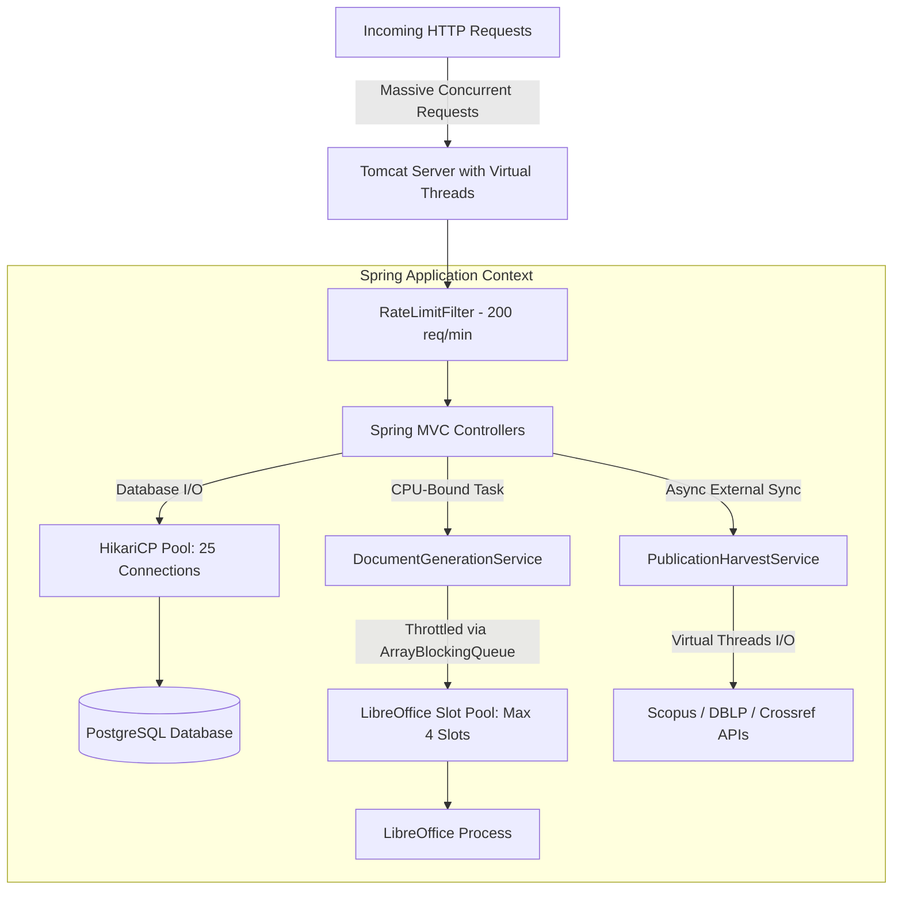

# PLAN: Enable Java 21 Virtual Threads & Concurrency Bottleneck Mitigation

## 🎯 Goal
เปิดใช้งาน **Java 21+ Virtual Threads (Project Loom)** แบบเต็มระบบผ่าน Spring Boot (`spring.threads.virtual.enabled=true`) เพื่อยกระดับ Throughput การประมวลผล HTTP requests และ Asynchronous tasks พร้อมวางมาตรการป้องกันปัญหาคอขวด (Database Pool Starvation, CPU-Bound Document Generation, Carrier Thread Pinning) และสร้างชุดทดสอบตรวจสอบความถูกต้อง

---

## 🔍 Context & Problem Analysis
1. **สภาพแวดล้อมปัจจุบัน:**
   - ใช้ **Java 21+** (Runtime รองรับ Java 21/24) และ **Spring Boot**
   - มีการใช้ Virtual Threads อยู่แล้วในโมดูล `PublicationHarvestService` (`Executors.newVirtualThreadPerTaskExecutor()`)
   - Tomcat HTTP Request Threads และ Spring `@Async` ยังคงใช้ **Platform Threads** เดิม
2. **ปัญหาคอขวดที่อาจเกิดขึ้นเมื่อเปิด Virtual Threads:**
   - **Database Connection Pool Starvation:** Tomcat สามารถรับ concurrent requests ได้หลายพันพร้อมกัน แต่ HikariCP ถูกจำกัดไว้ที่ `maximum-pool-size=20` หากรีเควสต์ยิงเข้า DB พร้อมกัน อาจเกิด `SQLTransientConnectionException: Connection is not available, request timed out`
   - **CPU-Bound Overload (LibreOffice & PAdES Signatures):** งานแปลง DOCX เป็น PDF และการคำนวณ Digital Signature เป็นงาน CPU-intensive ซึ่ง Virtual Threads ไม่ได้ช่วยให้เร็วขึ้น หากไม่จำกัด Concurrency เครื่องเซิร์ฟเวอร์จะรับภาระ CPU หนักเกินไป
   - **Carrier Thread Pinning:** การใช้บล็อก `synchronized` ร่วมกับ blocking I/O อาจทำให้ Virtual Thread ไม่สามารถ Unmount จาก OS Carrier Thread ได้

---

## 🏗️ Architecture & Concurrency Model

---

## 📋 Task Breakdown

### Phase 1: Configuration & Bottleneck Safeguards
- [ ] **เปิด Virtual Threads ใน `application.properties`:**
  - เพิ่ม `spring.threads.virtual.enabled=true`
- [ ] **ปรับแต่ง Database Connection Pool (HikariCP):**
  - ปรับ `spring.datasource.hikari.maximum-pool-size=${HIKARI_MAX_POOL_SIZE:25}` (รองรับโหลดเพิ่มขึ้นแต่ไม่กระทบ DB host)
  - คงค่า `spring.datasource.hikari.connection-timeout=20000` (20 วินาที)
  - ตั้งค่า `spring.datasource.hikari.leak-detection-threshold=30000` เพื่อจับ Connection ที่เปิดค้างนานเกิน 30 วินาที
- [ ] **รักษาเกราะป้องกัน CPU-Bound Workloads:**
  - ตรวจสอบ `DocumentGenerationService.java`: คงระบบ `SLOT_POOL` (4 slots) ด้วย `ArrayBlockingQueue` เพื่อป้องกัน LibreOffice overload
  - ตรวจสอบ `RateLimitFilter.java`: ยืนยันว่าการทำงานของ sliding-window ไม่มี blocking I/O ในบล็อก `synchronized`

### Phase 2: Automated Testing & Verification Suite
- [ ] **สร้าง Integration Test ตรวจสอบ Virtual Threads:**
  - สร้าง `src/test/java/com/ecom/config/VirtualThreadsConfigTest.java`
  - ตรวจสอบว่า `Thread.currentThread().isVirtual()` เป็น `true` เมื่อประมวลผลผ่าน TaskExecutor / Request Handler
  - ทดสอบรัน Concurrent Database Queries 50-100 threads พร้อมกันบน Virtual Threads เพื่อยืนยันว่า HikariCP บริหารจัดการคิวได้โดยไม่เกิด Connection Leak หรือ Crash
- [ ] **รัน Regression Suite:**
  - รัน `./mvnw test-compile`
  - รันการทดสอบหลักที่เกี่ยวข้อง (`PublicationHarvestServiceTest`, `RateLimitFilterTest`, `HrcpKkuApplicationTests`)

### Phase 3: Observability & Production Readiness
- [ ] อัปเดตคู่มือ/สคริปต์รัน: เพิ่ม JVM argument `-Djdk.tracePinnedThreads=short` สำหรับโหมด Debug เพื่อตรวจจับ Pinning Events
- [ ] สรุปผลการทดสอบและแนวทางปฏิบัติ (Best Practices)

---

## 🛡️ Risk & Mitigation
| ความเสี่ยง (Risk) | ผลกระทบ (Impact) | มาตรการรับมือ (Mitigation) |
|---|---|---|
| **HikariCP Exhaustion** | HTTP 500 จาก Connection timeout | กำหนด `leak-detection-threshold=30000` + มี `RateLimitFilter` คุมต้นทาง และปรับ Pool ให้เหมาะสม |
| **Carrier Thread Pinning** | ลดทอนประสิทธิภาพของ Virtual Threads | ตรวจสอบโค้ดแล้วพบว่า `synchronized` มีเฉพาะการบวกเลข In-memory เล็กน้อย (<10ns) และใส่ flag `-Djdk.tracePinnedThreads=short` ไว้ตรวจจับ |
| **CPU Spikes จาก PDF Conversion** | CPU 100% เครื่องค้าง | Throttling ผ่าน `ArrayBlockingQueue(4)` บังคับคิวแปลง PDF ไม่เกิน 4 งานพร้อมกันอย่างเข้มงวด |

---

## ✅ Verification Criteria
- [ ] Spring Boot เริ่มต้นการทำงานสำเร็จโดยมี `spring.threads.virtual.enabled=true`
- [ ] `VirtualThreadsConfigTest` ผ่าน: ยืนยันว่างานรันบน Virtual Thread จริง
- [ ] การทดสอบโหลดขนาน (Parallel DB read) 50+ threads รันผ่านฉลุยโดยไม่มี Connection leak
- [ ] `./mvnw test-compile` และชุดเทสที่เกี่ยวข้องทำงานสำเร็จ 100%
