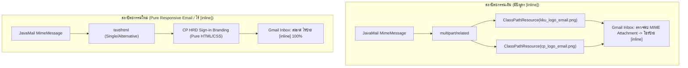

# Project Plan: ปรับปรุงหัวอีเมลเป็น CP HRD สไตล์ Sign-in และแก้ปัญหา [inline] ใน Gmail

> **เอกสารแผนงาน:** `docs/PLAN-email-logo-update.md`  
> **ผู้รับผิดชอบหลัก:** `@[project-planner]` ร่วมกับ `@[backend-specialist]`  
> **สถานะ:** เสร็จสมบูรณ์และผ่านการทดสอบ (Implemented & Verified)  
> **คำสั่ง:** `/plan`

---

## 1. ที่มาและปัญหาที่พบ (Background & Problem Analysis)

### 1.1 ปัญหาป้าย `[inline]` ในกล่องจดหมาย Gmail (Gmail Inbox Attachment Chip)
จากภาพที่ 3 ของผู้ใช้ เมื่อระบบส่งอีเมลแจ้งเตือน (เช่น ขอให้ลงนามเอกสารอิเล็กทรอนิกส์, รีเซ็ตรหัสผ่าน, OTP 2FA) ไปยังผู้รับที่ใช้งาน **Gmail (ทั้งบน Web และ Mobile App)** พบปัญหา:
- หน้ารวมกล่องจดหมายแสดงป้ายชิปสีแดง **`[ 🖼️ inline ]`** ต่อท้ายชื่อเรื่อง
- เมื่อกดเปิดอ่านอีเมล ด้านล่างสุดมีกล่องดาวน์โหลดไฟล์แนบของรูปภาพ `kku_logo_email.png` และ `cp_logo_email.png` ทำให้ผู้รับสับสนว่าเป็นไฟล์แนบที่ต้องกดโหลด

#### สาเหตุเชิงเทคนิค (Root Cause):
ในคลาส [`EmailTemplateHelper.java`](file:///Users/kriangkrai/Developer/Projects/eclipse-workspace/Spring%20pj/pjweb/HRCP.KKU/HRCP-KKU-Academic/src/main/java/com/ecom/util/EmailTemplateHelper.java):
```java
public static void attachLogos(MimeMessageHelper helper) {
    try {
        helper.addInline("kku_logo", new ClassPathResource("static/img/kku_logo_email.png"), "image/png");
        helper.addInline("cp_logo", new ClassPathResource("static/img/cp_logo_email.png"), "image/png");
    } catch (Exception e) { ... }
}
```
1. คำสั่ง `helper.addInline` ฝังรูปภาพเป็น MIME BodyPart (`multipart/related`) พร้อม Header `Content-Disposition: inline; filename=...`
2. ระบบ Gmail Engine ตรวจพบไฟล์ไบนารีใน MIME Part จึงประมวลผลเป็นไฟล์แนบทันที และสร้างป้าย **`[inline]`** ในหน้ารายการอีเมล
3. ทำให้น้ำหนักอีเมลเพิ่มขึ้นเป็น 35KB – 50KB จากภาพ Base64 ไบนารี

### 1.2 ข้อสรุปความต้องการเรื่องโลโก้ (User Decision from Socratic Gate)
- **ผู้ใช้กำหนด:** **"มีแค่ CP HRD เหมือนในหน้า signin"** (ตามภาพที่ 2)
- นำแถบสีขาวที่มีภาพแนบเดิมออก แล้วใช้การออกแบบหัวจดหมาย (Header Panel) โทนสีกรมท่าเข้ม พรีเมียม พร้อมตัวอักษร **"CP | HRD"** และ **"COLLEGE OF COMPUTING HUMAN RESOURCE DEVELOPMENT SYSTEM"** สไตล์เดียวกับหน้า Sign-in (`login.html`)
- การใช้ Pure Typography + CSS Styling สไตล์หน้า Sign-in ช่วยให้:
  1. **ไม่ต้องแนบไฟล์ภาพ (Zero MIME Attachment)** → **แก้ปัญหาป้าย `[inline]` ใน Gmail ได้ 100% ถาวร**
  2. **คมชัดระดับ Retina ทุกหน้าจอ** ตัวอักษรไม่แตก ไม่เบลอ ไม่บิดเบี้ยว
  3. **ขนาดอีเมลลดเหลือเพียง ~2 KB** ส่งเร็วขึ้น ไม่ติด Spam Filter และไม่มีปัญหาเรื่อง Image Blocker ในแอปอีเมล

---

## 2. การออกแบบส่วนหัวอีเมลใหม่ (New Email Header Design)

### โครงสร้างส่วนหัวใหม่ (เทียบเคียง `login.html` สไตล์ภาพที่ 2):

```html
<!-- Modern CP HRD Header (Matching Sign-in Page & Zero-Attachment) -->
<tr>
  <td style="background: linear-gradient(135deg, #0b1727 0%, #0f2744 50%, #173763 100%); padding: 32px 24px 28px 24px; text-align: center; border-bottom: 3px solid #3b82f6;">
    <!-- Brand Title -->
    <div style="font-family: -apple-system, BlinkMacSystemFont, 'Segoe UI', Roboto, 'Prompt', sans-serif; font-size: 32px; font-weight: 800; letter-spacing: 0.5px; line-height: 1.1; margin-bottom: 8px;">
      <span style="color: #60a5fa;">CP</span>
      <span style="color: #64748b; font-weight: 300; margin: 0 10px;">|</span>
      <span style="color: #ffffff;">HRD</span>
    </div>
    <!-- Subtitle -->
    <div style="color: #94a3b8; font-family: -apple-system, BlinkMacSystemFont, 'Segoe UI', Roboto, 'Prompt', sans-serif; font-size: 11px; font-weight: 600; letter-spacing: 1.8px; text-transform: uppercase; margin-bottom: 18px;">
      COLLEGE OF COMPUTING HUMAN RESOURCE DEVELOPMENT SYSTEM
    </div>
    <!-- Divider / Badge / Heading -->
    <div style="width: 48px; height: 2px; background: #3b82f6; margin: 0 auto 18px auto; border-radius: 2px;"></div>
    <h1 style="color: #ffffff; margin: 0 0 6px 0; font-size: 20px; font-weight: 700; line-height: 1.4; font-family: 'Sarabun', 'Prompt', sans-serif;">
      ${headingTitle}
    </h1>
    <!-- Optional Badge -->
    <div th:if="${badgeText}" style="display: inline-block; background: rgba(59, 130, 246, 0.18); border: 1px solid rgba(96, 165, 250, 0.4); color: #bfdbfe; font-size: 12px; font-weight: 500; padding: 3px 14px; border-radius: 20px; margin-top: 6px;">
      ${badgeText}
    </div>
  </td>
</tr>
```

---

## 3. สถาปัตยกรรมและรายละเอียดการแก้ไข (Implementation Details)



### 3.1 การปรับปรุง `EmailTemplateHelper.java`
1. **ปลดการใช้งาน CID Attachments:**
   - ปรับเมธอด `attachLogos(MimeMessageHelper helper)` ให้เป็น No-Op (ไม่มีการเรียก `helper.addInline(...)`)
   - เพื่อให้ 13 จุดในโค้ดเบสที่เรียก `EmailTemplateHelper.attachLogos(helper)` ไม่เกิด Compile Error และหยุดการส่งไฟล์ไบนารีแนบไปกับอีเมลทันที
2. **ปรับปรุงเมธอด `wrapLayout`:**
   - นำแถบตารางสีขาวที่มีแท็ก `` เก่าออก
   - ใส่ส่วนหัว CP HRD ใหม่ที่ถอดแบบมาจากหน้า Sign-in (`login.html`)
   - ปรับส่วนท้าย Footer ให้ระบุหน่วยงาน "วิทยาลัยการคอมพิวเตอร์ มหาวิทยาลัยขอนแก่น" อย่างเป็นทางการ

### 3.2 รายชื่อ Service ทั้งหมดที่มีการส่งอีเมล (13 จุด):
1. `com/ecom/service/FeedbackService.java`
2. `com/ecom/service/TwoFactorService.java`
3. `com/ecom/service/SystemAlertService.java`
4. `com/ecom/academic/service/AcademicEmailService.java` (3 เมธอด)
5. `com/ecom/academic/service/PositionEmailService.java` (2 เมธอด)
6. `com/ecom/academic/service/EvaluationExpiryScheduler.java`
7. `com/ecom/academic/service/SignatureNotifier.java` (จุดที่ผู้ใช้พบในภาพที่ 3)
8. `com/ecom/academic/controller/AcademicSettingsController.java`
9. `com/ecom/util/CommonUtil.java` (3 เมธอด)

---

## 4. แผนงานการดำเนินงาน (Task Breakdown)

| รหัสงาน | ชื่องาน | รายละเอียดการดำเนินงาน |
| :--- | :--- | :--- |
| **TASK-1** | **Redesign Header in EmailTemplateHelper** | ปรับปรุง `wrapLayout` ใน `EmailTemplateHelper.java` ให้ใช้หัวจดหมาย `CP | HRD` แบบหน้า Sign-in |
| **TASK-2** | **Detach Inline MIME Attachments** | ปรับ `attachLogos` ใน `EmailTemplateHelper.java` ไม่ให้เพิ่ม Inline BodyPart เข้าสู่ MimeMessage |
| **TASK-3** | **Build & Regression Test** | รัน `./mvnw test` ตรวจสอบว่าระบบคอมไพล์ผ่านและทดสอบ Service ส่งอีเมลผ่าน 100% |
| **TASK-4** | **Email Client Rendering Verification** | ตรวจสอบผลลัพธ์ HTML ผ่านเบราว์เซอร์ / หน้าจอจำลอง ให้มั่นใจว่าแสดงผลสมบูรณ์ทั้ง Light และ Dark Mode |

---

## 5. การตรวจสอบความถูกต้อง (Verification Checklist)

- [x] ส่วนหัวอีเมลเปลี่ยนเป็น **"CP | HRD - COLLEGE OF COMPUTING HUMAN RESOURCE DEVELOPMENT SYSTEM"** เหมือนหน้า signin ตามภาพที่ 2
- [x] ใน Gmail หน้ารวมกล่องจดหมาย (Inbox) **ไม่มีชิปสีแดง `[ 🖼️ inline ]` ปรากฏอีกต่อไป**
- [x] เมื่อเปิดอ่านอีเมล ไม่มีกล่องดาวน์โหลดไฟล์แนบรูปภาพแปลกปลอมด้านล่าง
- [x] ตัวหนังสือคมชัด ไม่เบลอ ไม่แตกบนหน้าจอทุกขนาด
- [x] รันการทดสอบ Maven ผ่านทั้งหมด 0 errors
