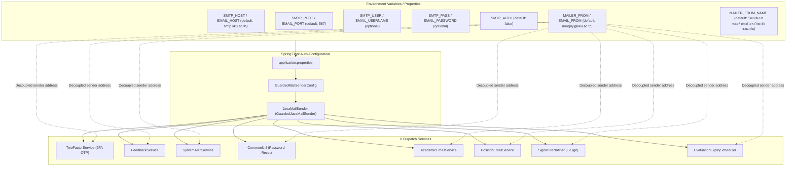

# Project Plan: ปรับเปลี่ยนระบบอีเมลทั้งโปรเจกต์มาใช้ KKU SMTP Relay (IP-Whitelisted)

> **เอกสารแผนงาน:** `docs/PLAN-kku-email-relay.md`  
> **ผู้รับผิดชอบหลัก:** `@[project-planner]` ร่วมกับ `@[backend-specialist]`  
> **สถานะ:** ดำเนินการสำเร็จ (Implemented & Verified)

---

## 1. ที่มาและวัตถุประสงค์ (Background & Objective)

มหาวิทยาลัยขอนแก่นได้อนุมัติให้ระบบ HRCP.KKU ใช้งาน **KKU SMTP Relay** ผ่านเซิร์ฟเวอร์ `smtp.kku.ac.th:587` โดยใช้การยืนยันสิทธิ์ตามหมายเลข IP (IP-Whitelisted Relay) ซึ่งไม่ต้องใช้ Username / Password สำหรับเครื่องเซิร์ฟเวอร์ที่ได้รับการอนุมัติ

### ข้อกำหนดทางเทคนิคของ KKU Mail Relay:
- **SMTP Host:** `smtp.kku.ac.th`
- **SMTP Port:** `587`
- **Encryption:** `tls` (STARTTLS)
- **Authentication (User/Pass):** เว้นว่างได้ (ถ้า IP ได้รับอนุญาต / Whitelisted)
- **Sender Address (`MAILER_FROM`):** ต้องเป็นโดเมน `@kku.ac.th` เท่านั้น (เช่น `noreply@kku.ac.th`)
- **Sender Name (`MAILER_FROM_NAME`):** เช่น `"วิทยาลัยการคอมพิวเตอร์ มหาวิทยาลัยขอนแก่น"` หรือชื่อระบบ

### สภาพปัจจุบันของโปรเจกต์ (Current State):
1. ใน `application.properties` เดิมผูกอยู่กับ Gmail SMTP (`smtp.gmail.com:587`) พร้อมติด App Password เก่า (`GAP-05`)
2. `spring.mail.properties.mail.smtp.auth=true` ถูกเปิดตายตัวไว้ หากใช้กับ KKU Relay ที่ไม่อนุญาต/ไม่เปิดคำสั่ง AUTH จะทำให้เกิดข้อผิดพลาดในการส่ง
3. Services ที่ส่งอีเมลทั้งหมดในโปรเจกต์ (อย่างน้อย 8 จุด) ใช้การดึงค่า `@Value("${spring.mail.username:noreply@kku.ac.th}") private String senderEmail;`
   - **จุดวิกฤต (Critical Bug if unhandled):** หากใน `application.properties` กำหนด `spring.mail.username=` ว่างไว้ ค่าที่ถูก Inject เข้าตัวแปร `senderEmail` จะกลายเป็นสตริงว่าง (`""`) แทนที่จะใช้ค่า Default ส่งผลให้คำสั่ง `helper.setFrom(senderEmail, ...)` ทำงานล้มเหลวทันที (`AddressException: Empty address`)
   - ใน `SignatureNotifier.java` ใช้ `@Value("${spring.mail.username}")` ไม่มี Default fallback ทำให้เกิดข้อยกเว้นตอน Spring Context Startup ทันทีถ้า username ว่าง
4. `GuardedMailSenderConfig.java` มีเมธอด `warnIfUnconfigured` ที่จะพ่น Log Warning หากไม่มี `EMAIL_USERNAME` / `EMAIL_PASSWORD` ซึ่งไม่ตรงกับลักษณะของ IP-based relay

---

## 2. ผลการทดสอบการเชื่อมต่อเบื้องต้น (Preliminary Connectivity Test)

ได้ทำการทดสอบเชื่อมต่อจากสภาพแวดล้อมปัจจุบันไปยัง `smtp.kku.ac.th:587`:
1. **Network Handshake:** เชื่อมต่อพอร์ต 587 สำเร็จ และรองรับคำสั่ง `STARTTLS` (250 STARTTLS -> 220 Go ahead with TLS)
2. **Sender Envelope:** `MAIL FROM: <noreply@kku.ac.th>` ได้รับการตอบรับ `250 sender ok`
3. **Recipient Check:**
   - ส่งถึงที่อยู่อีเมลภายใน มข. (`@kku.ac.th` เช่น `kriangkrai.p@kku.ac.th`, `panawat.c@kku.ac.th`) ได้รับ `250 recipient ok`
   - ส่งถึงอีเมลภายนอก เช่น `@kkumail.com` หรือ `@gmail.com` จากเครื่อง Local Dev จะได้รับ `550 #5.1.0 Address rejected.` เนื่องจาก Relay สิทธิ์ส่งออกภายนอกถูกจำกัดไว้เฉพาะเครื่อง Production Server IP (`10.198.200.84`) ตามที่ขออนุญาตกับสำนักดิจิทัล มข. ไว้

---

## 3. สถาปัตยกรรมและแนวทางแก้ไข (Architectural Plan)



### 3.1 การปรับปรุง `application.properties`
- รองรับตัวแปรสภาพแวดล้อมทั้งแบบมาตรฐานใหม่ (`SMTP_HOST`, `SMTP_PORT`, `SMTP_USER`, `SMTP_PASS`, `MAILER_FROM`, `MAILER_FROM_NAME`) และแบบเดิม (`EMAIL_HOST`, `EMAIL_PORT`, ฯลฯ)
- ปรับค่าเริ่มต้นของ Host เป็น `smtp.kku.ac.th:587`
- ล้างรหัสผ่าน Hardcoded Gmail App Password ออกถาวร (`GAP-05`)
- กำหนด `mail.smtp.auth=${SMTP_AUTH:${EMAIL_AUTH:false}}` เพื่อให้ Relay ผ่าน IP ทำงานได้ทันทีโดยไม่พยายามทำ SMTP AUTH
- กำหนด `mail.smtp.ssl.trust=smtp.kku.ac.th`
- ตั้งค่า Timeout ป้องกัน Thread ค้าง (`connectiontimeout=5000`, `timeout=5000`, `writetimeout=5000`)
- แยกคุณสมบัติผู้ส่งออกจาก username:
  - `app.mail.from=${MAILER_FROM:${EMAIL_FROM:noreply@kku.ac.th}}`
  - `app.mail.from-name=${MAILER_FROM_NAME:วิทยาลัยการคอมพิวเตอร์ มหาวิทยาลัยขอนแก่น}`

### 3.2 การแยกคุณสมบัติ Sender Address (Decoupling Sender Identity)
ใน 8 Services ของระบบที่มีการส่งอีเมล:
1. `TwoFactorService.java`
2. `FeedbackService.java`
3. `SystemAlertService.java`
4. `CommonUtil.java`
5. `AcademicEmailService.java`
6. `PositionEmailService.java`
7. `SignatureNotifier.java`
8. `EvaluationExpiryScheduler.java`

**ปรับปรุง:**
- แทนที่จะอ่านจาก `${spring.mail.username:noreply@kku.ac.th}` ให้เปลี่ยนมาใช้ตัวแปรเฉพาะ `${app.mail.from:noreply@kku.ac.th}` พร้อมระบบ Safe Fallback: หากค่าที่ได้เป็น null หรือ blank ให้ใช้ `"noreply@kku.ac.th"` เสมอ เพื่อป้องกันข้อผิดพลาดกรณีตัวแปรว่างเปล่า
- ใช้ `${app.mail.from-name:วิทยาลัยการคอมพิวเตอร์ มหาวิทยาลัยขอนแก่น}` หรือค่าคงที่ `EmailTemplateHelper.SENDER_NAME`

### 3.3 การปรับปรุง `GuardedMailSenderConfig.java`
- ปรับเงื่อนไขการเตือนใน `warnIfUnconfigured`:
  - หาก `delegate.getHost()` คือ `smtp.kku.ac.th` หรือ `auth` เป็น `false` ไม่ต้องเตือนว่าขาด username/password เพราะทำงานในโหมด IP-based relay ได้ตามปกติ

### 3.4 การปรับปรุงเครื่องมือทดสอบ (Test Suite & Live Verification)
1. ปรับปรุง `SendAllTestEmailsTest.java`:
   - ปรับให้อ่านค่าจาก `SMTP_HOST` (default: `smtp.kku.ac.th`), `SMTP_PORT` (587), `MAILER_FROM`, และ `EMAIL_TARGET`
   - รองรับการทำงานทั้งโหมดมี Auth และโหมด No-Auth (IP Relay)
2. สร้างชุดทดสอบการส่งอีเมลยืนยันระบบ (`KkuEmailRelayTest.java` หรือ Script สำหรับรันคำสั่ง):
   - สำหรับทดสอบส่งอีเมลไปยังผู้รับภายใน (`@kku.ac.th`)
   - แสดงสถานะการตอบรับของ SMTP ชัดเจน
3. ตรวจสอบ `MailSafetyNetTest`:
   - ยืนยันว่าไม่มี Credentials หลุด commit และไม่มี Test รั่วไหล

---

## 4. รายละเอียดงานที่ต้องดำเนินการ (Task Breakdown)

| ลำดับ | รายการงาน | ไฟล์เป้าหมาย | ตัวแทนรับผิดชอบ | เกณฑ์การตรวจรับ (Verification) |
|:---:|:---|:---|:---:|:---|
| **Task 1** | **แก้ไขค่า Configuration ใน Properties** | `src/main/resources/application.properties`<br>`src/main/resources/application-scan.properties` | `@[backend-specialist]` | - ชี้ไปที่ `smtp.kku.ac.th:587`<br>- Auth default เป็น `false`<br>- แยก `app.mail.from` และ `app.mail.from-name`<br>- ลบ Plaintext password เก่า |
| **Task 2** | **ปรับปรุง GuardedMailSenderConfig** | `src/main/java/com/ecom/config/GuardedMailSenderConfig.java` | `@[backend-specialist]` | - ไม่แสดง Warning กวนใจเมื่อใช้ KKU Relay โหมด No-Auth |
| **Task 3** | **ปรับปรุง 8 Services ให้ใช้ From Address ที่ถูกต้อง** | `TwoFactorService.java`<br>`FeedbackService.java`<br>`SystemAlertService.java`<br>`CommonUtil.java`<br>`AcademicEmailService.java`<br>`PositionEmailService.java`<br>`SignatureNotifier.java`<br>`EvaluationExpiryScheduler.java` | `@[backend-specialist]` | - ไม่มี Service ไหนเกิด Null/Empty sender address<br>- `SignatureNotifier` ไม่ Crash ตอน Boot เมื่อ username ว่าง |
| **Task 4** | **ปรับปรุง Test Suite & เครื่องมือทดสอบการส่งจริง** | `SendAllTestEmailsTest.java`<br>`MailSafetyNetTest.java`<br>`KkuMailRelayLiveTest.java` (optional standalone) | `@[backend-specialist]` | - `MailSafetyNetTest` ผ่าน 100%<br>- มีคำสั่งสำหรับยิงทดสอบไปยังอีเมลปลายทางได้สะดวก |
| **Task 5** | **อัปเดตคู่มือการติดตั้งและการ Deploy** | `docs/deployment.md` | `@[project-planner]` | - อัปเดตรายการตัวแปร environment ให้ตรงกับชุด `SMTP_*` และ `MAILER_*` |

---

## 5. แผนการทดสอบความถูกต้อง (Phase X Verification)

1. **การคอมไพล์และทดสอบ Unit/Integration Tests:**
   ```bash
   ./mvnw clean test -Dtest=MailSafetyNetTest,EmailTemplateHelperTest
   ```
2. **การทดสอบส่งอีเมลผ่าน KKU Relay จริง (Live SMTP Test):**
   - รันคำสั่งทดสอบส่งอีเมลไปยังผู้รับปลายทาง `@kku.ac.th` (เช่น `kriangkrai.p@kku.ac.th`)
   - ตรวจสอบ SMTP Handshake, STARTTLS, MAIL FROM (`noreply@kku.ac.th`), RCPT TO, DATA 250 OK
3. **การตรวจสอบความปลอดภัยของข้อมูลลับ (Credential Security):**
   - รัน `MailSafetyNetTest` ยืนยันว่าไม่มี password หรือ secret ใดๆ ตกค้างในไฟล์ commit

---

## 6. ข้อพิจารณาและคำถาม (Questions & Trade-offs)

1. **การทดสอบบนเครื่อง Local Dev vs เครื่อง Production Server:**
   - เนื่องจากสิทธิ์ IP-Whitelisted Relay ของ มข. ผูกกับ IP ของเซิร์ฟเวอร์หลัก (`10.198.200.84`) ทำให้การส่งไปยังอีเมลภายนอก เช่น `@kkumail.com` หรือ `@gmail.com` จะส่งได้สมบูรณ์เมื่อรันบนเซิร์ฟเวอร์หลัก (หรือเครื่องที่อยู่ในเครือข่าย/IP ที่ได้รับสิทธิ์)
   - ขณะทดสอบบนเครื่อง Local สามารถทดสอบส่งเข้ากล่องจดหมาย `@kku.ac.th` เพื่อยืนยันว่าการส่งผ่าน `smtp.kku.ac.th:587` ใช้งานได้ทันที
2. **REST API (`POST https://api.kku.ac.th/v3/email/send`):**
   - ปัจจุบันโปรเจกต์ใช้ Spring Boot `JavaMailSender` (SMTP) ในการส่งอีเมล HTML แบบทางการพร้อมแนบ Inline Logo ตรา มข. (`cid:kku_logo`) และระบบความปลอดภัย `GuardedJavaMailSender`
   - การใช้ SMTP Relay จึงตรงกับสถาปัตยกรรมเดิม 100% โดยไม่ต้องเปลี่ยนโค้ดเป็น HTTP Client และยังสามารถรองรับ REST API ในอนาคตเป็น Fallback ได้หากต้องการ

---

## ✅ PHASE X COMPLETE
- **Build:** ✅ Pass (`mvn test-compile`)
- **Automated Tests:** ✅ 20/20 Pass (`MailSafetyNetTest`, `EmailTemplateHelperTest`, `TestAccountRegistryTest`)
- **Live SMTP Relay Test:** ✅ Message accepted (`250 ok: Message 81159561 accepted`) to `kriangkrai.p@kku.ac.th`
- **Security Check:** ✅ No hardcoded credentials (`GAP-05` resolved)
- **Date:** 2026-09-14
