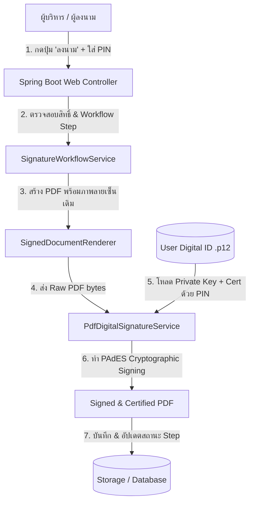

# Plan: Server-side Digital Signature ด้วยไฟล์ .p12 (PAdES Standard) บนระบบ HRCP.KKU

## 📌 Problem & Context
ปัจจุบันระบบ `HRCP-KKU-Academic` มีกระบวนการเดินเอกสารลงนาม (Workflow) และการประทับภาพลายเซ็น (PNG Image Stamp) ลงในเอกสาร Word/PDF ผ่าน `SignedDocumentRenderer` แล้ว แต่ยังเป็นเพียง **Electronic Signature (รูปภาพ)** ยังไม่ใช่ **Digital Signature (Cryptographic Signature ด้วยมาตรฐาน PKCS#7 / PAdES)** ตามใบรับรองดิจิทัล Digital ID (`.p12`) ของมหาวิทยาลัยขอนแก่น 

ผู้ใช้งานต้องการ:
1. ประยุกต์ใช้ไฟล์ใบรับรอง `.p12` (Digital ID) ในการลงนาม PDF อัตโนมัติทางฝั่ง Server (Spring Boot)
2. **ไม่เอาการตีตารางลงนามแบบเดิมตามคู่มือ** (ซึ่งใช้ไฟล์ `.fdf` สร้างตรายางตารางสารบรรณที่เทอะทะ) แต่ให้ประทับลายเซ็นเรียบหรูทับเส้นลงนามเดิมในเอกสาร หรือทำ Invisible Signature ฝังใน PDF
3. วางกลไกการจัดการ **รหัสผ่าน (PIN/Password)** ของไฟล์ `.p12` ให้ปลอดภัยและใช้งานง่าย

---

## 🔐 กลยุทธ์การจัดการรหัสผ่านไฟล์ `.p12` (Password Handling Architecture)

ไฟล์ `.p12` (PKCS#12) มีการเข้ารหัสเพื่อปกป้อง Private Key เสมอ เพื่อให้ระบบนำ Private Key มาคำนวณ Hash และ Sign PDF ได้ ระบบจำเป็นต้องได้รับรหัสผ่าน

> 🎯 **โหมดหลักที่เลือกใช้งานตามความต้องการของผู้ใช้**:
> **แบบที่ 2: บันทึกรหัสผ่านไว้ในระบบ (One-click Sign) — เน้นความสะดวกรวดเร็ว**
> * ผู้ใช้นำไฟล์ `.p12` และรหัสผ่าน (PIN) มาใส่ในระบบเพียง **ครั้งแรกครั้งเดียว** ในหน้า "ลายเซ็นของฉัน"
> * ระบบจะนำรหัสผ่านไปเข้ารหัสด้วย **AES-256-GCM** เก็บในฐานข้อมูลอย่างปลอดภัย
> * เวลาถึงคิวลงนาม ผู้บริหาร/อาจารย์สามารถกด **"ยืนยันการลงนาม" ได้ในคลิกเดียวทันที** โดยระบบจะทำการลงนามดิจิทัล (PAdES Digital Signature) ฝังใน PDF ให้อัตโนมัติ ไม่ต้องกรอกรหัสผ่านซ้ำอีกต่อไป

---

## 📖 คู่มือแนะนำสำหรับผู้ใช้งาน: วิธีไปเอาไฟล์ .p12 และรหัสผ่านเพื่อใส่ในระบบครั้งแรก

### 1. วิธีไปขอรับและดาวน์โหลดไฟล์ `.p12` จากมหาวิทยาลัยขอนแก่น
1. **เข้าสู่ระบบรับ Digital ID ของ มข.**:
   * เข้าสู่เว็บไซต์บริการดิจิทัลของสำนักเทคโนโลยีดิจิทัล มข. (ODT KKU) หรือระบบสารบรรณดิจิทัล (ผ่าน KKU SSO / บัญชี `@kku.ac.th`)
   * ไปที่บริการ **"ขอรับใบรับรองลายเซ็นดิจิทัล (Digital ID & Certificate)"**
2. **ดาวน์โหลดไฟล์ใบรับรอง**:
   * เมื่อผ่านการยืนยันตัวตน ระบบของ มข. จะสร้างไฟล์ใบรับรองอิเล็กทรอนิกส์ส่วนบุคคล
   * กดดาวน์โหลดไฟล์ลงเครื่องคอมพิวเตอร์ จะได้ไฟล์นามสกุล `.p12` หรือ `.pfx` (เช่น `somchai_j.p12` หรือ `DigitalID.p12`)

### 2. รหัสผ่าน (PIN) ของไฟล์ `.p12` เอามาจากไหน?
* 🔑 **กรณีที่ 1 (ผู้ใช้ตั้งเอง)**: ในขั้นตอนการดาวน์โหลดไฟล์ Digital ID จากระบบ มข. หน้าจอของ มข. จะมีช่องให้ผู้ใช้งาน **"ตั้งรหัสผ่านสำหรับเปิดไฟล์ (PIN / Passphrase)"** ด้วยตนเอง ให้จำรหัสผ่านตัวนี้ไว้
* 🔑 **กรณีที่ 2 (ระบบ มข. กำหนดให้)**: หากระบบ มข. เป็นผู้ออกรหัสผ่านเริ่มต้นให้ รหัสจะถูกส่งไปยัง **KKU Mail (`@kku.ac.th`)** หรือทาง **SMS เบอร์โทรศัพท์มือถือของบุคลากร** ที่ลงทะเบียนไว้กับมหาวิทยาลัย
* ⚠️ *ข้อสังเกต*: รหัสนี้เป็นรหัสความปลอดภัยสำหรับปลดล็อกใบรับรอง Digital ID โดยเฉพาะ (ไม่ใช่รหัสผ่าน KKU SSO / อีเมล)

### 3. ขั้นตอนการนำไฟล์และรหัสมาใส่ในระบบ HRCP.KKU (ทำเพียงครั้งแรกครั้งเดียว)
1. เข้าสู่ระบบ HRCP.KKU แล้วไปที่เมนู **"ลายเซ็นของฉัน"** (`/esign/my-signatures`)
2. เลื่อนลงมาที่หัวข้อ **"ใบรับรองดิจิทัล Digital ID (.p12)"**
3. ในกล่อง **"อัปโหลดใบรับรอง Digital ID (.p12)"**:
   * คลิก **"เลือกไฟล์"** แล้วเลือกไฟล์ `.p12` ที่ดาวน์โหลดมาจาก มข.
   * กรอก **รหัสผ่าน (PIN)** ของไฟล์ `.p12` ที่ได้มาในข้อ 2
   * ตรวจสอบว่ามีเครื่องหมายถูกที่ช่อง **"จดจำรหัสผ่านนี้ในระบบอย่างปลอดภัย (One-click Sign)"**
4. คลิกปุ่ม **"ติดตั้งและตรวจสอบใบรับรอง"**
5. **ระบบจะดำเนินการอัตโนมัติ**:
   * ทดสอบเปิดไฟล์ `.p12` ด้วย PIN เพื่อเช็คว่ารหัสถูกต้องหรือไม่ (ถ้าผิด ระบบจะแจ้งเตือนทันที)
   * ตรวจสอบวันหมดอายุ และดึงชื่อ-สกุล (Subject DN) มาแสดงยืนยัน
   * นำรหัส PIN ไปเข้ารหัสด้วยมาตรฐาน **AES-256-GCM** เก็บในระบบอย่างปลอดภัย
6. **เสร็จสิ้นการตั้งค่า**: หลังจากนี้เมื่อมีเอกสารส่งมาให้ลงนามในหน้า `/esign/sign/{id}` จะมีป้ายกำกับว่า *"One-Click Sign พร้อมใช้งาน"* ผู้ใช้เพียงกดปุ่ม **"ยืนยันการลงนาม"** ครั้งเดียว ระบบจะทำการลงนามดิจิทัลสากลให้อัตโนมัติทันที!

---

## 🏛️ Architecture & Component Design

### 1. Database Model (`UserDigitalCertificate`)
เพิ่ม Entity สำหรับผูก Digital ID กับบุคลากร:
* `id` (Long, PK)
* `user_id` (Long, FK to User)
* `certificate_path` (String: path ไปยังไฟล์ `.p12` ที่จัดเก็บใน Secure Directory นอก web root)
* `certificate_alias` (String: alias ใน keystore)
* `subject_dn` (String: เช่น `CN=ผศ.ดร.สมชาย ใจดี, O=Khon Kaen University, C=TH`)
* `issuer_dn` (String: เช่น `Thai University Consortium Certification Authority`)
* `valid_from` (LocalDateTime)
* `valid_to` (LocalDateTime: วันหมดอายุของ Certificate)
* `encrypted_pin` (String, Nullable: เก็บเฉพาะกรณีผู้ใช้เลือกให้ระบบจำรหัส)
* `is_active` (Boolean)
* `created_at`, `updated_at` (LocalDateTime)

### 2. Core Dependencies
เพิ่มใน `pom.xml`:
* **Apache PDFBox 3.x** หรือ **OpenPDF / Bouncy Castle (`bcpkix-jdk18on`)**:
  * ใช้สำหรับจัดการโครงสร้าง PDF, จัดการ Signature Dictionary (`/Type /Sig`), และสร้าง PKCS#7 / CMS Signature Container

### 3. Signing Service (`PdfDigitalSignatureService`)
สร้าง Service จัดการการ Sign โดยเฉพาะ:
* `byte[] signPdf(byte[] srcPdf, InputStream p12Stream, char[] pin, SignatureMetadata metadata)`
* **Appearance Strategy (ไม่เอาตารางลงนาม)**:
  * **ทางเลือกที่ 1 (Invisible Signature)**: เซ็นรับรองแบบไม่แสดงตรายางใดๆ บนหน้ากระดาษ (เพราะ `SignedDocumentRenderer` แปะรูป PNG สวยงามตรงตำแหน่ง `ลงชื่อ.............` อยู่แล้ว) เมื่อเปิดใน Adobe Acrobat จะเห็นแถบ "Signed and all signatures are valid" ที่ Signatures Panel
  * **ทางเลือกที่ 2 (Clean Visual Signature)**: หากต้องการให้ช่องลายเซ็นใน PDF เป็น Signature Field ของ Adobe ด้วย จะผูกตำแหน่งพิกัด X, Y ตรงจุดเดียวกับ Anchor Placeholder โดยแสดงเฉพาะภาพลายเซ็นเดี่ยวๆ ไม่มีเส้นตารางสี่เหลี่ยม

---

## 📋 Task Breakdown

### Phase 1: Dependencies & Data Layer
- [ ] เพิ่ม `bcpkix-jdk18on` และ `bcprov-jdk18on` ใน `pom.xml` เพื่อสนับสนุนการคำนวณ Cryptographic Signature
- [ ] สร้าง Entity `UserDigitalCertificate` และ Repository
- [ ] เขียน Flyway Migration สคริปต์เพื่อสร้างตาราง `user_digital_certificate`
- [ ] สร้าง Service จัดการไฟล์ `.p12` (Validate ความถูกต้องของไฟล์, ตรวจสอบวันหมดอายุ, ดึง Subject/Issuer อัตโนมัติ)

### Phase 2: Core PDF Digital Signature Engine
- [ ] สร้าง `PdfDigitalSignatureService` รองรับการ Sign แบบ PAdES-BES (PKCS#7 detached)
- [ ] พัฒนาโมดูลอ่าน Private Key และ Certificate Chain จาก `.p12` (รองรับทั้ง SHA256withRSA)
- [ ] เขียน Unit Test ทดสอบการ Sign ไฟล์ PDF จำลอง และตรวจสอบผลด้วย PDFBox Verification API

### Phase 3: Workflow & Renderer Integration
- [ ] ปรับปรุง `SignedDocumentRenderer` ให้มีขั้นตอน Post-processing: หลังจากแปลง DOCX เป็น PDF เสร็จแล้ว หากผู้ลงนามมี Digital ID ให้เรียก `PdfDigitalSignatureService` เพื่อประทับ Digital Signature
- [ ] รองรับการลงนามแบบ Multi-Signer (Incremental Update): กรณีเอกสารต้องเซ็นหลายคน (เช่น ผู้ขอ -> หัวหน้าสาขา -> คณบดี) แต่ละคนสามารถ Sign ทับกันได้โดยไม่ทำลาย Signature ของคนก่อนหน้า

### Phase 4: UI / UX for Digital ID Management & Signing Modal
- [ ] เพิ่มเมนูในหน้า User Profile / Signature ให้ผู้ใช้สามารถอัปโหลดไฟล์ `.p12` ของตนเอง พร้อมทดสอบใส่รหัสผ่านเพื่อ Verify
- [ ] ปรับปรุงหน้าจอลงนาม (`/user/academic/request/{id}/sign`):
  - แสดงป้ายแจ้งว่าผู้ใช้มี Digital ID หรือไม่
  - แสดง Modal ให้ระบุ PIN เมื่อกดยืนยันการลงนาม
  - แสดงข้อความและสถานะที่ชัดเจน

### Phase 5: Verification & Audit Trail
- [ ] ปรับปรุงหน้า `/esign/verify/{code}` ให้แสดงผลสถานะใบรับรองดิจิทัล (Issuer, Serial Number, วันเวลาที่ลงนามตาม Certificate)
- [ ] ทดสอบเปิดไฟล์ PDF ผลลัพธ์ในโปรแกรม **Adobe Acrobat Reader** เพื่อยืนยันว่าไม่มีตารางสี่เหลี่ยม และขึ้นสถานะ Green Checkmark ถูกต้อง

---

## 🧪 Verification Plan

### Automated Tests
- `mvn test -Dtest=PdfDigitalSignatureServiceTest`: ทดสอบ Sign PDF ด้วยคีย์ทดสอบ และ verify ว่า signature dictionary ถูกต้อง
- `mvn test -Dtest=SignedDocumentRendererIntegrationTest`: ทดสอบกระบวนการตั้งแต่สร้าง DOCX -> PDF -> Digital Signed PDF

### Manual Verification
1. อัปโหลดไฟล์ `.p12` ตัวอย่างเข้าสู่ระบบ
2. ทำการเดินเรื่องคำขอและกดลงนามผ่านหน้าเว็บ พร้อมใส่รหัสผ่าน PIN
3. ดาวน์โหลดไฟล์ PDF ที่ลงนามสมบูรณ์แล้ว เปิดใน **Adobe Acrobat Reader**:
   - ตรวจสอบว่าหน้าตาเอกสารสะอาด ไม่มีตารางสี่เหลี่ยมแบบ `.fdf`
   - ตรวจสอบ Signature Panel ว่าขึ้น Valid Signature พร้อมชื่อผู้ลงนามถูกต้อง
