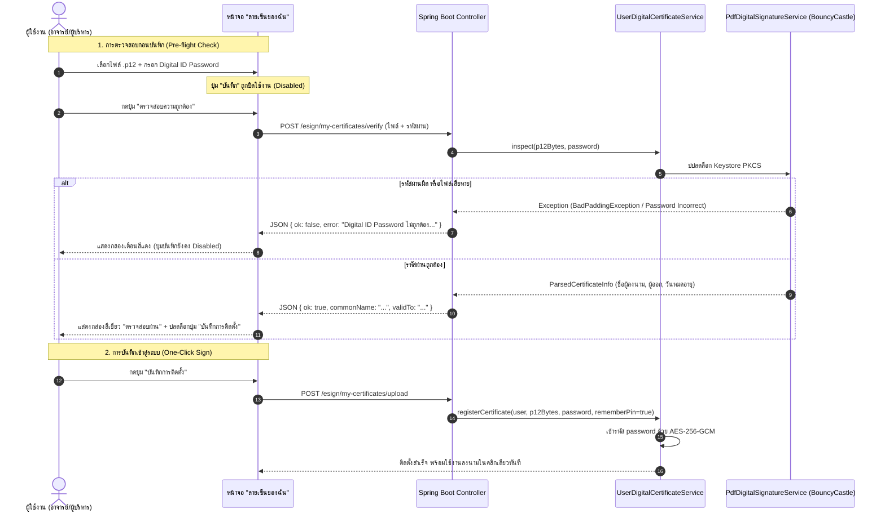

# Plan: ปรับปรุงระบบ Digital ID (.p12) — ตรวจสอบรหัสผ่านก่อนบันทึก, แก้ไขรหัสผ่าน, และอัปเดตลิงก์ i.kku.ac.th

## 📌 Problem & Context
จากการใช้งานระบบใบรับรองดิจิทัล Digital ID (`.p12`) พบความต้องการปรับปรุงเพิ่มเติมเพื่อให้ผู้ใช้งานไม่เกิดข้อผิดพลาดในการลงนาม:
1. **แหล่งดาวน์โหลดใบรับรอง:** บุคลากร มข. เข้าใช้งานระบบขอรับ Digital ID ผ่านพอร์ทัล `https://i.kku.ac.th` จึงต้องปรับปรุงลิงก์และคำแนะนำในระบบทั้งหมดให้ตรงกับความเป็นจริง
2. **ความเรียบง่าย:** ไม่ต้องมีตัวเลือกให้ติ๊ก "จดจำรหัสผ่าน" อีกต่อไป ให้ระบบทำการบันทึกและเข้ารหัส Digital ID Password ไว้อัตโนมัติ เพื่อรองรับการลงนามแบบ One-Click Sign ทันทีในครั้งเดียว
3. **การจัดการแก้ไข (Edit):** เพิ่มความสามารถในการแก้ไข Digital ID Password หรือเปลี่ยนไฟล์ `.p12` โดยตรงในระบบ
4. **ระบบตรวจสอบก่อนบันทึก (Pre-flight Verification):** ก่อนเพิ่มหรือแก้ไขไฟล์ `.p12` และ Digital ID Password ผู้ใช้ต้องกดปุ่ม **"ตรวจสอบความถูกต้อง"** ก่อน โดยปุ่มบันทึกจะปิดการใช้งาน (Disabled) จนกว่าจะผ่านการตรวจสอบ ป้องกันกรณีผู้ใช้จำรหัสผ่านผิดหรือกรอกผิดตั้งแต่แรก

---

## 🎯 Proposed Solutions & Architecture

---

## 📋 Task Breakdown & Agent Assignments

| เฟส | รายการงาน | ผู้รับผิดชอบ | รายละเอียดการดำเนินงาน |
|:---|:---|:---:|:---|
| **Phase 1** | **Backend API: Pre-flight Verification & Edit Password** | `backend-specialist` | 1. เพิ่ม API `POST /esign/my-certificates/verify` รับไฟล์และรหัสผ่าน คืนค่าผลการตรวจสอบเป็น JSON 2. เพิ่ม API `POST /esign/my-certificates/update-password` รับรหัสผ่านใหม่ ตรวจสอบกับไฟล์เดิม และบันทึกเข้ารหัสใหม่ 3. ปรับปรุง `registerCertificate` ให้บันทึกแบบ One-Click Sign เป็นค่ามาตรฐานถาวร |
| **Phase 2** | **Frontend UI: ระบบตรวจสอบและปุ่มบันทึก** | `frontend-specialist` | 1. ใน `my_signatures.html`: นำ Checkbox `rememberPin` ออก 2. เพิ่มปุ่ม **"ตรวจสอบความถูกต้อง"** และปิดปุ่ม **"บันทึกการติดตั้ง"** (`disabled`) เริ่มต้น 3. เชื่อม AJAX เรียก `/esign/my-certificates/verify` เพื่อแสดงกล่องแจ้งผลการตรวจสอบและปลดล็อกปุ่มบันทึกเมื่อผ่าน |
| **Phase 3** | **Frontend UI: ระบบแก้ไข Digital ID Password & ไฟล์** | `frontend-specialist` | 1. เพิ่ม Modal **"แก้ไข Digital ID Password"** ในการ์ดใบรับรองที่ติดตั้งแล้ว 2. มีช่องกรอกรหัสผ่านใหม่ พร้อมปุ่ม "ตรวจสอบรหัสผ่าน" ก่อนกดยืนยันบันทึก 3. ปรับปุ่มเปลี่ยนไฟล์ใหม่ให้มี Flow การตรวจสอบแบบเดียวกัน |
| **Phase 4** | **Documentation & Guide Updates (https://i.kku.ac.th)** | `frontend-specialist` | 1. อัปเดต [_p12_guide_modal.html](file:///Users/kriangkrai/Developer/Projects/eclipse-workspace/Spring%20pj/pjweb/HRCP.KKU/HRCP-KKU-Academic/src/main/resources/templates/academic/esign/_p12_guide_modal.html): เปลี่ยนลิงก์เป็น `https://i.kku.ac.th` 2. ปรับเปลี่ยนคำศัพท์เป็น **Digital ID Password** ทั้งหมด 3. อธิบายขั้นตอนการกดปุ่ม "ตรวจสอบความถูกต้อง" |
| **Phase 5** | **Testing & Verification** | `debugger` / `backend-specialist` | 1. เขียน Unit Tests ใน `PdfDigitalSignatureServiceTest` และ `UserDigitalCertificateServiceTest` 2. เขียน Integration Tests ใน `SigningPageRenderTest` และ `UserSignatureControllerTest` 3. ทดสอบการปฏิเสธรหัสผ่านผิด และการบันทึกสำเร็จ |

---

## 🔍 Verification Checklist

- [ ] **การตรวจสอบลิงก์:** ในคู่มือ Modal และหน้าจอทั้งหมด ต้องเป็น `https://i.kku.ac.th`
- [ ] **การตัด Checkbox:** ไม่มี Checkbox จดจำรหัสผ่านในหน้าจอ แต่ระบบบันทึกรหัสผ่านให้อัตโนมัติ
- [ ] **ปุ่มตรวจสอบก่อนบันทึก:**
  - [ ] เลือกไฟล์ + ใส่รหัสผิด -> กดตรวจสอบ -> ขึ้นแจ้งเตือนสีแดง -> ปุ่มบันทึกยังคง Disabled
  - [ ] เลือกไฟล์ + ใส่รหัสถูก -> กดตรวจสอบ -> ขึ้นชื่อผู้ลงนามสีเขียว -> ปุ่มบันทึกเปิดให้กดได้ (Enabled)
  - [ ] หากผู้ใช้แก้ไขรหัสผ่านหรือเปลี่ยนไฟล์หลังตรวจสอบผ่านแล้ว -> ปุ่มบันทึกต้องกลับไป Disabled เพื่อให้กดตรวจสอบใหม่
- [ ] **ฟังก์ชันแก้ไข Digital ID Password:**
  - [ ] กดเปิด Modal แก้ไขรหัสผ่าน -> ใส่รหัสใหม่ -> กดตรวจสอบ -> บันทึกสำเร็จ
- [ ] **การลงนามจริง:**
  - [ ] เมื่อติดตั้งเสร็จ สามารถลงนามในหน้า `/esign/sign/{id}` ได้ทันทีในคลิกเดียว (One-Click Sign)
  - [ ] เอกสาร PDF ที่ได้ มีเครื่องหมายถูกสีเขียว (Valid Digital Signature) จากไฟล์ `.p12`
