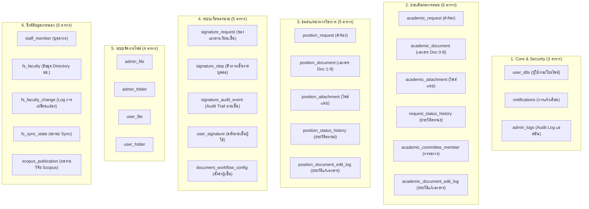

#  แผนการตรวจสอบและจัดการตารางฐานข้อมูลที่ไม่ได้ใช้งาน (Database Audit Plan)

> **เอกสารนี้จัดทำขึ้นจากการสแกน Entity, Flyway Migrations, Repositories และ Business Services ทั้งหมดในโปรเจกต์ HRCP.KKU**

---

##  1. สรุปผลการตรวจสอบ (Executive Summary)

จากการตรวจสอบฐานข้อมูลทั้งหมด **30 ตาราง** พบว่า:
- **ตารางที่ไม่ได้ใช้งาน (Unused / Dead Tables):** มี **2 ตาราง** คือ `petitions` และ `petition_statuses`
- **ตารางระบบ (System / Infrastructure Table):** มี **1 ตาราง** คือ `flyway_schema_history`
- **ตารางที่ใช้งานจริงในปัจจุบัน (Active Business Tables):** มี **27 ตาราง** (ตรงกับ 27 JPA Entities ในโค้ด)

---

##  2. รายละเอียดตารางที่ไม่ได้ใช้งาน (Unused Tables)

| ชื่อตาราง | ที่มา / ไฟล์สร้าง | สาเหตุที่ไม่ได้ใช้งาน | สถานะในโค้ดปัจจุบัน |
|:---|:---|:---|:---|
| **`petitions`** | `V1__create_petition_statuses_table.sql`<br/>`V2__create_petitions_table.sql` | เป็นตาราง "คำร้องทั่วไป" สมัยเริ่มพัฒนาโครงการ ก่อนที่ระบบจะ refactor แยกโมเดลเป็นคำร้องเฉพาะด้าน | [NO] **ไม่มี Entity Class**<br/>[NO] **ไม่มี Repository / Service**<br/>[NO] ไม่มีหน้า UI ใช้งาน |
| **`petition_statuses`** | `V1__create_petition_statuses_table.sql` | ตารางเก็บประวัติสถานะของ `petitions` | [NO] **ไม่มี Entity Class**<br/>(ระบบเปลี่ยนไปใช้ `request_status_history` และ `position_status_history` แทน) |

---

##  3. แผนผังตารางที่ใช้งานจริงในปัจจุบัน (27 Active Tables)



---

##  4. ทางเลือกและแนวทางดำเนินการ (Action Plan & Options)

### ทางเลือกที่ 1: ปล่อยไว้ตามเดิม (Recommended for stability)
* **ข้อดี:** ไม่กระทบ Flyway migration chain เดิม และไม่มีผลเสียต่อประสิทธิภาพ (ตารางว่างไม่มีข้อมูล)
* **การดูแล:** ไม่มีต้นทุน maintenance เพิ่มเติม เพราะ Hibernate validate เฉพาะ Entity ที่มีอยู่ในโค้ด

### ทางเลือกที่ 2: ทำความสะอาดตาราง (Clean up via Flyway V11)
หากต้องการให้ฐานข้อมูลสะอาด 100% ไม่มีตารางร้างหลงเหลือ:
1. **สร้างไฟล์ Migration ใหม่:** `V11__drop_unused_petition_tables.sql`
   ```sql
   -- Drop foreign key and unused petition tables
   DROP TABLE IF EXISTS petition_statuses CASCADE;
   DROP TABLE IF EXISTS petitions CASCADE;
   ```
2. **ห้ามลบไฟล์ `V1` และ `V2`:** เพื่อรักษาประวัติใน `flyway_schema_history`
3. **ทดสอบรันแอป:** ตรวจสอบว่า Flyway รัน `V11` สำเร็จและ Hibernate validate ผ่าน

---

##  5. Verification Checklist

- [x] ตรวจสอบทุก `@Entity` และ `@Table` ใน `com.ecom.*`
- [x] ตรวจสอบไฟล์ Migration ทุกเวอร์ชัน (`V0` ถึง `V10`)
- [x] ตรวจสอบ Repositories ทั้งหมดในโปรเจกต์
- [x] ระบุตารางร้างได้ครบถ้วน (`petitions`, `petition_statuses`)
- [x] มีแนวทางแก้ไขที่ไม่พัง Flyway Migration History
